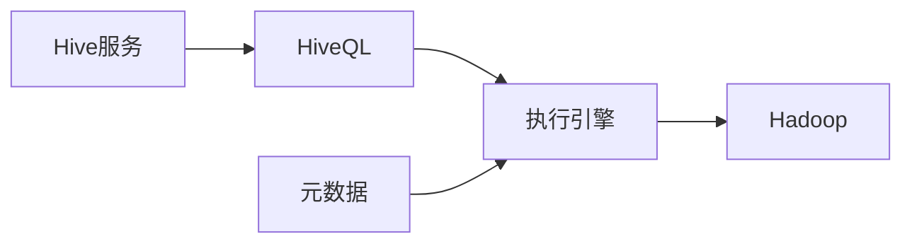

## 1.背景介绍

Hive是由Facebook开发的一种数据仓库工具，可以将复杂的工作转化为类似于SQL的查询语句，从而实现对大数据的高效处理。Hive的出现，让那些熟悉SQL语句的人，也能够处理海量数据，大大降低了大数据处理的门槛。

## 2.核心概念与联系

Hive的主要组成部分包括HiveQL、元数据、执行引擎和Hive服务。HiveQL是Hive的查询语言，它是SQL的一种方言，支持大部分的SQL语句。元数据则是Hive的数据字典，用于存储表的定义信息。执行引擎负责将HiveQL转化为可以在Hadoop上运行的MapReduce任务。Hive服务则是提供给用户的接口，包括命令行接口、Web接口和JDBC接口。



## 3.核心算法原理具体操作步骤

当用户通过Hive服务提交一个HiveQL查询时，Hive会首先解析这个查询，检查语法和语义是否正确。然后，Hive会生成一个逻辑执行计划，描述了如何执行这个查询。接着，Hive会对这个逻辑执行计划进行优化，例如合并多个操作、删除无用的操作等。最后，Hive会将优化后的逻辑执行计划转化为一个或多个MapReduce任务，并提交给Hadoop执行。

## 4.数学模型和公式详细讲解举例说明

Hive的查询优化主要依赖于代价模型。代价模型是一个函数，输入是一个逻辑执行计划，输出是这个逻辑执行计划的代价。Hive会尝试不同的逻辑执行计划，并使用代价模型计算它们的代价，选择代价最小的逻辑执行计划。代价模型的计算公式如下：

$$
C(P) = \sum_{i=1}^{n} T_i(P) + S_i(P)
$$

其中，$P$是一个逻辑执行计划，$T_i(P)$是计划$P$中第$i$个操作的时间代价，$S_i(P)$是计划$P$中第$i$个操作的空间代价。

## 5.项目实践：代码实例和详细解释说明

下面是一个使用Hive查询的例子。这个查询的目的是统计每个国家的人口总数。

```sql
SELECT country, SUM(population)
FROM world
GROUP BY country;
```

这个查询首先从`world`表中选择出所有的记录，然后按照`country`字段进行分组，最后对每个分组的`population`字段求和。

## 6.实际应用场景

Hive广泛应用于大数据处理的各个领域。例如，Facebook使用Hive进行日志分析，Uber使用Hive进行数据仓库建设，Netflix使用Hive进行视频推荐等。

## 7.工具和资源推荐

如果你想学习和使用Hive，我推荐你使用以下的工具和资源：

- Apache Hive官方网站：https://hive.apache.org/
- Hive快速入门教程：https://www.tutorialspoint.com/hive/index.htm
- Hive在线实验平台：https://www.jdoodle.com/hive-terminal-online

## 8.总结：未来发展趋势与挑战

随着大数据的发展，Hive的重要性将越来越高。然而，Hive也面临着一些挑战，例如查询性能的提升、实时查询的支持等。我相信，Hive的开发者和社区会克服这些挑战，让Hive成为大数据处理的重要工具。

## 9.附录：常见问题与解答

**Q: Hive支持哪些类型的数据？**

A: Hive支持多种类型的数据，包括整数、浮点数、字符串、日期等。此外，Hive还支持复杂类型，例如数组、映射和结构。

**Q: Hive可以处理多大的数据？**

A: Hive基于Hadoop，因此它可以处理PB级别的数据。

**Q: Hive的性能如何？**

A: Hive的性能主要取决于底层的Hadoop。一般来说，Hive的查询性能不如传统的数据库，但是它可以处理更大的数据。

作者：禅与计算机程序设计艺术 / Zen and the Art of Computer Programming