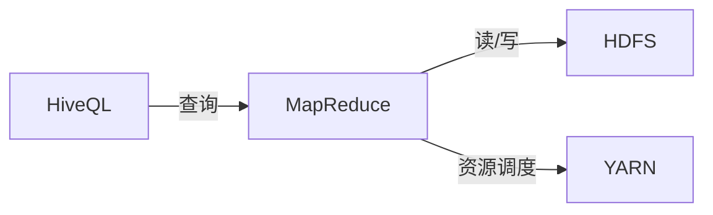

## 1.背景介绍

Hive是Apache的一个开源项目，提供了一种类似于SQL的查询语言——HiveQL，用于查询存储在Hadoop分布式文件系统（HDFS）中的数据。然而，由于Hive是基于Hadoop MapReduce模型的，因此在处理大数据量的查询时，可能会出现性能瓶颈。本文将探讨如何优化Hive查询，使其更快、更稳定。

## 2.核心概念与联系

在进行Hive调优之前，我们需要理解几个核心概念：

- **HiveQL**：Hive查询语言，类似于SQL，但是并不完全兼容。HiveQL主要用于数据分析，而不是实时查询或行级操作。

- **MapReduce**：Hadoop的核心编程模型，用于处理和生成大数据集。

- **HDFS**：Hadoop分布式文件系统，是一个高度容错的系统，适用于在低成本硬件上运行的大规模数据集。

- **YARN**：Hadoop的资源管理器，负责管理集群资源和调度用户应用程序。

这些概念之间的关系可以通过以下Mermaid流程图进行说明：



## 3.核心算法原理具体操作步骤

Hive查询优化主要包括以下几个步骤：

### 3.1 优化HiveQL查询

- **选择适当的数据类型**：尽量选择最小的数据类型来存储数据。例如，如果数据范围在0到255之间，使用TINYINT类型而不是INT类型。

- **使用分区**：通过对数据进行分区，可以减少Hive查询需要扫描的数据量。

- **使用Bucketing**：Bucketing是一种数据组织技术，可以对数据进行更细粒度的划分。

### 3.2 优化MapReduce作业

- **调整MapReduce参数**：例如，增加mapred.tasktracker.map.tasks.maximum和mapred.tasktracker.reduce.tasks.maximum的值，可以增加每个节点上并行运行的任务数量。

- **使用Combiner**：Combiner可以在Map阶段后进行局部的Reduce操作，减少数据传输量。

### 3.3 优化HDFS存储

- **使用压缩**：压缩可以减少存储空间和数据传输量，但是需要权衡压缩和解压缩的CPU开销。

- **调整HDFS块大小**：增加HDFS的块大小可以减少Map任务的数量，从而减少任务调度的开销。

## 4.数学模型和公式详细讲解举例说明

在优化Hive查询时，我们需要考虑的一个重要因素是数据倾斜。数据倾斜是指在MapReduce作业中，一部分任务处理的数据量远大于其他任务。这会导致这部分任务运行时间过长，从而影响整个作业的性能。

数据倾斜的度量可以用以下公式进行计算：

$$
Skewness = \frac{\sum_{i=1}^{n}(x_i - \bar{x})^3/n}{(\sum_{i=1}^{n}(x_i - \bar{x})^2/n)^{3/2}}
$$

其中，$x_i$表示第i个任务处理的数据量，$\bar{x}$表示所有任务处理的数据量的平均值，n表示任务的总数。Skewness的值越大，数据倾斜的程度越严重。

为了解决数据倾斜问题，我们可以使用Hive的Skew Join优化。当我们知道哪些键的数据量较大时，可以在JOIN操作中使用SKEWED BY子句，将这些键的数据单独处理。

## 5.项目实践：代码实例和详细解释说明

以下是一个使用HiveQL进行查询优化的示例：

```sql
CREATE TABLE orders (
    order_id INT,
    customer_id INT,
    order_date STRING,
    order_amount DOUBLE)
PARTITIONED BY (region STRING)
CLUSTERED BY (order_id) INTO 32 BUCKETS;
```

在这个示例中，我们创建了一个名为orders的表，该表按region进行分区，按order_id进行bucketing。通过这种方式，我们可以减少查询需要扫描的数据量，从而提高查询性能。

## 6.实际应用场景

Hive查询优化在很多大数据处理场景中都有应用，例如：

- **日志分析**：通过优化Hive查询，我们可以更快地分析大量的日志数据，从而及时发现系统的问题。

- **数据挖掘**：在进行大规模的数据挖掘任务时，优化Hive查询可以显著减少数据处理时间，提高数据挖掘的效率。

- **报表生成**：对于需要定期生成报表的业务，优化Hive查询可以确保报表能够在预定的时间内生成。

## 7.工具和资源推荐

以下是一些有用的Hive查询优化工具和资源：

- **Hive官方文档**：提供了详细的HiveQL语法和优化技巧。

- **Hadoop官方文档**：提供了关于MapReduce和HDFS的详细信息，包括如何调整参数和优化存储。

- **HiveMall**：一个基于Hive的机器学习库，提供了很多用于数据分析和预处理的函数。

## 8.总结：未来发展趋势与挑战

随着数据量的不断增长，Hive查询优化的重要性也在不断提高。未来，我们可以期待更多的Hive优化技术和工具的出现。然而，同时也面临着一些挑战，例如如何处理更大规模的数据，如何处理更复杂的查询，以及如何在保证查询性能的同时，保证数据的安全性和隐私性。

## 9.附录：常见问题与解答

**问：Hive查询优化和SQL查询优化有什么区别？**

答：虽然HiveQL和SQL非常相似，但是由于Hive是基于Hadoop MapReduce模型的，因此Hive查询优化和SQL查询优化有一些不同。例如，Hive不支持实时查询或行级操作，因此在优化查询时，我们需要考虑如何减少数据扫描的量，如何减少MapReduce任务的数量等。

**问：如何处理Hive查询中的数据倾斜问题？**

答：处理数据倾斜的一个常见方法是使用Hive的Skew Join优化。当我们知道哪些键的数据量较大时，可以在JOIN操作中使用SKEWED BY子句，将这些键的数据单独处理。此外，还可以尝试调整HDFS的块大小，或者使用更加均衡的数据分区和bucketing策略。

**问：Hive查询优化有哪些工具和资源可以参考？**

答：Hive和Hadoop的官方文档是非常好的资源。此外，还有一些开源项目，如HiveMall，提供了很多用于数据分析和预处理的函数，可以帮助我们优化Hive查询。

作者：禅与计算机程序设计艺术 / Zen and the Art of Computer Programming