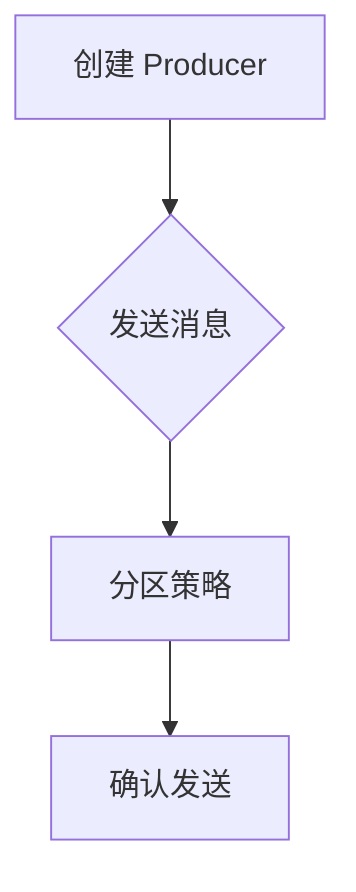

## 背景介绍

Apache Kafka 是一个分布式流处理系统，主要用于构建实时数据流管道和流处理应用程序。Kafka Producer 是 Kafka 生态系统中的一部分，它负责向 Kafka 集群中的主题（Topic）发送消息。

在本篇博客中，我们将深入探讨 Kafka Producer 的原理，以及如何使用 Java 编程语言来实现一个简单的 Kafka Producer。我们将从以下几个方面进行讨论：

1. Kafka Producer 核心概念与联系
2. Kafka Producer 算法原理具体操作步骤
3. Kafka Producer 数学模型和公式详细讲解举例说明
4. 项目实践：Java 实现 Kafka Producer 代码实例和详细解释说明
5. Kafka Producer 在实际应用场景中的应用
6. 工具和资源推荐
7. 总结：未来发展趋势与挑战
8. 附录：常见问题与解答

## Kafka Producer 核心概念与联系

Kafka Producer 主要由以下几个组件构成：

- **Producer**: 生产者，负责向 Kafka 集群发送消息。
- **Broker**: 存储和管理主题（Topic）的服务器节点。
- **Topic**: 主题，用于存储消息的分类目录。
- **Partition**: 分区，Topic 中的一个子集，用于存储和处理消息。

生产者通过发送消息到 Broker，Broker 将这些消息存储在 Topic 的 Partition 中。每个 Partition 可以独立地进行读取和写入操作，从而实现分布式流处理。

## Kafka Producer 算法原理具体操作步骤

Kafka Producer 的主要工作原理如下：

1. **创建 Producer**: 使用 Java 代码创建一个 Producer 实例，并配置其连接到 Kafka 集群中的 Broker。
2. **发送消息**: Producer 向 Broker 发送消息。消息包含一个主题（Topic）和一个键（Key），以及一个值（Value）。
3. **分区策略**: Kafka 会根据 Producer 设置的分区策略，将消息发送到不同的 Partition。
4. **确认发送**: Producer 可以选择性地等待 Broker 确认消息已成功写入。

以下是使用 Java 编程语言实现 Kafka Producer 的简单示例代码：

```java
import org.apache.kafka.clients.producer.KafkaProducer;
import org.apache.kafka.clients.producer.ProducerConfig;
import org.apache.kafka.clients.producer.ProducerRecord;
import java.util.Properties;

public class SimpleProducer {
    public static void main(String[] args) {
        // 配置 Producer 参数
        Properties props = new Properties();
        props.put(ProducerConfig.BOOTSTRAP_SERVERS_CONFIG, \"localhost:9092\");
        props.put(ProducerConfig.KEY_SERIALIZER_CLASS_CONFIG, \"org.apache.kafka.common.serialization.StringSerializer\");
        props.put(ProducerConfig.VALUE_SERIALIZER_CLASS_CONFIG, \"org.apache.kafka.common.serialization.StringSerializer\");

        // 创建 Producer 实例
        KafkaProducer<String, String> producer = new KafkaProducer<>(props);

        // 发送消息
        for (int i = 0; i < 10; i++) {
            producer.send(new ProducerRecord<>(\"test-topic\", Integer.toString(i), \"Message \" + i));
        }

        // 关闭 Producer
        producer.close();
    }
}
```

## Kafka Producer 数学模型和公式详细讲解举例说明

Kafka Producer 的数学模型主要涉及到分区策略。以下是一个简单的分区策略示例：



在这个示例中，Producer 首先创建一个实例，然后向 Broker 发送消息。接下来，根据设置的分区策略，将消息发送到不同的 Partition。最后，Producer 可以选择性地等待 Broker 确认消息已成功写入。

## 项目实践：Java 实现 Kafka Producer 代码实例和详细解释说明

在前面的部分，我们已经看到了一个简单的 Kafka Producer 示例。在本节中，我们将深入探讨如何使用 Java 编程语言实现一个更复杂的 Kafka Producer。

首先，我们需要添加 Kafka 客户端库依赖至我们的 Maven pom.xml 文件：

```xml
<dependencies>
    <dependency>
        <groupId>org.apache.kafka</groupId>
        <artifactId>kafka-clients</artifactId>
        <version>2.4.1</version>
    </dependency>
</dependencies>
```

然后，我们可以编写一个更复杂的 Kafka Producer 示例，如下所示：

```java
import org.apache.kafka.clients.producer.KafkaProducer;
import org.apache.kafka.clients.producer.ProducerConfig;
import org.apache.kafka.clients.producer.ProducerRecord;
import java.util.Properties;

public class ComplexProducer {
    public static void main(String[] args) {
        // 配置 Producer 参数
        Properties props = new Properties();
        props.put(ProducerConfig.BOOTSTRAP_SERVERS_CONFIG, \"localhost:9092\");
        props.put(ProducerConfig.KEY_SERIALIZER_CLASS_CONFIG, \"org.apache.kafka.common.serialization.StringSerializer\");
        props.put(ProducerConfig.VALUE_SERIALIZER_CLASS_CONFIG, \"org.apache.kafka.common.serialization.StringSerializer\");

        // 设置分区策略为 RoundRobin
        props.put(ProducerConfig.PARTITIONER_CLASS_CONFIG, \"org.apache.kafka.common.utils.RoundRobin\");

        // 创建 Producer 实例
        KafkaProducer<String, String> producer = new KafkaProducer<>(props);

        // 发送消息
        for (int i = 0; i < 10; i++) {
            producer.send(new ProducerRecord<>(\"test-topic\", Integer.toString(i), \"Message \" + i));
        }

        // 关闭 Producer
        producer.close();
    }
}
```

在这个示例中，我们使用了更复杂的分区策略，即 RoundRobin 分区策略。这种策略将消息轮流发送到不同的 Partition，从而实现负载均衡。

## Kafka Producer 在实际应用场景中的应用

Kafka Producer 可以用于构建各种实时数据流管道和流处理应用程序，例如：

- **日志收集**: 收集服务器日志并存储到 Kafka 集群中，以便进行实时分析或备份。
- **实时数据处理**: 对实时数据流进行实时计算、过滤、聚合等操作，以生成新的数据流。
- **事件驱动架构**: 构建基于事件的架构，允许不同系统之间进行实时通信和协作。

## 工具和资源推荐

为了深入了解 Kafka Producer 和 Kafka 生态系统，以下是一些建议的工具和资源：

1. **官方文档**：访问 [Apache Kafka 官方网站](https://kafka.apache.org/) 查看详细的文档和教程。
2. **在线课程**：学习相关的在线课程，如 [LinkedIn Learning 的 Apache Kafka 课程](https://www.linkedin.com/learning/apache-kafka-for-data-engineers)。
3. **书籍**：阅读相关书籍，如《Kafka: The Definitive Guide》和《Learning Kafka》。

## 总结：未来发展趋势与挑战

随着大数据和流处理技术的不断发展，Kafka Producer 将继续在各种应用场景中发挥重要作用。未来，我们可以期待以下几点发展趋势：

- 更高效的分区策略和负载均衡技术，以提高 Kafka 集群的性能和可扩展性。
- 更强大的流处理框架，使得 Kafka 可以更好地支持复杂的流计算任务。
- 更广泛的生态系统集成，使得 Kafka 能够与其他技术和平台无缝整合。

## 附录：常见问题与解答

1. **Q：如何选择适合自己的 Kafka 分区策略？**
A：根据具体应用场景选择合适的分区策略。例如，在需要实现负载均衡的情况下，可以使用 RoundRobin 分区策略；而在需要保持消息顺序的情况下，可以使用 Range 分区策略。

2. **Q：Kafka Producer 如何保证消息的有序发送？**
A：Kafka Producer 可以通过设置 `max.in.flight.requests.per.connection` 参数来控制同时发出的请求数量，从而避免因并发导致的消息乱序问题。此外，还可以使用 `send()` 方法的重试机制来确保消息成功发送。

3. **Q：如何监控和诊断 Kafka Producer 的性能问题？**
A：可以使用 Kafka 提供的内置监控工具，如 JMX 监控、Kafka 控制台等，以及第三方监控平台，如 Grafana 和 Prometheus，以获取更详细的性能指标和故障诊断信息。

以上就是我们关于 Kafka Producer 原理与代码实例讲解的全部内容。希望这篇博客能帮助您更好地了解 Kafka 生态系统，并为您的实际项目提供实用的价值。如果您对 Kafka 有任何疑问或想法，请随时在评论区留言，我们会尽力回答。