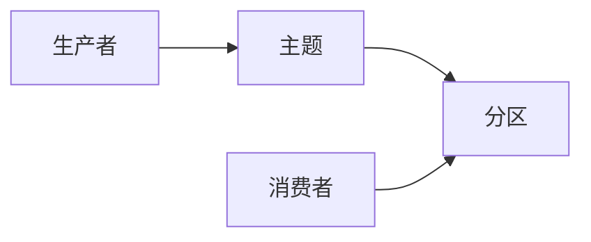

## 1.背景介绍

Apache Kafka 是一个分布式流处理平台，可用于构建实时的数据流管道和应用程序。它的设计目标是提供一个高吞吐量、低延迟、可扩展和容错的实时数据处理框架。这篇文章将详细介绍 Kafka 的核心概念、原理以及如何通过代码实例进行操作。

## 2.核心概念与联系

Kafka 的核心概念包括生产者、消费者、主题和分区。生产者负责向 Kafka 发送消息，这些消息被保存在主题中。主题可以进一步划分为多个分区，每个分区可以独立地保存和处理数据。消费者从主题的一个或多个分区读取和处理消息。



## 3.核心算法原理具体操作步骤

在 Kafka 中，生产者和消费者通过 Kafka 的 API 进行交互。生产者使用 `Producer API` 将消息发送到 Kafka，消费者使用 `Consumer API` 从 Kafka 读取消息。在这两个过程中，Kafka 使用了一些核心的算法和数据结构来保证消息的有序性、一致性和可靠性。

### 3.1 生产者操作

生产者在发送消息时，会首先将消息序列化成字节流，然后通过网络将这些字节流发送到 Kafka 的 Broker。Broker 是 Kafka 的服务节点，负责接收来自生产者的消息并将其保存到主题的分区中。

### 3.2 消费者操作

消费者在读取消息时，会首先从 Broker 请求消息，然后将收到的字节流反序列化成消息。为了保证消息的有序性，每个分区中的消息都被赋予了一个唯一的偏移量。消费者可以通过这个偏移量来控制读取消息的位置。

## 4.数学模型和公式详细讲解举例说明

假设我们有一个 Kafka 系统，其中有 $n$ 个生产者，$m$ 个消费者，$k$ 个主题，每个主题有 $p$ 个分区。对于每个生产者，它可以向任何一个主题的任何一个分区发送消息，因此，生产者的吞吐量 $T_p$ 可以表示为：

$$
T_p = n \times k \times p
$$

对于每个消费者，它可以从任何一个主题的任何一个分区读取消息，因此，消费者的吞吐量 $T_c$ 可以表示为：

$$
T_c = m \times k \times p
$$

在理想情况下，如果我们希望系统处于平衡状态，那么生产者的吞吐量应该等于消费者的吞吐量，即 $T_p = T_c$。

## 5.项目实践：代码实例和详细解释说明

下面我们通过一个简单的代码实例来展示如何使用 Kafka 的 API 进行操作。

### 5.1 生产者代码示例

```java
import org.apache.kafka.clients.producer.*;

public class ProducerDemo {
    public static void main(String[] args) {
        // 创建生产者配置
        Properties props = new Properties();
        props.put("bootstrap.servers", "localhost:9092");
        props.put("key.serializer", "org.apache.kafka.common.serialization.StringSerializer");
        props.put("value.serializer", "org.apache.kafka.common.serialization.StringSerializer");

        // 创建生产者
        Producer<String, String> producer = new KafkaProducer<>(props);

        // 发送消息
        for(int i = 0; i < 100; i++) {
            producer.send(new ProducerRecord<String, String>("my-topic", Integer.toString(i), Integer.toString(i)));
        }

        // 关闭生产者
        producer.close();
    }
}
```

### 5.2 消费者代码示例

```java
import org.apache.kafka.clients.consumer.*;

public class ConsumerDemo {
    public static void main(String[] args) {
        // 创建消费者配置
        Properties props = new Properties();
        props.put("bootstrap.servers", "localhost:9092");
        props.put("group.id", "test");
        props.put("key.deserializer", "org.apache.kafka.common.serialization.StringDeserializer");
        props.put("value.deserializer", "org.apache.kafka.common.serialization.StringDeserializer");

        // 创建消费者
        Consumer<String, String> consumer = new KafkaConsumer<>(props);

        // 订阅主题
        consumer.subscribe(Arrays.asList("my-topic"));

        // 读取消息
        while (true) {
            ConsumerRecords<String, String> records = consumer.poll(Duration.ofMillis(100));
            for (ConsumerRecord<String, String> record : records) {
                System.out.printf("offset = %d, key = %s, value = %s%n", record.offset(), record.key(), record.value());
            }
        }
    }
}
```

## 6.实际应用场景

Kafka 在实际的生产环境中有广泛的应用，例如日志收集、消息队列、用户行为跟踪、实时分析等。例如，LinkedIn 使用 Kafka 来处理每天的数十亿条用户行为数据；Netflix 使用 Kafka 来实现其实时监控系统；Uber 使用 Kafka 来处理其实时的订单和行程数据。

## 7.工具和资源推荐

- Apache Kafka 官方网站：提供了详细的文档和教程，是学习 Kafka 的最好资源。
- Kafka Streams：Kafka 的官方流处理库，可以用来构建实时的数据流应用程序。
- Confluent Platform：提供了一套完整的 Kafka 解决方案，包括 Kafka、Kafka Streams、Kafka Connect、KSQL 等组件。

## 8.总结：未来发展趋势与挑战

随着数据的增长和实时处理需求的提高，Kafka 的重要性将会越来越大。然而，Kafka 也面临着一些挑战，例如如何处理大规模的数据、如何提高处理速度、如何保证数据的一致性和可靠性等。这些挑战需要我们在未来的研究和实践中去解决。

## 9.附录：常见问题与解答

- 问题1：如何提高 Kafka 的吞吐量？
  - 答案：可以通过增加主题的分区数、增加 Broker 的数量、优化生产者和消费者的配置等方法来提高 Kafka 的吞吐量。

- 问题2：Kafka 如何保证消息的一致性和可靠性？
  - 答案：Kafka 使用了一些机制来保证消息的一致性和可靠性，例如副本同步、ISR 机制、消息确认机制等。

- 问题3：Kafka 和其他消息队列系统有什么区别？
  - 答案：Kafka 的设计目标是提供一个高吞吐量、低延迟、可扩展和容错的实时数据处理框架，这使得它在处理大规模的实时数据时具有优势。

作者：禅与计算机程序设计艺术 / Zen and the Art of Computer Programming