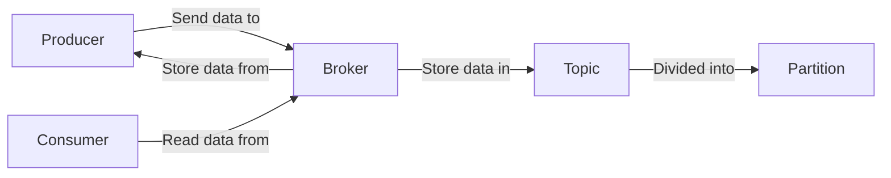

## 1.背景介绍
Apache Kafka是一个分布式流处理平台，用于构建实时数据管道和流应用程序。它是水平可扩展的，容错的，快速的，并且能够在从一个服务器到数千个服务器的集群中运行。然而，为了充分利用Kafka的强大功能，需要对其进行适当的监控和优化。本文将重点讨论Kafka性能的监控和优化。

## 2.核心概念与联系
在深入讨论如何监控和优化Kafka性能之前，我们首先需要理解Kafka的一些核心概念。

### 2.1 Kafka的基本构成
Kafka主要由以下几个部分构成：

- **Producer**：生产者，负责向Kafka发送数据。
- **Broker**：代理，存储由生产者发送的数据。
- **Consumer**：消费者，从Kafka读取数据。
- **Topic**：主题，数据的分类。
- **Partition**：分区，主题的子类别，用于数据的并行处理。

这些构成部分之间的关系如下图所示：



### 2.2 Kafka的性能指标
在监控和优化Kafka性能时，我们需要关注以下性能指标：

- **吞吐量**：系统在单位时间内处理消息的数量。
- **延迟**：消息从发送到被消费的时间。
- **可用性**：系统能在规定时间内正常提供服务的能力。

## 3.核心算法原理具体操作步骤
接下来，我们将详细介绍如何监控和优化Kafka性能的具体步骤。

### 3.1 监控Kafka性能
监控Kafka性能的主要目标是确保系统的稳定性和可靠性。我们可以通过以下方式来监控Kafka的性能：

- **使用JMX**：Java Management Extensions (JMX)是一种Java技术，可以用于监控和管理Java应用程序。Kafka Broker、Producer和Consumer都暴露了JMX接口，我们可以通过这些接口获取到各种性能指标。

- **使用Kafka的内置工具**：Kafka提供了一些内置的命令行工具，可以用来查看Broker、Topic和Consumer的状态。

- **使用第三方监控工具**：有许多第三方工具，如Prometheus、Grafana等，可以用来监控Kafka的性能。

### 3.2 优化Kafka性能
优化Kafka性能的主要目标是提高系统的吞吐量，降低延迟，提高可用性。我们可以通过以下方式来优化Kafka的性能：

- **增加Broker的数量**：增加Broker的数量可以提高系统的吞吐量和可用性。

- **增加Partition的数量**：增加Partition的数量可以提高系统的并行处理能力，从而提高吞吐量。

- **优化Producer和Consumer的配置**：合理的配置Producer和Consumer可以提高系统的性能。

## 4.数学模型和公式详细讲解举例说明
在优化Kafka性能时，我们需要对系统的吞吐量和延迟进行量化分析。以下是两个重要的数学模型和公式：

- **吞吐量**：吞吐量（T）可以通过以下公式计算：

$$ T = \frac{N}{t} $$

其中，$N$ 是处理的消息数量，$t$ 是处理这些消息的时间。

- **延迟**：延迟（L）可以通过以下公式计算：

$$ L = \frac{t}{N} $$

其中，$t$ 是处理消息的总时间，$N$ 是处理的消息数量。

## 5.项目实践：代码实例和详细解释说明
接下来，我们将通过一个简单的例子来展示如何在Java中使用Kafka。

### 5.1 创建Producer
首先，我们需要创建一个Producer来发送数据。以下是创建Producer的代码示例：

```java
Properties props = new Properties();
props.put("bootstrap.servers", "localhost:9092");
props.put("key.serializer", "org.apache.kafka.common.serialization.StringSerializer");
props.put("value.serializer", "org.apache.kafka.common.serialization.StringSerializer");

Producer<String, String> producer = new KafkaProducer<>(props);
```

### 5.2 发送数据
然后，我们可以使用Producer发送数据。以下是发送数据的代码示例：

```java
ProducerRecord<String, String> record = new ProducerRecord<>("test", "key", "value");
producer.send(record);
```

### 5.3 创建Consumer
接下来，我们需要创建一个Consumer来接收数据。以下是创建Consumer的代码示例：

```java
Properties props = new Properties();
props.put("bootstrap.servers", "localhost:9092");
props.put("group.id", "test");
props.put("key.deserializer", "org.apache.kafka.common.serialization.StringDeserializer");
props.put("value.deserializer", "org.apache.kafka.common.serialization.StringDeserializer");

Consumer<String, String> consumer = new KafkaConsumer<>(props);
```

### 5.4 接收数据
最后，我们可以使用Consumer接收数据。以下是接收数据的代码示例：

```java
consumer.subscribe(Arrays.asList("test"));

while (true) {
    ConsumerRecords<String, String> records = consumer.poll(100);
    for (ConsumerRecord<String, String> record : records) {
        System.out.printf("offset = %d, key = %s, value = %s%n", record.offset(), record.key(), record.value());
    }
}
```

## 6.实际应用场景
Kafka在许多实际应用场景中都发挥了重要作用，例如：

- **日志收集**：Kafka可以用于收集来自各种源的大量日志数据，然后将这些数据传输到一个集中的地方进行处理和分析。

- **消息队列**：Kafka可以作为一个高性能的消息队列，用于在系统之间传输数据。

- **实时数据处理**：Kafka可以用于实时数据处理，例如实时分析用户的点击流数据，实时监控系统的运行状态等。

## 7.工具和资源推荐
以下是一些有用的工具和资源，可以帮助你更好地监控和优化Kafka性能：

- **Kafka Manager**：一个开源的Kafka集群管理工具，可以用来监控Kafka集群的状态，创建和删除Topic，查看Consumer的状态等。

- **Kafka Monitor**：一个开源的Kafka监控工具，可以用来监控Kafka集群的性能。

- **Kafka Streams**：一个开源的库，可以用来构建实时数据处理应用程序。

## 8.总结：未来发展趋势与挑战
随着数据量的增长，对实时数据处理的需求也在增加。Kafka作为一个高性能的分布式流处理平台，将在未来的数据处理领域发挥越来越重要的作用。然而，随着Kafka的使用变得越来越广泛，如何有效地监控和优化Kafka性能也成为了一个重要的挑战。

## 9.附录：常见问题与解答
### Q1：为什么Kafka的性能比传统的消息队列更好？
A：Kafka的设计使其具有高吞吐量，低延迟和高可用性。Kafka使用了一种名为“零拷贝”的技术，可以直接将数据从磁盘读取到网络套接字，从而大大提高了性能。

### Q2：如何选择合适的Partition数量？
A：选择Partition数量的一个重要原则是，Partition的数量应该能够充分利用所有的Broker和Consumer。如果Partition的数量太少，可能会导致一部分Broker或Consumer处于空闲状态。如果Partition的数量太多，可能会导致系统的管理开销过大。

### Q3：Kafka是否支持数据的压缩？
A：是的，Kafka支持数据的压缩，可以大大减少网络传输的数据量，从而提高性能。Kafka支持多种压缩算法，包括Gzip、Snappy和LZ4。

作者：禅与计算机程序设计艺术 / Zen and the Art of Computer Programming