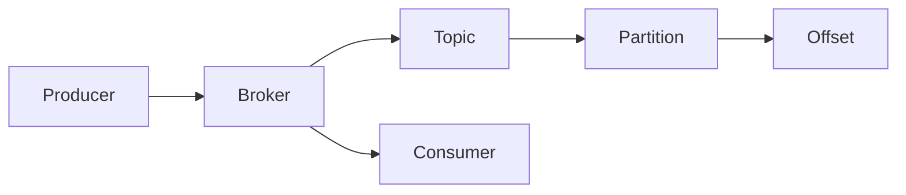

## 1.背景介绍

### 1.1 Kafka的起源和发展
Apache Kafka是一种高吞吐量的分布式发布订阅消息系统，由LinkedIn公司开发，后来成为Apache项目的一部分。Kafka是用Scala和Java编写的，因此主要是面向JVM的用户。Kafka的设计目标是为大数据实时处理提供实时性的数据流传输。它的高吞吐量、可扩展性和失败恢复能力使得Kafka在广告、日志收集、流处理、网站活动跟踪等众多场景中都有广泛的应用。

### 1.2 Kafka的重要性和地位
在当前的大数据和云计算环境下，实时数据流处理变得越来越重要。而Kafka作为最具影响力的实时数据流处理工具之一，其重要性不言而喻。无论是大型互联网公司，还是中小型企业，无不在使用Kafka来处理各种实时数据流。因此，学习和掌握Kafka，对于程序员和数据工程师来说，是非常重要的。

## 2.核心概念与联系

### 2.1 Kafka的基本概念
Kafka主要由以下几个核心概念构成：Producer、Broker、Consumer、Topic、Partition、Offset。

- Producer：数据生产者，向Kafka的一个或多个Topic发布消息的客户端应用程序。
- Broker：Kafka集群中的一个服务器，负责存储和处理消息。
- Consumer：数据消费者，从Kafka的一个或多个Topic读取消息的客户端应用程序。
- Topic：Kafka中数据的分类，相当于数据库中的“表”。
- Partition：Topic的分区，用于实现数据的并行处理。
- Offset：在Partition中每条消息的唯一标识，用于标记消息的位置。

### 2.2 Kafka的工作原理
Kafka的工作原理可以简单描述为：Producer发布消息到Broker的一个或多个Topic中，每个Topic被划分为多个Partition，每个Partition中的消息通过Offset进行唯一标识。Consumer从Broker的一个或多个Topic中读取数据，通过维护每个Partition的Offset来控制消息的读取位置。



## 3.核心算法原理具体操作步骤

### 3.1 数据的发布
数据的发布主要由Producer完成。Producer将数据打包成消息，然后发送到Broker的一个或多个Topic中。在发送消息时，Producer可以选择将消息发送到Topic的哪个Partition中。如果没有指定Partition，Kafka会根据Round-Robin策略自动选择一个Partition。

### 3.2 数据的存储
数据的存储主要由Broker完成。Broker接收到Producer发送的消息后，会将消息追加到对应Topic的指定Partition中。每个Partition中的消息都有一个唯一的Offset，新的消息总是被追加到Partition的末尾，Offset会自动增加。

### 3.3 数据的消费
数据的消费主要由Consumer完成。Consumer从Broker的一个或多个Topic中读取数据。在读取数据时，Consumer需要指定读取哪个Partition，以及从哪个Offset开始读取。读取完一条消息后，Consumer会更新该Partition的Offset。

## 4.数学模型和公式详细讲解举例说明

在Kafka中，我们可以使用一些数学模型和公式来描述和优化Kafka的性能。例如，我们可以用下面的公式来计算Kafka的吞吐量（Throughput）：

$$
Throughput = \frac{Total \, messages}{Total \, time}
$$

其中，Total messages是在一段时间内处理的消息总数，Total time是处理这些消息所花费的总时间。

我们还可以用下面的公式来计算Kafka的延迟（Latency）：

$$
Latency = \frac{Total \, delay}{Total \, messages}
$$

其中，Total delay是在一段时间内所有消息的延迟总和，Total messages是在这段时间内处理的消息总数。

通过这些公式，我们可以量化地评估Kafka的性能，从而更好地优化Kafka的配置和使用。

## 5.项目实践：代码实例和详细解释说明

在这一部分，我们将通过一个简单的例子来演示如何使用Kafka进行数据的发布和消费。

### 5.1 Kafka环境的搭建
首先，我们需要搭建一个Kafka环境。这可以通过下载和安装Kafka，然后启动Zookeeper和Kafka服务来完成。

```bash
# 下载和解压Kafka
wget http://apache.mirrors.tds.net/kafka/2.2.0/kafka_2.12-2.2.0.tgz
tar -xzf kafka_2.12-2.2.0.tgz

# 启动Zookeeper服务
./kafka_2.12-2.2.0/bin/zookeeper-server-start.sh ./kafka_2.12-2.2.0/config/zookeeper.properties

# 启动Kafka服务
./kafka_2.12-2.2.0/bin/kafka-server-start.sh ./kafka_2.12-2.2.0/config/server.properties
```

### 5.2 数据的发布
然后，我们可以编写一个简单的Producer程序，向Kafka发布一些消息。

```java
import org.apache.kafka.clients.producer.*;

public class SimpleProducer {
    public static void main(String[] args) {
        Properties props = new Properties();
        props.put("bootstrap.servers", "localhost:9092");
        props.put("key.serializer", "org.apache.kafka.common.serialization.StringSerializer");
        props.put("value.serializer", "org.apache.kafka.common.serialization.StringSerializer");

        Producer<String, String> producer = new KafkaProducer<>(props);
        for (int i = 0; i < 100; i++)
            producer.send(new ProducerRecord<String, String>("my-topic", Integer.toString(i), Integer.toString(i)));

        producer.close();
    }
}
```

这个程序将会向Kafka的"my-topic"主题发布100条消息，每条消息的键和值都是一个整数字符串。

### 5.3 数据的消费
最后，我们可以编写一个简单的Consumer程序，从Kafka消费这些消息。

```java
import org.apache.kafka.clients.consumer.*;

public class SimpleConsumer {
    public static void main(String[] args) {
        Properties props = new Properties();
        props.put("bootstrap.servers", "localhost:9092");
        props.put("group.id", "test");
        props.put("key.deserializer", "org.apache.kafka.common.serialization.StringDeserializer");
        props.put("value.deserializer", "org.apache.kafka.common.serialization.StringDeserializer");

        Consumer<String, String> consumer = new KafkaConsumer<>(props);
        consumer.subscribe(Arrays.asList("my-topic"));

        while (true) {
            ConsumerRecords<String, String> records = consumer.poll(100);
            for (ConsumerRecord<String, String> record : records)
                System.out.printf("offset = %d, key = %s, value = %s%n", record.offset(), record.key(), record.value());
        }
    }
}
```

这个程序将会从Kafka的"my-topic"主题消费消息，然后打印出每条消息的偏移量、键和值。

通过这个例子，我们可以看到使用Kafka进行数据的发布和消费是非常简单和直观的。

## 6.实际应用场景

Kafka在许多实际应用场景中都发挥着重要的作用。下面是一些常见的应用场景：

### 6.1 日志收集
Kafka可以用于收集各种服务器的日志数据，然后统一进行处理和分析。这对于监控系统的状态、排查问题、进行安全审计等都非常有用。

### 6.2 实时数据分析
Kafka可以用于实时收集和处理各种业务数据，比如用户行为数据、交易数据等。这对于实时监控业务状态、实时推荐、实时风控等都非常有用。

### 6.3 数据同步
Kafka可以用于在不同的系统或组件之间同步数据。比如，我们可以使用Kafka将数据库的数据实时同步到搜索引擎或数据仓库。

### 6.4 事件驱动的微服务
Kafka可以用于实现事件驱动的微服务架构。在这种架构中，服务之间通过Kafka来发送和接收事件，从而实现解耦和异步。

## 7.工具和资源推荐

要学习和掌握Kafka，以下是一些推荐的工具和资源：

### 7.1 书籍
- 《Kafka权威指南》：这是一本非常全面和深入的Kafka教程书籍，由Kafka的主要开发者之一写作，非常推荐。
- 《Kafka实战》：这是一本非常实用的Kafka实战书籍，包含了许多实际的例子和最佳实践。

### 7.2 网站
- [Kafka官方网站](https://kafka.apache.org/)：这是Kafka的官方网站，包含了Kafka的下载、文档、教程、API等资源。
- [Kafka StackOverflow](https://stackoverflow.com/questions/tagged/apache-kafka)：这是StackOverflow上的Kafka标签，可以找到许多Kafka的问题和答案。

### 7.3 课程
- [Kafka教程](https://www.tutorialspoint.com/apache_kafka/index.htm)：这是一个非常全面的Kafka在线教程，适合初学者。
- [Kafka入门课程](https://www.udemy.com/course/apache-kafka/)：这是Udemy上的一个Kafka入门课程，包含了许多视频教程。

## 8.总结：未来发展趋势与挑战

Kafka作为一个高吞吐量的分布式发布订阅消息系统，在大数据实时处理领域有着广泛的应用。随着大数据和云计算的发展，Kafka的应用场景和需求只会越来越多。因此，Kafka的未来发展趋势是非常明显的。

然而，Kafka也面临着一些挑战。首先，Kafka的学习曲线较陡峭，需要掌握许多复杂的概念和技术。其次，Kafka的配置和优化较为复杂，需要根据具体的应用场景和需求进行调整。最后，Kafka的一些高级特性，如Exactly Once语义、事务等，还需要进一步的改进和完善。

总的来说，Kafka是一个非常强大和灵活的工具，值得我们深入学习和掌握。

## 9.附录：常见问题与解答

### Q1：Kafka和RabbitMQ有什么区别？
A1：Kafka和RabbitMQ都是消息队列系统，但是它们的设计目标和使用场景有所不同。Kafka主要设计用于高吞吐量的实时数据流处理，而RabbitMQ主要设计用于灵活的消息路由和投递。

### Q2：Kafka如何保证数据的可靠性？
A2：Kafka通过多副本和日志复制来保证数据的可靠性。每个Partition可以有多个副本，其中一个副本是Leader，其他的副本是Follower。Producer发布的消息首先被写入Leader，然后被复制到Follower。只有当消息被所有副本都写入后，才被认为是提交的，Consumer只能消费已经提交的消息。

### Q3：Kafka如何处理大量的小消息？
A3：Kafka通过批量发送和压缩来处理大量的小消息。Producer可以将多个小消息打包成一个大消息批次，然后一次性发送给Broker。同时，Kafka还支持消息的压缩，可以显著减少网络传输的数据量。

作者：禅与计算机程序设计艺术 / Zen and the Art of Computer Programming