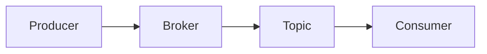

## 1.背景介绍

Apache Kafka是一种流行的开源流处理平台，它能够处理和存储大量的实时数据。其核心是一个发布-订阅消息队列，它的设计目标是为处理实时数据流提供高吞吐量、低延迟和容错性。在这篇文章中，我们将深入探讨Kafka生产者和消费者API的原理，并通过实例代码进行详细的讲解。

## 2.核心概念与联系

在深入理解Kafka生产者和消费者API之前，我们需要了解一些Kafka的核心概念。

- **Topic**: Kafka的数据被组织成一个或多个topic。当生产者发送数据时，它选择将数据发送到哪个topic，而消费者则从一个或多个topic读取数据。

- **Producer**: 生产者是发送数据到Kafka topic的客户端应用程序。

- **Consumer**: 消费者是从Kafka topic读取数据的客户端应用程序。

- **Broker**: Kafka集群中的每个服务器都被称为broker。broker接收来自生产者的消息，为消费者存储消息，并在失败时处理消息的重新分配。

在Kafka中，生产者和消费者通过Broker进行通信。生产者将消息发送到Broker，Broker将消息存储在Topic中，然后消费者从Topic中读取和消费这些消息。



## 3.核心算法原理具体操作步骤

### 3.1 Kafka生产者的工作原理

当生产者发送消息时，它首先确定消息应该发送到哪个分区。这通常是通过round-robin算法或基于消息键的散列算法来确定的。然后，生产者将消息发送到相应的broker，并等待broker确认消息已成功接收。一旦接收到确认，生产者就可以继续发送下一条消息。

### 3.2 Kafka消费者的工作原理

消费者通过向broker发送拉取请求来读取数据。拉取请求指定了消费者想要读取的topic和分区，以及消费者想要开始读取的消息的偏移量。然后，broker返回包含请求消息的响应。消费者读取响应中的消息，然后向broker发送另一个拉取请求，以获取更多的消息。

## 4.数学模型和公式详细讲解举例说明

在Kafka中，我们可以使用一些基本的数学模型和公式来描述和优化系统的性能。例如，我们可以使用下面的公式来计算Kafka的吞吐量：

$ T = \frac{N}{t} $

其中，$T$ 是吞吐量，$N$ 是处理的消息数量，$t$ 是处理这些消息所需的时间。

另一个重要的概念是延迟，它是消息从生产者发送到消费者接收的时间。延迟可以用以下公式表示：

$ L = t_{receive} - t_{send} $

其中，$L$ 是延迟，$t_{receive}$ 是消费者接收消息的时间，$t_{send}$ 是生产者发送消息的时间。

## 5.项目实践：代码实例和详细解释说明

接下来，我们将通过实例代码来演示如何使用Kafka的生产者和消费者API。

### 5.1 Kafka生产者代码实例

以下是一个简单的Kafka生产者代码实例：

```java
public class KafkaProducerExample {
    public static void main(String[] args) {
        Properties props = new Properties();
        props.put("bootstrap.servers", "localhost:9092");
        props.put("key.serializer", "org.apache.kafka.common.serialization.StringSerializer");
        props.put("value.serializer", "org.apache.kafka.common.serialization.StringSerializer");

        Producer<String, String> producer = new KafkaProducer<>(props);
        for(int i = 0; i < 100; i++)
            producer.send(new ProducerRecord<String, String>("my-topic", Integer.toString(i), Integer.toString(i)));

        producer.close();
    }
}
```

这段代码首先创建一个Kafka生产者，然后发送100条消息到"my-topic"主题。每条消息的键和值都是消息的编号。

### 5.2 Kafka消费者代码实例

以下是一个简单的Kafka消费者代码实例：

```java
public class KafkaConsumerExample {
    public static void main(String[] args) {
        Properties props = new Properties();
        props.put("bootstrap.servers", "localhost:9092");
        props.put("group.id", "test");
        props.put("enable.auto.commit", "true");
        props.put("auto.commit.interval.ms", "1000");
        props.put("key.deserializer", "org.apache.kafka.common.serialization.StringDeserializer");
        props.put("value.deserializer", "org.apache.kafka.common.serialization.StringDeserializer");

        Consumer<String, String> consumer = new KafkaConsumer<>(props);
        consumer.subscribe(Arrays.asList("my-topic"));

        while (true) {
            ConsumerRecords<String, String> records = consumer.poll(Duration.ofMillis(100));
            for (ConsumerRecord<String, String> record : records)
                System.out.printf("offset = %d, key = %s, value = %s%n", record.offset(), record.key(), record.value());
        }
    }
}
```

这段代码首先创建一个Kafka消费者，然后订阅"my-topic"主题。然后，它不断地从broker拉取新的消息，并打印出消息的偏移量、键和值。

## 6.实际应用场景

Kafka广泛应用于各种实时数据流处理场景，例如日志聚合、实时分析、事件驱动微服务等。例如，Uber使用Kafka来处理其实时数据流，包括旅程数据、地理位置更新等。LinkedIn也使用Kafka来处理其用户活动数据和操作日志。

## 7.工具和资源推荐

以下是一些有用的Kafka工具和资源：

- **Kafka官方文档**: Kafka的官方文档是最权威、最全面的资源，包含了Kafka的详细介绍、API文档和教程。

- **Confluent**: Confluent是由Kafka的创始人创建的公司，提供了一些有用的Kafka工具和服务，例如Confluent Platform、Kafka Connect和KSQL。

- **Kafka Streams**: Kafka Streams是一个Java库，用于构建实时、高度可扩展的数据处理应用程序。

## 8.总结：未来发展趋势与挑战

随着数据量的增长和实时处理需求的增加，Kafka的重要性也在不断提高。然而，Kafka也面临着一些挑战，例如如何处理大量的数据、如何保证消息的顺序性、如何处理系统故障等。未来，我们期待Kafka能够通过持续的创新和改进，来解决这些挑战，更好地服务于实时数据流处理的需求。

## 9.附录：常见问题与解答

- **问题1：Kafka如何保证消息的顺序性？**

答：Kafka通过分区来保证消息的顺序性。在同一个分区内，消息是有序的，也就是说，生产者发送的消息会按照发送的顺序被存储在分区中。消费者在读取分区的消息时，也会按照存储的顺序进行读取。

- **问题2：Kafka如何处理系统故障？**

答：Kafka通过副本机制来处理系统故障。每个分区可以有多个副本，其中一个副本是主副本，其他的是备份副本。当主副本发生故障时，备份副本会接管主副本的角色，继续提供服务。

- **问题3：如何优化Kafka的性能？**

答：优化Kafka的性能有很多方法，例如增加分区数量、增加broker数量、优化生产者和消费者的配置等。

作者：禅与计算机程序设计艺术 / Zen and the Art of Computer Programming