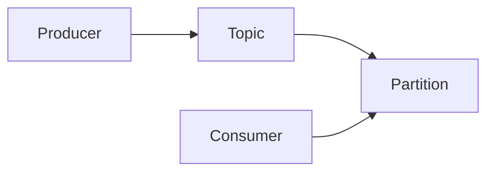

## 1.背景介绍

Apache Kafka是一个开源的分布式事件流平台，致力于为实时数据处理提供高吞吐、低延迟和容错处理。从2011年起，Kafka已经成为了许多大型企业的核心数据基础设施，用于实现实时的数据管道和流处理。随着Kafka的影响力逐渐扩大，其社区与生态也日益繁荣。

## 2.核心概念与联系

Kafka的核心概念包括生产者（Producer）、消费者（Consumer）、主题（Topic）和分区（Partition）。生产者负责将事件发送到Kafka，而消费者则从Kafka读取这些事件。主题是一种分发事件的逻辑通道，每个主题都可以分为多个分区，每个分区都是一组有序的、不可变的记录，以时间戳顺序写入。



## 3.核心算法原理具体操作步骤

在Kafka中，生产者将事件发送到特定主题的分区。每个分区都是一个有序的、不可变的记录序列，新的事件都添加到分区的末尾。每个记录在分区中的位置都由一个称为偏移量的唯一标识符标记。

消费者从分区读取记录，通过指定偏移量来控制读取位置。消费者在读取记录后，会将其偏移量提交到Kafka，以便在失败恢复时，知道从哪个位置开始读取。

## 4.数学模型和公式详细讲解举例说明

在Kafka中，分区的副本数量和消费者的数量会影响系统的吞吐量。假设每个分区的副本数量为$r$，消费者的数量为$c$，每个分区的事件数量为$n$，那么系统的吞吐量$T$可以用下面的公式来计算：

$$
T = \frac{n}{r \times c}
$$

例如，如果每个分区有1000个事件，副本数量为3，消费者数量为2，那么系统的吞吐量为：

$$
T = \frac{1000}{3 \times 2} \approx 166.67
$$

这意味着每个消费者每次可以处理约167个事件。

## 5.项目实践：代码实例和详细解释说明

以下是一个简单的Kafka生产者和消费者的Java代码示例：

```java
// 生产者
Producer<String, String> producer = new KafkaProducer<>(props);
for(int i = 0; i < 100; i++)
    producer.send(new ProducerRecord<String, String>("my-topic", Integer.toString(i), Integer.toString(i)));

// 消费者
Consumer<String, String> consumer = new KafkaConsumer<>(props);
consumer.subscribe(Arrays.asList("my-topic"));
while (true) {
    ConsumerRecords<String, String> records = consumer.poll(100);
    for (ConsumerRecord<String, String> record : records)
        System.out.printf("offset = %d, key = %s, value = %s%n", record.offset(), record.key(), record.value());
}
```

在这个示例中，生产者发送了100个事件到"my-topic"主题，每个事件的键和值都是事件的编号。消费者订阅了"my-topic"主题，并不断轮询新的事件，将每个事件的偏移量、键和值打印出来。

## 6.实际应用场景

Kafka广泛应用于大数据处理、实时分析、日志处理、事件驱动的微服务等场景。例如，LinkedIn使用Kafka来处理每天的上亿条消息，Uber使用Kafka来处理实时的位置更新，Netflix使用Kafka来实现其实时监控系统。

## 7.工具和资源推荐

- [Apache Kafka官方网站](https://kafka.apache.org/)：提供详细的文档和教程。
- [Confluent](https://www.confluent.io/)：提供Kafka的商业支持和增强版。
- [Kafka Summit](https://kafka-summit.org/)：Kafka的年度大会，可以了解最新的技术和案例。

## 8.总结：未来发展趋势与挑战

随着事件驱动架构和流处理的兴起，Kafka的应用将更加广泛。但同时，Kafka也面临着如何处理大规模、全球分布的数据，如何提供更强的容错和恢复能力等挑战。

## 9.附录：常见问题与解答

1. **Kafka如何保证数据的一致性？**

   Kafka通过副本机制来保证数据的一致性。每个分区都有多个副本，其中一个作为领导者，其他的作为追随者。所有的读写操作都通过领导者进行，追随者从领导者复制数据。当领导者失败时，会从追随者中选举出新的领导者。

2. **Kafka如何处理大规模数据？**

   Kafka通过分区和副本机制来处理大规模数据。每个主题可以分为多个分区，每个分区都可以在不同的服务器上。这样，Kafka可以通过增加服务器来扩展处理能力。

作者：禅与计算机程序设计艺术 / Zen and the Art of Computer Programming