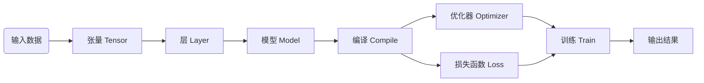

# Keras 原理与代码实战案例讲解

## 1.背景介绍
### 1.1 人工智能与深度学习
人工智能(Artificial Intelligence, AI)是计算机科学的一个重要分支,旨在研究如何让计算机模拟甚至超越人类的智能。其中,机器学习(Machine Learning, ML)作为实现人工智能的主要途径,通过学习大量数据,让计算机具备从经验中学习的能力。而深度学习(Deep Learning, DL)则是机器学习的一个子集,利用多层神经网络模拟人脑结构,大大提升了机器学习的性能,在计算机视觉、自然语言处理等领域取得了突破性进展。

### 1.2 Keras 框架简介
Keras 是一个用 Python 编写的高级神经网络 API,它能够以 TensorFlow、CNTK 或者 Theano 作为后端运行。Keras 的开发重点是支持快速的实验。能够以最小的时延把你的想法转换为实验结果,是做好研究的关键。Keras 具有以下特点:
- 容易上手:Keras 的设计理念是用户友好、模块化和可扩展性。
- 支持多种神经网络:Keras 支持卷积神经网络(CNN)、循环神经网络(RNN)等多种常见的神经网络。
- 支持任意的深度学习模型:Keras 可以将各种深度学习模型组合到一起,如多输入或多输出模型、有向无环图模型等。

## 2.核心概念与联系
### 2.1 张量(Tensor)
张量是多维数组,它是 Keras 中数据的基本表示形式。标量可以看作 0 维张量,向量可以看作 1 维张量,矩阵可以看作 2 维张量。张量中的每个元素都有相同的数据类型,一般是浮点数。

### 2.2 层(Layer)
层是 Keras 的核心概念,它是一个数据处理模块,接收一些张量作为输入,并产生一些张量作为输出。Keras 中内置了全连接层(Dense)、卷积层(Conv)、池化层(Pooling)、循环层(RNN)等多种常见的神经网络层。

### 2.3 模型(Model)  
模型是层的有向无环图,用于组织层。一个模型可以包含一个或多个输入,一个或多个输出。Keras 中常见的两种模型是序列模型(Sequential)和函数式模型(Functional)。

### 2.4 优化器(Optimizer)
优化器用于编译 Keras 模型,它实现了各种优化算法,如 SGD、RMSprop、Adam 等,用于在训练过程中更新权重。

### 2.5 损失函数(Loss Function)
损失函数用于编译 Keras 模型,它是优化的目标,即模型试图最小化的目标函数。常见的损失函数有均方误差(mean_squared_error)、交叉熵(categorical_crossentropy)等。

### 2.6 核心概念之间的联系
下面用一个 Mermaid 流程图来展示 Keras 中这些核心概念之间的联系:


可以看到,Keras 的工作流程是:输入数据表示为张量,通过层对数据进行处理,组成模型,然后用优化器和损失函数编译模型,最后训练模型得到输出结果。

## 3.核心算法原理具体操作步骤
### 3.1 前向传播
前向传播是神经网络的基础,对应于模型从输入到输出的计算过程。具体步骤如下:
1. 输入层接收输入数据。
2. 输入数据通过隐藏层的计算,得到新的数据表示。隐藏层可以有多个,每个隐藏层通常包含一个线性变换和一个非线性激活函数。
3. 隐藏层的输出通过输出层的计算,得到最终输出。
4. 输出结果与真实标签比较,计算损失函数。

用公式表示,假设输入为 $x$,模型为函数 $f$,模型参数为 $\theta$,输出为 $\hat{y} = f(x;\theta)$。如果真实标签为 $y$,损失函数为 $L$,则损失为 $L(y, \hat{y})$。

### 3.2 反向传播
反向传播是神经网络训练的核心算法,通过求梯度更新模型参数,使模型在训练数据上的损失最小化。具体步骤如下:
1. 根据损失函数 $L(y, \hat{y})$ 计算损失。
2. 计算损失函数 $L$ 关于每个神经元输出 $o_i$ 的梯度 $\frac{\partial L}{\partial o_i}$。
3. 根据链式法则,将损失函数关于神经元输出的梯度 $\frac{\partial L}{\partial o_i}$ 转化为损失函数关于每个参数 $\theta_i$ 的梯度 $\frac{\partial L}{\partial \theta_i} = \frac{\partial L}{\partial o_i} \frac{\partial o_i}{\partial \theta_i}$。
4. 根据梯度下降法,以学习率 $\eta$ 更新每个参数: $\theta_i \leftarrow \theta_i - \eta \frac{\partial L}{\partial \theta_i}$。
5. 重复步骤 1-4,直到模型收敛。

反向传播的数学推导涉及矩阵、向量的复合函数求导,对于一般的多层神经网络模型,可以用动态规划的思想,从输出层开始,逐层向前求导,避免重复计算。

## 4.数学模型和公式详细讲解举例说明
本节我们以一个简单的三层全连接神经网络为例,详细推导前向传播和反向传播的数学公式。

### 4.1 定义数学符号
- 输入: $\mathbf{x} \in \mathbb{R}^{n_0}$
- 第 $l$ 层神经元的输入: $\mathbf{z}^{(l)} \in \mathbb{R}^{n_l}$
- 第 $l$ 层神经元的输出(激活值): $\mathbf{a}^{(l)}= g^{(l)}(\mathbf{z}^{(l)}) \in \mathbb{R}^{n_l}$,其中 $g^{(l)}$ 是第 $l$ 层的激活函数
- 第 $l$ 层的权重矩阵: $\mathbf{W}^{(l)} \in \mathbb{R}^{n_l \times n_{l-1}}$
- 第 $l$ 层的偏置向量: $\mathbf{b}^{(l)} \in \mathbb{R}^{n_l}$
- 损失函数: $J(\mathbf{W},\mathbf{b};\mathbf{x},y)$

### 4.2 前向传播公式
对于一个三层的神经网络(1个隐藏层),前向传播的公式为:

$$
\begin{aligned}
\mathbf{z}^{(1)} &= \mathbf{W}^{(1)}\mathbf{x} + \mathbf{b}^{(1)} \\
\mathbf{a}^{(1)} &= g^{(1)}(\mathbf{z}^{(1)}) \\
\mathbf{z}^{(2)} &= \mathbf{W}^{(2)}\mathbf{a}^{(1)} + \mathbf{b}^{(2)} \\ 
\hat{y} = \mathbf{a}^{(2)} &= g^{(2)}(\mathbf{z}^{(2)})
\end{aligned}
$$

其中 $\mathbf{x}$ 是输入,$\hat{y}$ 是输出。这里假设输出层不加激活函数。

### 4.3 反向传播公式
根据链式法则,反向传播需要计算损失函数关于每个参数的梯度。对于第 $l$ 层的权重矩阵 $\mathbf{W}^{(l)}$ 和偏置向量 $\mathbf{b}^{(l)}$,梯度公式为:

$$
\begin{aligned}
\frac{\partial J}{\partial \mathbf{W}^{(l)}} &= \frac{\partial J}{\partial \mathbf{z}^{(l)}} \frac{\partial \mathbf{z}^{(l)}}{\partial \mathbf{W}^{(l)}} = \mathbf{\delta}^{(l)} (\mathbf{a}^{(l-1)})^T \\
\frac{\partial J}{\partial \mathbf{b}^{(l)}} &= \frac{\partial J}{\partial \mathbf{z}^{(l)}} \frac{\partial \mathbf{z}^{(l)}}{\partial \mathbf{b}^{(l)}} = \mathbf{\delta}^{(l)}
\end{aligned}
$$

其中 $\mathbf{\delta}^{(l)} = \frac{\partial J}{\partial \mathbf{z}^{(l)}}$ 表示第 $l$ 层的"错误",它的计算公式为:

$$
\mathbf{\delta}^{(l)} = \begin{cases}
\nabla_{\mathbf{a}^{(L)}} J \odot g'^{(L)}(\mathbf{z}^{(L)}), & \text{if } l = L \\
((\mathbf{W}^{(l+1)})^T \mathbf{\delta}^{(l+1)}) \odot g'^{(l)}(\mathbf{z}^{(l)}), & \text{if } l < L
\end{cases}
$$

其中 $\odot$ 表示 Hadamard 乘积(对应元素相乘),而 $\nabla_{\mathbf{a}^{(L)}} J$ 表示损失函数关于输出层激活值的梯度。

以均方误差损失函数为例,假设真实标签为 $y$,输出层激活函数为恒等函数,则:

$$
J = \frac{1}{2} \Vert \hat{y} - y \Vert^2, \quad
\nabla_{\mathbf{a}^{(L)}} J = \hat{y} - y
$$

至此,我们得到了前向传播和反向传播在数学上的完整推导。有了这些公式,就可以写出神经网络的训练代码了。

## 5.项目实践：代码实例和详细解释说明
本节我们用 Keras 实现一个三层的全连接神经网络,用于 MNIST 手写数字识别任务。完整代码如下:

```python
from keras.datasets import mnist
from keras.models import Sequential
from keras.layers import Dense
from keras.optimizers import SGD

# 加载 MNIST 数据集
(x_train, y_train), (x_test, y_test) = mnist.load_data()

# 数据预处理
x_train = x_train.reshape(60000, 784) 
x_test = x_test.reshape(10000, 784)
x_train = x_train.astype('float32') / 255
x_test = x_test.astype('float32') / 255

# 将标签转换为 one-hot 编码
y_train = keras.utils.to_categorical(y_train, 10)
y_test = keras.utils.to_categorical(y_test, 10)

# 定义模型
model = Sequential()
model.add(Dense(512, activation='relu', input_shape=(784,)))
model.add(Dense(256, activation='relu'))
model.add(Dense(10, activation='softmax'))

# 编译模型
model.compile(optimizer=SGD(lr=0.01), 
              loss='categorical_crossentropy',
              metrics=['accuracy'])

# 训练模型
model.fit(x_train, y_train, 
          batch_size=128, 
          epochs=20, 
          validation_data=(x_test, y_test))
```

下面我们详细解释每一步:

1. 加载 MNIST 数据集:MNIST 是一个手写数字识别数据集,包含 60000 个训练样本和 10000 个测试样本,每个样本是一个 28x28 的灰度图像。

2. 数据预处理:将图像从 28x28 的矩阵展平为 784 维的向量,并将像素值缩放到 [0,1] 区间。这可以加速梯度下降的收敛。

3. 将标签转换为 one-hot 编码:原始标签是 0-9 的数字,转换为 one-hot 编码后,每个标签变成一个 10 维的向量,只有对应的数字位置为 1,其他位置为 0。这是多分类问题的常用处理方式。

4. 定义模型:使用 Keras 的 Sequential 模型,依次添加三个全连接层。第一层有 512 个神经元,第二层有 256 个神经元,输出层有 10 个神经元,分别对应 0-9 这 10 个数字。隐藏层使用 