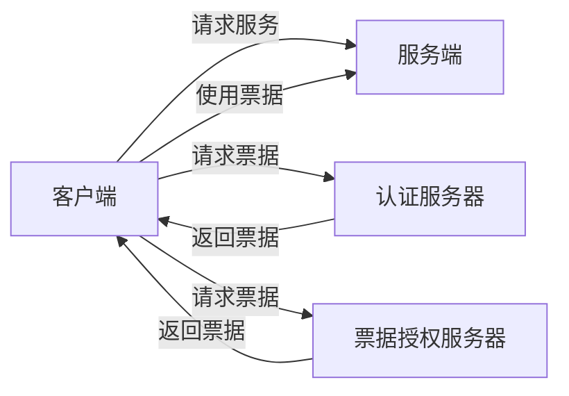

## 1.背景介绍

在我们的日常生活中，身份认证无处不在。无论是解锁手机，还是登录电脑，都需要我们证明自己是合法的用户。在计算机网络中，这种身份验证更是重要，因为它关系到数据的安全性和完整性。Kerberos，就是一种在互联网环境中广泛应用的身份认证协议。它的名字来源于希腊神话中的三头犬克柏洛斯，象征着它对网络安全的严密守护。那么，Kerberos是如何工作的呢？我们又如何在实际项目中应用它呢？接下来的内容，将带您深入了解Kerberos的原理与应用。

## 2.核心概念与联系

在我们开始详细介绍Kerberos之前，我们需要了解一些核心概念。

- **客户端(Client)**：需要进行身份验证的用户或者服务。

- **服务端(Server)**：提供服务的应用程序。

- **票据(Ticket)**：Kerberos系统中用于身份验证的凭证。

- **密钥(Key)**：用于加密和解密数据的字符串。

- **认证服务器(AS, Authentication Server)**：负责身份验证和票据分发的服务器。

- **票据授权服务器(TGS, Ticket Granting Server)**：负责票据的分发。

这些核心概念之间的联系如下：



## 3.核心算法原理具体操作步骤

Kerberos的工作流程可以分为三个阶段：初始身份验证，票据获取，以及服务请求。下面我们将逐一介绍这三个阶段的具体操作步骤。

### 3.1 初始身份验证

在初始身份验证阶段，客户端首先需要向认证服务器发送一个包含自己身份信息的请求。认证服务器收到请求后，会对客户端的身份进行验证。验证成功后，认证服务器会生成一个包含客户端和票据授权服务器之间的会话密钥的票据，然后将这个票据返回给客户端。客户端收到票据后，就可以使用这个票据向票据授权服务器请求服务票据了。

### 3.2 票据获取

在票据获取阶段，客户端需要向票据授权服务器发送一个包含自己身份信息和需要访问的服务信息的请求。票据授权服务器收到请求后，会验证客户端的身份和服务的合法性。验证成功后，票据授权服务器会生成一个包含客户端和服务端之间的会话密钥的服务票据，然后将这个服务票据返回给客户端。客户端收到服务票据后，就可以使用这个服务票据向服务端请求服务了。

### 3.3 服务请求

在服务请求阶段，客户端需要向服务端发送一个包含自己身份信息和服务票据的请求。服务端收到请求后，会验证服务票据的合法性。验证成功后，服务端会提供请求的服务给客户端。

## 4.数学模型和公式详细讲解举例说明

在Kerberos中，有两种主要的加密算法，分别是对称加密和非对称加密。对称加密是指加密和解密使用同一把密钥的加密算法，非对称加密是指加密和解密使用不同的密钥的加密算法。在Kerberos中，对称加密主要用于客户端和服务端之间的通信，非对称加密主要用于客户端和认证服务器之间的通信。

对于对称加密，其数学模型可以表示为：

$$
C = M \oplus K
$$

其中，$C$ 是密文，$M$ 是明文，$K$ 是密钥，$\oplus$ 是异或运算。

对于非对称加密，其数学模型可以表示为：

$$
C = M^e \mod n
$$

$$
M = C^d \mod n
$$

其中，$C$ 是密文，$M$ 是明文，$e$ 是公钥，$d$ 是私钥，$n$ 是模数。

## 5.项目实践：代码实例和详细解释说明

在实际的项目中，我们可以使用Java的JGSS-API来实现Kerberos的身份验证。下面是一个简单的代码示例：

```java
// 导入相关的库
import javax.security.auth.Subject;
import javax.security.auth.login.LoginContext;
import javax.security.auth.login.LoginException;

public class KerberosClient {
    public static void main(String[] args) {
        try {
            // 创建一个LoginContext对象
            LoginContext lc = new LoginContext("KerberosClient");
            // 登录
            lc.login();
            // 获取Subject
            Subject subject = lc.getSubject();
            // 输出Subject
            System.out.println("Authenticated user: " + subject);
        } catch (LoginException le) {
            System.err.println("Authentication failed: ");
            le.printStackTrace();
            System.exit(-1);
        }
    }
}
```

在这段代码中，我们首先导入了需要的库，然后创建了一个`LoginContext`对象，这个对象是JGSS-API中用于身份验证的主要接口。接着，我们调用了`login`方法进行登录，如果登录成功，我们就可以通过`getSubject`方法获取到已验证的用户，最后，我们将用户信息打印出来。

## 6.实际应用场景

Kerberos在许多实际的应用场景中都有着广泛的应用。例如，在大型企业的内部网络中，为了保证员工访问内部资源的安全性，通常会使用Kerberos进行身份验证。又如，在云计算环境中，为了保证用户访问云服务的安全性，也会使用Kerberos进行身份验证。

## 7.工具和资源推荐

如果你想要深入学习和实践Kerberos，我推荐以下的工具和资源：

- **MIT Kerberos**：这是一个开源的Kerberos实现，它提供了完整的Kerberos功能，并且有详细的文档。

- **Wireshark**：这是一个网络协议分析工具，你可以使用它来分析Kerberos的网络通信过程。

- **JGSS-API**：这是Java提供的一个GSS-API实现，你可以使用它来在Java程序中实现Kerberos身份验证。

## 8.总结：未来发展趋势与挑战

随着互联网的发展，身份验证的重要性日益凸显。Kerberos作为一种成熟的身份验证协议，将会在未来的网络安全领域中发挥更大的作用。然而，Kerberos也面临着一些挑战，例如如何应对量子计算的威胁，如何提高身份验证的效率等。这些挑战需要我们在未来的研究中去逐一克服。

## 9.附录：常见问题与解答

1. **问题：Kerberos的安全性如何？**

答：Kerberos的安全性是非常高的。它使用了对称加密和非对称加密两种加密算法，确保了通信的安全性。同时，它还使用了票据机制，进一步增强了身份验证的安全性。

2. **问题：Kerberos的效率如何？**

答：Kerberos的效率是相对较高的。虽然在身份验证过程中需要多次的网络通信，但是由于使用了高效的加密算法，所以整体的效率还是相当高的。

3. **问题：如何在Java中实现Kerberos身份验证？**

答：在Java中，我们可以使用JGSS-API来实现Kerberos身份验证。JGSS-API是Java提供的一个GSS-API实现，它提供了一套简单易用的API，使得我们可以方便地在Java程序中实现Kerberos身份验证。

作者：禅与计算机程序设计艺术 / Zen and the Art of Computer Programming