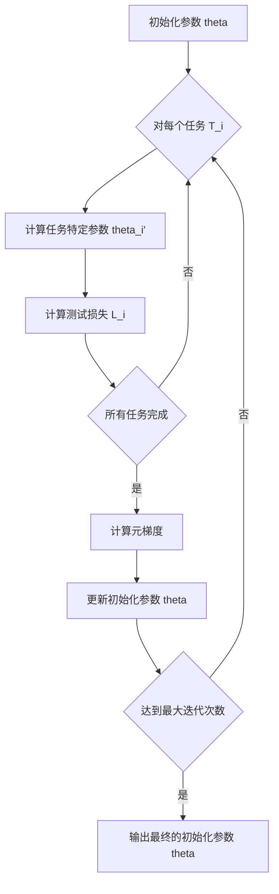

# MAML：原理、算法流程与代码实例

## 1. 背景介绍

### 1.1 元学习的兴起
近年来，随着深度学习的飞速发展，人工智能在图像识别、自然语言处理等领域取得了令人瞩目的成就。然而，传统的深度学习方法在面对小样本学习、快速适应新任务等场景时仍然存在局限性。为了解决这些问题，元学习（Meta-Learning）应运而生，成为了机器学习领域的研究热点。

### 1.2 MAML的提出
在众多元学习算法中，MAML（Model-Agnostic Meta-Learning）脱颖而出，受到了学术界和工业界的广泛关注。MAML由Chelsea Finn等人于2017年提出，旨在通过学习一个好的初始化模型参数，使模型能够在新任务上快速适应，达到小样本学习的目的。

### 1.3 MAML的优势
与其他元学习方法相比，MAML具有以下优势：
1. 模型无关性：MAML可以应用于各种不同的机器学习模型，如神经网络、决策树等。
2. 高效性：MAML只需要少量的梯度更新步骤，即可在新任务上取得良好的性能。
3. 可解释性：MAML学习到的初始化参数具有一定的可解释性，有助于理解模型的内部机制。

## 2. 核心概念与联系

### 2.1 任务分布
在MAML中，我们假设存在一个任务分布 $p(\mathcal{T})$，其中每个任务 $\mathcal{T}_i$ 都有自己的训练数据集 $\mathcal{D}_i^{train}$ 和测试数据集 $\mathcal{D}_i^{test}$。我们的目标是通过在一系列任务上的训练，学习一个初始化参数 $\theta$，使得模型能够在新任务上快速适应。

### 2.2 内循环与外循环
MAML的训练过程分为两个循环：内循环（Inner Loop）和外循环（Outer Loop）。
- 内循环：对于每个任务 $\mathcal{T}_i$，我们使用其训练数据集 $\mathcal{D}_i^{train}$ 对模型进行少量的梯度更新，得到任务特定的参数 $\theta_i'$。
- 外循环：使用所有任务的测试数据集 $\mathcal{D}_i^{test}$，计算模型在各个任务上的损失，并通过梯度下降更新初始化参数 $\theta$。

### 2.3 元梯度
在MAML中，我们需要计算元梯度（Meta-Gradient）来更新初始化参数 $\theta$。元梯度是模型在各个任务上损失函数关于初始化参数 $\theta$ 的梯度，反映了初始化参数对模型在新任务上快速适应的影响。

## 3. 核心算法原理具体操作步骤

### 3.1 算法流程
MAML的算法流程如下：



### 3.2 具体步骤
1. 随机初始化模型参数 $\theta$。
2. 对于每个任务 $\mathcal{T}_i$：
   a. 使用训练数据集 $\mathcal{D}_i^{train}$ 对模型进行 $K$ 次梯度更新，得到任务特定参数 $\theta_i'$。
   b. 使用测试数据集 $\mathcal{D}_i^{test}$ 计算模型的损失 $\mathcal{L}_i$。
3. 计算所有任务的损失之和，即元损失（Meta-Loss）：$\mathcal{L}_{meta} = \sum_i \mathcal{L}_i$。
4. 计算元损失关于初始化参数 $\theta$ 的梯度，即元梯度：$\nabla_\theta \mathcal{L}_{meta}$。
5. 使用元梯度更新初始化参数：$\theta \leftarrow \theta - \alpha \nabla_\theta \mathcal{L}_{meta}$，其中 $\alpha$ 为元学习率。
6. 重复步骤2-5，直到达到最大迭代次数或满足停止条件。

## 4. 数学模型和公式详细讲解举例说明

### 4.1 数学符号定义
- $\mathcal{T}_i$：第 $i$ 个任务
- $\mathcal{D}_i^{train}$：任务 $\mathcal{T}_i$ 的训练数据集
- $\mathcal{D}_i^{test}$：任务 $\mathcal{T}_i$ 的测试数据集
- $\theta$：模型的初始化参数
- $\theta_i'$：任务 $\mathcal{T}_i$ 的特定参数
- $\mathcal{L}_i$：模型在任务 $\mathcal{T}_i$ 上的损失函数
- $\alpha$：内循环学习率
- $\beta$：外循环学习率（元学习率）

### 4.2 内循环更新
对于每个任务 $\mathcal{T}_i$，我们使用其训练数据集 $\mathcal{D}_i^{train}$ 对模型进行 $K$ 次梯度更新，得到任务特定参数 $\theta_i'$：

$$
\theta_i' = \theta - \alpha \nabla_\theta \mathcal{L}_i(\theta, \mathcal{D}_i^{train})
$$

其中，$\mathcal{L}_i(\theta, \mathcal{D}_i^{train})$ 表示模型在任务 $\mathcal{T}_i$ 的训练数据集上的损失函数。

### 4.3 外循环更新
在外循环中，我们使用所有任务的测试数据集 $\mathcal{D}_i^{test}$ 计算模型的元损失：

$$
\mathcal{L}_{meta}(\theta) = \sum_i \mathcal{L}_i(\theta_i', \mathcal{D}_i^{test})
$$

然后，我们计算元损失关于初始化参数 $\theta$ 的梯度，即元梯度：

$$
\nabla_\theta \mathcal{L}_{meta}(\theta) = \sum_i \nabla_\theta \mathcal{L}_i(\theta_i', \mathcal{D}_i^{test})
$$

最后，使用元梯度更新初始化参数：

$$
\theta \leftarrow \theta - \beta \nabla_\theta \mathcal{L}_{meta}(\theta)
$$

其中，$\beta$ 为元学习率。

### 4.4 举例说明
假设我们有一个二分类任务，使用逻辑回归模型进行分类。模型的参数为权重矩阵 $W$ 和偏置向量 $b$，初始化参数 $\theta = [W, b]$。

对于任务 $\mathcal{T}_i$，我们使用其训练数据集 $\mathcal{D}_i^{train}$ 对模型进行内循环更新：

$$
W_i' = W - \alpha \nabla_W \mathcal{L}_i(W, b, \mathcal{D}_i^{train})
$$
$$
b_i' = b - \alpha \nabla_b \mathcal{L}_i(W, b, \mathcal{D}_i^{train})
$$

得到任务特定参数 $\theta_i' = [W_i', b_i']$。

在外循环中，我们计算元损失：

$$
\mathcal{L}_{meta}(W, b) = \sum_i \mathcal{L}_i(W_i', b_i', \mathcal{D}_i^{test})
$$

然后计算元梯度：

$$
\nabla_W \mathcal{L}_{meta}(W, b) = \sum_i \nabla_W \mathcal{L}_i(W_i', b_i', \mathcal{D}_i^{test})
$$
$$
\nabla_b \mathcal{L}_{meta}(W, b) = \sum_i \nabla_b \mathcal{L}_i(W_i', b_i', \mathcal{D}_i^{test})
$$

最后更新初始化参数：

$$
W \leftarrow W - \beta \nabla_W \mathcal{L}_{meta}(W, b)
$$
$$
b \leftarrow b - \beta \nabla_b \mathcal{L}_{meta}(W, b)
$$

通过多次迭代，我们得到一个优化后的初始化参数 $\theta = [W, b]$，使得模型能够在新任务上快速适应。

## 5. 项目实践：代码实例和详细解释说明

下面是一个使用PyTorch实现MAML算法的简化版代码示例：

```python
import torch
import torch.nn as nn
import torch.optim as optim

class MAML:
    def __init__(self, model, alpha, beta, num_inner_steps):
        self.model = model
        self.alpha = alpha
        self.beta = beta
        self.num_inner_steps = num_inner_steps

    def meta_train(self, tasks, num_iterations):
        optimizer = optim.Adam(self.model.parameters(), lr=self.beta)

        for _ in range(num_iterations):
            meta_loss = 0.0

            for task in tasks:
                train_data, test_data = task

                # 内循环更新
                model_copy = copy.deepcopy(self.model)
                inner_optimizer = optim.SGD(model_copy.parameters(), lr=self.alpha)

                for _ in range(self.num_inner_steps):
                    train_loss = self.compute_loss(model_copy, train_data)
                    inner_optimizer.zero_grad()
                    train_loss.backward()
                    inner_optimizer.step()

                # 外循环更新
                test_loss = self.compute_loss(model_copy, test_data)
                meta_loss += test_loss

            meta_loss /= len(tasks)
            optimizer.zero_grad()
            meta_loss.backward()
            optimizer.step()

    def compute_loss(self, model, data):
        x, y = data
        y_pred = model(x)
        loss = nn.functional.cross_entropy(y_pred, y)
        return loss

# 示例使用
model = nn.Sequential(
    nn.Linear(10, 20),
    nn.ReLU(),
    nn.Linear(20, 5)
)

maml = MAML(model, alpha=0.01, beta=0.001, num_inner_steps=5)

tasks = [...]  # 准备任务数据

maml.meta_train(tasks, num_iterations=1000)
```

代码解释：
1. 定义了一个`MAML`类，初始化时接受模型、内循环学习率`alpha`、外循环学习率`beta`和内循环更新步数`num_inner_steps`。
2. `meta_train`方法接受一个任务列表`tasks`和元训练迭代次数`num_iterations`。
3. 在每个元训练迭代中，对每个任务进行内循环更新和外循环更新。
4. 内循环更新：创建模型的副本`model_copy`，使用任务的训练数据对其进行`num_inner_steps`次梯度更新。
5. 外循环更新：使用任务的测试数据计算`model_copy`的损失，并将其加到`meta_loss`中。
6. 在所有任务更新完成后，计算平均元损失，并使用元梯度更新原始模型的参数。
7. `compute_loss`方法计算给定模型和数据的损失函数值。
8. 最后，创建一个示例模型，实例化`MAML`类，准备任务数据，并调用`meta_train`方法进行元训练。

请注意，这只是一个简化版的MAML实现，实际应用中可能需要进行更多的调整和优化。

## 6. 实际应用场景

MAML算法在许多领域都有广泛的应用，下面列举几个典型的应用场景：

### 6.1 小样本图像分类
在图像分类任务中，当每个类别只有少量训练样本时，传统的深度学习方法往往表现不佳。MAML可以通过在一系列相关任务上进行元训练，学习一个好的初始化参数，使得模型能够在新的小样本图像分类任务上快速适应，达到更好的分类性能。

### 6.2 机器人控制
在机器人控制领域，通常需要机器人在不同的环境和任务下快速适应。MAML可以通过在各种机器人控制任务上进行元训练，学习一个通用的初始化策略，使得机器人能够在新的环境和任务下快速学习和适应，提高机器人的自主性和鲁棒性。

### 6.3 自然语言处理
在自然语言处理中，MAML可以应用于各种任务，如文本分类、命名实体识别、问答系统等。通过在相关任务上进行元训练，