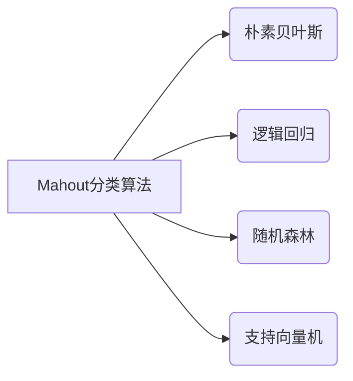

# Mahout分类算法的创业机会探索

## 1.背景介绍
### 1.1 大数据时代的机遇与挑战
随着互联网、物联网、移动互联网等技术的快速发展,人类社会已经进入了大数据时代。海量的数据每时每刻都在被生成和积累,蕴含着巨大的商业价值。然而,如何从海量数据中挖掘出有价值的信息和知识,是摆在我们面前的一大挑战。大数据为创业者提供了前所未有的机遇,同时也对创业者的技术能力提出了更高的要求。

### 1.2 机器学习在大数据分析中的重要作用
机器学习作为人工智能的核心,在大数据分析领域扮演着至关重要的角色。机器学习算法可以自动从海量数据中学习模式和规律,并用于对未知数据进行预测和分类。在电商、金融、医疗、教育等诸多领域,机器学习已经得到了广泛应用,极大地提升了数据分析和决策的效率和准确性。

### 1.3 Apache Mahout的优势
Apache Mahout是一个成熟的开源机器学习库,提供了多种可扩展的机器学习算法,可以应用于聚类、分类、推荐等任务。Mahout基于Hadoop实现,天然支持海量数据的分布式处理。Mahout拥有活跃的社区支持,接口友好,易于集成到各种大数据处理平台中。这些优势使得Mahout成为创业者进行机器学习应用开发的绝佳选择。

## 2.核心概念与联系
### 2.1 分类算法概述
分类是监督学习的一个重要任务,旨在根据已知类别的训练样本,学习一个分类模型,将未知类别的样本划分到已知的类别中。常见的分类算法包括决策树、朴素贝叶斯、支持向量机、逻辑回归等。这些算法在文本分类、垃圾邮件识别、疾病诊断等领域有广泛应用。

### 2.2 Mahout中的分类算法
Mahout提供了多种经典的分类算法实现,包括:

- 朴素贝叶斯(Naive Bayes):基于贝叶斯定理和特征独立性假设,通过先验概率和条件概率预测样本的类别。
- 逻辑回归(Logistic Regression):通过Sigmoid函数将样本特征映射到0-1之间,预测样本属于某个类别的概率。 
- 随机森林(Random Forest):通过bagging集成多个决策树,综合多棵树的预测结果,提高分类的准确性和泛化能力。
- 支持向量机(SVM):在高维空间中寻找最优分类超平面,最大化类别间隔,对非线性问题采用核技巧。

下图展示了这些算法在Mahout中的关系:



### 2.3 分类算法的应用场景
Mahout分类算法可应用于多种场景,例如:

- 情感分析:根据用户评论、反馈等文本,判断用户情感倾向,了解用户喜好。
- 用户画像:根据用户的人口统计学特征、行为特征等,预测用户的性别、年龄、收入等属性。
- 金融风控:根据用户的信用记录、交易行为等,预测用户的违约风险,控制金融风险。
- 医疗诊断:根据患者的症状、体征、检验结果等,辅助医生进行疾病诊断和分期。

## 3.核心算法原理具体操作步骤
下面以朴素贝叶斯算法为例,详细介绍其原理和具体步骤。

### 3.1 朴素贝叶斯算法原理
朴素贝叶斯基于贝叶斯定理和特征独立性假设。贝叶斯定理描述了事件的先验概率和后验概率的关系:

$$P(A|B) = \frac{P(B|A)P(A)}{P(B)}$$

其中,$P(A)$是事件A的先验概率,$P(B|A)$是在A发生的条件下B发生的概率,$P(A|B)$是在B发生的条件下A发生的后验概率。

朴素贝叶斯假设样本的特征是条件独立的,因此一个样本属于某个类别的概率可以表示为:

$$P(C|F_1,\dots,F_n) = \frac{P(C)P(F_1,\dots,F_n|C)}{P(F_1,\dots,F_n)} \propto P(C)\prod_{i=1}^nP(F_i|C)$$

其中,$C$表示类别,$F_i$表示第$i$个特征。分类时,我们选择后验概率最大的类别作为样本的预测类别:

$$\hat{C} = \arg\max_{C} P(C)\prod_{i=1}^nP(F_i|C)$$

### 3.2 朴素贝叶斯的具体步骤
1. 准备训练数据:收集已知类别的样本,提取特征。
2. 估计先验概率$P(C)$:统计每个类别出现的频率。
3. 估计条件概率$P(F_i|C)$:对每个特征,统计在各个类别下的概率分布。
4. 对测试样本,提取特征,计算在各个类别下的后验概率。
5. 选择后验概率最大的类别作为预测类别。

### 3.3 Mahout中朴素贝叶斯的实现
Mahout提供了多种朴素贝叶斯的实现,包括标准的朴素贝叶斯、补充朴素贝叶斯、多项式朴素贝叶斯等。以标准朴素贝叶斯为例,其主要步骤如下:

1. 加载训练数据,调用`TrainNaiveBayesJob`对模型进行训练。
2. 训练时,先计算先验概率,再计算每个特征在各个类别下的条件概率。
3. 加载测试数据,调用`TestNaiveBayesDriver`对测试样本进行分类。 
4. 测试时,计算每个样本在各个类别下的后验概率,选择概率最大的类别。
5. 评估分类效果,计算准确率、召回率、F1值等指标。

## 4.数学模型和公式详细讲解举例说明
为了更直观地理解朴素贝叶斯的数学原理,下面通过一个简单的例子来说明。

假设我们要根据天气条件预测是否适合打球,已知数据如下:

|天气|温度|湿度|风速|是否打球|
|---|---|---|---|---|
|晴|高|正常|弱|是|
|晴|高|高|强|否|
|阴|高|正常|弱|是|
|雨|中|高|弱|是|
|雨|低|正常|弱|否|
|雨|低|正常|强|否|
|阴|低|正常|强|是|
|晴|中|高|弱|否|
|晴|低|正常|弱|是|
|雨|中|正常|弱|是|
|晴|中|正常|强|是|
|阴|中|高|强|是|
|阴|高|正常|强|否|
|雨|中|高|强|否|

我们要预测的是:晴天、低温、正常湿度、强风时是否适合打球?

首先,估计先验概率$P(Yes)$和$P(No)$:

$$P(Yes) = \frac{9}{14} = 0.643, P(No) = \frac{5}{14} = 0.357$$

然后,估计各个特征在Yes和No两个类别下的条件概率。以温度为例:

$$
\begin{aligned}
P(High|Yes) &= \frac{2}{9} = 0.222 \\
P(Medium|Yes) &= \frac{4}{9} = 0.444 \\
P(Low|Yes) &= \frac{3}{9} = 0.333 \\
P(High|No) &= \frac{2}{5} = 0.4 \\  
P(Medium|No) &= \frac{2}{5} = 0.4 \\
P(Low|No) &= \frac{1}{5} = 0.2
\end{aligned}
$$

类似地,可以估计出其他特征的条件概率。最后,对于待预测样本(晴,低,正常,强),计算后验概率:

$$
\begin{aligned}
P(Yes|Sunny,Low,Normal,Strong) &\propto P(Yes) \cdot P(Sunny|Yes) \cdot P(Low|Yes) \cdot P(Normal|Yes) \cdot P(Strong|Yes) \\
&= 0.643 \times 0.556 \times 0.333 \times 0.667 \times 0.222 \\
&= 0.0175 \\
P(No|Sunny,Low,Normal,Strong) &\propto P(No) \cdot P(Sunny|No) \cdot P(Low|No) \cdot P(Normal|No) \cdot P(Strong|No) \\
&= 0.357 \times 0.4 \times 0.2 \times 0.6 \times 0.6 \\
&= 0.0103
\end{aligned}
$$

因为$P(Yes|Sunny,Low,Normal,Strong) > P(No|Sunny,Low,Normal,Strong)$,所以预测该天气条件下适合打球。

这个例子展示了朴素贝叶斯的基本原理,Mahout中的实现也是基于这些公式,只是处理的是更大规模的数据。

## 5.项目实践：代码实例和详细解释说明
下面通过一个简单的示例来演示如何使用Mahout的朴素贝叶斯算法进行文本分类。

### 5.1 准备数据
首先准备训练和测试数据,这里使用的是20 Newsgroups数据集的一个子集,包含4个类别:alt.atheism、comp.graphics、sci.med、soc.religion.christian。

将数据集分为训练集(80%)和测试集(20%),训练集用于训练模型,测试集用于评估模型的效果。

### 5.2 数据预处理
在训练之前,需要对文本数据进行预处理,主要步骤包括:

1. 分词:将文本划分为单词序列。
2. 去除停用词:过滤掉一些常见的虚词、连接词等。
3. 词干提取:将单词规范化为词干形式。
4. 特征选择:选择一些重要的、有区分度的词作为特征。

Mahout中可以使用`StringToDictionaryVectorizer`类来完成这些预处理步骤。示例代码如下:

```java
StringToDictionaryVectorizer vectorizer = new StringToDictionaryVectorizer();
vectorizer.setConvertToLowerCase(true);
vectorizer.setMinTermFrequency(5);
vectorizer.setMaxNGramSize(1);
vectorizer.setMinLLRValue(50);
vectorizer.setNormalize(true);
vectorizer.setNumFeatures(10000);

Map<String, List<String>> trainingData = readData(trainDir);
Dictionary dictionary = vectorizer.fit(trainingData.get("data"));
```

### 5.3 模型训练
使用预处理后的训练数据来训练朴素贝叶斯模型,示例代码如下:

```java
Map<String, Integer> labelIndex = new HashMap<>();
for (int i = 0; i < trainingData.get("labels").size(); i++) {
  labelIndex.put(trainingData.get("labels").get(i), i);
}

NaiveBayesModel model = new NaiveBayesModel(dictionary, labelIndex, 1.0, false);
for (int i = 0; i < trainingData.get("data").size(); i++) {
  model.train(trainingData.get("labels").get(i), trainingData.get("data").get(i));
}
model.validate();
```

### 5.4 模型评估
使用测试集评估模型的分类效果,示例代码如下:

```java
Map<String, List<String>> testingData = readData(testDir);
int correct = 0;
for (int i = 0; i < testingData.get("data").size(); i++) {
  Vector result = model.classifyFull(testingData.get("data").get(i));
  if (testingData.get("labels").get(i).equals(dictionary.values().get(result.maxValueIndex()))) {
    correct++;
  }
}
double accuracy = 100.0 * correct / testingData.get("data").size();
System.out.println("Accuracy: " + accuracy + "%");
```

### 5.5 完整代码
完整的示例代码如下:

```java
public class NaiveBayesExample {
  public static void main(String[] args) throws IOException {
    String trainDir = "data/20news-bydate-train";
    String testDir = "data/20news-bydate-test";
    
    // 数据预处理
    StringToDictionaryVectorizer vectorizer = new StringToDictionaryVectorizer();
    vectorizer.setConvertToLower