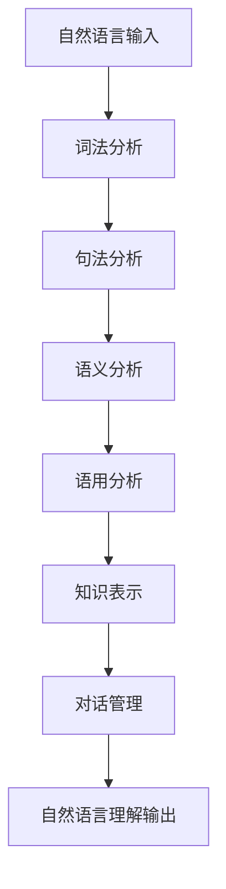

# Natural Language Understanding 原理与代码实战案例讲解

## 1.背景介绍

自然语言理解(Natural Language Understanding, NLU)是人工智能领域中的一个关键挑战,旨在使计算机能够像人类一样理解和处理自然语言。随着人工智能技术的快速发展,NLU已经广泛应用于多个领域,如虚拟助手、机器翻译、情感分析、问答系统等。

NLU系统需要处理自然语言的多层次复杂性,包括词法、语法、语义和语用等方面。这需要综合运用多种技术,如自然语言处理(Natural Language Processing, NLP)、机器学习、知识表示等。NLU的核心目标是从输入的自然语言文本中准确地提取语义信息,并将其转化为计算机可以理解和处理的形式。

## 2.核心概念与联系

NLU涉及多个核心概念,包括:

1. **词法分析(Lexical Analysis)**: 将文本分割成单词(tokens)并标注词性等基本信息。
2. **句法分析(Syntactic Analysis)**: 分析句子的语法结构,确定词与词之间的关系。
3. **语义分析(Semantic Analysis)**: 理解单词、短语和句子的实际含义。
4. **语用分析(Pragmatic Analysis)**: 考虑上下文和语境,理解话语的实际意图。
5. **知识表示(Knowledge Representation)**: 将自然语言知识形式化,以便计算机理解和推理。
6. **对话管理(Dialogue Management)**: 在多轮对话中跟踪上下文,维护对话状态。

这些概念相互关联,共同构建了NLU系统的核心能力。



## 3.核心算法原理具体操作步骤

NLU系统通常包含以下核心算法步骤:

1. **标记化(Tokenization)**: 将文本拆分为单词、数字、标点符号等tokens。
2. **词性标注(Part-of-Speech Tagging)**: 为每个token分配相应的词性标记,如名词、动词、形容词等。
3. **命名实体识别(Named Entity Recognition, NER)**: 识别出文本中的命名实体,如人名、地名、组织机构名等。
4. **依存分析(Dependency Parsing)**: 分析句子中词与词之间的依存关系。
5. **语义角色标注(Semantic Role Labeling, SRL)**: 识别谓词-论元结构,确定每个论元的语义角色。
6. **指代消解(Coreference Resolution)**: 将文本中的代词与其指代的实体关联起来。
7. **关系提取(Relation Extraction)**: 从文本中提取实体之间的语义关系。
8. **情感分析(Sentiment Analysis)**: 判断文本所表达的情感倾向,如正面、负面或中性等。
9. **意图识别(Intent Recognition)**: 确定用户的语句意图,如查询、预订、投诉等。
10. **对话状态跟踪(Dialogue State Tracking)**: 在多轮对话中跟踪对话状态和上下文信息。

这些算法步骤通常采用基于规则或基于机器学习的方法,有时也结合两者的混合方法。

## 4.数学模型和公式详细讲解举例说明

在NLU中,数学模型和公式扮演着重要角色,为各种任务提供理论基础和计算框架。以下是一些常见的数学模型和公式:

### 4.1 词袋模型(Bag-of-Words Model)

词袋模型是NLP中最简单的文本表示方法之一。它将文档表示为其单词的多重集(multiset),忽略了单词的顺序和语法结构。

设有一个语料库 $\mathcal{D}$ ,其中包含 $M$ 个文档 $\{d_1, d_2, \dots, d_M\}$,词汇表 $\mathcal{V}$ 包含 $N$ 个单词 $\{w_1, w_2, \dots, w_N\}$。那么,文档 $d_i$ 可以用一个 $N$ 维向量 $\vec{x}_i$ 表示,其中第 $j$ 个元素是单词 $w_j$ 在文档 $d_i$ 中出现的次数:

$$\vec{x}_i = (x_{i1}, x_{i2}, \dots, x_{iN})$$

其中,

$$x_{ij} = \text{count}(w_j, d_i)$$

尽管简单,词袋模型在文本分类、聚类等任务中仍有一定应用。

### 4.2 N-gram语言模型

N-gram语言模型是基于马尔可夫假设的概率模型,广泛应用于自然语言生成任务。它假设一个单词的概率只与前面的 $N-1$ 个单词相关。

对于一个长度为 $T$ 的句子 $S = \{w_1, w_2, \dots, w_T\}$,根据链式法则,其概率可以表示为:

$$P(S) = P(w_1, w_2, \dots, w_T) = \prod_{t=1}^T P(w_t | w_1, \dots, w_{t-1})$$

根据马尔可夫假设,我们有:

$$P(w_t | w_1, \dots, w_{t-1}) \approx P(w_t | w_{t-N+1}, \dots, w_{t-1})$$

因此,句子概率可以近似为:

$$P(S) \approx \prod_{t=1}^T P(w_t | w_{t-N+1}, \dots, w_{t-1})$$

这些条件概率可以通过计数和平滑技术从训练语料库中估计得到。

### 4.3 注意力机制(Attention Mechanism)

注意力机制是深度学习中的一种关键技术,可以让模型专注于输入序列中的关键部分。在NLU任务中,注意力机制常与序列模型(如RNN、Transformer等)结合使用。

设有一个输入序列 $X = (x_1, x_2, \dots, x_T)$ 和输出序列 $Y = (y_1, y_2, \dots, y_T')$。在生成第 $t'$ 个输出 $y_{t'}$ 时,注意力机制会计算一个注意力向量 $\vec{\alpha}_{t'}$,表示模型对输入序列中不同位置的关注程度:

$$\vec{\alpha}_{t'} = \text{softmax}(\text{score}(s_{t'}, X))$$

其中, $s_{t'}$ 是当前解码状态, $\text{score}(\cdot, \cdot)$ 是一个评分函数,用于衡量当前状态与输入序列中每个位置的关联程度。

然后,注意力向量 $\vec{\alpha}_{t'}$ 与输入序列 $X$ 进行加权求和,得到一个注意力表示 $c_{t'}$:

$$c_{t'} = \sum_{i=1}^T \alpha_{t'i} x_i$$

最后,注意力表示 $c_{t'}$ 与当前解码状态 $s_{t'}$ 一起,用于预测下一个输出 $y_{t'+1}$。

注意力机制赋予了模型动态关注输入的能力,在许多NLU任务中表现出色。

## 5.项目实践:代码实例和详细解释说明

为了更好地理解NLU原理和实现,我们将通过一个实际项目案例来进行讲解。这个项目旨在构建一个基于深度学习的意图识别和实体提取系统,可以应用于智能客服等场景。

我们将使用Python和PyTorch深度学习框架来实现这个项目。代码将分为以下几个部分:

1. **数据预处理**
2. **词嵌入层**
3. **双向LSTM编码器**
4. **注意力层**
5. **意图分类器**
6. **实体提取层**
7. **模型训练与评估**

### 5.1 数据预处理

首先,我们需要对原始数据进行预处理,包括分词、填充、构建词汇表等步骤。这个过程可以使用Python的自然语言处理库,如NLTK或spaCy来实现。

```python
import nltk
from nltk.tokenize import word_tokenize

# 分词
def tokenize(text):
    return word_tokenize(text.lower())

# 填充序列
def pad_sequence(sequence, max_len, pad_token='<pad>'):
    padded_seq = sequence[:max_len] + [pad_token] * max(max_len - len(sequence), 0)
    return padded_seq

# 构建词汇表
def build_vocab(dataset):
    vocab = set()
    for sample in dataset:
        vocab.update(sample['text'])
    vocab = sorted(vocab)
    vocab2idx = {token: idx for idx, token in enumerate(vocab, 2)}
    vocab2idx['<pad>'] = 0
    vocab2idx['<unk>'] = 1
    return vocab2idx
```

### 5.2 词嵌入层

我们使用预训练的词嵌入模型(如GloVe或Word2Vec)来获取每个单词的向量表示。这个层将词汇表中的每个单词映射到一个固定长度的向量。

```python
import torch
import torch.nn as nn

class EmbeddingLayer(nn.Module):
    def __init__(self, vocab_size, embedding_dim, pretrained_embeddings=None):
        super(EmbeddingLayer, self).__init__()
        self.embedding = nn.Embedding(vocab_size, embedding_dim, padding_idx=0)
        if pretrained_embeddings is not None:
            self.embedding.weight.data.copy_(pretrained_embeddings)

    def forward(self, inputs):
        return self.embedding(inputs)
```

### 5.3 双向LSTM编码器

我们使用双向长短期记忆网络(Bi-LSTM)作为编码器,从输入序列中捕获上下文信息。Bi-LSTM由两个LSTM组成,一个从左到右处理序列,另一个从右到左处理序列,最终将两个方向的隐藏状态拼接起来。

```python
import torch.nn as nn

class BiLSTMEncoder(nn.Module):
    def __init__(self, embedding_dim, hidden_dim, num_layers):
        super(BiLSTMEncoder, self).__init__()
        self.lstm = nn.LSTM(embedding_dim, hidden_dim, num_layers, bidirectional=True, batch_first=True)

    def forward(self, inputs):
        outputs, _ = self.lstm(inputs)
        return outputs
```

### 5.4 注意力层

我们使用注意力机制来捕获输入序列中与当前任务相关的关键信息。具体来说,我们将使用一个前馈神经网络来计算注意力权重,然后对编码器输出进行加权求和。

```python
import torch.nn as nn
import torch.nn.functional as F

class AttentionLayer(nn.Module):
    def __init__(self, hidden_dim):
        super(AttentionLayer, self).__init__()
        self.attention = nn.Linear(hidden_dim * 2, hidden_dim)
        self.vector = nn.Parameter(torch.rand(hidden_dim))

    def forward(self, inputs):
        attention_scores = self.attention(inputs).squeeze(-1)
        attention_weights = F.softmax(attention_scores, dim=-1)
        context_vector = torch.sum(inputs * attention_weights.unsqueeze(-1), dim=1)
        return context_vector
```

### 5.5 意图分类器

我们使用一个前馈神经网络作为意图分类器,将注意力层的输出映射到意图标签空间。

```python
import torch.nn as nn

class IntentClassifier(nn.Module):
    def __init__(self, hidden_dim, num_intents):
        super(IntentClassifier, self).__init__()
        self.classifier = nn.Sequential(
            nn.Linear(hidden_dim, hidden_dim // 2),
            nn.ReLU(),
            nn.Dropout(0.2),
            nn.Linear(hidden_dim // 2, num_intents)
        )

    def forward(self, inputs):
        logits = self.classifier(inputs)
        return logits
```

### 5.6 实体提取层

我们使用一个序列标注模型来进行实体提取,将编码器输出和注意力向量作为输入,预测每个单词是否属于某个实体类型。

```python
import torch.nn as nn

class EntityExtractor(nn.Module):
    def __init__(self, hidden_dim, num_entities):
        super(EntityExtractor, self).__init__()
        self.extractor = nn.Linear(hidden_dim * 2, num_entities)

    def forward(self, encoder_outputs, attention_vector):
        combined_inputs = torch.cat([encoder_outputs, attention_vector.unsqueeze(1).repeat(1, encoder_outputs.size(1), 1)], dim=-1)
        entity_logits = self.extractor(combined_inputs)
        return entity_logits
```

### 5.7 模型训练与评估

最后,我们将上述模块组合起来,构建完整的NLU模型。我们将使用交叉熵损失函数进行训练,并在验证集上评估模型性能。

```python
import torch.nn as nn
import torch.optim as optim

class NLUModel