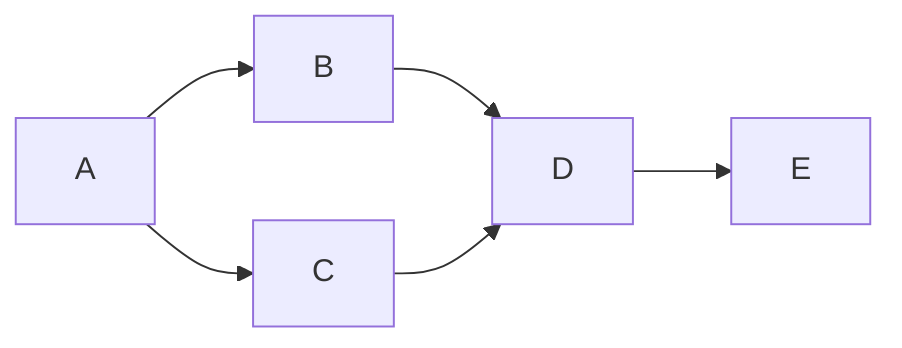

# OozieBundle高级应用：实现复杂工作流逻辑

## 1.背景介绍

在大数据领域中,工作流调度系统扮演着至关重要的角色。它们负责协调和执行复杂的数据处理任务,确保数据处理过程按照预定的流程顺利进行。Apache Oozie是一个流行的工作流调度系统,被广泛应用于Hadoop生态系统中。

Oozie提供了多种工作流定义方式,其中OozieBundle就是一种强大的工具,用于实现复杂的工作流逻辑。OozieBundle允许用户将多个工作流作业组合在一起,并根据特定的条件和依赖关系控制它们的执行顺序。这种灵活性使得OozieBundle在处理复杂的数据处理场景时变得非常有用。

### 1.1 什么是Oozie

Apache Oozie是一个用于管理Hadoop作业(如Java MapReduce、Pig作业、Hive作业等)的工作流调度系统。它可以集成到现有的系统中,也可以作为独立的产品使用。Oozie的主要功能包括:

- 定义工作流
- 提交和监控工作流实例
- 提供工作流操作的web控制台
- 支持多种类型的Hadoop作业
- 支持参数化和函数

Oozie使用工作流应用程序(Workflow Application)来定义工作流,工作流应用程序由多个XML文件组成,用于描述工作流的控制流逻辑、数据依赖关系、作业配置等。

### 1.2 什么是OozieBundle

OozieBundle是Oozie提供的一种特殊的工作流类型,允许用户将多个工作流作业组合在一起,并根据特定的条件和依赖关系控制它们的执行顺序。

一个OozieBundle由多个协调器(Coordinator)组成,每个协调器又包含一个或多个工作流(Workflow)。协调器定义了工作流的执行计划,例如启动时间、结束时间、重复执行等。工作流则定义了具体的数据处理任务,如MapReduce作业、Pig作业等。

OozieBundle的强大之处在于,它允许用户在协调器层面上定义复杂的条件和依赖关系,从而控制工作流的执行顺序。例如,可以设置一个协调器在另一个协调器完成后再启动,或者根据数据的可用性动态决定是否执行某个工作流。

通过OozieBundle,用户可以更好地管理和协调复杂的数据处理任务,提高整体的效率和可靠性。

## 2.核心概念与联系

在深入探讨OozieBundle的高级应用之前,我们需要了解一些核心概念及它们之间的关系。

### 2.1 Oozie工作流(Workflow)

Oozie工作流是Oozie中最基本的单元,用于定义一系列需要按顺序执行的动作。一个工作流可以包含多个动作(Action),如MapReduce作业、Pig作业、Shell脚本等。这些动作通过控制节点(Control Node)连接在一起,形成一个有向无环图(DAG)结构。

控制节点用于控制工作流的执行流程,包括:

- Start节点: 工作流的入口点
- End节点: 工作流的出口点
- Decision节点: 根据条件决定执行哪个分支
- Fork节点: 并行执行多个分支
- Join节点: 等待多个分支完成后继续执行

工作流的定义存储在一个XML文件中,描述了工作流的结构、动作配置、数据依赖关系等信息。

```xml
<workflow-app xmlns="uri:oozie:workflow:0.5" name="my-workflow">
  <start to="fork-node"/>
  <fork name="fork-node">
    <path start="action1"/>
    <path start="action2"/>
  </fork>
  <action name="action1">
    <map-reduce>
      ...
    </map-reduce>
    <ok to="join-node"/>
    <error to="fail"/>
  </action>
  <action name="action2">
    <pig>
      ...
    </pig>
    <ok to="join-node"/>
    <error to="fail"/>
  </action>
  <join name="join-node" to="end"/>
  <kill name="fail">
    <message>Workflow failed, error message[${wf:errorMessage(wf:lastErrorNode())}]</message>
  </kill>
  <end name="end"/>
</workflow-app>
```

### 2.2 Oozie协调器(Coordinator)

协调器用于定义工作流的执行计划,包括启动时间、结束时间、重复执行等。它本质上是一个定时器,根据预定的时间计划触发工作流的执行。

协调器的定义存储在一个XML文件中,描述了执行计划、输入数据集、输出数据集、工作流应用程序等信息。

```xml
<coordinator-app xmlns="uri:oozie:coordinator:0.4" name="my-coordinator"
  start="2023-05-01T00:00Z" end="2023-05-31T23:59Z" timezone="UTC"
  frequency="${coord:days(1)}" xmlns:coord="uri:oozie:coordinator:0.4">
  <controls>
    <timeout>10</timeout>
    <concurrency>1</concurrency>
    <execution>FIFO</execution>
  </controls>
  <datasets>
    <dataset name="input" frequency="${coord:days(1)}" initial-instance="2023-05-01T00:00Z" timezone="UTC">
      <uri-template>hdfs://namenode:8020/user/oozie/input/${YEAR}/${MONTH}/${DAY}</uri-template>
    </dataset>
    <dataset name="output" frequency="${coord:days(1)}" initial-instance="2023-05-01T00:00Z" timezone="UTC">
      <uri-template>hdfs://namenode:8020/user/oozie/output/${YEAR}/${MONTH}/${DAY}</uri-template>
    </dataset>
  </datasets>
  <action>
    <workflow>
      <app-path>hdfs://namenode:8020/user/oozie/workflows/my-workflow</app-path>
      <configuration>
        <property>
          <name>inputDir</name>
          <value>${coord:dataset('input')}</value>
        </property>
        <property>
          <name>outputDir</name>
          <value>${coord:dataset('output')}</value>
        </property>
      </configuration>
    </workflow>
  </action>
</coordinator-app>
```

### 2.3 OozieBundle

OozieBundle是Oozie提供的一种特殊的工作流类型,用于组合和协调多个协调器。它允许用户定义协调器之间的依赖关系,从而实现更加复杂的工作流逻辑。

OozieBundle的定义存储在一个XML文件中,描述了包含的协调器、协调器之间的依赖关系等信息。

```xml
<bundle-app xmlns="uri:oozie:bundle:0.2" name="my-bundle">
  <coordinator>
    <app-path>hdfs://namenode:8020/user/oozie/coordinators/coord1</app-path>
  </coordinator>
  <coordinator>
    <app-path>hdfs://namenode:8020/user/oozie/coordinators/coord2</app-path>
    <precedingCoordinators>
      <coordinator>coord1</coordinator>
    </precedingCoordinators>
  </coordinator>
</bundle-app>
```

在上面的示例中,`coord2`协调器依赖于`coord1`协调器,只有在`coord1`完成后才会启动。

### 2.4 核心概念关系

这些核心概念之间的关系如下所示:


- OozieBundle包含一个或多个协调器
- 每个协调器包含一个工作流
- 工作流由一系列动作组成,通过控制节点连接

通过这种层次结构,OozieBundle可以实现复杂的工作流逻辑,如并行执行、条件执行、依赖执行等。

## 3.核心算法原理具体操作步骤  

OozieBundle的核心算法原理是基于有向无环图(DAG)和拓扑排序算法实现的。下面我们将详细介绍OozieBundle的工作原理和具体操作步骤。

### 3.1 OozieBundle工作原理

OozieBundle的工作原理可以概括为以下几个步骤:

1. **解析Bundle定义文件**

OozieBundle首先解析Bundle定义XML文件,构建一个有向无环图(DAG)。在这个DAG中,每个节点代表一个协调器,边表示协调器之间的依赖关系。

2. **拓扑排序**

对DAG进行拓扑排序,确定协调器的执行顺序。拓扑排序算法可以保证一个节点只有在它的所有前驱节点都已执行完毕后,才能执行该节点。

3. **启动协调器**

按照拓扑排序的结果,依次启动每个协调器。每个协调器启动后,会根据其定义的时间计划触发工作流的执行。

4. **执行工作流**

工作流由一系列动作组成,这些动作按照工作流定义的顺序执行。工作流完成后,协调器将进入下一个时间周期,重复执行工作流。

5. **监控和恢复**

OozieBundle会持续监控协调器和工作流的执行状态。如果发生故障,OozieBundle会尝试自动恢复或重新执行失败的任务。

### 3.2 OozieBundle具体操作步骤

下面是使用OozieBundle实现复杂工作流逻辑的具体操作步骤:

1. **定义工作流**

首先,我们需要定义一个或多个工作流,描述具体的数据处理任务。工作流定义存储在XML文件中,包含动作配置、控制节点等信息。

2. **定义协调器**

接下来,为每个工作流定义一个协调器,描述工作流的执行计划。协调器定义存储在XML文件中,包含时间计划、输入输出数据集、工作流应用程序路径等信息。

3. **定义OozieBundle**

创建一个OozieBundle定义XML文件,列出所有需要包含的协调器,并指定它们之间的依赖关系。

4. **部署OozieBundle**

将工作流、协调器和OozieBundle定义文件上传到Hadoop分布式文件系统(HDFS)中。

5. **启动OozieBundle**

使用Oozie命令行工具或Web控制台启动OozieBundle。Oozie将解析Bundle定义文件,构建DAG,并按照拓扑排序的结果依次启动协调器。

6. **监控执行状态**

通过Oozie Web控制台或命令行工具监控协调器和工作流的执行状态。如果发生故障,可以查看日志并尝试手动恢复或重新执行失败的任务。

7. **维护和优化**

根据实际需求,可以修改工作流、协调器或OozieBundle定义文件,并重新部署和启动。同时,也可以优化作业配置、数据依赖关系等,以提高整体性能。

通过这些步骤,我们可以利用OozieBundle实现复杂的工作流逻辑,如并行执行、条件执行、依赖执行等,从而更好地管理和协调大数据处理任务。

## 4.数学模型和公式详细讲解举例说明

在OozieBundle的实现中,涉及到一些数学模型和算法,下面我们将详细介绍其中的关键部分。

### 4.1 有向无环图(DAG)

OozieBundle将协调器之间的依赖关系建模为一个有向无环图(DAG)。在这个DAG中,每个节点代表一个协调器,边表示协调器之间的依赖关系。

DAG的数学定义如下:

$$
G = (V, E)
$$

其中:

- $V$ 是节点集合,表示所有协调器
- $E$ 是边集合,表示协调器之间的依赖关系

如果存在一条从节点 $u$ 到节点 $v$ 的路径,我们称 $v$ 依赖于 $u$,记作 $u \rightarrow v$。

例如,下面是一个简单的OozieBundle DAG示例:



在这个DAG中:

- $V = \{A, B, C, D, E\}$
- $E = \{(A, B), (A, C), (B, D), (C, D), (D, E)\}$

我们可以看到:

- $B$ 和 $C$ 依赖于 $A$
- $D$ 依赖于 $B$ 和 $C$
- $E$ 依赖于 $D$

### 4.2 拓扑排序算法

为了确定协调器的执行顺序,OozieBundle使用了拓扑排序算法。拓扑排序是一种对有向无环图进行线性排序的算法,它可以确保一个节点只有在它的所有前驱节点都已执行完毕后,才能执行该节点。

拓扑排序算法的基本思想是: