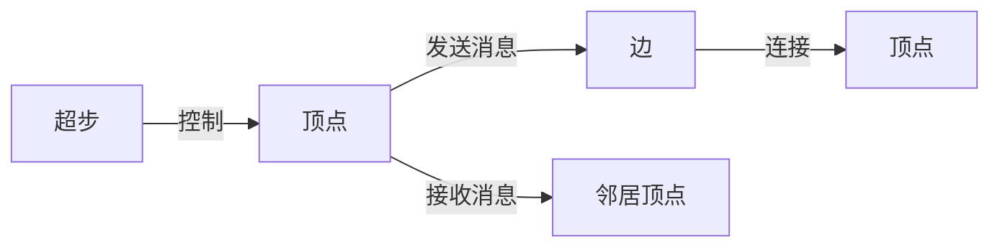

## 1.背景介绍

在大数据时代，图计算已经成为了数据处理的重要工具。然而，传统的图计算模型在处理大规模图数据时面临着巨大的挑战。为了解决这个问题，Google在2010年提出了一种新的图计算模型——Pregel。它采用了分布式的处理方式，可以处理亿级别以上的大规模图数据，极大地提高了图计算的效率和性能。

## 2.核心概念与联系

Pregel模型基于BSP(Bulk Synchronous Parallel)并行计算模型，其主要概念包括顶点、边、消息和超步。每个顶点都有一个唯一的标识和一个值，边则包含一个源顶点和一个目标顶点以及一个值。在每个超步中，顶点可以接收来自其邻居顶点的消息，然后根据这些消息来更新自己的值，并向其邻居发送消息。当所有顶点都不再发送消息时，计算结束。



## 3.核心算法原理具体操作步骤

Pregel模型的运行过程大致可以分为以下几个步骤：

1. 初始化：每个顶点的值被初始化，所有的边被分配给源顶点。
2. 超步计算：每个顶点接收上一超步发送的消息，然后进行计算，并向其邻居顶点发送消息。
3. 同步：所有顶点在同一超步中进行计算，直到所有顶点都完成计算，才会进入下一超步。
4. 终止：当所有顶点都不再发送消息，或者达到最大超步数时，计算结束。

## 4.数学模型和公式详细讲解举例说明

在Pregel模型中，我们可以将一个图表示为一个有向图$G=(V,E)$，其中$V$是顶点集，$E$是边集。每个顶点$v \in V$都有一个值$value(v)$，每个边$e \in E$都有一个值$value(e)$。在每个超步$t$中，顶点$v$接收到的消息集为$M_{t}(v)$，然后根据这些消息来更新自己的值：

$$
value(v) = f_{v}(M_{t}(v))
$$

其中$f_{v}$是顶点$v$的计算函数。在计算完成后，顶点$v$可以向其邻居顶点发送消息。

## 5.项目实践：代码实例和详细解释说明

以下是一个使用Pregel模型的PageRank算法的代码示例：

```java
public class PageRankVertex extends Vertex<LongWritable, DoubleWritable, NullWritable, DoubleWritable> {
  public void compute(Iterable<DoubleWritable> messages) {
    if (getSuperstep() >= 1) {
      double sum = 0;
      for (DoubleWritable message : messages) {
        sum += message.get();
      }
      setValue(new DoubleWritable(0.15 / getTotalNumVertices() + 0.85 * sum));
    }

    if (getSuperstep() < 30) {
      long edges = getNumEdges();
      sendMessageToAllEdges(new DoubleWritable(getValue().get() / edges));
    } else {
      voteToHalt();
    }
  }
}
```

在这个代码示例中，每个顶点在每个超步中接收来自其邻居的消息（即PageRank值），然后根据这些消息来更新自己的PageRank值。在更新完成后，每个顶点将其PageRank值平均分配给其所有的邻居。

## 6.实际应用场景

Pregel模型广泛应用于各种大规模图计算任务，如社交网络分析、网络结构挖掘、机器学习等。例如，Google使用Pregel模型进行网页的PageRank计算；Facebook使用Pregel模型进行社交网络的社区发现等。

## 7.工具和资源推荐

Apache Giraph是一个开源的Pregel模型实现，它提供了丰富的API，可以方便地进行各种图计算任务。此外，还有一些其他的Pregel模型实现，如Pregel+、GoldenOrb等。

## 8.总结：未来发展趋势与挑战

Pregel模型以其简洁的模型和强大的性能，已经在大规模图计算领域取得了显著的成果。然而，由于其基于BSP模型，存在着通信延迟大、计算资源利用率低等问题，这也是未来需要进一步研究和改进的方向。

## 9.附录：常见问题与解答

Q：Pregel模型如何处理图的动态变化？
A：Pregel模型本身并不直接支持图的动态变化，但可以通过在每个超步中更新顶点和边的信息来间接实现。

Q：Pregel模型如何处理故障？
A：Pregel模型通过检查点机制来处理故障。在每个超步结束时，系统会将所有顶点的状态保存到磁盘，如果出现故障，可以从最近的检查点恢复。

作者：禅与计算机程序设计艺术 / Zen and the Art of Computer Programming