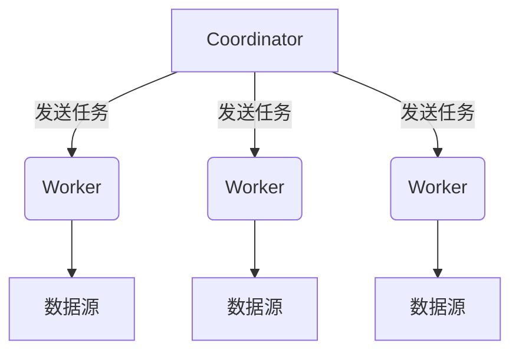
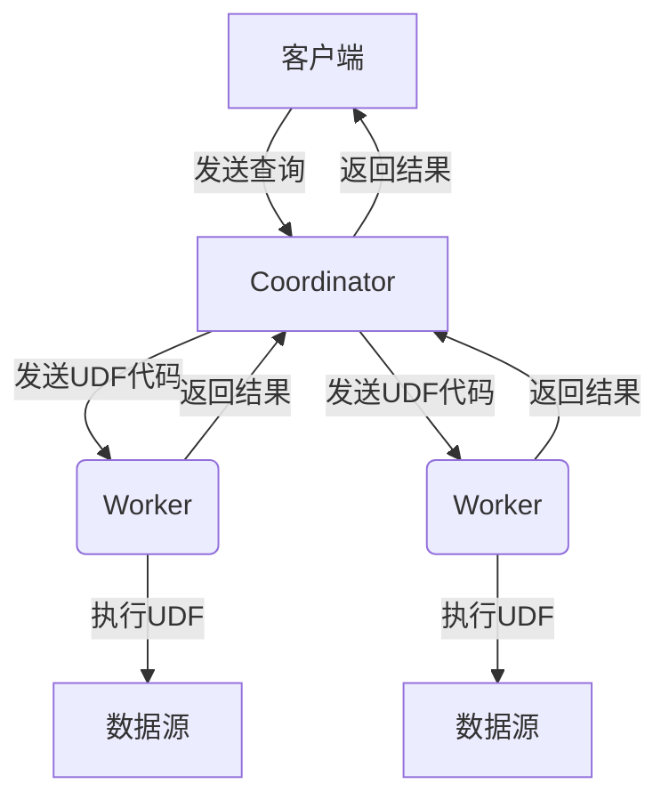

# PrestoUDF性能优化：打造高效数据处理流程

## 1.背景介绍

在当今大数据时代，数据处理能力成为了企业的核心竞争力之一。随着数据量的不断增长,高效的数据处理流程变得越来越重要。Presto是一种开源的大数据分析引擎,它能够快速地处理大规模数据集,并为分析师和数据科学家提供低延迟的交互式分析体验。

然而,在处理复杂的数据转换和计算任务时,Presto的内置函数可能无法满足所有需求。这时,用户定义函数(UDF)就派上了用场。UDF允许开发人员使用Java、Scala或其他语言编写自定义代码,扩展Presto的功能,实现特定的数据处理逻辑。

尽管UDF为Presto带来了巨大的灵活性,但如果实现不当,它们也可能成为性能瓶颈。本文将探讨如何优化PrestoUDF的性能,打造高效的数据处理流程,提高Presto查询的执行效率。

## 2.核心概念与联系

在深入探讨PrestoUDF性能优化之前,让我们先了解一些核心概念:

### 2.1 Presto架构

Presto采用主从架构,由一个协调器(Coordinator)和多个工作节点(Worker)组成。协调器负责解析SQL语句、制定执行计划并将任务分发给工作节点。工作节点则执行实际的数据处理工作,包括扫描数据、执行计算等。



### 2.2 UDF执行流程

当Presto查询涉及UDF时,其执行流程如下:

1. 协调器解析SQL,识别出需要使用UDF。
2. 协调器将UDF代码发送给工作节点。
3. 工作节点加载UDF代码并执行。
4. 工作节点将执行结果返回给协调器。
5. 协调器汇总结果并返回给客户端。



### 2.3 UDF类型

Presto支持以下几种UDF类型:

- Scalar UDF:接受0个或多个参数,返回单个值。
- Aggregate UDF:接受输入行,并对它们进行聚合计算。
- Window UDF:对有序数据集进行窗口化计算。

不同类型的UDF在执行时会有不同的性能特征,需要采取不同的优化策略。

## 3.核心算法原理具体操作步骤

优化PrestoUDF性能的核心算法原理包括以下几个方面:

### 3.1 代码优化

编写高效的UDF代码是优化的基础。以下是一些优化技巧:

1. **避免不必要的对象创建**:对象创建和垃圾回收会带来性能开销,应尽量复用对象。
2. **使用基本数据类型**:基本数据类型比包装类更高效。
3. **避免过度boxing/unboxing**:boxing/unboxing会导致额外开销。
4. **合理使用缓存**:对于昂贵的计算结果,可以考虑缓存。
5. **使用JIT编译器友好的代码模式**:JIT编译器能够更好地优化某些代码模式。

### 3.2 内存管理

合理管理内存对于UDF性能至关重要:

1. **避免内存泄漏**:确保及时释放不再使用的对象。
2. **控制内存使用量**:限制每个UDF实例的最大内存使用量。
3. **重用内存**:通过对象池等技术复用内存,减少内存分配和回收开销。

### 3.3 并行化

Presto支持在工作节点内部并行执行UDF,充分利用多核CPU:

1. **确定并行度**:根据CPU核心数和数据量确定合适的并行度。
2. **划分任务**:将输入数据划分为多个分区,由不同线程并行处理。
3. **合并结果**:将各个线程的结果合并为最终结果。

### 3.4 向量化

Presto支持向量化执行,可以显著提高性能:

1. **实现向量化UDF**:以批量方式处理数据,而不是一次处理一行。
2. **优化内存访问模式**:确保内存访问是连续的,以充分利用CPU缓存。
3. **利用SIMD指令**:现代CPU支持SIMD指令,可以同时处理多个数据元素。

### 3.5 代码生成

Presto可以动态生成字节码,避免反射等开销:

1. **实现`OperatorFactory`接口**:提供生成特定UDF实现的方法。
2. **生成高度优化的代码**:根据输入类型生成特定的代码路径。
3. **缓存生成的代码**:避免重复生成相同的代码。

以上是PrestoUDF性能优化的核心算法原理和具体操作步骤,下面我们将通过数学模型和公式进一步阐述。

## 4.数学模型和公式详细讲解举例说明

在探讨PrestoUDF性能优化时,我们需要考虑多个因素,并建立相应的数学模型来量化和优化性能。

### 4.1 CPU开销模型

CPU开销是影响UDF性能的主要因素之一。我们可以使用以下公式来估计CPU开销:

$$
CPU\_cost = N \times C_{inst} + M \times C_{mem}
$$

其中:

- $N$是指令数量
- $C_{inst}$是每条指令的平均开销
- $M$是内存访问次数
- $C_{mem}$是每次内存访问的平均开销

通过减少指令数量($N$)和内存访问次数($M$),我们可以降低CPU开销。例如,使用向量化执行可以减少指令数量,而优化内存访问模式可以减少内存访问次数。

### 4.2 内存开销模型

内存开销也会影响UDF性能。我们可以使用以下公式来估计内存开销:

$$
Mem\_cost = S_{obj} \times N_{obj} + S_{tmp} \times N_{tmp}
$$

其中:

- $S_{obj}$是每个对象的平均大小
- $N_{obj}$是对象数量
- $S_{tmp}$是每个临时变量的平均大小
- $N_{tmp}$是临时变量数量

通过减少对象数量($N_{obj}$)和临时变量数量($N_{tmp}$),我们可以降低内存开销。例如,复用对象可以减少对象数量,而优化算法可以减少临时变量的使用。

### 4.3 并行化模型

对于可以并行执行的UDF,我们可以使用以下公式来估计并行执行的加速比:

$$
Speedup = \frac{T_s}{T_p} = \frac{1}{\frac{1}{N} + \frac{N-1}{N} \times \alpha}
$$

其中:

- $T_s$是串行执行时间
- $T_p$是并行执行时间
- $N$是并行度(线程数量)
- $\alpha$是并行开销系数,用于量化并行开销

当并行开销系数$\alpha$接近0时,加速比接近线性加速($Speedup \approx N$)。但实际情况下,由于线程同步、数据分区等开销,$\alpha$通常大于0,从而限制了并行加速效果。

通过优化并行化策略,我们可以减小并行开销系数$\alpha$,从而获得更好的加速比。例如,我们可以优化数据分区算法,减少线程同步开销。

以上是PrestoUDF性能优化中涉及的一些数学模型和公式。通过建立这些模型,我们可以更好地量化和优化UDF性能。

## 5.项目实践:代码实例和详细解释说明

为了更好地理解PrestoUDF性能优化,我们将通过一个实际项目进行实践。在这个项目中,我们将开发一个Scalar UDF,用于计算文本相似度。

### 5.1 需求描述

给定两个文本字符串,计算它们之间的相似度分数。相似度分数范围为0到1,值越大表示两个文本越相似。

我们将使用编辑距离(Levenshtein Distance)作为相似度的度量标准。编辑距离是指将一个字符串转换为另一个字符串所需的最小编辑操作数(插入、删除或替换字符)。

### 5.2 基线实现

我们先来看一个基线实现,这是一个简单但低效的版本:

```java
import io.airlift.slice.Slice;
import io.prestosql.spi.function.Description;
import io.prestosql.spi.function.ScalarFunction;
import io.prestosql.spi.function.SqlType;
import io.prestosql.spi.type.StandardTypes;

@ScalarFunction("str_similarity")
@Description("Returns similarity score between two strings based on Levenshtein distance")
public final class StringSimilarity {
    private StringSimilarity() {}

    @SqlType(StandardTypes.DOUBLE)
    public static double stringSimilarity(
            @SqlType(StandardTypes.VARCHAR) Slice str1,
            @SqlType(StandardTypes.VARCHAR) Slice str2) {
        int len1 = str1.length();
        int len2 = str2.length();
        int[][] dp = new int[len1 + 1][len2 + 1];

        for (int i = 0; i <= len1; i++) {
            dp[i][0] = i;
        }
        for (int j = 0; j <= len2; j++) {
            dp[0][j] = j;
        }

        for (int i = 1; i <= len1; i++) {
            for (int j = 1; j <= len2; j++) {
                if (str1.getByte(i - 1) == str2.getByte(j - 1)) {
                    dp[i][j] = dp[i - 1][j - 1];
                } else {
                    dp[i][j] = 1 + Math.min(Math.min(dp[i - 1][j], dp[i][j - 1]), dp[i - 1][j - 1]);
                }
            }
        }

        int distance = dp[len1][len2];
        int maxLen = Math.max(len1, len2);
        return 1.0 - (double) distance / maxLen;
    }
}
```

这个实现使用动态规划算法计算编辑距离,时间复杂度为$O(mn)$,其中$m$和$n$分别是两个字符串的长度。然后根据编辑距离计算相似度分数。

虽然这个实现是正确的,但它存在一些性能问题:

1. **对象创建开销**:在每次调用时,都会创建一个二维数组`dp`,这会带来不必要的开销。
2. **内存访问开销**:对二维数组的访问模式是不连续的,无法充分利用CPU缓存。
3. **未利用SIMD指令**:没有使用SIMD指令进行向量化计算。

接下来,我们将逐步优化这个实现,提高其性能。

### 5.3 优化1:对象重用

我们可以通过对象池技术来重用二维数组`dp`,避免频繁创建和销毁对象:

```java
private static final int MAX_LENGTH = 1024;
private static final ThreadLocal<int[][]> dpPool = ThreadLocal.withInitial(() -> new int[MAX_LENGTH + 1][MAX_LENGTH + 1]);

@SqlType(StandardTypes.DOUBLE)
public static double stringSimilarity(
        @SqlType(StandardTypes.VARCHAR) Slice str1,
        @SqlType(StandardTypes.VARCHAR) Slice str2) {
    int len1 = str1.length();
    int len2 = str2.length();
    int[][] dp = dpPool.get();

    // ... (计算逻辑同基线实现)

    return 1.0 - (double) distance / maxLen;
}
```

在这个优化版本中,我们使用`ThreadLocal`为每个线程维护一个对象池。对象池中的二维数组大小被限制为`MAX_LENGTH + 1`,以防止过度内存使用。

通过对象重用,我们避免了频繁的对象创建和垃圾回收,从而降低了CPU和内存开销。

### 5.4 优化2:内存访问优化

为了优化内存访问模式,我们可以将二维数组展开为一维数组:

```java
@SqlType(StandardTypes.DOUBLE)
public static double stringSimilarity(
        @SqlType(StandardTypes.VARCHAR) Slice str1,
        @SqlType(StandardTypes.VARCHAR) Slice str2) {
    int len1 = str1.length();
    int len2 