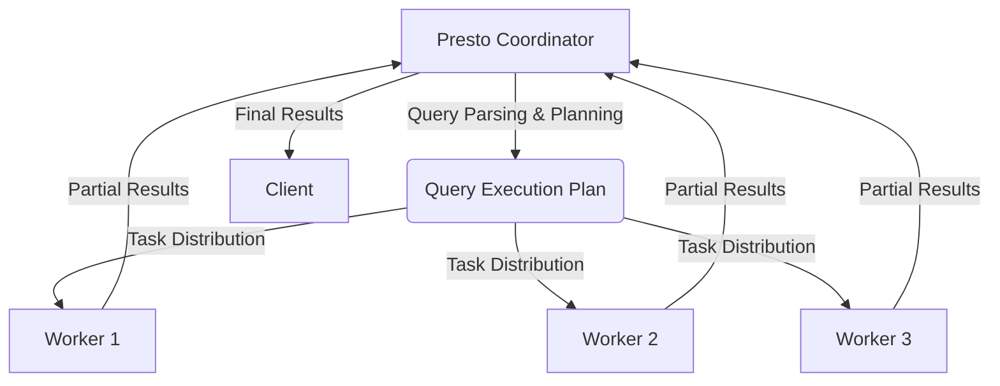
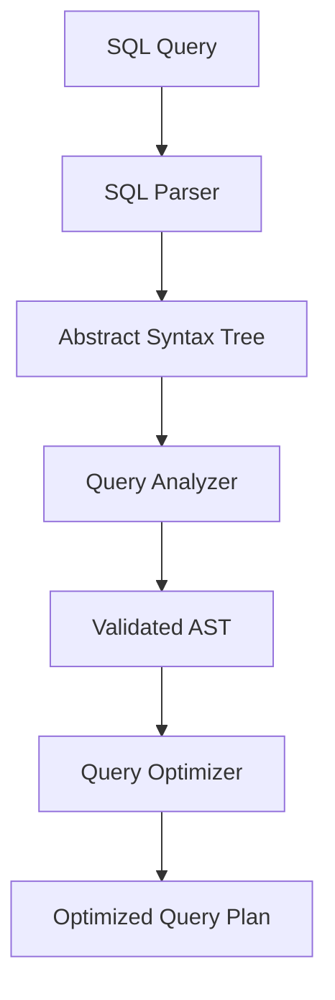
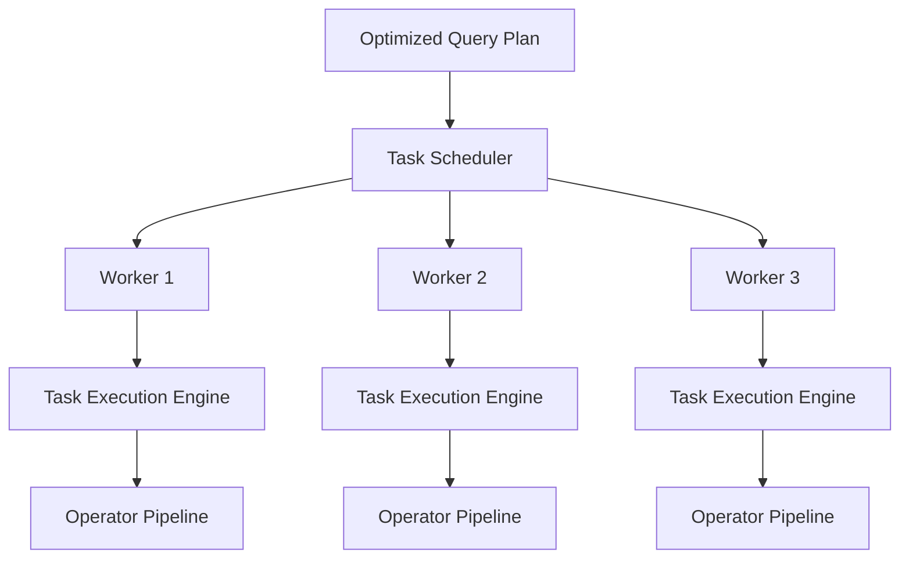
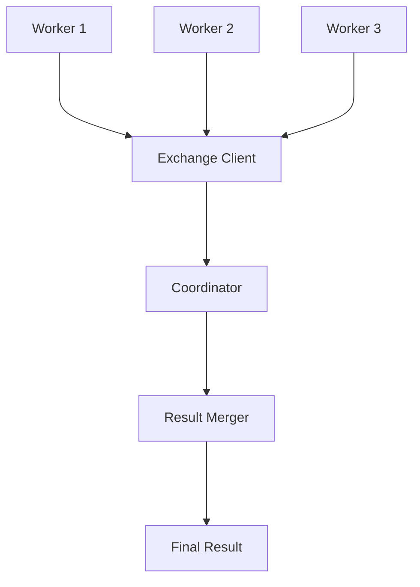

# Presto社区与生态：开放共建，繁荣发展

## 1.背景介绍

Presto是一款开源的大数据分布式SQL查询引擎,由Facebook公司开发并贡献给开源社区。它旨在对各种不同的数据源进行快速、可扩展和高效的分析查询,支持标准的ANSI SQL语法,并具有高度灵活和可扩展的特性。Presto的出现解决了传统数据库在大数据场景下查询效率低下的问题,为企业级大数据分析提供了高性能的解决方案。

Presto最初由Facebook的数据基础设施团队开发,用于查询Facebook的海量日志数据。随后在2013年11月开源,成为一个拥有活跃社区的开源项目。目前,Presto已被众多知名公司和组织广泛使用,包括Netflix、Airbnb、Uber、Twitter等,成为大数据生态系统中的重要组成部分。

## 2.核心概念与联系

### 2.1 Presto架构概览

Presto采用主从架构设计,由一个协调器(Coordinator)和多个工作节点(Worker)组成。协调器负责解析SQL查询、制定查询计划并将任务分发给工作节点执行。工作节点则负责实际执行查询任务,并将结果返回给协调器。



### 2.2 查询执行流程

1. 客户端提交SQL查询到协调器
2. 协调器解析SQL,生成分布式执行计划
3. 协调器将执行计划分发到工作节点
4. 工作节点执行任务,产生部分结果
5. 工作节点将部分结果返回协调器
6. 协调器合并部分结果,形成最终结果
7. 协调器将最终结果返回客户端

### 2.3 核心特性

- **分布式并行查询**：Presto通过将查询分解为多个并行任务在集群中执行,实现高吞吐和低延迟。
- **多数据源连接器**：支持Hive、Cassandra、MySQL、PostgreSQL、Kafka等多种数据源,可以跨数据源进行联合查询。
- **ANSI SQL兼容**：支持大多数ANSI SQL标准语法,易于使用和集成。
- **高性能内存计算**：采用基于内存的面向列的处理方式,提高了查询效率。
- **容错和故障恢复**：具备容错和自动故障恢复能力,确保查询的可靠性。
- **成本优化**：通过成本优化和自适应查询执行,提高查询效率。

## 3.核心算法原理具体操作步骤  

### 3.1 查询解析与优化

Presto的查询执行过程从SQL解析开始。SQL解析器将SQL语句转换为抽象语法树(AST),然后进行语义分析、类型检查等验证。经过验证后,查询优化器会对AST进行一系列优化转换,包括逻辑优化和代数优化,以生成高效的分布式执行计划。



### 3.2 任务调度与执行

经过优化后的查询计划会被分解为多个任务(Task),并分发到工作节点上执行。每个工作节点都有一个任务执行引擎,负责执行分配的任务。任务执行引擎会根据查询计划构建运算符管道(Operator Pipeline),并通过Pull模型驱动数据流动和计算。



### 3.3 数据交换与合并

在执行过程中,工作节点之间需要进行数据交换以实现分布式查询。Presto采用了高效的数据交换机制,支持重新分区(Repartition)、广播(Broadcast)和本地合并(Partial Merge)等操作。最终,协调器会将工作节点返回的部分结果进行合并,形成完整的查询结果。



## 4.数学模型和公式详细讲解举例说明

在查询优化过程中,Presto会根据成本模型选择最优的执行计划。成本模型主要考虑以下几个因素:

- 数据统计信息(Data Statistics):包括表的行数、列的基数、数据分布等。
- 硬件资源(Hardware Resources):包括CPU、内存、网络和磁盘IO等。
- 操作代价(Operation Costs):包括CPU代价、内存代价、网络代价和磁盘IO代价等。

假设有一个连接查询:

```sql
SELECT *
FROM lineitem l
JOIN orders o ON l.orderkey = o.orderkey;
```

其中lineitem表有L行,orders表有O行。连接操作的代价可以用下面的公式估算:

$$
Cost_{Join} = Cost_{Build} + Cost_{Probe}\\
Cost_{Build} = O \\
Cost_{Probe} = L \times \log_2(O)
$$

其中$Cost_{Build}$表示构建连接哈希表的代价,等于orders表的行数O。$Cost_{Probe}$表示探测哈希表的代价,等于lineitem表的行数L乘以对数因子$\log_2(O)$。

对于排序操作,如果使用基于内存的排序算法,其代价可以估算为:

$$
Cost_{Sort} = N \times \log_2(N)
$$

其中N表示待排序的行数。

通过估算不同执行计划的代价,查询优化器可以选择最优的计划。

## 5.项目实践：代码实例和详细解释说明

这里我们通过一个简单的示例,演示如何使用Presto查询Hive数据源中的数据。

### 5.1 环境准备

首先,我们需要启动一个Presto集群。可以使用Docker快速搭建:

```bash
# 拉取Presto Docker镜像
docker pull prestosql/presto

# 启动Presto coordinator
docker run -d --name presto-coordinator \
    -p 8080:8080 \
    prestosql/presto

# 启动Presto worker
docker run -d --name presto-worker-1 \
    --link presto-coordinator:presto-coordinator \
    prestosql/presto
```

### 5.2 连接Hive数据源

接下来,我们需要配置Presto连接Hive数据源。编辑`etc/catalog/hive.properties`文件:

```properties
connector.name=hive-hadoop2
hive.metastore.uri=thrift://hive-metastore:9083
```

重启Presto集群使配置生效。

### 5.3 查询示例

现在,我们可以使用Presto的CLI客户端连接到集群,并执行SQL查询:

```bash
# 连接到Presto coordinator
docker run -it --rm \
    --link presto-coordinator:presto-coordinator \
    prestosql/presto \
    presto --server presto-coordinator:8080 --catalog hive --schema default
```

在Presto CLI中,我们可以执行以下查询:

```sql
-- 查看Hive中的表
SHOW TABLES;

-- 查询表数据
SELECT * FROM lineitem LIMIT 10;

-- 执行连接查询
SELECT l.orderkey, l.extendedprice, o.orderstatus
FROM lineitem l
JOIN orders o ON l.orderkey = o.orderkey
LIMIT 10;
```

上面的示例展示了如何使用Presto查询Hive数据源中的数据,包括查看表、查询表数据和执行连接查询等操作。

## 6.实际应用场景

Presto在实际应用中被广泛使用于以下几个主要场景:

1. **交互式分析**:由于Presto的高性能和低延迟,非常适合用于交互式的数据分析和探索。

2. **ETL和数据集成**:Presto可以高效地从各种数据源提取数据,并进行转换和加载到其他系统中,常用于ETL和数据集成场景。

3. **数据监控和报表**:Presto可以对大量的监控日志和事件数据进行快速分析,生成实时报表和可视化展示。

4. **机器学习和数据科学**:Presto可以高效地处理大规模数据集,为机器学习和数据科学提供支持。

5. **Ad-hoc查询**:由于支持标准SQL语法,Presto非常适合用于临时性的Ad-hoc查询和探索性数据分析。

6. **云数据湖分析**:在云环境中,Presto可以高效地查询存储在对象存储(如AWS S3)中的大数据集,支持云数据湖分析。

## 7.工具和资源推荐

### 7.1 Presto相关工具

- **Presto UI**:Presto自带的Web UI,可以查看集群状态、查询状态和性能指标等信息。
- **Presto CLI**:Presto的命令行客户端,可以执行SQL查询和管理操作。
- **Presto JDBC Driver**:用于从Java应用程序连接Presto并执行SQL查询。
- **Presto ODBC Driver**:用于从BI工具(如Tableau、Power BI)连接Presto并执行SQL查询。

### 7.2 社区资源

- **Presto官网**:https://prestodb.io/
- **Presto GitHub仓库**:https://github.com/prestosql/presto
- **Presto文档**:https://prestosql.io/docs/current/
- **Presto Slack社区**:https://prestosql.slack.com/
- **Presto用户邮件列表**:https://groups.google.com/g/presto-users

## 8.总结：未来发展趋势与挑战

Presto作为一款优秀的开源分布式SQL查询引擎,在大数据分析领域发挥着重要作用。未来,Presto将继续面临以下几个发展趋势和挑战:

1. **云原生支持**:随着云计算的普及,Presto需要进一步增强对云原生环境的支持,如Kubernetes集成、自动扩缩容等。

2. **机器学习支持**:为了更好地支持机器学习和数据科学场景,Presto需要提供更多的机器学习算法和模型支持。

3. **性能优化**:持续优化查询执行引擎、数据交换机制和成本模型,提高Presto的查询性能和资源利用率。

4. **安全性和治理**:增强Presto的安全性和治理能力,如细粒度的访问控制、审计日志和元数据管理等。

5. **生态系统扩展**:继续扩展Presto的连接器生态系统,支持更多的数据源和存储格式。

6. **社区活力**:保持Presto社区的活力和发展,吸引更多的贡献者和用户参与,推动Presto的长期发展。

总的来说,Presto作为一个开源项目,将继续依赖社区的力量共同应对挑战,不断创新和发展,为大数据分析领域提供更加强大的解决方案。

## 9.附录：常见问题与解答

1. **Presto与Hive/Spark SQL的主要区别是什么?**

Presto与Hive和Spark SQL都是用于大数据分析的SQL引擎,但它们有一些重要区别:

- Presto是一个纯内存计算引擎,查询性能更快,但需要更多内存资源。Hive和Spark SQL则更多依赖磁盘存储。
- Presto支持标准的ANSI SQL语法,而Hive和Spark SQL有自己的SQL方言。
- Presto更侧重于交互式分析查询,而Hive和Spark SQL更适合批处理作业。
- Presto有更好的连接器生态系统,可以跨多种数据源进行联合查询。

2. **如何监控和调优Presto的性能?**

监控和调优Presto性能的主要方法包括:

- 使用Presto UI和监控指标(如查询时间、内存使用情况等)监控集群状态和查询性能。
- 分析Presto的查询计划和执行统计信息