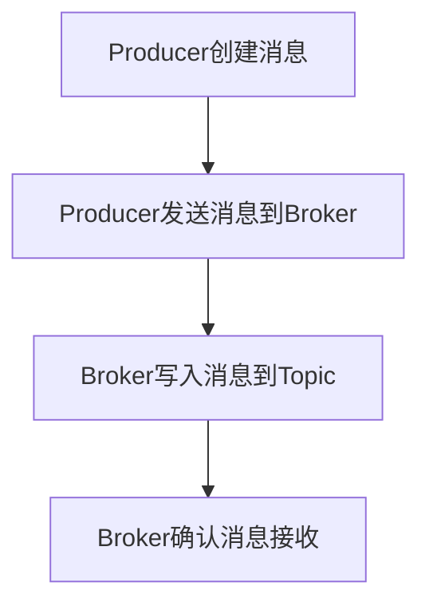

## 1.背景介绍

Apache Pulsar是一个高性能的,灵活的,可扩展的,开源的消息队列系统。它的设计目标是为大规模数据处理提供一个统一的数据处理平台，包括实时流处理和批处理。

Pulsar Producer是Apache Pulsar的关键组件之一，它负责将消息发送到Pulsar系统。理解Pulsar Producer的工作原理和如何在实际项目中使用它，对于有效使用Pulsar系统至关重要。

## 2.核心概念与联系

在深入了解Pulsar Producer的原理和使用之前，我们首先需要了解一些核心概念。

- **Producer：** 在Pulsar系统中，Producer是发送消息的客户端。每个Producer都有一个唯一的标识符，并且可以配置为异步或同步发送消息。

- **Topic：** 在Pulsar系统中，消息是通过Topic进行分类的。Producer将消息发送到特定的Topic，而Consumer则从特定的Topic接收消息。

- **Message：** 在Pulsar系统中，消息是数据传输的基本单位。每个消息都有一个唯一的序列号，以及一些可选的属性，如键、值和事件时间。

- **Broker：** Broker是Pulsar系统的核心组件，负责接收来自Producer的消息，并将它们路由到正确的Topic。

## 3.核心算法原理具体操作步骤

下面是Pulsar Producer发送消息的基本步骤：

1. Producer创建一个新的消息，并设置其内容和属性。
2. Producer将消息发送到Broker。
3. Broker将消息写入对应的Topic。
4. Broker向Producer确认消息已经被成功接收。

这个过程可以通过下面的Mermaid流程图进行可视化：



## 4.数学模型和公式详细讲解举例说明

在Pulsar系统中，Producer发送消息的速率和系统的吞吐量之间存在一种数学关系。具体来说，系统的吞吐量（T）可以通过下面的公式计算：

$$ T = M \times R $$

其中，M是每个消息的平均大小（以字节为单位），R是Producer发送消息的速率（以消息/秒为单位）。

例如，如果每个消息的平均大小是1KB，Producer的发送速率是1000消息/秒，那么系统的吞吐量就是1MB/秒。

## 5.项目实践：代码实例和详细解释说明

下面是一个使用Java Pulsar客户端的Producer发送消息的代码示例：

```java
import org.apache.pulsar.client.api.*;

public class PulsarProducerExample {
    public static void main(String[] args) throws PulsarClientException {
        PulsarClient client = PulsarClient.builder()
            .serviceUrl("pulsar://localhost:6650")
            .build();

        Producer<String> producer = client.newProducer(Schema.STRING)
            .topic("my-topic")
            .create();

        for (int i = 0; i < 10; i++) {
            producer.send("Hello Pulsar " + i);
        }

        producer.close();
        client.close();
    }
}
```

这段代码首先创建一个PulsarClient实例，然后使用这个客户端创建一个Producer。Producer被配置为将消息发送到名为"my-topic"的Topic。接着，Producer发送10条消息，每条消息的内容都是"Hello Pulsar"加上消息的序号。最后，关闭Producer和客户端。

## 6.实际应用场景

Pulsar Producer在许多实际应用场景中都非常有用。例如：

- **日志收集：** 在分布式系统中，可以使用Pulsar Producer来收集和发送各个服务的日志。这些日志可以被发送到一个或多个Topic，然后由其他服务进行处理和分析。

- **事件驱动的微服务：** 在事件驱动的微服务架构中，可以使用Pulsar Producer来发送事件。这些事件可以被其他微服务接收并处理，从而驱动整个系统的运行。

- **实时数据处理：** 在实时数据处理场景中，可以使用Pulsar Producer来发送实时数据。这些数据可以被实时处理系统接收并处理，以实现实时的数据分析和决策。

## 7.工具和资源推荐

如果你想要更深入地了解和使用Pulsar Producer，这里有一些工具和资源推荐：

- **Apache Pulsar官方文档：** Apache Pulsar的官方文档是学习和使用Pulsar的最好资源。它包括了详细的使用指南和API文档。

- **Apache Pulsar GitHub仓库：** Apache Pulsar的GitHub仓库包含了Pulsar的源代码和一些示例代码。你可以通过阅读和运行这些代码来更好地理解Pulsar的工作原理。

- **Apache Pulsar用户邮件列表和论坛：** Apache Pulsar的用户邮件列表和论坛是获取帮助和与其他Pulsar用户交流的好地方。

## 8.总结：未来发展趋势与挑战

Apache Pulsar作为一个高性能、灵活、可扩展的消息队列系统，已经在大规模数据处理领域得到了广泛的应用。然而，随着数据量的不断增长和处理需求的不断复杂化，Pulsar以及其Producer组件面临着一些挑战，如如何提高吞吐量、如何处理大规模的并发连接、如何保证消息的可靠性等。

在未来，我们期待Pulsar能够通过持续的技术创新和社区发展，来解决这些挑战，为大规模数据处理提供更好的解决方案。

## 9.附录：常见问题与解答

Q: Pulsar Producer可以发送哪些类型的消息？

A: Pulsar Producer可以发送各种类型的消息，包括文本、字节、键值对等。通过使用Pulsar的Schema API，你可以定义和验证消息的结构。

Q: Pulsar Producer如何处理消息发送失败的情况？

A: 如果Pulsar Producer在发送消息时遇到错误，它会尝试重新发送消息。你可以配置重试的次数和间隔，以及失败后的处理策略。

Q: Pulsar Producer可以同时发送多少条消息？

A: Pulsar Producer可以同时发送多条消息。你可以通过配置Producer的批处理大小和时间间隔，来控制批处理的行为。

作者：禅与计算机程序设计艺术 / Zen and the Art of Computer Programming