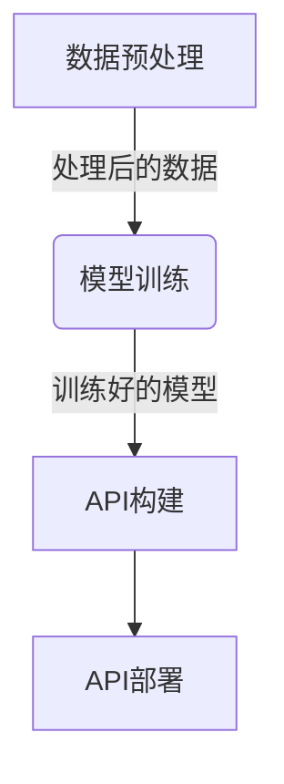

# Python机器学习实战：使用Flask构建机器学习API

## 1.背景介绍

在当今数据驱动的世界中，机器学习已经成为各行各业不可或缺的技术。从推荐系统到自动驾驶汽车,机器学习模型都在发挥着重要作用。然而,将这些模型部署到生产环境并提供可靠的服务是一个巨大的挑战。

Flask是一个轻量级的Python Web框架,它提供了一种简单而强大的方式来构建Web应用程序和API。通过将Flask与机器学习相结合,我们可以轻松地将训练好的模型部署为RESTful API服务,从而使其可以被其他应用程序或系统访问和利用。

在本文中,我们将探讨如何使用Flask构建一个机器学习API,包括数据预处理、模型训练、API构建和部署等关键步骤。我们还将讨论一些最佳实践,以确保API的可靠性、可扩展性和安全性。

## 2.核心概念与联系

在开始构建机器学习API之前,我们需要了解一些核心概念和它们之间的关系。

### 2.1 机器学习模型

机器学习模型是通过从数据中学习来进行预测或决策的算法。常见的机器学习模型包括线性回归、逻辑回归、决策树、随机森林、支持向量机等。选择合适的模型对于获得准确的预测结果至关重要。

### 2.2 数据预处理

数据预处理是机器学习过程中的一个关键步骤。它包括数据清洗、特征工程、标准化等操作,旨在将原始数据转换为模型可以理解的格式。高质量的数据预处理可以提高模型的准确性和性能。

### 2.3 Flask Web框架

Flask是一个轻量级的Python Web框架,它提供了一种简单而灵活的方式来构建Web应用程序和API。Flask支持RESTful API,可以轻松地将机器学习模型部署为Web服务。

### 2.4 RESTful API

RESTful API(Representational State Transfer Application Programming Interface)是一种基于HTTP协议的架构风格,它定义了一组约束条件和原则,用于构建Web服务。RESTful API使用标准的HTTP方法(GET、POST、PUT、DELETE)来处理数据,并使用统一的资源标识符(URI)来定位资源。

### 2.5 API部署

API部署是指将API服务部署到生产环境中,使其可以被其他应用程序或系统访问和利用。常见的部署方式包括容器化部署(如Docker)、云部署(如AWS、Azure)等。

## 3.核心算法原理具体操作步骤

构建机器学习API的核心步骤包括数据预处理、模型训练、API构建和部署。下面我们将详细介绍每个步骤的具体操作。



### 3.1 数据预处理

数据预处理是机器学习过程中的一个关键步骤,它包括以下操作:

1. **数据清洗**: 处理缺失值、异常值和重复数据等问题。
2. **特征工程**: 从原始数据中提取有用的特征,或者创建新的特征来提高模型的性能。
3. **数据标准化**: 将数据缩放到一个合适的范围,以防止某些特征对模型的影响过大或过小。
4. **数据分割**: 将数据集分为训练集和测试集,用于模型训练和评估。

下面是一个使用Python进行数据预处理的示例:

```python
import pandas as pd
from sklearn.preprocessing import StandardScaler

# 加载数据
data = pd.read_csv('data.csv')

# 处理缺失值
data = data.dropna()

# 特征工程
data['Age_Bucket'] = pd.cut(data['Age'], bins=[0, 18, 30, 60, 100], labels=['Child', 'Young', 'Adult', 'Senior'])

# 标准化数值特征
scaler = StandardScaler()
data[['Height', 'Weight']] = scaler.fit_transform(data[['Height', 'Weight']])

# 分割数据集
from sklearn.model_selection import train_test_split
X = data.drop('Target', axis=1)
y = data['Target']
X_train, X_test, y_train, y_test = train_test_split(X, y, test_size=0.2, random_state=42)
```

### 3.2 模型训练

在数据预处理完成后,我们可以使用机器学习算法来训练模型。常见的机器学习算法包括线性回归、逻辑回归、决策树、随机森林、支持向量机等。选择合适的算法取决于问题的类型(回归或分类)和数据的特征。

下面是一个使用Python训练逻辑回归模型的示例:

```python
from sklearn.linear_model import LogisticRegression

# 初始化模型
model = LogisticRegression()

# 训练模型
model.fit(X_train, y_train)

# 评估模型
accuracy = model.score(X_test, y_test)
print(f'Accuracy: {accuracy}')
```

### 3.3 API构建

在训练好模型后,我们可以使用Flask构建RESTful API,将模型部署为Web服务。Flask提供了一种简单而灵活的方式来定义API端点和处理HTTP请求。

下面是一个使用Flask构建机器学习API的示例:

```python
from flask import Flask, request, jsonify
import pickle

app = Flask(__name__)

# 加载模型
with open('model.pkl', 'rb') as f:
    model = pickle.load(f)

@app.route('/predict', methods=['POST'])
def predict():
    data = request.get_json()
    prediction = model.predict([data])
    return jsonify({'prediction': int(prediction[0])})

if __name__ == '__main__':
    app.run(debug=True)
```

在这个示例中,我们定义了一个`/predict`端点,用于接收POST请求。客户端可以向该端点发送JSON格式的数据,API将使用加载的模型进行预测,并返回预测结果。

### 3.4 API部署

在构建完API之后,我们需要将其部署到生产环境中,使其可以被其他应用程序或系统访问和利用。常见的部署方式包括容器化部署(如Docker)和云部署(如AWS、Azure)。

以Docker为例,我们可以创建一个Dockerfile来构建API的Docker镜像,然后将该镜像推送到Docker Registry中。最后,我们可以从Registry中拉取镜像并运行容器,从而部署API服务。

下面是一个简单的Dockerfile示例:

```dockerfile
FROM python:3.9

WORKDIR /app

COPY requirements.txt .
RUN pip install --no-cache-dir -r requirements.txt

COPY . .

CMD ["python", "app.py"]
```

在这个示例中,我们基于Python 3.9镜像构建新的镜像。我们首先复制`requirements.txt`文件并安装所需的Python包。然后,我们复制整个应用程序代码到镜像中。最后,我们设置容器启动时运行的命令为`python app.py`。

## 4.数学模型和公式详细讲解举例说明

在机器学习中,数学模型和公式扮演着重要的角色。它们为算法提供了理论基础,并帮助我们更好地理解和优化模型。在这一部分,我们将介绍一些常见的机器学习模型及其相关的数学公式。

### 4.1 线性回归

线性回归是一种广泛使用的机器学习算法,用于解决回归问题。它试图找到一条最佳拟合直线,使得数据点到直线的距离之和最小。

线性回归的数学模型可以表示为:

$$y = \theta_0 + \theta_1x_1 + \theta_2x_2 + ... + \theta_nx_n$$

其中:
- $y$是目标变量
- $x_1, x_2, ..., x_n$是特征变量
- $\theta_0, \theta_1, ..., \theta_n$是需要学习的参数

我们可以使用最小二乘法来估计这些参数,目标是最小化以下代价函数:

$$J(\theta) = \frac{1}{2m}\sum_{i=1}^m(h_\theta(x^{(i)}) - y^{(i)})^2$$

其中:
- $m$是训练样本的数量
- $h_\theta(x^{(i)})$是对于第$i$个样本的预测值
- $y^{(i)}$是第$i$个样本的实际值

通过梯度下降等优化算法,我们可以找到使代价函数最小化的参数值。

### 4.2 逻辑回归

逻辑回归是一种用于解决分类问题的算法。它通过估计概率来预测一个实例属于某个类别的可能性。

对于二元逻辑回归,我们使用sigmoid函数将线性回归的输出值映射到0到1之间的概率值:

$$h_\theta(x) = \frac{1}{1 + e^{-\theta^Tx}}$$

其中:
- $h_\theta(x)$是预测实例$x$属于正类的概率
- $\theta$是需要学习的参数向量

我们可以使用最大似然估计来学习参数$\theta$,目标是最大化以下对数似然函数:

$$l(\theta) = \sum_{i=1}^m[y^{(i)}\log(h_\theta(x^{(i)})) + (1 - y^{(i)})\log(1 - h_\theta(x^{(i)}))]$$

其中:
- $m$是训练样本的数量
- $y^{(i)}$是第$i$个样本的实际标签(0或1)

通过梯度上升等优化算法,我们可以找到使对数似然函数最大化的参数值。

### 4.3 决策树

决策树是一种用于解决分类和回归问题的非参数算法。它通过构建一个决策树模型来进行预测,该模型由一系列基于特征值的决策组成。

决策树的构建过程可以使用信息增益或基尼系数等指标来选择最优特征进行分裂。对于分类问题,我们可以使用信息增益来衡量特征的重要性:

$$\text{Gain}(D, a) = \text{Entropy}(D) - \sum_{v \in \text{Values}(a)} \frac{|D^v|}{|D|} \text{Entropy}(D^v)$$

其中:
- $D$是当前数据集
- $a$是特征
- $\text{Values}(a)$是特征$a$的所有可能值
- $D^v$是在特征$a$取值为$v$的子集
- $\text{Entropy}(D)$是数据集$D$的信息熵,定义为$\sum_{c \in \text{Classes}} -p_c \log_2 p_c$,其中$p_c$是类$c$的概率

我们选择具有最大信息增益的特征进行分裂,直到满足停止条件(如最大深度或最小样本数)。

### 4.4 随机森林

随机森林是一种集成学习算法,它通过构建多个决策树并将它们的预测结果进行组合来提高模型的准确性和鲁棒性。

对于分类问题,随机森林的预测结果是由每棵决策树的预测结果进行投票得出的:

$$\hat{C}_{rf}(x) = \text{majority vote} \{\hat{C}_b(x)\}_{b=1}^B$$

其中:
- $\hat{C}_{rf}(x)$是随机森林对实例$x$的预测类别
- $B$是决策树的数量
- $\hat{C}_b(x)$是第$b$棵决策树对实例$x$的预测类别

对于回归问题,随机森林的预测结果是每棵决策树预测值的平均值:

$$\hat{f}_{rf}(x) = \frac{1}{B}\sum_{b=1}^B\hat{f}_b(x)$$

其中:
- $\hat{f}_{rf}(x)$是随机森林对实例$x$的预测值
- $B$是决策树的数量
- $\hat{f}_b(x)$是第$b$棵决策树对实例$x$的预测值

随机森林的优势在于它可以有效地减少过拟合的风险,并且对于噪声和异常值具有较好的鲁棚性。

## 5.项目实践:代码实例和详细解释说明

在这一部分,我们将通过一个实际的项目示例来演示如何使用Flask构建一个机器学习API。我们将使用著名的鸢尾花数据集,并训练一个逻辑回归模型来预测鸢尾花的种类。

### 5.1 数据预处理

首先,我们需要导入必要的Python库并加载数据集。

```python
import pandas as pd
from sklearn.model_selection import train_test_split
from sklearn.preprocessing import StandardScaler

# 加载数据集
iris = pd.