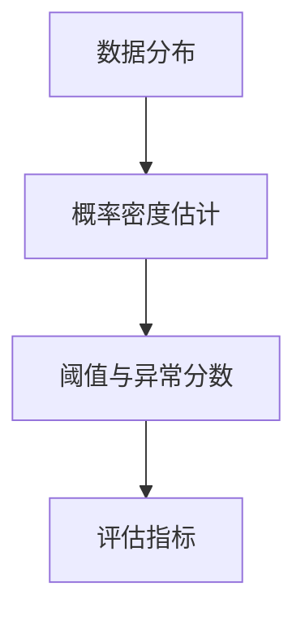

# Python机器学习实战：机器学习中的异常检测技术

## 1.背景介绍

异常检测(Anomaly Detection)是机器学习中一个重要而有趣的课题。在许多实际场景中,异常数据的出现往往预示着某些重要事件的发生,比如设备故障、网络入侵、金融欺诈等。及时发现这些异常,对业务有重大意义。

传统的异常检测方法主要基于统计学和数据挖掘,需要大量的领域知识和人工参与。而基于机器学习的异常检测技术,可以自动学习数据的正常模式,智能识别异常,极大提升效率。本文将重点介绍几种常见的机器学习异常检测算法,并用Python实现它们。

### 1.1 异常检测的定义与分类

异常检测,顾名思义就是找出数据集中与大多数数据有显著差异的个体。从数学角度看,如果我们把数据看作一个随机变量X,异常值可以定义为:

$$P(X=x_{anomaly})\leq \epsilon$$

其中$\epsilon$是一个接近于0的小数。也就是说,异常是小概率事件。

异常检测可以分为以下几类:

- 无监督异常检测:只有正常数据,没有异常数据样本
- 半监督异常检测:训练数据中有少量异常样本
- 监督异常检测:训练数据中同时包含正常和异常样本

本文主要关注无监督和半监督的异常检测。

### 1.2 异常检测的一般流程

一个典型的机器学习异常检测系统通常包括以下步骤:

1. 数据预处理:清洗、归一化数据,提取特征
2. 构建异常检测模型:选择合适的算法,用训练数据拟合模型参数  
3. 模型评估:用测试集评估模型性能
4. 模型应用:用训练好的模型对新数据进行异常检测


## 2.核心概念与联系

异常检测涉及到多个核心概念,它们相互联系,共同构成了异常检测的理论基础。

### 2.1 数据分布

要检测异常,首先要了解数据的分布规律。常见的数据分布有:

- 高斯分布(正态分布):许多自然现象服从高斯分布
- 指数分布:事件发生的时间间隔往往服从指数分布
- 泊松分布:稀有事件的发生次数服从泊松分布

对数据分布的假设,是异常检测算法的基础。

### 2.2 概率密度估计

如果我们知道数据分布类型,就可以用概率密度函数 $p(x)$ 来刻画数据分布。异常检测的关键是估计 $p(x)$。常用的密度估计方法有:

- 参数估计:假设分布类型,估计分布参数,如高斯分布的均值和方差
- 非参数估计:不对分布做强假设,用核密度估计等方法估计 $p(x)$

### 2.3 阈值与异常分数

有了 $p(x)$ 后,我们就可以计算样本的异常分数:

$$s(x)=-\log p(x)$$

分数越高,样本越异常。设定一个阈值 $\theta$,若 $s(x)>\theta$,则判定为异常。阈值的选取需要权衡漏检和误判。

### 2.4 评估指标 

异常检测的常用评估指标有:
- 准确率(Accuracy):$\frac{TP+TN}{TP+TN+FP+FN}$
- 精确率(Precision):$\frac{TP}{TP+FP}$  
- 召回率(Recall):$\frac{TP}{TP+FN}$
- F1分数:$2\cdot \frac{Precision \cdot Recall}{Precision + Recall}$
- ROC曲线和AUC



## 3.核心算法原理具体操作步骤

下面介绍几种常用的异常检测算法。

### 3.1 高斯模型异常检测

假设数据服从多元高斯分布,参数 $\mu$ 和 $\Sigma$ 可以用极大似然估计:

$$\mu=\frac{1}{m}\sum_{i=1}^m x^{(i)}$$

$$\Sigma=\frac{1}{m}\sum_{i=1}^m (x^{(i)}-\mu)(x^{(i)}-\mu)^T$$

异常分数为马氏距离:

$$s(x)=(x-\mu)^T\Sigma^{-1}(x-\mu)$$

算法步骤:
1. 估计 $\mu$ 和 $\Sigma$
2. 计算所有样本的异常分数
3. 选取阈值 $\theta$,分数大于 $\theta$ 的判为异常

### 3.2 孤立森林(Isolation Forest)

iForest的思想是,异常点更容易被孤立出来。它通过随机切分数据空间,构造多棵孤立树(iTree)。样本的异常分数与它所在的iTree节点的深度有关,深度越小,越可能是异常。

算法步骤:
1. 从数据集中随机抽取n个样本,构造一棵iTree:
   - 随机选择一个特征
   - 在该特征的最小和最大值之间随机选择一个切分点
   - 递归构建左右子树,直到树的高度达到限制或节点只有一个样本
2. 重复步骤1,构造一个iTree的集合
3. 计算每个样本在每棵树上的节点深度,取平均值作为异常分数

### 3.3 局部异常因子(Local Outlier Factor)

LOF算法考虑样本的局部密度,若某个样本的局部密度明显小于它邻域内其他样本的局部密度,则认为它是异常点。

算法步骤:
1. 对每个样本 $x$,计算它到第 $k$ 近邻的距离 $k\text{-}distance(x)$ 
2. 计算 $x$ 的 $k\text{-}distance$ 邻域 $N_k(x)$,即与 $x$ 的距离不大于 $k\text{-}distance(x)$ 的所有样本
3. 计算 $x$ 的局部可达密度(local reachability density):

$$lrd(x)=1/(\frac{\sum_{y\in N_k(x)}k\text{-}distance(y,x)}{|N_k(x)|}) $$

4. 计算 $x$ 的异常因子:

$$LOF(x)=\frac{\sum_{y\in N_k(x)}\frac{lrd(y)}{lrd(x)}}{|N_k(x)|}$$

LOF值越大,样本越异常。

## 4.数学模型和公式详细讲解举例说明

本节详细解释上述算法中涉及的数学模型和公式。

### 4.1 高斯模型

多元高斯分布的概率密度函数为:

$$p(x;\mu,\Sigma)=\frac{1}{(2\pi)^{n/2}|\Sigma|^{1/2}} \exp\left(-\frac{1}{2}(x-\mu)^T\Sigma^{-1}(x-\mu)\right)$$

其中 $\mu$ 是均值向量, $\Sigma$ 是协方差矩阵。

假设有 $m$ 个 $n$ 维样本 $\{x^{(1)},\dots,x^{(m)}\}$,极大似然估计为:

$$\mu_{ML}=\frac{1}{m}\sum_{i=1}^m x^{(i)}$$

$$\Sigma_{ML}=\frac{1}{m}\sum_{i=1}^m (x^{(i)}-\mu)(x^{(i)}-\mu)^T$$

马氏距离刻画了样本 $x$ 到分布中心 $\mu$ 的距离,考虑了各维度之间的相关性:

$$d_{Mahal}(x)=\sqrt{(x-\mu)^T\Sigma^{-1}(x-\mu)}$$

### 4.2 孤立森林

iTree的构建过程可以看作是不断地对数据空间 $S$ 进行随机切分,直到每个样本被孤立。

假设在树的第 $l$ 层,样本 $x$ 所在的节点对应的数据子空间为 $S_l(x)$,其体积为 $V(S_l(x))$。若子空间内的样本数为 $n_l(x)$,则 $x$ 在该节点被孤立的概率为:

$$P(x\text{ is isolated at layer }l)=\frac{V(S_l(x))}{V(S)}$$

样本的异常分数定义为:

$$s(x)=2^{-\frac{E(h(x))}{c(n)}}$$

其中 $E(h(x))$ 是 $x$ 在所有iTree上的平均节点深度, $c(n)$ 是树高的平均值。

### 4.3 局部异常因子

$k\text{-}distance(x)$ 定义为 $x$ 到它第 $k$ 近邻的距离:

$$k\text{-}distance(x)=d(x,x^{(k)})$$

其中 $x^{(k)}$ 是 $x$ 的第 $k$ 近邻。

$k\text{-}distance$ 邻域 $N_k(x)$ 定义为:

$$N_k(x)=\{y\in D\setminus\{x\}|d(x,y)\leq k\text{-}distance(x)\}$$

局部可达密度 $lrd(x)$ 刻画了 $x$ 邻域内的样本密度:

$$lrd(x)=1/(\frac{\sum_{y\in N_k(x)}k\text{-}distance(y,x)}{|N_k(x)|})$$

异常因子 $LOF(x)$ 刻画了 $x$ 的局部密度与其邻居的局部密度之比:

$$LOF(x)=\frac{\sum_{y\in N_k(x)}\frac{lrd(y)}{lrd(x)}}{|N_k(x)|}$$

若 $x$ 是异常点,则它的 $lrd(x)$ 会明显小于邻居的 $lrd(y)$,导致 $LOF(x)$ 较大。

## 5.项目实践：代码实例和详细解释说明

下面用Python实现上述算法。

### 5.1 高斯模型异常检测

```python
import numpy as np
from scipy.stats import multivariate_normal

class GaussianAD:
    def __init__(self):
        self.mu = None
        self.sigma = None
    
    def fit(self, X):
        self.mu = np.mean(X, axis=0)
        self.sigma = np.cov(X.T)
    
    def predict(self, X):
        p = multivariate_normal.pdf(X, mean=self.mu, cov=self.sigma)
        return -np.log(p)
```

`fit`方法估计高斯分布参数。`predict`方法计算样本的异常分数。

### 5.2 孤立森林

```python
from sklearn.ensemble import IsolationForest

class IForestAD:
    def __init__(self, n_estimators=100, contamination=0.1):
        self.model = IsolationForest(n_estimators=n_estimators, 
                                     contamination=contamination)
    
    def fit(self, X):
        self.model.fit(X)
    
    def predict(self, X):
        return -self.model.decision_function(X)
```

`IsolationForest`是sklearn提供的孤立森林实现。`decision_function`返回样本的异常分数。

### 5.3 局部异常因子

```python
from sklearn.neighbors import LocalOutlierFactor

class LOFAD:
    def __init__(self, n_neighbors=20, contamination=0.1):
        self.model = LocalOutlierFactor(n_neighbors=n_neighbors,
                                        contamination=contamination)
    
    def fit_predict(self, X):
        return -self.model.fit_predict(X)
```

`LocalOutlierFactor`是sklearn提供的LOF实现。`fit_predict`直接返回样本的异常因子。

## 6.实际应用场景

异常检测在工业界有广泛应用,下面列举几个典型场景。

### 6.1 设备故障检测

在工业生产中,设备的各种传感器会持续产生大量数据,如温度、压力、振动等。异常检测算法可以实时分析这些数据,一旦发现异常,就预警可能发生的故障,避免造成重大损失。

### 6.2 网络入侵检测

黑客入侵会产生异常的网络流量。异常检测可以及时发现这些异常流量,如DDoS攻击、端口扫描、蠕虫病毒等,触发报警和防御机制。

### 6.3 金融欺诈检测

金融交易中存在大量欺