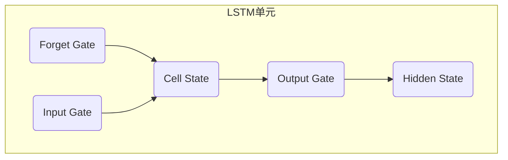
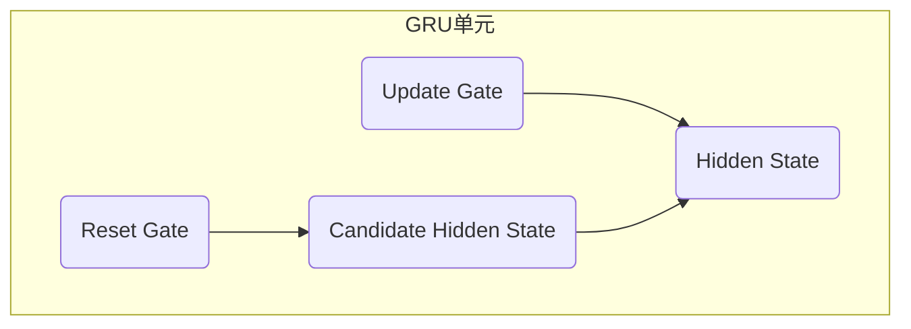

# Python深度学习实践：LSTM与GRU在序列数据预测中的应用

## 1.背景介绍

在当今数据驱动的时代,序列数据无处不在,例如股票价格、语音识别、机器翻译等。传统的机器学习算法往往无法有效地处理这种序列数据,因为它们无法捕捉数据中的时间依赖性。而循环神经网络(Recurrent Neural Networks,RNNs)则被设计用于处理序列数据,并取得了巨大的成功。

然而,标准的RNNs在处理长期依赖性时存在困难,这就催生了长短期记忆网络(Long Short-Term Memory,LSTM)和门控循环单元(Gated Recurrent Unit,GRU)等变体。LSTM和GRU通过引入门控机制,使网络能够更好地捕捉长期依赖关系,从而在许多序列建模任务中取得了优异的性能。

### 1.1 序列数据的挑战

序列数据具有以下几个关键特征:

- **时间依赖性**:数据点之间存在时间上的相关性,后续数据点的值依赖于之前的数据点。
- **可变长度**:与固定长度的数据(如图像)不同,序列数据的长度可以是可变的。
- **噪声和缺失值**:实际数据中往往存在噪声和缺失值,需要模型具有鲁棒性。

这些特征使得传统的机器学习算法(如线性回归、决策树等)无法直接应用于序列数据建模。

### 1.2 循环神经网络(RNNs)

为了解决序列数据建模的挑战,循环神经网络(RNNs)应运而生。RNNs的核心思想是在网络中引入循环,使得当前时间步的隐藏状态不仅取决于当前输入,还取决于前一时间步的隐藏状态。这种循环结构赋予了RNNs处理序列数据的能力。

然而,标准的RNNs在实践中存在一些缺陷,例如梯度消失/爆炸问题,难以捕捉长期依赖关系等。为了解决这些问题,研究人员提出了LSTM和GRU等变体。

## 2.核心概念与联系

### 2.1 LSTM(Long Short-Term Memory)

LSTM是一种特殊的RNN,它通过引入门控机制来解决标准RNN的梯度消失/爆炸问题,并能够更好地捕捉长期依赖关系。

LSTM的核心思想是维护一个细胞状态(cell state),它像一条传送带一样,能够将信息无衰减地传递到较远的时间步。同时,LSTM通过三个门(遗忘门、输入门和输出门)来控制细胞状态和隐藏状态的更新。

- **遗忘门(Forget Gate)**: 控制从上一时间步传递到当前细胞状态的信息量。
- **输入门(Input Gate)**: 控制当前输入和上一时间步的隐藏状态对当前细胞状态的影响程度。
- **输出门(Output Gate)**: 控制当前细胞状态对当前隐藏状态的影响程度。

通过这些门控机制,LSTM能够有选择性地保留重要信息,丢弃不重要信息,从而更好地捕捉长期依赖关系。

### 2.2 GRU(Gated Recurrent Unit)

GRU是另一种流行的RNN变体,它相比LSTM结构更加简单,计算量也更小。GRU通过引入更新门(update gate)和重置门(reset gate)来控制状态的更新和信息流动。

- **重置门(Reset Gate)**: 控制忘记上一时间步的隐藏状态,并计算新的候选隐藏状态。
- **更新门(Update Gate)**: 控制保留上一时间步的隐藏状态,以及合并新的候选隐藏状态。

GRU相比LSTM结构更加简单,因此在某些场景下训练更快、性能更好。但在处理长期依赖关系时,LSTM可能表现更加出色。

### 2.3 LSTM与GRU的联系

LSTM和GRU都是为了解决标准RNN的梯度消失/爆炸问题和长期依赖性问题而提出的改进方案。它们都通过引入门控机制来控制信息的流动和状态的更新,从而增强了网络捕捉长期依赖关系的能力。

尽管LSTM和GRU在具体实现上有所不同,但它们的核心思想是相似的,都是通过门控机制来控制信息流动和状态更新。LSTM使用三个门(遗忘门、输入门和输出门),而GRU使用两个门(重置门和更新门)。

在实践中,LSTM和GRU在不同任务上的表现可能有所差异,需要根据具体任务和数据集进行选择和调优。一般而言,LSTM在处理长期依赖关系时可能表现更好,而GRU在某些场景下由于结构更简单,训练更快、性能更好。

## 3.核心算法原理具体操作步骤

在这一部分,我们将详细介绍LSTM和GRU的具体算法原理和操作步骤。

### 3.1 LSTM算法原理及操作步骤

LSTM的核心思想是维护一个细胞状态(cell state),它像一条传送带一样,能够将信息无衰减地传递到较远的时间步。同时,LSTM通过三个门(遗忘门、输入门和输出门)来控制细胞状态和隐藏状态的更新。

具体操作步骤如下:

1. **遗忘门(Forget Gate)**: 决定从上一时间步的细胞状态中保留多少信息。

$$
f_t = \sigma(W_f \cdot [h_{t-1}, x_t] + b_f)
$$

其中,$f_t$是遗忘门的输出,$\sigma$是sigmoid激活函数,$W_f$和$b_f$是可训练的权重和偏置,$h_{t-1}$是上一时间步的隐藏状态,$x_t$是当前时间步的输入。

2. **输入门(Input Gate)**: 决定从当前输入和上一隐藏状态中获取多少新信息,并与遗忘门的输出相结合,生成新的细胞状态。

$$
i_t = \sigma(W_i \cdot [h_{t-1}, x_t] + b_i) \\
\tilde{C}_t = \tanh(W_C \cdot [h_{t-1}, x_t] + b_C) \\
C_t = f_t * C_{t-1} + i_t * \tilde{C}_t
$$

其中,$i_t$是输入门的输出,$\tilde{C}_t$是候选细胞状态,$C_t$是当前时间步的细胞状态。

3. **输出门(Output Gate)**: 决定从当前细胞状态中输出多少信息,并与当前输入和上一隐藏状态相结合,生成当前时间步的隐藏状态。

$$
o_t = \sigma(W_o \cdot [h_{t-1}, x_t] + b_o) \\
h_t = o_t * \tanh(C_t)
$$

其中,$o_t$是输出门的输出,$h_t$是当前时间步的隐藏状态。

通过这些门控机制,LSTM能够有选择性地保留重要信息,丢弃不重要信息,从而更好地捕捉长期依赖关系。

### 3.2 GRU算法原理及操作步骤

GRU相比LSTM结构更加简单,它通过引入更新门(update gate)和重置门(reset gate)来控制状态的更新和信息流动。

具体操作步骤如下:

1. **更新门(Update Gate)**: 决定保留上一时间步的隐藏状态多少,以及合并新的候选隐藏状态多少。

$$
z_t = \sigma(W_z \cdot [h_{t-1}, x_t] + b_z)
$$

其中,$z_t$是更新门的输出。

2. **重置门(Reset Gate)**: 决定忘记上一时间步的隐藏状态多少,并计算新的候选隐藏状态。

$$
r_t = \sigma(W_r \cdot [h_{t-1}, x_t] + b_r) \\
\tilde{h}_t = \tanh(W_h \cdot [r_t * h_{t-1}, x_t] + b_h)
$$

其中,$r_t$是重置门的输出,$\tilde{h}_t$是候选隐藏状态。

3. **隐藏状态更新**: 根据更新门的输出,合并上一时间步的隐藏状态和新的候选隐藏状态。

$$
h_t = (1 - z_t) * h_{t-1} + z_t * \tilde{h}_t
$$

其中,$h_t$是当前时间步的隐藏状态。

通过这两个门控机制,GRU能够控制信息流动和状态更新,从而增强了网络捕捉长期依赖关系的能力。

## 4.数学模型和公式详细讲解举例说明

在上一节中,我们介绍了LSTM和GRU的算法原理和操作步骤,其中涉及到了一些数学公式和符号。在这一节,我们将详细解释这些公式和符号的含义,并通过具体例子来帮助读者更好地理解。

### 4.1 LSTM公式详解

在LSTM的算法步骤中,我们使用了以下几个公式:

1. 遗忘门(Forget Gate):

$$
f_t = \sigma(W_f \cdot [h_{t-1}, x_t] + b_f)
$$

这个公式计算了遗忘门的输出$f_t$,它决定了从上一时间步的细胞状态中保留多少信息。其中:

- $\sigma$是sigmoid激活函数,将输入值映射到0到1之间,表示保留信息的程度。
- $W_f$和$b_f$是可训练的权重和偏置,用于对输入进行线性变换。
- $[h_{t-1}, x_t]$是将上一时间步的隐藏状态$h_{t-1}$和当前时间步的输入$x_t$拼接在一起作为输入。

2. 输入门(Input Gate)和细胞状态更新:

$$
i_t = \sigma(W_i \cdot [h_{t-1}, x_t] + b_i) \\
\tilde{C}_t = \tanh(W_C \cdot [h_{t-1}, x_t] + b_C) \\
C_t = f_t * C_{t-1} + i_t * \tilde{C}_t
$$

这些公式计算了输入门的输出$i_t$、候选细胞状态$\tilde{C}_t$和当前时间步的细胞状态$C_t$。其中:

- $i_t$决定了从当前输入和上一隐藏状态中获取多少新信息。
- $\tilde{C}_t$是一个候选的新细胞状态,通过$\tanh$激活函数将值映射到-1到1之间。
- $C_t$是当前时间步的细胞状态,它是上一时间步的细胞状态$C_{t-1}$和新的候选细胞状态$\tilde{C}_t$的加权和,权重分别由遗忘门$f_t$和输入门$i_t$决定。

3. 输出门(Output Gate)和隐藏状态更新:

$$
o_t = \sigma(W_o \cdot [h_{t-1}, x_t] + b_o) \\
h_t = o_t * \tanh(C_t)
$$

这些公式计算了输出门的输出$o_t$和当前时间步的隐藏状态$h_t$。其中:

- $o_t$决定了从当前细胞状态中输出多少信息。
- $h_t$是当前时间步的隐藏状态,它是当前细胞状态$C_t$通过$\tanh$激活函数后,与输出门$o_t$相乘得到的。

通过这些门控机制,LSTM能够有选择性地保留重要信息,丢弃不重要信息,从而更好地捕捉长期依赖关系。

### 4.2 GRU公式详解

在GRU的算法步骤中,我们使用了以下几个公式:

1. 更新门(Update Gate):

$$
z_t = \sigma(W_z \cdot [