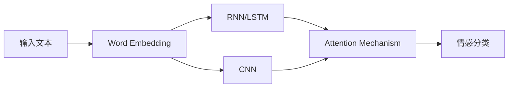

# Python深度学习实践：文本情感分类的深度学习方法

## 1. 背景介绍
### 1.1 文本情感分类的重要性
在当今信息爆炸的时代,海量的文本数据如评论、社交媒体帖子、客户反馈等不断产生。从这些文本数据中自动识别和提取情感倾向,对于企业决策、舆情分析、个性化推荐等领域具有重要的价值。文本情感分类旨在自动判断一段文本所表达的情感是积极、消极还是中性,是自然语言处理和情感计算领域的核心任务之一。

### 1.2 传统的文本情感分类方法
传统的文本情感分类方法主要基于词典和机器学习。基于词典的方法需要构建情感词典,根据情感词出现的频率和权重来判断文本的情感倾向。但其覆盖面有限,难以应对口语化、新词等复杂语言现象。基于机器学习的方法如朴素贝叶斯、支持向量机等,将文本表示成稀疏的词袋向量,然后训练分类器。但其依赖于人工特征,无法挖掘词语间的深层语义信息。

### 1.3 深度学习在文本情感分类中的优势  
近年来,深度学习技术在计算机视觉、语音识别等领域取得了巨大突破,其强大的特征学习和建模能力也被引入到自然语言处理领域。与传统方法相比,深度学习可以自动学习文本的多层次抽象特征,挖掘词语间的深层语义信息,在文本情感分类任务上取得了显著的性能提升。

本文将重点介绍几种经典的深度学习模型在文本情感分类任务中的应用,包括循环神经网络(RNN)、长短期记忆网络(LSTM)、卷积神经网络(CNN)、注意力机制等,探讨如何使用Python实现这些模型,并分享实践中的经验和思考。

## 2. 核心概念与联系
### 2.1 词嵌入(Word Embedding)
将词语映射为稠密的低维实值向量,词向量之间的距离可以表示词语间的语义相似度。常见的词嵌入模型有Word2Vec、GloVe等。将词嵌入作为深度学习模型的输入层,可以有效地将文本数字化并捕捉词语间的语义信息。

### 2.2 循环神经网络(RNN)
一种适合处理序列数据的神经网络,可以建模文本中的上下文信息和长距离依赖关系。RNN在每个时间步接收一个词向量,输出一个隐藏状态,并将其传递给下一个时间步,从而实现信息的累积和传递。

### 2.3 长短期记忆网络(LSTM)  
传统RNN在处理长序列时会出现梯度消失或梯度爆炸问题,影响模型的学习能力。LSTM通过引入门控机制,可以有选择地记忆和遗忘信息,从而更好地捕捉长距离依赖,是一种常用的RNN变体。

### 2.4 卷积神经网络(CNN)
擅长提取局部特征和特征组合,可以自动学习文本中的多粒度特征。将词向量看作一维图像,使用不同尺寸的卷积核在文本上滑动,提取n-gram特征,最后使用池化操作获得整句的特征表示。

### 2.5 注意力机制(Attention Mechanism)
赋予模型根据任务目标,动态地为输入序列的不同部分分配权重的能力。常见的有Bahdanau Attention和Self-Attention。在文本分类中,注意力机制可以帮助模型关注对情感极性判断更重要的词语,提升分类性能。

下图展示了这些核心概念在文本情感分类任务中的联系:



## 3. 核心算法原理与具体操作步骤
下面以LSTM模型为例,详细介绍使用深度学习进行文本情感分类的核心算法原理和操作步骤。

### 3.1 LSTM的基本结构
LSTM的关键是细胞状态(cell state)和三个门(gate):输入门(input gate)、遗忘门(forget gate)和输出门(output gate)。细胞状态贯穿整个序列,类似于传送带,允许信息在序列中传递。三个门控制信息的流动,决定哪些信息加入到细胞状态,哪些信息被遗忘。

### 3.2 LSTM的前向传播过程
1) 对于输入的词向量$x_t$,首先计算输入门$i_t$、遗忘门$f_t$、输出门$o_t$以及候选细胞状态$\tilde{C}_t$:
   
$$
\begin{aligned}
i_t &= \sigma(W_i \cdot [h_{t-1}, x_t] + b_i) \\
f_t &= \sigma(W_f \cdot [h_{t-1}, x_t] + b_f) \\
o_t &= \sigma(W_o \cdot [h_{t-1}, x_t] + b_o) \\
\tilde{C}_t &= \tanh(W_C \cdot [h_{t-1}, x_t] + b_C)
\end{aligned}
$$

其中$W_i, W_f, W_o, W_C$是可学习的权重矩阵,$b_i, b_f, b_o, b_C$是偏置项,$\sigma$是sigmoid激活函数。

2) 更新细胞状态$C_t$,遗忘门控制上一步的细胞状态$C_{t-1}$中的信息是否被遗忘,输入门控制候选细胞状态$\tilde{C}_t$中的信息是否被加入:

$$C_t = f_t * C_{t-1} + i_t * \tilde{C}_t$$

3) 计算隐藏状态$h_t$,输出门控制细胞状态中的信息是否输出:

$$h_t = o_t * \tanh(C_t)$$

4) 将最后一个时间步的隐藏状态$h_T$传入全连接层,然后使用softmax函数进行情感类别的概率预测:

$$\hat{y} = \text{softmax}(W \cdot h_T + b)$$

其中$W$和$b$是可学习的参数。

### 3.3 模型训练
使用反向传播算法和梯度下降法来最小化预测概率分布$\hat{y}$与真实标签$y$之间的交叉熵损失:

$$L = -\sum_{i=1}^{N} y_i \log(\hat{y}_i)$$

其中$N$是类别数。通过不断迭代和优化,模型可以学习到文本情感分类的潜在模式。

## 4. 数学模型和公式详细讲解举例说明
这里以LSTM中的遗忘门为例,详细讲解其数学模型和公式。

遗忘门$f_t$控制上一步的细胞状态$C_{t-1}$中的信息是否被遗忘,其计算公式为:

$$f_t = \sigma(W_f \cdot [h_{t-1}, x_t] + b_f)$$

其中$W_f$是遗忘门的权重矩阵,$h_{t-1}$是上一步的隐藏状态,$x_t$是当前步的输入词向量,$b_f$是偏置项。$[h_{t-1}, x_t]$表示将两个向量拼接成一个更长的向量。

$\sigma$是sigmoid激活函数,将输入映射到(0, 1)范围内:

$$\sigma(x) = \frac{1}{1 + e^{-x}}$$

sigmoid函数具有良好的梯度特性,适合作为门控信号。

举例说明,假设隐藏状态维度为4,词向量维度为4,则遗忘门的权重矩阵$W_f$的形状为(4, 8),偏置项$b_f$的形状为(4,)。给定上一步隐藏状态$h_{t-1}$和当前步输入$x_t$:

$$
h_{t-1} = 
\begin{bmatrix}
0.1 \\
0.2 \\
0.3 \\
0.4
\end{bmatrix},
x_t = 
\begin{bmatrix}
0.5 \\
0.6 \\
0.7 \\
0.8
\end{bmatrix}
$$

假设权重矩阵和偏置项为:

$$
W_f = 
\begin{bmatrix}
0.1 & 0.2 & 0.3 & 0.4 & 0.5 & 0.6 & 0.7 & 0.8 \\
0.2 & 0.3 & 0.4 & 0.5 & 0.6 & 0.7 & 0.8 & 0.9 \\
0.3 & 0.4 & 0.5 & 0.6 & 0.7 & 0.8 & 0.9 & 1.0 \\
0.4 & 0.5 & 0.6 & 0.7 & 0.8 & 0.9 & 1.0 & 1.1
\end{bmatrix},
b_f = 
\begin{bmatrix}
0.1 \\
0.2 \\
0.3 \\
0.4
\end{bmatrix}
$$

则遗忘门$f_t$的计算过程为:

$$
\begin{aligned}
f_t &= \sigma(W_f \cdot [h_{t-1}, x_t] + b_f) \\
&= \sigma(
\begin{bmatrix}
0.1 & 0.2 & 0.3 & 0.4 & 0.5 & 0.6 & 0.7 & 0.8 \\
0.2 & 0.3 & 0.4 & 0.5 & 0.6 & 0.7 & 0.8 & 0.9 \\
0.3 & 0.4 & 0.5 & 0.6 & 0.7 & 0.8 & 0.9 & 1.0 \\
0.4 & 0.5 & 0.6 & 0.7 & 0.8 & 0.9 & 1.0 & 1.1
\end{bmatrix}
\cdot
\begin{bmatrix}
0.1 \\
0.2 \\
0.3 \\
0.4 \\
0.5 \\
0.6 \\
0.7 \\
0.8
\end{bmatrix}
+
\begin{bmatrix}
0.1 \\
0.2 \\
0.3 \\
0.4
\end{bmatrix}) \\
&= \sigma(
\begin{bmatrix}
2.3 \\
2.8 \\  
3.3 \\
3.8
\end{bmatrix}) \\
&= 
\begin{bmatrix}
0.91 \\
0.94 \\
0.96 \\
0.98
\end{bmatrix}
\end{aligned}
$$

可以看到,遗忘门的输出是一个(0, 1)范围内的向量,控制上一步细胞状态中的信息通过的比例。这里的输出都接近1,表示上一步的大部分信息将被保留。

## 5. 项目实践：代码实例和详细解释说明
下面使用Python和Keras库来实现一个基于LSTM的文本情感分类模型。

### 5.1 数据准备
首先加载IMDB电影评论数据集,该数据集包含25000条训练评论和25000条测试评论,标签为二分类(正面/负面)。

```python
from keras.datasets import imdb

max_features = 10000  # 只考虑数据集中前10000个最常出现的单词
maxlen = 200  # 每条评论最大长度为200个单词

(x_train, y_train), (x_test, y_test) = imdb.load_data(num_words=max_features)

# 将评论长度规范化到200
x_train = sequence.pad_sequences(x_train, maxlen=maxlen)
x_test = sequence.pad_sequences(x_test, maxlen=maxlen)
```

### 5.2 构建LSTM模型
使用Keras的Sequential模型来搭建LSTM网络,模型架构如下:
- Embedding层:将单词索引转换为词向量
- LSTM层:学习文本的序列特征
- Dense层:全连接层,输出情感类别的概率分布

```python
from keras.models import Sequential
from keras.layers import Embedding, LSTM, Dense

model = Sequential()
model.add(Embedding(max_features, 128, input_length=maxlen))
model.add(LSTM(128, dropout=0.2, recurrent_dropout=0.2))
model.add(Dense(1, activation='sigmoid'))

model.compile(loss='binary_crossentropy',
              optimizer='adam',
              metrics=['accuracy'])
```

### 5.3 模型训练与评估
使用训练集数据来训练模型,并在测试