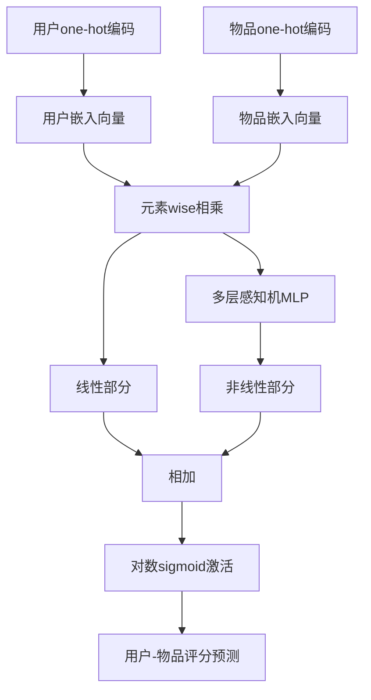
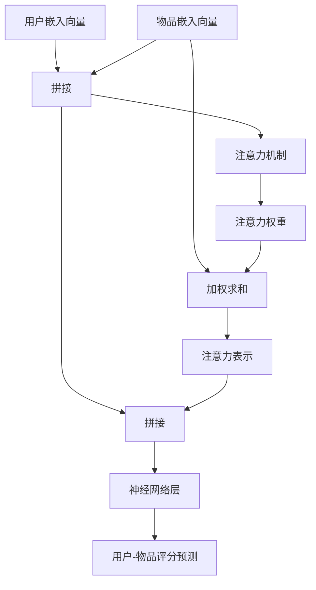

# Python深度学习实践：构建和优化推荐系统模型

## 1.背景介绍

在当今信息时代,人们面临着信息过载的挑战。推荐系统应运而生,旨在从海量信息中为用户精准推荐感兴趣的内容,提供个性化体验。推荐系统广泛应用于电子商务、在线视频、社交媒体等领域,为用户带来更好的服务和体验。

传统的推荐系统通常基于协同过滤算法,依赖于用户历史行为数据,存在冷启动问题、数据稀疏性等局限性。而深度学习凭借强大的特征学习能力,能够从原始数据中自动挖掘高阶特征,捕捉复杂的用户偏好模式,从而有望突破传统方法的瓶颈,为推荐系统带来全新的发展机遇。

本文将详细介绍如何利用Python生态圈中的深度学习框架,构建和优化推荐系统模型。我们将探讨推荐系统的核心概念和算法原理,并通过实践项目和代码示例,帮助读者掌握推荐系统模型的构建和优化技巧。

## 2.核心概念与联系

推荐系统涉及多个核心概念,包括:

### 2.1 协同过滤(Collaborative Filtering)

协同过滤是推荐系统中最常见的技术,基于"相似用户有相似兴趣"的假设。根据用户过去的行为记录,发现具有相似兴趣的用户群体,并基于这些相似用户的喜好进行推荐。常见的协同过滤算法有:

- **用户基准协同过滤**: 基于用户-物品评分矩阵,计算用户之间的相似度,并根据相似用户的喜好进行推荐。
- **物品基准协同过滤**: 基于用户-物品评分矩阵,计算物品之间的相似度,并推荐与用户喜欢的物品相似的其他物品。

### 2.2 内容过滤(Content-based Filtering)

内容过滤根据物品的内容特征(如文本、图像等)与用户的兴趣进行匹配,推荐与用户过去喜欢的物品内容相似的新物品。常用的内容特征提取方法包括TF-IDF、Word Embedding等。

### 2.3 混合推荐(Hybrid Recommendation)

混合推荐系统结合了协同过滤和内容过滤的优点,综合考虑用户的历史行为数据和物品内容特征,以期提高推荐的准确性和多样性。

### 2.4 深度学习在推荐系统中的应用

深度学习模型具有自动学习特征表示的能力,可以从原始数据中挖掘高阶特征,捕捉复杂的用户偏好模式。常见的深度学习推荐模型包括:

- **神经协同过滤(Neural Collaborative Filtering, NCF)**: 将矩阵分解和神经网络相结合,学习用户和物品的隐式特征向量表示。
- **注意力机制(Attention Mechanism)**: 通过注意力机制捕捉用户对不同物品特征的偏好差异,提高推荐的个性化程度。
- **会话基础推荐(Session-based Recommendation)**: 针对用户的连续行为序列(会话),捕捉用户的动态兴趣,实现实时推荐。

## 3.核心算法原理具体操作步骤

### 3.1 神经协同过滤(Neural Collaborative Filtering, NCF)

神经协同过滤(NCF)模型将传统的矩阵分解和神经网络相结合,通过学习用户和物品的隐式特征向量表示,捕捉复杂的用户-物品交互模式,从而提高推荐的准确性。NCF模型的核心思想是:

1. 将用户和物品的one-hot编码输入到嵌入层,得到用户和物品的低维嵌入向量表示。
2. 将用户嵌入向量和物品嵌入向量进行元素wise相乘,捕捉用户-物品的线性关系。
3. 将乘积结果输入到多层感知机(MLP),捕捉用户-物品的非线性关系。
4. 将线性部分和非线性部分的结果相加,得到最终的用户-物品交互表示。
5. 使用对数sigmoid作为激活函数,输出用户对该物品的评分预测值。
6. 使用均方根误差(RMSE)或其他损失函数进行模型训练。

NCF模型架构如下所示:

### 3.2 注意力机制(Attention Mechanism)

注意力机制是深度学习中一种重要的技术,它允许模型动态地分配不同输入特征的权重,从而更好地捕捉输入数据的重要部分。在推荐系统中,注意力机制可以帮助模型捕捉用户对不同物品特征的偏好差异,提高推荐的个性化程度。

注意力机制的基本思想是:

1. 将用户嵌入向量和物品嵌入向量进行拼接,得到初始的用户-物品交互向量表示。
2. 使用注意力机制计算用户对每个物品特征的注意力权重,权重值越高,表示该特征对用户的重要性越大。
3. 将注意力权重与物品特征向量进行加权求和,得到用户对该物品的注意力表示。
4. 将注意力表示与用户-物品交互向量拼接,输入到后续的神经网络层中进行训练。

注意力机制的计算过程如下所示:

使用注意力机制可以让模型更好地捕捉用户对不同物品特征的偏好差异,从而提高推荐的个性化程度和准确性。

## 4.数学模型和公式详细讲解举例说明

### 4.1 矩阵分解

矩阵分解是协同过滤推荐系统中常用的技术,它将用户-物品评分矩阵 $R$ 分解为用户隐式特征矩阵 $U$ 和物品隐式特征矩阵 $V$,使得 $R \approx U^T V$。

给定 $m$ 个用户和 $n$ 个物品,用户-物品评分矩阵 $R \in \mathbb{R}^{m \times n}$,其中 $r_{ij}$ 表示用户 $i$ 对物品 $j$ 的评分。我们希望找到 $U \in \mathbb{R}^{m \times k}$ 和 $V \in \mathbb{R}^{n \times k}$,使得:

$$\min_{U, V} \sum_{(i, j) \in \mathcal{K}} (r_{ij} - u_i^T v_j)^2 + \lambda (\|U\|_F^2 + \|V\|_F^2)$$

其中 $\mathcal{K}$ 是已知评分的集合, $\lambda$ 是正则化系数, $\|\cdot\|_F$ 表示矩阵的Frobenius范数。

通过优化上述目标函数,我们可以得到用户和物品的隐式特征向量表示 $u_i$ 和 $v_j$,并根据 $u_i^T v_j$ 预测用户 $i$ 对物品 $j$ 的评分。

### 4.2 神经协同过滤(NCF)

神经协同过滤(NCF)模型的核心思想是将矩阵分解和神经网络相结合,通过学习用户和物品的隐式特征向量表示,捕捉复杂的用户-物品交互模式。

给定用户 $u$ 和物品 $i$,NCF模型的前馈过程如下:

1. 将用户 $u$ 和物品 $i$ 的one-hot编码输入到嵌入层,得到用户嵌入向量 $\mathbf{p}_u$ 和物品嵌入向量 $\mathbf{q}_i$。
2. 计算用户-物品交互向量 $\phi = \mathbf{p}_u \odot \mathbf{q}_i$,其中 $\odot$ 表示元素wise相乘。
3. 将交互向量 $\phi$ 输入到多层感知机(MLP),得到非线性部分 $\psi = \text{MLP}(\phi)$。
4. 计算线性部分 $\mathbf{p}_u^T \mathbf{q}_i$。
5. 将线性部分和非线性部分相加,得到最终的用户-物品交互表示 $\hat{y}_{ui} = \mathbf{p}_u^T \mathbf{q}_i + \psi$。
6. 使用对数sigmoid作为激活函数,输出用户 $u$ 对物品 $i$ 的评分预测值 $\hat{r}_{ui} = \sigma(\hat{y}_{ui})$。

NCF模型的损失函数为:

$$\mathcal{L} = -\sum_{(u, i) \in \mathcal{K}} (r_{ui} \log \hat{r}_{ui} + (1 - r_{ui}) \log (1 - \hat{r}_{ui})) + \lambda_\Theta \|\Theta\|^2$$

其中 $\mathcal{K}$ 是已知评分的集合, $\lambda_\Theta$ 是正则化系数, $\Theta$ 表示模型的所有可训练参数。

通过优化上述损失函数,NCF模型可以学习到用户和物品的隐式特征向量表示,并捕捉复杂的用户-物品交互模式,从而提高推荐的准确性。

### 4.3 注意力机制(Attention Mechanism)

注意力机制是深度学习中一种重要的技术,它允许模型动态地分配不同输入特征的权重,从而更好地捕捉输入数据的重要部分。在推荐系统中,注意力机制可以帮助模型捕捉用户对不同物品特征的偏好差异,提高推荐的个性化程度。

给定用户嵌入向量 $\mathbf{p}_u$ 和物品嵌入向量 $\mathbf{q}_i$,注意力机制的计算过程如下:

1. 将用户嵌入向量和物品嵌入向量进行拼接,得到初始的用户-物品交互向量表示 $\mathbf{x} = [\mathbf{p}_u, \mathbf{q}_i]$。
2. 使用注意力机制计算用户对每个物品特征的注意力权重 $\alpha_j$:

$$e_j = \mathbf{w}^T \tanh(\mathbf{W}_1 \mathbf{p}_u + \mathbf{W}_2 \mathbf{q}_{i,j})$$
$$\alpha_j = \frac{\exp(e_j)}{\sum_k \exp(e_k)}$$

其中 $\mathbf{w}$, $\mathbf{W}_1$, $\mathbf{W}_2$ 是可训练的权重矩阵, $\mathbf{q}_{i,j}$ 是物品 $i$ 的第 $j$ 个特征向量。

3. 将注意力权重与物品特征向量进行加权求和,得到用户对该物品的注意力表示 $\mathbf{c}_i$:

$$\mathbf{c}_i = \sum_j \alpha_j \mathbf{q}_{i,j}$$

4. 将注意力表示与用户-物品交互向量拼接,输入到后续的神经网络层中进行训练:

$$\hat{y}_{ui} = \text{NN}([\mathbf{x}, \mathbf{c}_i])$$

使用注意力机制可以让模型更好地捕捉用户对不同物品特征的偏好差异,从而提高推荐的个性化程度和准确性。

## 5.项目实践:代码实例和详细解释说明

在这一部分,我们将通过一个实际的项目实践,演示如何使用Python和深度学习框架构建和优化推荐系统模型。我们将使用MovieLens数据集,并基于PyTorch实现神经协同过滤(