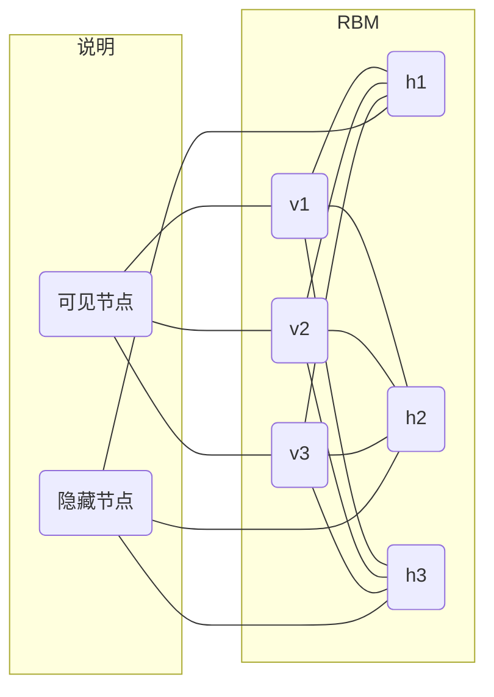
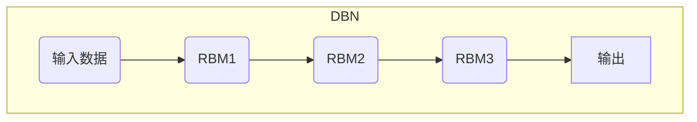

# Python深度学习实践：深度信念网络（DBN）的理论与实践

## 1.背景介绍

### 1.1 深度学习的兴起

近年来，深度学习在多个领域取得了令人瞩目的成就,例如计算机视觉、自然语言处理、语音识别等,它极大地推动了人工智能的发展。与传统的机器学习算法相比,深度学习能够从大量数据中自动学习特征表示,无需人工设计特征,从而在许多任务上取得了更好的性能。

### 1.2 深度信念网络简介  

深度信念网络(Deep Belief Network, DBN)是一种由多层受限玻尔兹曼机(Restricted Boltzmann Machine, RBM)组成的概率生成模型。它由Geoffrey Hinton等人于2006年提出,是较早的深度学习模型之一。DBN通过无监督的贪婪层层训练方式来学习输入数据的概率分布,并可以用于生成式任务和判别式任务。

## 2.核心概念与联系

### 2.1 受限玻尔兹曼机(RBM)

受限玻尔兹曼机是DBN的基础构建块,是一种无向概率图模型。RBM由两层节点组成:一层可见节点(visible units)和一层隐藏节点(hidden units)。可见节点对应于输入数据,而隐藏节点则学习输入数据的隐含特征表示。这两层节点之间存在连接权重,但同一层内的节点之间没有连接。



### 2.2 DBN的层次结构

DBN由多个RBM堆叠而成,形成一个层次结构。第一层RBM的可见节点对应于输入数据,而其隐藏节点则作为下一层RBM的可见节点输入,依次类推。通过这种层层贪婪训练的方式,DBN可以从低层次的特征开始学习,逐步提取更高层次的抽象特征表示。



## 3.核心算法原理具体操作步骤  

### 3.1 DBN的训练过程

DBN的训练分为两个阶段:无监督的预训练和有监督的微调。

1. **无监督预训练**

   在这个阶段,DBN通过贪婪层层训练的方式来学习输入数据的概率分布。具体步骤如下:

   a. 初始化第一层RBM,将输入数据作为可见节点,并使用对比散度(Contrastive Divergence,CD)算法训练该RBM。

   b. 对于后续的每一层RBM,将前一层RBM的隐藏节点激活值作为可见节点输入,并使用CD算法训练当前层的RBM。

   c. 重复步骤b,直到训练完所有层的RBM。

2. **有监督微调**

   在无监督预训练之后,可以根据具体任务对DBN进行有监督微调。常见的方法包括:

   - 对于生成式任务,可以在DBN的顶层添加一个反向RBM,并使用对比散度或其他算法进行联合训练。

   - 对于判别式任务(如分类),可以在DBN的顶层添加一个逻辑回归层或softmax层,并使用反向传播算法进行微调。

### 3.2 对比散度算法

对比散度(Contrastive Divergence, CD)算法是训练RBM的一种广泛使用的方法。它通过对比模型分布与重构分布之间的divergence来更新权重,从而最小化两个分布之间的KL散度。CD算法的具体步骤如下:

1. 初始化RBM的权重参数。

2. 对于每个训练样本:

   a. 计算隐藏节点的条件概率,并基于该概率对隐藏节点进行采样,得到隐藏节点的二值状态。

   b. 重构可见节点,计算可见节点的条件概率,并基于该概率对可见节点进行采样,得到重构的可见节点。

   c. 重复步骤a和b进行k步的吉布斯采样(通常k=1),得到重构的隐藏节点和可见节点。

   d. 更新权重参数,使模型分布与重构分布之间的divergence最小化。

3. 重复步骤2,直到模型收敛或达到最大迭代次数。

CD算法通过有限步骤的吉布斯采样来近似计算梯度,从而避免了精确计算分区函数的困难,大大提高了训练效率。

## 4.数学模型和公式详细讲解举例说明

### 4.1 RBM的能量函数

RBM的联合概率分布可以通过能量函数来定义:

$$P(v, h) = \frac{1}{Z}e^{-E(v, h)}$$

其中,Z是配分函数,用于对概率进行归一化:

$$Z = \sum_{v, h}e^{-E(v, h)}$$

能量函数E(v, h)定义了可见节点v和隐藏节点h的相互作用:

$$E(v, h) = -\sum_{i\in visible}b_iv_i - \sum_{j\in hidden}c_jh_j - \sum_{i, j}v_ih_jw_{ij}$$

这里,b和c分别是可见节点和隐藏节点的偏置项,w是连接权重。

根据能量函数,我们可以得到隐藏节点和可见节点的条件概率:

$$P(h_j=1|v) = \sigma\left(c_j + \sum_iw_{ij}v_i\right)$$
$$P(v_i=1|h) = \sigma\left(b_i + \sum_jw_{ij}h_j\right)$$

其中,σ是sigmoid函数。

### 4.2 对比散度算法更新规则

在对比散度算法中,我们需要更新RBM的权重参数,使模型分布与重构分布之间的divergence最小化。具体的更新规则如下:

$$\Delta w_{ij} = \epsilon\left(\langle v_ih_j\rangle_{data} - \langle v_ih_j\rangle_{recon}\right)$$
$$\Delta b_i = \epsilon\left(\langle v_i\rangle_{data} - \langle v_i\rangle_{recon}\right)$$
$$\Delta c_j = \epsilon\left(\langle h_j\rangle_{data} - \langle h_j\rangle_{recon}\right)$$

其中,ε是学习率,<>data表示在训练数据上的期望,<>recon表示在重构样本上的期望。通过这种方式,我们可以最小化模型分布与重构分布之间的KL散度。

### 4.3 DBN的生成式建模

对于生成式任务,我们可以在DBN的顶层添加一个反向RBM,形成一个无向模型。该模型的联合概率分布为:

$$P(v, h^{(1)}, h^{(2)}, ..., h^{(l)}) = \frac{1}{Z}e^{-E(v, h^{(1)}, h^{(2)}, ..., h^{(l)})}$$

其中,l是DBN的层数,h(i)表示第i层的隐藏节点。能量函数E可以通过各层RBM的能量函数相加得到。

在训练过程中,我们可以使用对比散度算法或其他算法(如持续对比算法)来优化模型参数,使得模型能够很好地捕捉输入数据的概率分布。

## 5.项目实践:代码实例和详细解释说明

以下是使用Python和TensorFlow实现DBN的示例代码,包括RBM和DBN的构建、训练和评估。

### 5.1 RBM实现

```python
import tensorflow as tf

class RBM(object):
    def __init__(self, input_size, hidden_size, learning_rate=0.01):
        self.input_size = input_size
        self.hidden_size = hidden_size
        self.learning_rate = learning_rate

        # 初始化权重和偏置
        self.weights = tf.Variable(tf.random.normal([input_size, hidden_size], stddev=0.1))
        self.visible_bias = tf.Variable(tf.zeros([input_size]))
        self.hidden_bias = tf.Variable(tf.zeros([hidden_size]))

        # 定义模型输入
        self.inputs = tf.compat.v1.placeholder(tf.float32, [None, input_size])

    def sample_hidden(self, visible):
        # 计算隐藏节点的条件概率
        hidden_probs = tf.sigmoid(tf.matmul(visible, self.weights) + self.hidden_bias)
        # 对隐藏节点进行采样
        return tf.nn.relu(tf.sign(hidden_probs - tf.random.uniform(tf.shape(hidden_probs))))

    def sample_visible(self, hidden):
        # 计算可见节点的条件概率
        visible_probs = tf.sigmoid(tf.matmul(hidden, tf.transpose(self.weights)) + self.visible_bias)
        # 对可见节点进行采样
        return tf.nn.relu(tf.sign(visible_probs - tf.random.uniform(tf.shape(visible_probs))))

    def train(self, visible_data, epochs=10, batch_size=128, k=1):
        # 定义训练操作
        with tf.GradientTape() as tape:
            # 正向传播
            hidden = self.sample_hidden(visible_data)
            reconstructed = self.sample_visible(hidden)

            # 进行k步吉布斯采样
            for _ in range(k):
                hidden = self.sample_hidden(reconstructed)
                reconstructed = self.sample_visible(hidden)

            # 计算对比散度
            positive_grad = tf.matmul(tf.transpose(visible_data), hidden)
            negative_grad = tf.matmul(tf.transpose(reconstructed), hidden)
            weights_grad = positive_grad - negative_grad
            visible_bias_grad = tf.reduce_mean(visible_data - reconstructed, axis=0)
            hidden_bias_grad = tf.reduce_mean(hidden - self.sample_hidden(reconstructed), axis=0)

        # 更新权重和偏置
        weights_update = self.weights.assign_add(self.learning_rate * weights_grad / batch_size)
        visible_bias_update = self.visible_bias.assign_add(self.learning_rate * visible_bias_grad / batch_size)
        hidden_bias_update = self.hidden_bias.assign_add(self.learning_rate * hidden_bias_grad / batch_size)

        # 训练循环
        for epoch in range(epochs):
            for batch in self.get_batches(visible_data, batch_size):
                weights_update, visible_bias_update, hidden_bias_update

    def get_batches(self, data, batch_size):
        # 生成批次数据
        ...

```

在上面的代码中,我们定义了RBM类,包含了初始化、采样隐藏节点、采样可见节点和训练等方法。在训练过程中,我们使用对比散度算法来更新权重和偏置。

### 5.2 DBN实现

```python
class DBN(object):
    def __init__(self, sizes, learning_rate=0.01):
        self.sizes = sizes
        self.learning_rate = learning_rate
        self.rbm_layers = []

        # 构建DBN
        for i in range(len(sizes) - 1):
            rbm = RBM(sizes[i], sizes[i + 1], learning_rate)
            self.rbm_layers.append(rbm)

    def pretrain(self, visible_data, epochs=10, batch_size=128):
        # 无监督预训练
        for rbm in self.rbm_layers:
            rbm.train(visible_data, epochs, batch_size)
            visible_data = rbm.sample_hidden(visible_data)

    def finetune(self, labeled_data, epochs=10, batch_size=128):
        # 有监督微调
        ...

    def generate(self, num_samples):
        # 生成样本
        ...

    def classify(self, data):
        # 分类
        ...
```

在上面的代码中,我们定义了DBN类,它由多个RBM层组成。在无监督预训练阶段,我们逐层训练每个RBM,并将前一层的隐藏节点激活值作为下一层的输入。在有监督微调阶段,我们可以根据具体任务添加相应的层(如逻辑回归层或softmax层),并使用反向传播算法进行微调。

## 6.实际应用场景

DBN由于其强大的特征学习能力,在多个领域都有广泛的应用,