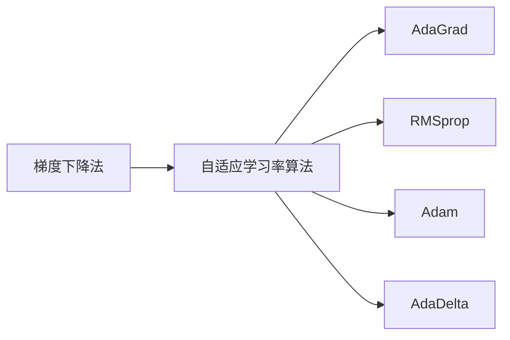

# Python深度学习实践：自适应学习率调整技术

## 1. 背景介绍
### 1.1 深度学习中的学习率
在深度学习模型的训练过程中,学习率(Learning Rate)是一个至关重要的超参数。它决定了每次迭代更新模型参数的步长大小。选择合适的学习率对模型的收敛速度和性能有着重大影响。
### 1.2 学习率调整的必要性  
- 固定学习率的局限性:传统的训练方法通常使用固定的学习率,但这可能导致模型收敛速度慢、容易陷入局部最优等问题。
- 自适应学习率的优势:自适应学习率调整技术能够根据训练过程中的反馈信息动态调整学习率,加速收敛并提升模型性能。

## 2. 核心概念与联系
### 2.1 梯度下降法
梯度下降是深度学习优化算法的基础,通过计算损失函数对参数的梯度,沿着负梯度方向更新参数,使损失函数最小化。学习率决定了每次更新的步长。
### 2.2 自适应学习率算法
自适应学习率算法是一类根据训练过程中的梯度信息自动调整学习率的优化算法。常见的算法包括:
- AdaGrad
- RMSprop 
- Adam
- AdaDelta
### 2.3 算法之间的联系与区别
这些算法的核心思想都是根据历史梯度信息调整学习率,但在具体实现上有所不同:
- AdaGrad根据参数的历史梯度平方和调整学习率
- RMSprop在AdaGrad的基础上引入了梯度平方的滑动平均  
- Adam结合了动量和RMSprop的思想
- AdaDelta不需要设置初始学习率



## 3. 核心算法原理与具体步骤
### 3.1 AdaGrad算法
#### 3.1.1 算法原理
AdaGrad会为每个参数维护一个学习率,根据该参数历史梯度平方和的累积值来调整当前学习率。梯度平方和越大,说明该参数更新越频繁,学习率应该越小。
#### 3.1.2 具体步骤
1. 初始化参数$\theta$和学习率$\alpha$
2. 初始化每个参数的梯度平方和$s=0$ 
3. 在每次迭代中:
   - 计算梯度$g_t=\nabla_{\theta}J(\theta)$
   - 更新梯度平方和$s_t=s_{t-1}+g_t^2$
   - 更新参数$\theta_t=\theta_{t-1}-\frac{\alpha}{\sqrt{s_t+\epsilon}} \cdot g_t$
4. 重复步骤3直到收敛

### 3.2 RMSprop算法
#### 3.2.1 算法原理 
RMSprop在AdaGrad的基础上,使用了梯度平方的滑动平均值来替代累积值,减轻了AdaGrad学习率急剧下降的问题。
#### 3.2.2 具体步骤
1. 初始化参数$\theta$、学习率$\alpha$和衰减率$\rho$
2. 初始化梯度平方的滑动平均值$E[g^2]=0$
3. 在每次迭代中:  
   - 计算梯度$g_t=\nabla_{\theta}J(\theta)$
   - 更新滑动平均值$E[g^2]_t=\rho \cdot E[g^2]_{t-1}+(1-\rho) \cdot g_t^2$
   - 更新参数$\theta_t=\theta_{t-1}-\frac{\alpha}{\sqrt{E[g^2]_t+\epsilon}} \cdot g_t$
4. 重复步骤3直到收敛

### 3.3 Adam算法
#### 3.3.1 算法原理
Adam算法结合了动量和RMSprop的思想,同时维护了梯度的一阶矩(动量)和二阶矩(自适应学习率)的估计值,能够自适应地调整每个参数的学习率。
#### 3.3.2 具体步骤 
1. 初始化参数$\theta$、学习率$\alpha$、一阶矩估计的衰减率$\beta_1$、二阶矩估计的衰减率$\beta_2$
2. 初始化一阶矩$m_0=0$、二阶矩$v_0=0$、时间步$t=0$
3. 在每次迭代中:
   - 计算梯度$g_t=\nabla_{\theta}J(\theta)$ 
   - 更新一阶矩估计$m_t=\beta_1 \cdot m_{t-1}+(1-\beta_1) \cdot g_t$
   - 更新二阶矩估计$v_t=\beta_2 \cdot v_{t-1}+(1-\beta_2) \cdot g_t^2$
   - 修正一阶矩的偏差$\hat{m}_t=\frac{m_t}{1-\beta_1^t}$  
   - 修正二阶矩的偏差$\hat{v}_t=\frac{v_t}{1-\beta_2^t}$
   - 更新参数$\theta_t=\theta_{t-1}-\frac{\alpha}{\sqrt{\hat{v}_t}+\epsilon} \cdot \hat{m}_t$
4. 重复步骤3直到收敛

## 4. 数学模型和公式详细讲解举例说明
### 4.1 AdaGrad的数学模型
AdaGrad算法的参数更新公式为:

$$\theta_{t+1,i}=\theta_{t,i}-\frac{\alpha}{\sqrt{G_{t,ii}+\epsilon}} \cdot g_{t,i}$$

其中,$\theta_{t,i}$表示第$t$次迭代中第$i$个参数的值,$\alpha$为学习率,$g_{t,i}$为损失函数对第$i$个参数的梯度,$G_t \in \mathbb{R}^{d \times d}$是一个对角矩阵,对角线上的元素为每个参数的梯度平方和:

$$G_{t,ii}=\sum_{j=1}^t g_{j,i}^2$$

$\epsilon$是一个小常数,用于数值稳定性。

举例说明:假设我们有两个参数$\theta_1$和$\theta_2$,学习率$\alpha=0.01$,在前三次迭代中它们的梯度分别为:

$$g_{1}=(0.1, 0.2), g_{2}=(0.2, 0.1), g_{3}=(0.1, 0.1)$$

则对应的梯度平方和矩阵$G_t$为:

$$
G_1=\begin{bmatrix}
0.01 & 0\\
0 & 0.04
\end{bmatrix},
G_2=\begin{bmatrix}
0.05 & 0\\  
0 & 0.05
\end{bmatrix},
G_3=\begin{bmatrix}
0.06 & 0\\
0 & 0.06  
\end{bmatrix}
$$

假设初始参数为$\theta_0=(0,0)$,则前三次迭代后的参数为:

$$
\theta_1 \approx (-0.0010, -0.0005)\\
\theta_2 \approx (-0.0024, -0.0015)\\
\theta_3 \approx (-0.0034, -0.0024) 
$$

可以看到,随着迭代次数增加,每个参数的学习率在不断减小。

### 4.2 RMSprop的数学模型
RMSprop算法的参数更新公式为:

$$\theta_{t+1}=\theta_t-\frac{\alpha}{\sqrt{E[g^2]_t+\epsilon}} \cdot g_t$$

其中,$E[g^2]_t$是梯度平方的滑动平均值,更新公式为:

$$E[g^2]_t=\gamma E[g^2]_{t-1}+(1-\gamma)g_t^2$$

$\gamma$是衰减率,控制历史信息的权重。

举例说明:沿用上一个例子的数据,假设$\gamma=0.9$,则滑动平均值$E[g^2]_t$的计算过程为:

$$
E[g^2]_1=(0.01, 0.04)\\
E[g^2]_2=(0.031, 0.031)\\  
E[g^2]_3=(0.0229, 0.0229)
$$

相应地,前三次迭代后的参数为:

$$
\theta_1 \approx (-0.0010, -0.0005)\\
\theta_2 \approx (-0.0026, -0.0018)\\ 
\theta_3 \approx (-0.0040, -0.0031)
$$

可以看到,与AdaGrad相比,RMSprop的学习率下降得更加平缓。

### 4.3 Adam的数学模型
Adam算法的参数更新公式为:

$$\theta_{t+1}=\theta_t-\frac{\alpha}{\sqrt{\hat{v}_t}+\epsilon} \cdot \hat{m}_t$$

其中,$\hat{m}_t$和$\hat{v}_t$分别是梯度一阶矩和二阶矩的修正估计值:

$$
\hat{m}_t=\frac{m_t}{1-\beta_1^t}\\
\hat{v}_t=\frac{v_t}{1-\beta_2^t}
$$

而$m_t$和$v_t$的更新公式为:

$$
m_t=\beta_1 m_{t-1}+(1-\beta_1)g_t\\
v_t=\beta_2 v_{t-1}+(1-\beta_2)g_t^2
$$

$\beta_1$和$\beta_2$是一阶矩和二阶矩的衰减率,通常取值为0.9和0.999。

举例说明:沿用之前的例子,假设$\beta_1=0.9, \beta_2=0.99$,则一阶矩$m_t$和二阶矩$v_t$的计算过程为:

$$
m_1=(0.01, 0.02), v_1=(0.0001, 0.0004)\\
m_2=(0.029, 0.031), v_2=(0.00029, 0.00031)\\
m_3=(0.0361, 0.0391), v_3=(0.000361, 0.000391)  
$$

修正后的估计值为:

$$
\hat{m}_1=(0.0111, 0.0222), \hat{v}_1=(0.0101, 0.0404)\\
\hat{m}_2=(0.0322, 0.0344), \hat{v}_2=(0.0302, 0.0323)\\
\hat{m}_3=(0.0401, 0.0434), \hat{v}_3=(0.0373, 0.0404)
$$

相应地,前三次迭代后的参数为:  

$$
\theta_1 \approx (-0.0011, -0.0005)\\
\theta_2 \approx (-0.0032, -0.0021)\\
\theta_3 \approx (-0.0053, -0.0037)  
$$

可以看到,Adam在早期迭代时学习率较大,后期逐渐减小,兼顾了收敛速度和稳定性。

## 5. 项目实践:代码实例和详细解释说明
下面我们用Python实现这几种自适应学习率算法,并用一个简单的二次函数拟合问题进行测试。

### 5.1 AdaGrad算法的Python实现
```python
def adagrad(grad_fn, init_theta, alpha=0.01, num_iters=100):
    theta = init_theta
    grad_square_sum = np.zeros_like(theta)
    
    thetas = [theta]
    for i in range(num_iters):
        grad = grad_fn(theta)
        grad_square_sum += grad**2
        theta -= alpha * grad / (np.sqrt(grad_square_sum) + 1e-8)
        thetas.append(theta.copy())
        
    return np.array(thetas)
```

其中,`grad_fn`是一个函数,输入参数$\theta$,返回损失函数在$\theta$处的梯度。`init_theta`是初始参数值,`alpha`是初始学习率,`num_iters`是迭代次数。

算法的主要步骤为:
1. 初始化参数`theta`和梯度平方和`grad_square_sum` 
2. 在每次迭代中:
   - 计算梯度`grad`
   - 更新`grad_square_sum`
   - 根据AdaGrad公式更新`theta`
   - 记录当前的`theta`值
3. 返回所有`theta`的记录数组

### 5.2 RMSprop算法的Python实现  
```python
def rmsprop(grad_fn, init_theta, alpha=0.01, gamma=0.9, num_iters=100):
    theta = init_theta
    grad_square_avg = np.zeros_like(theta)
    
    thetas = [theta]
    for i in range(num_iters):
        grad = grad_fn(theta)
        grad_square_avg = gamma * grad_square_avg + (1 - gamma) * grad**2
        theta -= alpha * grad / (np