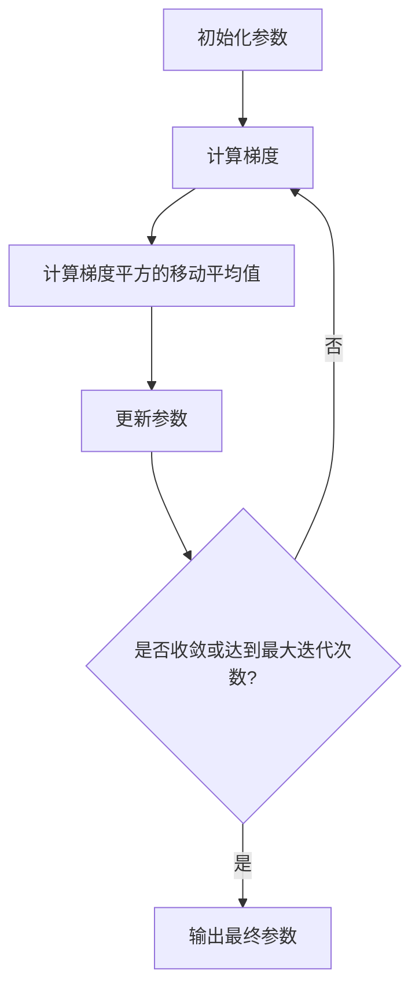

# RMSProp优化器原理与代码实例讲解

## 1.背景介绍

在深度学习和机器学习领域中,优化算法扮演着至关重要的角色。它们用于调整模型的权重和参数,以最小化损失函数并提高模型的性能。传统的优化算法如梯度下降法(Gradient Descent)虽然简单有效,但在处理复杂的非凸优化问题时往往会遇到一些挑战,如陷入鞍点、梯度消失或梯度爆炸等。为了解决这些问题,研究人员提出了各种自适应学习率优化算法,其中RMSProp就是一种广为人知的自适应学习率优化算法。

RMSProp是Geoff Hinton在他的课程上提出的一种无需手动调节学习率的优化算法。它通过对梯度的指数加权移动平均来调节每个参数的学习率,从而加快收敛速度并提高优化效率。RMSProp在处理稀疏梯度、非平稳目标函数等情况下表现出色,被广泛应用于深度神经网络的训练。

## 2.核心概念与联系

### 2.1 梯度下降法回顾

在介绍RMSProp之前,我们先回顾一下梯度下降法的基本原理。梯度下降是一种迭代优化算法,通过沿着目标函数的负梯度方向更新参数,逐步找到函数的最小值。具体来说,在第t次迭代时,参数$\theta$的更新规则为:

$$\theta_{t+1} = \theta_t - \eta \nabla J(\theta_t)$$

其中,$\eta$是学习率(learning rate),决定了每次迭代的步长;$\nabla J(\theta_t)$是目标函数$J$在$\theta_t$处的梯度。

虽然梯度下降法简单有效,但它也存在一些缺陷:

1. 学习率的选择非常重要,过大可能导致发散,过小则收敛速度很慢。
2. 对于不同的参数,使用相同的学习率可能不太合适。
3. 在鞍点或梯度较小的区域,收敛速度会变得非常缓慢。

为了解决这些问题,研究人员提出了各种自适应学习率优化算法,如Adagrad、RMSProp和Adam等。这些算法通过动态调整每个参数的学习率,来加快收敛速度并提高优化效率。

### 2.2 RMSProp算法原理

RMSProp全称是Root Mean Square Propagation,中文可称为均方根传播。它是Adagrad算法的一个改进版本,旨在解决Adagrad算法在后期迭代时学习率衰减过快的问题。

RMSProp的核心思想是:对每个参数的梯度进行指数加权移动平均,并使用该移动平均值调节对应参数的学习率。具体来说,在第t次迭代时,参数$\theta_i$的更新规则为:

$$
\begin{aligned}
E[g_t^2]_i &= \beta E[g_{t-1}^2]_i + (1-\beta)(\nabla J(\theta_t))_i^2\\
\theta_{t+1} &= \theta_t - \frac{\eta}{\sqrt{E[g_t^2]_i + \epsilon}}(\nabla J(\theta_t))_i
\end{aligned}
$$

其中:

- $E[g_t^2]_i$是参数$\theta_i$的梯度平方的指数加权移动平均值,用于估计该参数的未来梯度值。
- $\beta$是衰减率(decay rate),控制了移动平均值的更新速度,通常取值在0.9~0.99之间。
- $\epsilon$是一个很小的正数,用于避免分母为零的情况。
- $\eta$是全局学习率,控制了整体的更新幅度。

可以看出,RMSProp通过对每个参数的梯度进行放缩,从而动态调整了每个参数的学习率。对于梯度较大的参数,学习率会相应变小;而对于梯度较小的参数,学习率会变大。这种自适应机制有助于加快收敛速度,并避免陷入鞍点或梯度较小的区域。

另外,RMSProp还具有以下优点:

1. 不需要手动调节学习率,算法会自动调整每个参数的学习率。
2. 对于稀疏梯度问题有很好的鲁棒性,因为它使用了梯度平方的移动平均值。
3. 计算简单,易于实现和并行化。

### 2.3 RMSProp与其他优化算法的联系

RMSProp算法与其他一些优化算法有一定的联系和区别:

- **Adagrad**:Adagrad是RMSProp的前身,它也使用了梯度平方的累积和来调整学习率。但是,Adagrad在后期迭代时学习率会衰减过快,导致收敛速度变慢。RMSProp通过使用指数加权移动平均值来解决这个问题。
- **Adam**:Adam算法可以看作是RMSProp和动量(Momentum)算法的结合体。它不仅使用了梯度平方的指数加权移动平均值,还引入了一阶动量项,从而进一步提高了优化效率。
- **Nadam**:Nadam是Adam算法的一个变体,它在Adam的基础上加入了Nesterov加速梯度,以期获得更快的收敛速度。

总的来说,RMSProp算法相对简单,计算开销较小,在处理稀疏梯度和非平稳目标函数时表现良好。它为后来的Adam和Nadam等算法奠定了基础,在深度学习领域得到了广泛应用。

## 3.核心算法原理具体操作步骤

RMSProp算法的核心思想是对每个参数的梯度进行指数加权移动平均,并使用该移动平均值调节对应参数的学习率。具体的操作步骤如下:

1. **初始化参数**:首先,我们需要初始化模型的参数$\theta$,通常使用一些随机值。

2. **计算梯度**:对于当前的参数$\theta_t$,我们计算目标函数$J$在该点处的梯度$\nabla J(\theta_t)$。

3. **计算梯度平方的指数加权移动平均值**:对于每个参数$\theta_i$,我们计算其梯度平方的指数加权移动平均值$E[g_t^2]_i$:

$$E[g_t^2]_i = \beta E[g_{t-1}^2]_i + (1-\beta)(\nabla J(\theta_t))_i^2$$

其中,$\beta$是衰减率,控制了移动平均值的更新速度。通常取值在0.9~0.99之间。

4. **更新参数**:使用计算出的梯度平方的移动平均值$E[g_t^2]_i$来调节每个参数$\theta_i$的学习率,并更新参数:

$$\theta_{t+1} = \theta_t - \frac{\eta}{\sqrt{E[g_t^2]_i + \epsilon}}(\nabla J(\theta_t))_i$$

其中,$\eta$是全局学习率,控制了整体的更新幅度;$\epsilon$是一个很小的正数,用于避免分母为零的情况。

5. **重复迭代**:重复步骤2~4,直到达到收敛条件或达到最大迭代次数。

需要注意的是,在实际实现中,我们通常会对小批量数据(mini-batch)进行梯度计算和参数更新,而不是对整个数据集。这样可以提高计算效率并减少内存占用。

RMSProp算法的流程可以用以下Mermaid流程图来表示:

通过上述步骤,RMSProp算法可以自适应地调整每个参数的学习率,从而加快收敛速度并提高优化效率。在下一节中,我们将详细讨论RMSProp算法的数学模型和公式推导。

## 4.数学模型和公式详细讲解举例说明

在这一节中,我们将详细推导RMSProp算法的数学模型和公式,并通过一个具体的例子来说明其计算过程。

### 4.1 RMSProp算法的数学模型

RMSProp算法的核心思想是对每个参数的梯度进行指数加权移动平均,并使用该移动平均值调节对应参数的学习率。具体来说,在第t次迭代时,参数$\theta_i$的更新规则为:

$$
\begin{aligned}
E[g_t^2]_i &= \beta E[g_{t-1}^2]_i + (1-\beta)(\nabla J(\theta_t))_i^2\\
\theta_{t+1} &= \theta_t - \frac{\eta}{\sqrt{E[g_t^2]_i + \epsilon}}(\nabla J(\theta_t))_i
\end{aligned}
$$

其中:

- $E[g_t^2]_i$是参数$\theta_i$的梯度平方的指数加权移动平均值,用于估计该参数的未来梯度值。
- $\beta$是衰减率(decay rate),控制了移动平均值的更新速度,通常取值在0.9~0.99之间。
- $\epsilon$是一个很小的正数,用于避免分母为零的情况。
- $\eta$是全局学习率,控制了整体的更新幅度。

我们可以将上述公式进一步展开,得到:

$$
\begin{aligned}
E[g_t^2]_i &= \beta E[g_{t-1}^2]_i + (1-\beta)(\nabla J(\theta_t))_i^2\\
           &= \beta(\beta E[g_{t-2}^2]_i + (1-\beta)(\nabla J(\theta_{t-1}))_i^2) + (1-\beta)(\nabla J(\theta_t))_i^2\\
           &= \beta^2 E[g_{t-2}^2]_i + (1-\beta)\beta(\nabla J(\theta_{t-1}))_i^2 + (1-\beta)(\nabla J(\theta_t))_i^2\\
           &= \cdots\\
           &= (1-\beta)\sum_{k=0}^{t}\beta^k(\nabla J(\theta_{t-k}))_i^2
\end{aligned}
$$

可以看出,RMSProp算法实际上是对梯度平方进行了指数加权移动平均,其中较新的梯度平方被赋予了更大的权重。这种机制可以使算法对较新的梯度更加敏感,从而更好地适应目标函数的变化。

另一方面,通过将梯度平方的移动平均值$E[g_t^2]_i$作为分母,RMSProp算法实现了对每个参数的自适应学习率调节。具体来说:

- 对于梯度较大的参数,其$E[g_t^2]_i$值也会较大,从而使得该参数的学习率变小,避免了过大的更新幅度。
- 对于梯度较小的参数,其$E[g_t^2]_i$值也会较小,从而使得该参数的学习率变大,加快了收敛速度。

通过这种自适应机制,RMSProp算法可以加快收敛速度,并避免陷入鞍点或梯度较小的区域。

### 4.2 RMSProp算法的计算示例

为了更好地理解RMSProp算法的计算过程,我们给出一个具体的示例。假设我们有一个简单的线性回归模型,目标函数为:

$$J(\theta) = \frac{1}{2}\sum_{i=1}^{n}(y_i - \theta x_i)^2$$

其中,$\theta$是模型的参数,$(x_i, y_i)$是训练数据。我们使用RMSProp算法来优化参数$\theta$。

假设初始参数$\theta_0 = 1.0$,全局学习率$\eta = 0.1$,衰减率$\beta = 0.9$,平滑常数$\epsilon = 10^{-8}$。我们将对前5个训练样本进行优化,其中$(x_1, y_1) = (1, 2)$,$(x_2, y_2) = (2, 3)$,$(x_3, y_3) = (3, 4)$,$(x_4, y_4) = (4, 5)$,$(x_5, y_5) = (5, 6)$。

第0次迭代时,我们初始化$E[g_0^2] = 0$。

第1次迭代:

$$
\begin{aligned}
\nabla J(\theta_0) &= \sum_{i=