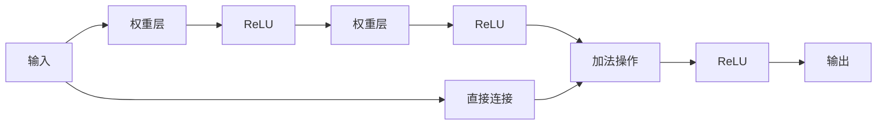

## 1.背景介绍

在深度学习的世界里，深度神经网络的深度是一个关键的因素。然而，随着网络深度的增加，神经网络的训练变得越来越困难。这是因为深度神经网络在训练过程中会遇到梯度消失和梯度爆炸的问题。为了解决这个问题，微软研究院的Kaiming He等人在2015年提出了ResNet，即残差网络（Residual Network）。ResNet通过引入残差模块，成功地训练了一个深度达到152层的神经网络，并在ImageNet图像分类任务上取得了当时最好的结果。

## 2.核心概念与联系

ResNet的主要思想是：如果一个较浅的网络可以达到较好的性能，那么在这个网络的基础上增加更多的层，性能应该至少不会下降。为了实现这一目标，ResNet引入了一个新的结构，称为残差模块。残差模块的主要思想是学习输入和输出之间的残差映射，而不是直接学习输入和输出之间的映射。这样，当增加更多的层时，网络只需要学习新增层对最终结果的改变，即残差，而不是重新学习整个映射。



## 3.核心算法原理具体操作步骤

在ResNet中，每个残差模块由两个或更多的卷积层组成，每个卷积层后面都跟随一个Batch Normalization层和ReLU激活函数。在这些卷积层的输入和输出之间，有一个直接连接（shortcut connection），也就是恒等映射。这个直接连接将输入直接添加到卷积层的输出上，形成了最终的输出。这就是残差模块的基本结构。

在训练过程中，每个残差模块试图学习输入和输出之间的残差映射。如果新增的层能够提供有用的信息，那么网络可以学习到这些信息，并将其添加到原始输入上；如果新增的层没有提供有用的信息，那么网络可以将这些层的权重设置为0，使得新增的层不对最终结果产生影响。这样，无论增加多少层，网络的性能都不会下降。

## 4.数学模型和公式详细讲解举例说明

在ResNet中，每个残差模块的输出可以用下面的公式表示：

$$
y = F(x, {W_i}) + x
$$

其中，$x$是输入，$y$是输出，$F(x, {W_i})$是残差映射，${W_i}$是残差模块中的权重。

这个公式表明，残差模块的输出是输入和残差映射的和。这就是ResNet的基本原理。通过这种方式，ResNet可以将输入直接传递到输出，从而避免了梯度消失和梯度爆炸的问题。

## 5.项目实践：代码实例和详细解释说明

下面是一个使用PyTorch实现的ResNet的代码示例。这个示例展示了如何定义一个残差模块，并将这些模块堆叠起来形成一个ResNet。

```python
import torch
import torch.nn as nn

# 定义残差模块
class ResidualBlock(nn.Module):
    def __init__(self, in_channels, out_channels, stride=1):
        super(ResidualBlock, self).__init__()
        self.conv1 = nn.Conv2d(in_channels, out_channels, kernel_size=3, stride=stride, padding=1, bias=False)
        self.bn1 = nn.BatchNorm2d(out_channels)
        self.relu = nn.ReLU(inplace=True)
        self.conv2 = nn.Conv2d(out_channels, out_channels, kernel_size=3, stride=1, padding=1, bias=False)
        self.bn2 = nn.BatchNorm2d(out_channels)
        if stride != 1 or in_channels != out_channels:
            self.shortcut = nn.Sequential(
                nn.Conv2d(in_channels, out_channels, kernel_size=1, stride=stride, bias=False),
                nn.BatchNorm2d(out_channels)
            )
        else:
            self.shortcut = nn.Sequential()

    def forward(self, x):
        out = self.relu(self.bn1(self.conv1(x)))
        out = self.bn2(self.conv2(out))
        out += self.shortcut(x)
        out = self.relu(out)
        return out

# 定义ResNet
class ResNet(nn.Module):
    def __init__(self, block, num_blocks, num_classes=10):
        super(ResNet, self).__init__()
        self.in_channels = 64
        self.conv1 = nn.Conv2d(3, 64, kernel_size=3, stride=1, padding=1, bias=False)
        self.bn1 = nn.BatchNorm2d(64)
        self.relu = nn.ReLU(inplace=True)
        self.layer1 = self._make_layer(block, 64, num_blocks[0], stride=1)
        self.layer2 = self._make_layer(block, 128, num_blocks[1], stride=2)
        self.layer3 = self._make_layer(block, 256, num_blocks[2], stride=2)
        self.layer4 = self._make_layer(block, 512, num_blocks[3], stride=2)
        self.avg_pool = nn.AdaptiveAvgPool2d((1, 1))
        self.fc = nn.Linear(512, num_classes)

    def _make_layer(self, block, out_channels, num_blocks, stride):
        strides = [stride] + [1] * (num_blocks - 1)
        layers = []
        for stride in strides:
            layers.append(block(self.in_channels, out_channels, stride))
            self.in_channels = out_channels
        return nn.Sequential(*layers)

    def forward(self, x):
        out = self.relu(self.bn1(self.conv1(x)))
        out = self.layer1(out)
        out = self.layer2(out)
        out = self.layer3(out)
        out = self.layer4(out)
        out = self.avg_pool(out)
        out = out.view(out.size(0), -1)
        out = self.fc(out)
        return out
```

## 6.实际应用场景

ResNet由于其深度和精度，被广泛应用于各种深度学习任务中，包括图像分类、物体检测、语义分割等。例如，在ImageNet图像分类任务中，ResNet取得了当时最好的结果。在COCO物体检测任务中，ResNet也表现出色。此外，ResNet还被用于人脸识别、视频分析等任务。

## 7.工具和资源推荐

如果你想要深入学习和实践ResNet，以下是一些推荐的工具和资源：

- PyTorch：一个强大的深度学习框架，提供了丰富的API和良好的文档。
- TensorFlow：另一个强大的深度学习框架，由Google开发，有大量的教程和案例。
- Keras：一个基于Python的深度学习库，可以作为TensorFlow的高级API，易于使用。
- ImageNet：一个大规模图像数据库，用于训练和测试深度神经网络。
- COCO：一个大规模物体检测、分割和字幕数据集。

## 8.总结：未来发展趋势与挑战

ResNet的提出，成功解决了深度神经网络训练难的问题，使得神经网络的深度可以达到之前无法想象的程度。然而，随着深度神经网络的深度越来越深，训练的复杂性和计算量也在增加。如何有效地训练更深的神经网络，是未来深度学习需要面临的一个挑战。

此外，虽然ResNet在各种任务上都取得了优秀的结果，但其原理仍然不是完全清楚。为什么ResNet可以有效地训练深度神经网络？残差模块的设计有什么深层的原理？这些问题的研究，将有助于我们更深入地理解深度学习，也是未来深度学习的一个重要研究方向。

## 9.附录：常见问题与解答

1. 问题：ResNet的深度可以无限增加吗？

答：理论上，ResNet的深度可以无限增加。然而，实际上，随着深度的增加，训练的复杂性和计算量也在增加。此外，过深的网络可能会导致过拟合问题。因此，在实际应用中，需要根据具体任务和数据，选择合适的网络深度。

2. 问题：ResNet有什么缺点？

答：ResNet的主要缺点是其复杂性和计算量较大，尤其是对于深度较大的ResNet。此外，虽然ResNet可以有效地训练深度神经网络，但其原理仍然不是完全清楚。

3. 问题：我可以在自己的项目中使用ResNet吗？

答：当然可以。ResNet是一个通用的深度神经网络结构，可以应用于各种深度学习任务。只要你的任务适合使用深度神经网络，你就可以尝试使用ResNet。

作者：禅与计算机程序设计艺术 / Zen and the Art of Computer Programming