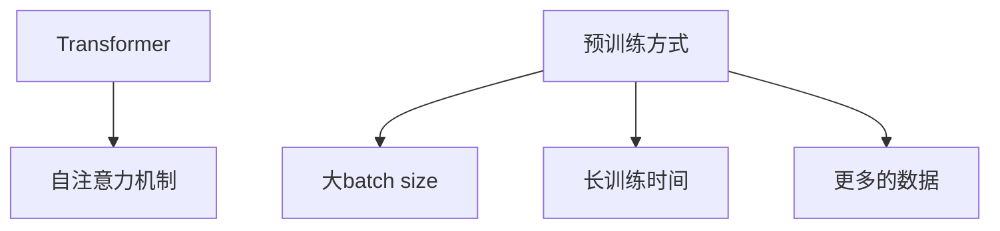

## 1.背景介绍

RoBERTa，全称为Robustly Optimized BERT Pretraining Approach，是由Facebook AI在2019年提出的一种改进版的BERT模型。RoBERTa模型在许多自然语言处理(NLP)任务上都取得了显著的效果，包括情感分析、文本分类、命名实体识别等。本文将深入探讨RoBERTa模型的原理，并通过代码实例进行详细的讲解。

## 2.核心概念与联系

RoBERTa模型的核心是基于Transformer的自注意力机制，它能够捕捉到文本中的长距离依赖关系。RoBERTa模型的另一个关键特性是其预训练方式，它使用了更大的batch size，更长的训练时间以及更多的数据，以此来提高模型的性能。



## 3.核心算法原理具体操作步骤

RoBERTa模型的训练过程包括两个步骤：预训练和微调。在预训练阶段，RoBERTa模型通过大量的无标签文本数据进行学习，得到每个单词的向量表示。在微调阶段，模型通过具体的NLP任务（如情感分析、文本分类等）进行训练，以此来适应具体的任务需求。

## 4.数学模型和公式详细讲解举例说明

RoBERTa模型的核心是基于Transformer的自注意力机制。其数学表达如下：

自注意力机制可以表示为：

$$
Attention(Q, K, V) = softmax(\frac{QK^T}{\sqrt{d_k}})V
$$

其中，$Q$, $K$ 和 $V$ 分别是查询（query）、键（key）和值（value）。$d_k$ 是键的维度。

## 5.项目实践：代码实例和详细解释说明

下面是一个使用PyTorch和Transformers库进行RoBERTa模型训练的代码示例：

```python
from transformers import RobertaTokenizer, RobertaForSequenceClassification
import torch

tokenizer = RobertaTokenizer.from_pretrained('roberta-base')
model = RobertaForSequenceClassification.from_pretrained('roberta-base')

inputs = tokenizer("Hello, my dog is cute", return_tensors="pt")
labels = torch.tensor([1]).unsqueeze(0)  # Batch size 1
outputs = model(**inputs, labels=labels)

loss = outputs.loss
logits = outputs.logits
```

## 6.实际应用场景

RoBERTa模型广泛应用于各种NLP任务，包括但不限于：

- 文本分类：例如新闻分类、商品评论分类等。
- 情感分析：例如电影评论的情感分析、社交媒体上的情绪监测等。
- 命名实体识别：例如从文本中识别出人名、地名、机构名等。

## 7.工具和资源推荐

- [Transformers](https://github.com/huggingface/transformers)：一个开源的深度学习模型库，包含了大量的预训练模型，如BERT、RoBERTa等。
- [PyTorch](https://pytorch.org/)：一个开源的深度学习框架，提供了丰富的API和工具，方便进行深度学习模型的训练和部署。

## 8.总结：未来发展趋势与挑战

RoBERTa模型作为一种强大的NLP模型，其在各种任务上的表现都非常优秀。然而，RoBERTa模型的训练需要大量的计算资源和时间，这对于一些资源有限的研究者来说，可能是一个挑战。未来的发展趋势可能会更加注重模型的效率和可扩展性，以适应更大规模的数据和更复杂的任务。

## 9.附录：常见问题与解答

- Q: RoBERTa模型的训练需要多长时间？
- A: 这取决于许多因素，包括你的硬件配置、训练数据的大小、模型的复杂度等。一般来说，RoBERTa模型的训练可能需要几天到几周的时间。

- Q: RoBERTa模型适用于哪些NLP任务？
- A: RoBERTa模型适用于各种NLP任务，包括文本分类、情感分析、命名实体识别等。

作者：禅与计算机程序设计艺术 / Zen and the Art of Computer Programming