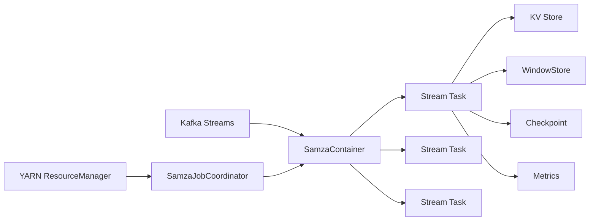

# Samza KV Store原理与代码实例讲解

## 1. 背景介绍

### 1.1 Samza简介

Samza是一个由LinkedIn和Apache软件基金会共同开发的分布式流处理框架。它建立在Apache Kafka和Apache Hadoop YARN之上,旨在提供一个高性能、可伸缩、容错的实时流处理平台。

### 1.2 Samza的主要特性

- 支持高吞吐、低延迟的流处理
- 保证exactly-once语义
- 支持有状态计算
- 与YARN无缝集成,支持动态资源分配
- 支持多语言API(Java、Scala等)
- 插件化、可扩展的架构

### 1.3 Samza在实际生产中的应用

Samza目前已经在LinkedIn、Uber、Netflix等多家大型互联网公司的生产环境中广泛应用。主要应用场景包括:

- 实时数据分析 
- 实时异常检测
- 实时推荐系统
- 实时ETL
- 消息转换与路由

## 2. 核心概念与联系

### 2.1 Samza的核心概念

- StreamTask:流处理任务的基本单元
- SystemStream:输入输出流
- KV Store:本地状态存储
- Checkpoint:任务状态的持久化存储点
- WindowStore:基于时间窗口的状态存储
- Metrics:系统和任务的度量指标

### 2.2 Samza架构与组件之间的关系



Samza的核心组件包括:

- Kafka:提供输入和输出流
- SamzaContainer:StreamTask的运行环境,负责管理Task的生命周期
- StreamTask:流处理的基本单元,执行计算逻辑
- KV Store:为Task提供本地状态存储
- Checkpoint:周期性地将任务状态持久化,用于容错恢复
- YARN ResourceManager:负责资源管理和任务调度
- SamzaJobCoordinator:负责与YARN RM交互,管理SamzaContainer

## 3. 核心算法原理与操作步骤

### 3.1 Samza的并行模型

Samza采用基于分区的并行模型。输入流被划分为多个分区,每个分区由一个StreamTask独立处理。不同分区的数据可以并行处理,但单个分区内的数据是按序处理的。

### 3.2 Samza的状态管理与容错机制

#### 本地状态存储
Samza为每个Task提供一个本地的Key-Value存储,称为KV Store。KV Store采用RocksDB作为底层存储引擎,支持快速的读写访问。

#### 状态的Checkpoint
为了能够从失败中恢复,Samza周期性地将任务的状态持久化到Checkpoint。当Task失败重启时,可以从最近的Checkpoint恢复状态。

Checkpoint的主要步骤包括:

1. 遍历所有的KV Store,将数据序列化并写入Checkpoint文件
2. 记录当前Checkpoint的Offset
3. 将Checkpoint文件上传到可靠存储(如HDFS)
4. 更新Checkpoint元数据

#### 任务的重新分配与状态恢复
当StreamTask失败时,Samza会自动在另一个Container中重新启动该Task。重启时会执行状态恢复:

1. 从Checkpoint元数据中获取最近的Checkpoint文件
2. 下载Checkpoint文件并反序列化
3. 重建KV Store
4. 从Checkpoint的Offset开始消费输入流

通过本地状态存储和Checkpoint机制,Samza可以提供exactly-once的处理语义,并实现快速的故障恢复。

## 4. 数学模型与公式详解

### 4.1 Samza的Watermark机制

Watermark是Samza中用于处理乱序事件的机制。它定义了一个时间点,代表在这个时间点之前的所有事件都已经到达。

假设我们的输入流中包含一个时间戳字段`eventTime`,系统时间为`t`,Watermark可以定义为:

$$Watermark(t) = max(eventTime_i) - maxDelay, \quad i \in [0, t]$$

其中`maxDelay`是事件的最大延迟时间。

举个例子,假设`t=10`,已经到达的事件的时间戳为`[1, 3, 2, 9, 7, 5]`,`maxDelay=2`,则:

$$Watermark(10) = max(1, 3, 2, 9, 7, 5) - 2 = 7$$

这意味着,在系统时间`t=10`时,时间戳小于等于7的事件都已经到达。

### 4.2 基于Watermark的窗口计算

有了Watermark,我们就可以在乱序事件流上定义滑动窗口,并进行窗口计算。假设窗口的长度为`windowSize`,滑动步长为`slideInterval`,则第n个窗口可以表示为:

$$window_n = [n * slideInterval, n * slideInterval + windowSize)$$

对于每个到达的事件`e`,我们判断其时间戳`eventTime`落在哪个窗口内:

$$n = \lfloor \frac{eventTime}{slideInterval} \rfloor$$

然后将事件添加到对应的窗口`window_n`中进行计算。

当Watermark到达时,我们可以判断哪些窗口已经完成,可以输出计算结果了。对于第n个窗口`window_n`,如果:

$$Watermark(t) \ge n * slideInterval + windowSize$$

则表示`window_n`已经完成,可以输出结果并清理状态了。

## 5. 项目实践:代码实例与详解

下面我们通过一个简单的单词计数的例子,来演示如何使用Samza进行流处理。完整代码可以参见:[samza-hello-samza](https://github.com/apache/samza-hello-samza)

### 5.1 定义流与任务

首先我们需要定义输入输出流以及StreamTask:

```java
public class WordCountTask implements StreamTask, InitableTask, WindowableTask {

  private static final SystemStream OUTPUT_STREAM = new SystemStream("kafka", "word-count-output");

  private int totalWords = 0;

  @Override
  public void init(Config config, TaskContext context) {
    context.registerInputStream(new SystemStream("kafka", "word-count-input"), new StringSerde(), new StringSerde());
    context.registerOutputStream(OUTPUT_STREAM, new StringSerde(), new JsonSerdeV2<>(WordCount.class));
  }

  @Override
  public void process(IncomingMessageEnvelope envelope, MessageCollector collector, TaskCoordinator coordinator) {
    String[] words = envelope.getMessage().split(" ");
    totalWords += words.length;

    for (String word : words) {
      collector.send(new OutgoingMessageEnvelope(OUTPUT_STREAM, word, new WordCount(word, 1)));
    }
  }

  @Override
  public void window(MessageCollector collector, TaskCoordinator coordinator) {
    collector.send(new OutgoingMessageEnvelope(OUTPUT_STREAM, "total", new WordCount("total", totalWords)));
  }
}
```

在`init`方法中,我们注册了一个`SystemStream`作为输入,一个作为输出。

在`process`方法中,我们对每个输入的句子进行分词,并对每个单词输出一个`WordCount`消息。

在`window`方法中,我们输出单词总数。

### 5.2 定义KV Store

接下来我们定义一个KV Store来存储单词的计数:

```java
public class WordCountStore implements KeyValueStore<String, Integer> {

  private static final String STORE_NAME = "word-count-store";

  private KeyValueStore<String, Integer> store;

  public WordCountStore(KeyValueStoreProvider storeProvider) {
    this.store = storeProvider.getKVStore(STORE_NAME, String.class, Integer.class);
  }

  @Override
  public Integer get(String key) {
    return store.get(key);
  }

  @Override
  public void put(String key, Integer value) {
    store.put(key, value);
  }

  @Override
  public void putAll(List<Entry<String, Integer>> entries) {
    store.putAll(entries);
  }

  @Override
  public void delete(String key) {
    store.delete(key);
  }
}
```

### 5.3 在StreamTask中使用KV Store

现在我们可以在`WordCountTask`中使用`WordCountStore`来维护单词的计数了:

```java
public class WordCountTask implements StreamTask, InitableTask, WindowableTask {

  private WordCountStore store;

  @Override
  public void init(Config config, TaskContext context) {
    //...
    this.store = new WordCountStore(context.getKeyValueStoreProvider());
  }

  @Override
  public void process(IncomingMessageEnvelope envelope, MessageCollector collector, TaskCoordinator coordinator) {
    String[] words = envelope.getMessage().split(" ");

    for (String word : words) {
      Integer count = store.get(word);
      if (count == null) {
        count = 0;
      }
      count++;
      store.put(word, count);
      collector.send(new OutgoingMessageEnvelope(OUTPUT_STREAM, word, new WordCount(word, count)));
    }
  }

  @Override
  public void window(MessageCollector collector, TaskCoordinator coordinator) {
    int totalWords = 0;
    try (KeyValueIterator<String, Integer> iter = store.all()) {
      while (iter.hasNext()) {
        Entry<String, Integer> entry = iter.next();
        totalWords += entry.getValue();
      }
    }
    collector.send(new OutgoingMessageEnvelope(OUTPUT_STREAM, "total", new WordCount("total", totalWords)));
  }
}
```

在`process`方法中,我们从KV Store中获取单词的计数、加一然后写回。

在`window`方法中,我们遍历KV Store,统计单词总数。

### 5.4 任务配置与提交

最后,我们需要配置并提交Samza任务:

```java
public class WordCountApp implements StreamApplication {

  @Override
  public void init(StreamGraph graph, Config config) {
    graph.setDefaultSerde(new StringSerde());

    MessageStream<String> inputStream = graph.getInputStream("kafka", "word-count-input", (KVSerde<String, String>) null);
    OutputStream<String, WordCount> outputStream = graph.getOutputStream("kafka", "word-count-output", new StringSerde(), new JsonSerdeV2<>(WordCount.class));

    inputStream
        .map(msg -> msg.split(" "))
        .flatMap(Arrays::stream)
        .window(Windows.keyedTumblingWindow(
            w -> w,
            Duration.ofSeconds(10),
            () -> 0,
            (m, c) -> c + 1,
            null,
            null), "count")
        .map(WordCount::new)
        .sendTo(outputStream);
  }
}
```

这里我们使用了Samza的高阶API来定义计算逻辑。我们先将输入流按空格切分成单词流,然后应用一个10秒的滚动窗口进行计数,最后将结果输出。

提交任务:

```bash
./bin/run-app.sh --config-factory=org.apache.samza.config.factories.PropertiesConfigFactory --config-path=file://$PWD/deploy/samza/config/word-count-app.properties
```

至此,我们就完成了一个完整的单词计数的Samza应用。

## 6. 实际应用场景

Samza KV Store在实际生产中有非常广泛的应用,下面列举几个典型场景:

### 6.1 用户行为分析

在电商、社交等领域,我们经常需要对用户的行为数据进行实时分析。例如统计用户的浏览历史、购买历史等。

我们可以将用户行为事件作为输入流,然后用KV Store来存储用户的行为历史。当新的事件到达时,我们可以从KV Store中读取该用户的历史行为,进行累加更新,然后触发相应的分析计算。

### 6.2 异常检测

在金融、IoT等领域,我们需要对实时数据进行异常检测和风险预警。

我们可以用KV Store来存储每个监控对象的历史状态和统计指标。当新的事件到达时,我们判断其是否超出正常范围,如果连续多次异常,就可以触发报警。

### 6.3 流式 ETL

在数据仓库和数据湖的建设中,我们通常需要对源数据进行清洗、转换和聚合,然后再导入到目标存储中。

使用Samza,我们可以将ETL的各个步骤串联成一个流式管道。其中转换和聚合阶段就大量使用了KV Store来存储中间状态。

例如,我们需要将原始的点击日志聚合成会话,并提取出关键字段。我们可以用KV Store来存储每个会话的状态,当新的点击到达时,我们从KV Store中读取会话状态,更新会话的时长、点击次数等指标,并将关键字段写入下一阶段的流中。

## 7. 工具与资源推荐

### 官方资源

- [Samza官网](http://samza.apache.org/)
- [Samza Github仓库](https://github.com/apache/sam