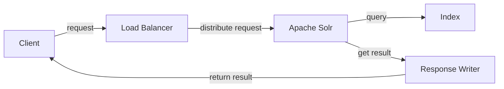

## 1.背景介绍

Apache Solr是一款开源的、基于Lucene的全文搜索服务器。Solr不仅具有丰富的查询语言、高性能、强大的索引能力，还具有高度可扩展性和容错能力。Solr支持通过HTTP进行富文档（如Word、PDF）的索引、并提供XML/JSON API。其主要的特性包括：分布式搜索、索引复制、负载均衡、自动故障转移等。

## 2.核心概念与联系

Solr的核心概念主要包括以下几个部分：

- Document：文档，是搜索的基本单位，每个文档都有一系列的Field。
- Field：字段，每个字段都有名称和类型。
- Schema：定义了Field的属性，包括字段名称、字段类型、是否存储、是否索引等。
- Index：索引，Solr中的数据存储和搜索都是基于索引的。
- Core：核心，一个Solr实例可以有多个Core，每个Core有自己的配置文件和索引。
- Collection：集合，SolrCloud模式下的核心概念，一个集合可以有多个Shard，每个Shard可以有多个Replica。

下面是Solr的基本架构图：



## 3.核心算法原理具体操作步骤

Solr的搜索过程可以概括为以下几个步骤：

1. 用户发送搜索请求到Solr服务器。
2. Solr服务器解析请求，将查询字符串转换为查询对象。
3. 查询对象在索引中进行搜索，得到匹配的文档列表。
4. 对文档列表进行排序，生成搜索结果。
5. 将搜索结果返回给用户。

## 4.数学模型和公式详细讲解举例说明

在Solr中，搜索结果的相关性评分是通过TF-IDF模型进行计算的。TF-IDF模型由两部分组成：词频（Term Frequency，TF）和逆文档频率（Inverse Document Frequency，IDF）。

词频TF表示在一个文档中，一个词出现的次数。公式如下：

$$ TF = \frac{词在文档中出现的次数}{文档的总词数} $$

逆文档频率IDF表示一个词的普遍重要性。如果一个词在很多文档中都出现，那么它的IDF值就会低。公式如下：

$$ IDF = log \left( \frac{总文档数}{包含该词的文档数 + 1} \right) $$

最后，一个词的相关性评分为TF和IDF的乘积：

$$ Score = TF \times IDF $$

## 5.项目实践：代码实例和详细解释说明

以下是一个使用SolrJ进行搜索的简单示例：

```java
import org.apache.solr.client.solrj.SolrQuery;
import org.apache.solr.client.solrj.impl.HttpSolrClient;
import org.apache.solr.client.solrj.response.QueryResponse;

public class SolrJSearcher {
    public static void main(String[] args) throws Exception {
        String urlString = "http://localhost:8983/solr/my_core";
        HttpSolrClient solr = new HttpSolrClient.Builder(urlString).build();

        SolrQuery query = new SolrQuery();
        query.setQuery("apple");
        QueryResponse response = solr.query(query);

        List<MyBean> beans = response.getBeans(MyBean.class);
        for (MyBean bean : beans) {
            System.out.println(bean);
        }
    }
}
```

## 6.实际应用场景

Solr被广泛应用于各种场景，例如：

- 电商网站的商品搜索：用户可以通过关键词搜索商品，还可以进行价格、品牌等多条件筛选。
- 文章检索系统：用户可以全文搜索文章，还可以通过作者、发布日期等条件进行检索。
- 日志分析：通过Solr可以对大量的日志数据进行快速检索和分析。

## 7.工具和资源推荐

- Apache Solr官方网站：提供最新的Solr下载和文档。
- Solr in Action：一本详细介绍Solr的书籍，适合初学者和进阶者。
- SolrJ：Solr的Java客户端，提供了丰富的API进行搜索和索引。

## 8.总结：未来发展趋势与挑战

随着数据量的增长，全文搜索的需求也越来越大。Solr作为一款成熟的搜索服务器，其在未来还有很大的发展空间。但同时，Solr也面临着一些挑战，例如如何处理实时数据的搜索，如何提高搜索的相关性等。

## 9.附录：常见问题与解答

1. 问题：如何提高Solr的搜索速度？
   答：可以通过以下方法提高搜索速度：增加硬件资源、优化索引、使用缓存、调整查询参数等。

2. 问题：Solr支持中文分词吗？
   答：是的，Solr支持中文分词，可以使用IK Analyzer等分词器。

3. 问题：Solr和Elasticsearch有什么区别？
   答：Solr和Elasticsearch都是优秀的搜索服务器，但在一些方面有所不同。例如，Solr更适合做文档搜索，而Elasticsearch更适合做日志分析。

作者：禅与计算机程序设计艺术 / Zen and the Art of Computer Programming