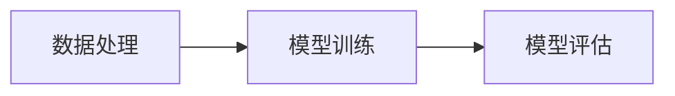

## 1.背景介绍

Apache Spark是一个快速、通用的大数据处理引擎，其内置的MLlib库为大规模机器学习提供了丰富的工具。MLlib包含了常用的机器学习算法和工具，如分类、回归、聚类、协同过滤，以及模型评估和数据导入等。本文将对Spark MLlib的主要特性进行深入探讨，并通过实例讲解其在机器学习项目中的应用。

## 2.核心概念与联系

Spark MLlib的核心构成包括如下几个部分：

### 2.1 数据处理

MLlib支持多种数据格式的输入和输出，包括CSV、JSON、Parquet、LibSVM等。同时，MLlib提供了丰富的数据转换操作，如特征提取、转换和选择，以及处理缺失值、分类数据和连续数据等。

### 2.2 算法

MLlib包含了大量常用的机器学习算法，包括分类、回归、聚类、协同过滤等。这些算法都经过优化，可以在大规模数据上进行高效的计算。

### 2.3 实用工具

MLlib还提供了一些实用工具，如模型选择和调优工具，以及用于模型评估的指标。

### 2.4 流程图

在MLlib中，一个机器学习项目通常包括数据处理、模型训练和模型评估三个阶段。以下是这个过程的Mermaid流程图：



## 3.核心算法原理具体操作步骤

以MLlib中的线性回归算法为例，其具体操作步骤如下：

1. 数据读取：使用MLlib提供的数据读取工具，读取训练数据。
2. 数据处理：对数据进行预处理，如特征提取、缺失值处理等。
3. 模型训练：使用线性回归算法，对处理后的数据进行训练，得到模型。
4. 模型评估：使用测试数据，对训练得到的模型进行评估。

## 4.数学模型和公式详细讲解举例说明

线性回归是一种预测模型，它假设目标变量和特征之间存在线性关系。在MLlib中，线性回归模型的数学表示如下：

$$
y = w^T x + b
$$

其中，$y$是目标变量，$x$是特征向量，$w$是权重向量，$b$是偏置项。线性回归的目标是找到最优的$w$和$b$，使得预测值$y$和真实值之间的差距最小。

## 5.项目实践：代码实例和详细解释说明

以下是一个使用MLlib进行线性回归的Scala代码示例：

```scala
import org.apache.spark.ml.regression.LinearRegression
import org.apache.spark.sql.SparkSession

val spark = SparkSession.builder.appName("Linear Regression Example").getOrCreate()
val training = spark.read.format("libsvm").load("data/mllib/sample_linear_regression_data.txt")

val lr = new LinearRegression().setMaxIter(10).setRegParam(0.3).setElasticNetParam(0.8)
val lrModel = lr.fit(training)

println(s"Coefficients: ${lrModel.coefficients} Intercept: ${lrModel.intercept}")
```

## 6.实际应用场景

MLlib被广泛应用于各种领域，如电商推荐系统、社交网络分析、金融风控等。例如，电商平台可以使用MLlib的协同过滤算法，根据用户的购买历史和行为数据，生成个性化的商品推荐。

## 7.工具和资源推荐

推荐以下工具和资源以帮助你更好地使用MLlib：

- Apache Spark官方文档：提供了详细的API文档和使用指南。
- MLlib用户邮件列表：可以在这里找到其他用户的问题和解答，也可以咨询自己的问题。
- GitHub：Spark的源代码和示例代码都可以在GitHub上找到。

## 8.总结：未来发展趋势与挑战

随着大数据和人工智能的发展，Spark MLlib的应用将更加广泛。但同时，也面临一些挑战，如如何处理更大规模的数据，如何支持更多的机器学习算法，以及如何提高计算效率等。

## 9.附录：常见问题与解答

Q: MLlib支持哪些机器学习算法？
A: MLlib支持多种机器学习算法，包括分类、回归、聚类、协同过滤等。

Q: 如何处理缺失值？
A: MLlib提供了处理缺失值的工具，可以选择删除含有缺失值的行，或者使用均值、中位数等填充缺失值。

Q: MLlib支持哪些编程语言？
A: MLlib支持Scala、Java和Python。

作者：禅与计算机程序设计艺术 / Zen and the Art of Computer Programming