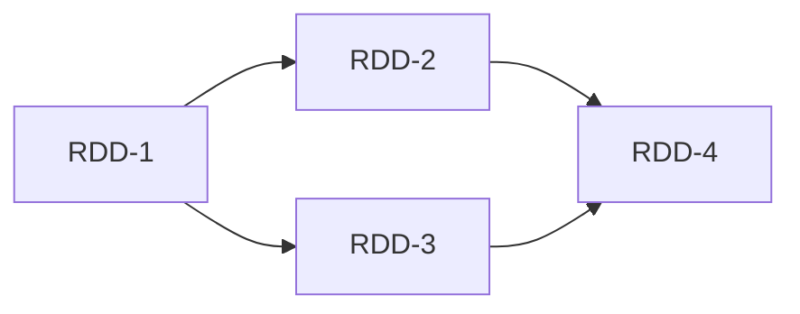

# Spark RDD原理与代码实例讲解

## 1. 背景介绍

### 1.1 大数据处理的挑战
随着数据量的爆炸式增长,传统的数据处理方式已经无法满足实时性、高吞吐量的大数据处理需求。为了应对TB、PB级别海量数据的存储和计算,需要一种全新的大数据处理框架。

### 1.2 Spark的诞生
Spark作为一个快速、通用的大规模数据处理引擎,由加州大学伯克利分校AMP实验室于2009年开发。Spark的诞生,很好地解决了MapReduce等传统大数据处理框架在迭代计算和交互式查询等场景下效率低下的问题。

### 1.3 RDD的核心地位
RDD(Resilient Distributed Dataset)作为Spark框架的核心概念和基础数据结构,为Spark提供了高效、容错的大规模数据处理能力。理解和掌握RDD编程,是成为Spark技术专家的必经之路。

## 2. 核心概念与联系

### 2.1 RDD概念解析
RDD是Spark框架中的基本数据抽象,本质上是一个只读的分区记录集合。每个RDD可以包含多个分区,每个分区就是一个dataset片段。RDD可以包含Python、Java、Scala中任意类型的对象,甚至可以是用户自定义对象。

### 2.2 RDD五大特性
- A:RDD是只读的、不可变的数据集合(Immutable Read-Only)
- B:RDD支持跨集群节点的数据分区(Partitioned)  
- C:RDD支持两种操作-转换(Transformations)和动作(Actions)
- D:RDD自动容错(Fault-Tolerant)
- E:RDD支持延迟计算(Lazy Evaluated)

### 2.3 RDD之间的依赖关系
RDD通过操作算子可以产生新的RDD,RDD之间形成有向无环图DAG(Directed Acyclic Graph)。根据RDD之间的依赖关系,可以分为窄依赖(narrow dependency)和宽依赖(wide dependency)。



## 3. 核心算法原理与操作步骤

### 3.1 RDD创建
可以通过两种方式创建RDD:
- 由现有的Scala集合或数据源创建
- 由一个RDD经转换操作衍生出一个新RDD

### 3.2 RDD转换算子(Transformations)
常用的转换算子包括:
- map(func): 对RDD中每个元素都执行func映射函数,返回新的RDD
- filter(func): 对RDD元素执行func计算,返回计算结果为true的元素组成的新RDD
- flatMap(func): 与map类似,但每个输入的item被映射成0到多个输出items(所以func应该返回一个序列,而不是单个item)
- groupByKey(): 按照key进行分组,返回`RDD[(K, Iterable[V])]`
- reduceByKey(func): 按key进行分组,并对每个key进行func聚合计算

### 3.3 RDD行动算子(Actions) 
常用的行动算子包括:
- count(): 返回RDD中元素的个数
- collect(): 以一个array数组的形式返回dataset的所有元素,适用于小结果集
- reduce(func): 通过func函数聚合RDD中的所有元素,这个功能必须是可交换且可并联的
- take(n): 返回一个由RDD的前n个元素组成的array数组
- foreach(func): 对dataset的每个元素都执行func函数,无返回值

### 3.4 RDD持久化
RDD通过persist方法或cache方法可以将前面的计算结果缓存,默认情况下persist()会把数据以序列化的形式缓存在JVM的堆空间中。但是并不是这两个方法被调用时立即缓存,而是触发后面的action算子时,该RDD将会被缓存在计算节点的内存中,并供后面重用。

## 4. 数学模型和公式详解

### 4.1 RDD中的数学模型
RDD作为一个数据集合$R$,数学定义如下:

$$R = \{r_1, r_2, ..., r_n\}$$

其中,$r_1, r_2, ..., r_n$表示集合中的每个数据记录。一个RDD数据集合可以通过一系列的转换算子(Transformations)衍生出新的RDD。设有一个转换算子$f$作用在RDD $R$上,生成一个新的RDD $R'$,数学表示为:

$$R' = f(R) = f(\{r_1, r_2, ..., r_n\}) = \{f(r_1), f(r_2), ..., f(r_n)\}$$

### 4.2 转换算子数学说明
以map算子为例,设原始RDD为$R$,map算子为$f$,新生成的RDD为$R_{map}$,则数学表达式为:

$$R_{map} = \\{f(r) | r \in R\\} = map(f, R)$$  

同理,filter算子数学表示为:

$$R_{filter} = \\{r | r \in R \wedge f(r) = true \\} = filter(f, R)$$

reduceByKey算子的数学表示为:

$$R_{reduceByKey} = \\{(k,v) | (k,v) \in R \wedge v = \sum_{(k,v') \in R}v'\\} = reduceByKey(R)$$

## 5. 项目实践:代码实例和详解

### 5.1 RDD创建示例

```scala
// 1. 由现有Scala集合创建
val data = Array(1, 2, 3, 4, 5)
val distData = sc.parallelize(data)

// 2. 由外部数据源创建
val lines = sc.textFile("data.txt")
```

### 5.2 RDD转换算子示例

```scala
// map 算子
val squares = distData.map(x => x * x)

// filter 算子
val evenSquares = squares.filter(x => x % 2 == 0)

// flatMap 算子
val pairs = distData.flatMap(x => (0 until x).map(i => (x, i))) 

// groupByKey 算子
val kvRdd = sc.parallelize(List((3, "me"), (1, "you"), (3, "him"), (2, "her"))) 
val groupRdd = kvRdd.groupByKey()

// reduceByKey 算子
val wordCounts = lines.flatMap(line => line.split(" "))
                      .map(word => (word, 1))
                      .reduceByKey((a, b) => a + b)
```

### 5.3 RDD行动算子示例

```scala
// count 算子
val count = distData.count()

// collect 算子 
val numbers = distData.collect()

// reduce 算子
val sum = distData.reduce((a, b) => a + b)

// take 算子
val firstThree = distData.take(3)

// foreach 算子
distData.foreach(x => println(x))
```

### 5.4 RDD持久化示例

```scala
// cache 持久化
val result = input.map(x => x * x)
result.cache()
println(result.count())
println(result.collect().mkString(","))

// persist 持久化
val result = input.map(x => x * x)
result.persist(StorageLevel.DISK_ONLY) 
println(result.count())
println(result.collect().mkString(","))
```

## 6. 实际应用场景

### 6.1 日志分析
Spark可以用于对海量的日志数据进行分析挖掘,例如:
- 统计网站的PV、UV等指标
- 分析用户访问路径、流量来源等信息
- 挖掘用户特征,进行用户画像

### 6.2 推荐系统
利用Spark的RDD和MLlib机器学习库,可以训练和部署大规模的推荐系统,例如:
- 基于协同过滤的商品推荐
- 基于内容的文章、视频推荐
- 基于知识图谱的相关推荐

### 6.3 金融风控
Spark在金融领域的风险控制中有广泛应用,例如:
- 构建用户信用评估模型
- 识别欺诈行为,实现反欺诈
- 评估贷款违约风险

## 7. 工具和资源推荐

### 7.1 Spark官方文档
- 官网地址:http://spark.apache.org/
- 文档地址:http://spark.apache.org/docs/latest/

### 7.2 Spark编程书籍推荐
- 《Spark大数据处理:技术、应用与性能优化》
- 《Spark高级数据分析》
- 《Spark快速大数据分析》

### 7.3 Spark在线学习资源
- edX的Spark系列在线课程:https://www.edx.org/learn/apache-spark
- Coursera上的Spark专项课程:https://www.coursera.org/specializations/big-data-analysis-spark
- 优达学城的Spark课程:https://www.udacity.com/course/learn-spark-at-udacity--ud2002

## 8. 总结:未来发展趋势与挑战

### 8.1 Spark的未来发展趋势
- 云端一体化:与云平台深度集成,提供Spark as a Service
- AI赋能:与AI技术深度融合,Spark将成为AI平台的核心引擎
- 简化开发:更高级的API设计,屏蔽底层细节,提升开发效率
- 异构计算:支持GPU、FPGA等异构硬件,满足深度学习等场景需求

### 8.2 Spark面临的挑战
- 内存墙:Spark对内存的需求不断增加,内存成为瓶颈
- 小文件问题:Spark对海量小文件的处理效率较低
- 数据倾斜:不同任务之间的数据分布不均衡,导致整体性能降低
- 缺乏标准:缺乏统一的生态和标准,导致学习和应用成本高

## 9. 附录:常见问题与解答

### Q1:什么是RDD宽依赖和窄依赖?
窄依赖(narrow dependency):每个父RDD的分区只被子RDD的一个分区使用。
宽依赖(wide dependency):多个子RDD分区都依赖同一个父RDD分区,会引起shuffle。

### Q2:RDD缓存级别有哪些?
NONE:不缓存
DISK_ONLY:只缓存在磁盘
DISK_ONLY_2:只缓存在磁盘,副本数为2
MEMORY_ONLY:只缓存在内存 
MEMORY_ONLY_2:只缓存在内存,副本数为2
MEMORY_ONLY_SER:只缓存在内存,以序列化形式存储
MEMORY_ONLY_SER_2:只缓存在内存,以序列化形式存储,副本数为2 
MEMORY_AND_DISK:先放在内存,内存不够则溢写到磁盘
MEMORY_AND_DISK_2:先放在内存,内存不够则溢写到磁盘,副本数为2
MEMORY_AND_DISK_SER:先放在内存,内存不够则溢写到磁盘,以序列化形式存储
MEMORY_AND_DISK_SER_2:先放在内存,内存不够则溢写到磁盘,以序列化形式存储,副本数为2

### Q3:RDD checkPoint的作用是什么?
Checkpoint的目的是为了数据安全,将RDD的数据保存一份到可靠的存储系统如HDFS中。这样当RDD的部分分区数据丢失时,不需要重头计算,只需从checkpoint处恢复。

作者：禅与计算机程序设计艺术 / Zen and the Art of Computer Programming