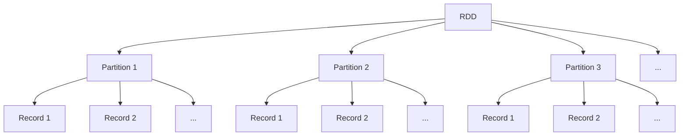
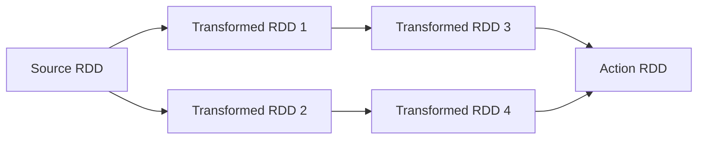
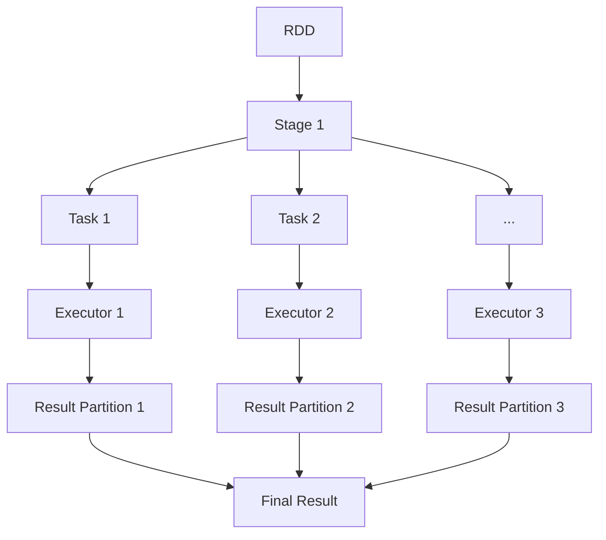
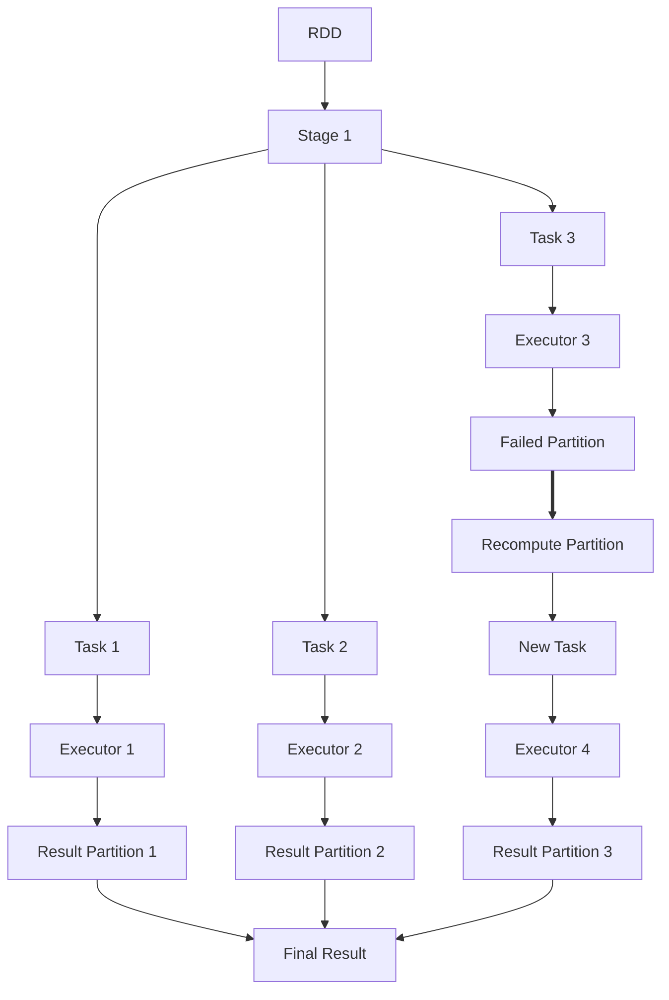

# Spark RDD弹性分布式数据集原理与代码实例讲解

## 1.背景介绍

### 1.1 大数据时代的到来

在当今的数字时代,数据已经成为了一种新的"燃料",推动着各行各业的创新与发展。随着物联网、社交媒体、移动互联网等新兴技术的快速发展,海量的结构化和非结构化数据不断涌现,传统的数据处理方式已经难以满足现代大数据应用的需求。

### 1.2 大数据处理的挑战

大数据处理面临着诸多挑战,包括:

- **数据量大**:数据规模已经达到 PB 甚至 EB 级别,远远超出了传统数据库和计算系统的处理能力。
- **数据种类多**:除了结构化数据,还包括日志、图像、视频等非结构化数据。
- **数据增长快**:数据以指数级别增长,需要实时处理和存储。
- **数据价值密度低**:有价值的数据往往被淹没在海量无用数据中。

### 1.3 Spark 的诞生

为了解决大数据处理的挑战,Apache Spark 应运而生。Spark 是一种快速、通用、可扩展的大数据处理引擎,最初由加州大学伯克利分校 AMPLab 开发。它基于内存计算,可以高效地处理大规模数据,并且支持多种编程语言,如 Scala、Java、Python 和 R。

### 1.4 RDD:Spark 的核心抽象

在 Spark 中,RDD(Resilient Distributed Dataset,弹性分布式数据集)是最基本的数据抽象,它是一个不可变、分区的记录集合,可以并行操作。RDD 提供了一种高度受限的共享内存模型,使程序员可以执行内存计算,同时还能够控制计算的分区方式,以优化数据的存储位置,从而提高整体应用程序的性能。

## 2.核心概念与联系

### 2.1 RDD 的定义

RDD 是一个不可变的分区记录集合,可以并行计算。具体来说,RDD 具有以下几个核心特征:

- **分区(Partitioned)**: RDD 由多个分区(Partition)组成,每个分区存储在集群的不同节点上,可以并行计算。
- **不可变(Immutable)**: RDD 本身是不可变的,一旦创建就不能修改。如果需要修改,只能通过转换操作创建新的 RDD。
- **有血统(Lineage)**: RDD 通过一系列确定性操作(如 map、filter、join 等)从其他 RDD 或数据源(如文件系统)派生而来,这些操作的集合就是 RDD 的血统(Lineage)。
- **容错(Fault-Tolerant)**: 由于 RDD 的不可变性和血统信息,Spark 可以通过重新计算丢失的分区来实现容错。
- **可并行计算(Parallel Computation)**: RDD 中的分区可以并行计算,从而充分利用集群资源,提高计算效率。



### 2.2 RDD 的创建

RDD 可以通过两种方式创建:

1. **从集群外部数据源创建**,如本地文件系统、HDFS、HBase 或任何 Hadoop 数据源。
2. **从驱动器程序中的集合对象创建**,如 Scala 的 `parallelize` 方法。

```scala
// 从文件创建 RDD
val textFile = sc.textFile("path/to/file.txt")

// 从集合创建 RDD
val numbers = sc.parallelize(List(1, 2, 3, 4, 5))
```

### 2.3 RDD 的转换

RDD 支持两种类型的操作:转换(Transformation)和动作(Action)。

- **转换(Transformation)**: 将一个 RDD 转换为另一个 RDD,如 `map`、`filter`、`flatMap`、`union` 等。转换操作是懒加载的,只有在执行动作操作时才会真正计算。
- **动作(Action)**: 从 RDD 中获取结果并返回到驱动器程序或将其写入外部存储系统,如 `reduce`、`collect`、`count`、`saveAsTextFile` 等。动作操作会触发实际的计算。

```scala
// 转换操作
val squaredRDD = numbers.map(x => x * x)

// 动作操作
val sum = squaredRDD.reduce((x, y) => x + y)
```

### 2.4 RDD 的依赖关系

RDD 之间存在着依赖关系,形成了一个有向无环图(DAG)。Spark 会根据这个 DAG 来优化执行计划,并行执行任务。



## 3.核心算法原理具体操作步骤

### 3.1 RDD 的创建过程

当创建一个 RDD 时,Spark 会执行以下步骤:

1. **确定分区方式**: 根据输入数据源的类型和大小,确定 RDD 的分区数量和分区策略。
2. **计算分区位置**: 根据集群的节点信息,计算每个分区的存储位置。
3. **构建 RDD 对象**: 创建 RDD 对象,包含分区信息、依赖关系、计算函数等元数据。

### 3.2 RDD 的计算过程

当执行一个动作操作时,Spark 会执行以下步骤:

1. **构建 DAG**: 根据 RDD 的依赖关系,构建一个有向无环图(DAG)。
2. **划分阶段(Stage)**: 将 DAG 划分为多个阶段(Stage),每个阶段由一系列基于同一阶段父 RDD 的任务(Task)组成。
3. **任务调度**: 根据每个阶段的任务数量和集群资源情况,将任务分发到不同的执行器(Executor)上执行。
4. **任务执行**: 执行器运行任务,计算结果并返回给驱动器程序。
5. **结果处理**: 驱动器程序收集并处理所有执行器返回的结果。



### 3.3 RDD 的容错机制

由于 RDD 的不可变性和血统信息,Spark 可以通过重新计算丢失的分区来实现容错。具体步骤如下:

1. **检测失败**: 当某个任务失败时,Spark 会检测到该失败。
2. **重新计算分区**: Spark 会根据失败分区的血统信息,重新计算该分区。
3. **任务重试**: 重新计算出的分区会被重新提交为新的任务执行。



## 4.数学模型和公式详细讲解举例说明

在 Spark 中,RDD 的实现涉及到一些数学模型和公式,用于优化计算和存储。

### 4.1 数据分区

为了实现并行计算,RDD 会将数据划分为多个分区(Partition)。常用的分区策略包括:

- **哈希分区(Hash Partitioning)**: 根据记录的键(Key)的哈希值,将记录分配到不同的分区。
- **范围分区(Range Partitioning)**: 根据记录的键(Key)的范围,将记录分配到不同的分区。

哈希分区的公式如下:

$$
partition = key.hashCode() \% numPartitions
$$

其中,`key.hashCode()` 是记录键的哈希值,`numPartitions` 是分区数量。

范围分区的公式如下:

$$
partition = \left\lfloor \frac{key - rangeStart}{rangeLength} \times numPartitions \right\rfloor
$$

其中,`key` 是记录键的值,`rangeStart` 和 `rangeLength` 分别表示键值范围的起始值和长度,`numPartitions` 是分区数量。

### 4.2 数据局部性

为了提高计算效率,Spark 会尽量将计算任务调度到存储相应数据的节点上,以减少数据传输开销。这个原理被称为数据局部性(Data Locality)。

Spark 使用一种称为 `Locality Level` 的概念来量化数据局部性的程度。`Locality Level` 的取值范围从 0 到 7,值越小,数据局部性越好。具体取值如下:

- `PROCESS_LOCAL(0)`: 数据在同一个执行器进程中。
- `NODE_LOCAL(1)`: 数据在同一个节点上,但不在同一个执行器进程中。
- `NO_PREF(2)`: 没有偏好。
- `RACK_LOCAL(3)`: 数据在同一个机架上。
- `ANY(7)`: 数据可以在任何地方。

在任务调度时,Spark 会优先选择 `Locality Level` 较小的节点,以提高数据局部性。

### 4.3 数据倾斜

数据倾斜(Data Skew)是指数据在不同分区之间分布不均匀,导致部分任务执行时间远远长于其他任务。这会严重影响整个作业的执行效率。

为了检测和解决数据倾斜问题,Spark 引入了一些技术,如:

- **分区统计信息**: Spark 会收集每个分区的记录数和大小等统计信息,用于检测数据倾斜。
- **采样**: Spark 可以对输入数据进行采样,估计数据分布,从而优化分区策略。
- **自适应执行**: Spark 可以根据运行时的统计信息动态调整执行计划,如重新分区等。

## 5.项目实践:代码实例和详细解释说明

下面是一个使用 Scala 编写的 Spark 程序示例,演示了如何创建、转换和操作 RDD。

### 5.1 创建 RDD

```scala
// 从文件创建 RDD
val textFile = sc.textFile("path/to/file.txt")

// 从集合创建 RDD
val numbers = sc.parallelize(List(1, 2, 3, 4, 5))
```

- `sc` 是 `SparkContext` 对象,代表与 Spark 集群的连接。
- `textFile` 方法从指定路径读取文本文件,并创建一个 RDD,每一行作为一个记录。
- `parallelize` 方法从驱动器程序的集合创建一个 RDD。

### 5.2 转换 RDD

```scala
// map 转换
val squaredNumbers = numbers.map(x => x * x)

// filter 转换
val evenNumbers = squaredNumbers.filter(x => x % 2 == 0)

// flatMap 转换
val words = textFile.flatMap(line => line.split(" "))

// union 转换
val combined = squaredNumbers.union(evenNumbers)
```

- `map` 对每个元素应用一个函数,并返回一个新的 RDD。
- `filter` 返回一个新的 RDD,只包含满足条件的元素。
- `flatMap` 类似于 `map`,但每个输入元素可以映射为 0 个或多个输出元素。
- `union` 将两个 RDD 合并为一个新的 RDD。

### 5.3 操作 RDD

```scala
// 动作操作
val count = words.count()
val first = words.first()
val collected = words.collect()

// 保存结果
words.saveAsTextFile("path/to/output")
```

- `count` 返回 RDD 中元素的个数。
- `first` 返回 RDD 中的第一个元素。
- `collect` 