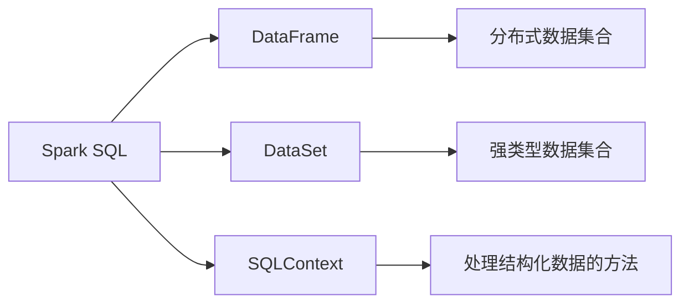
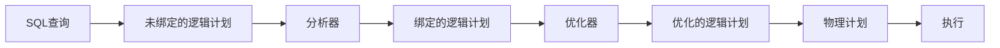

## 1.背景介绍

Spark SQL是Apache Spark的一个模块，用于处理结构化和半结构化数据。它提供了一个编程接口，用户可以通过它来查询数据，无论数据是在Hadoop Distributed File System (HDFS)、Apache Cassandra、HBase，还是其他数据源中。Spark SQL不仅支持各种关系型数据源，还支持Hive和Avro等数据格式。本文将深入探讨Spark SQL的原理，并通过代码实例进行讲解。

## 2.核心概念与联系

Spark SQL的核心概念包括DataFrame、DataSet和SQLContext。DataFrame是一个分布式数据集合，它的数据结构由列名和类型定义，类似于关系型数据库的表。DataSet是一个强类型的分布式数据集合，它在编译时就会进行类型检查，从而提高了代码的健壮性。SQLContext是Spark SQL的主入口，它提供了一系列用于处理结构化数据的方法。



## 3.核心算法原理具体操作步骤

Spark SQL的工作原理主要包括以下几个步骤：

1. 首先，Spark SQL将SQL查询转换为未绑定的逻辑计划（Unresolved Logical Plan）。
2. 然后，逻辑计划经过分析器（Analyzer）的处理，将其中的表名和列名解析为具体的数据类型，生成绑定的逻辑计划（Analyzed Logical Plan）。
3. 接着，优化器（Optimizer）会对逻辑计划进行优化，生成优化的逻辑计划（Optimized Logical Plan）。
4. 最后，Spark SQL根据优化的逻辑计划生成物理计划（Physical Plan），并执行。



## 4.数学模型和公式详细讲解举例说明

在Spark SQL中，我们经常需要处理数据倾斜的问题。数据倾斜是指在分布式计算中，数据分布不均匀，导致某些节点的计算压力过大，从而影响整个任务的执行效率。数据倾斜的度可以用基尼系数（Gini Coefficient）来度量，基尼系数的公式为：

$$ G = \frac{\sum_{i=1}^{n}(2i-n-1)x_i}{n^2\bar{x}} $$

其中，$x_i$表示第i个节点的数据量，$n$表示节点总数，$\bar{x}$表示平均数据量。基尼系数的值在0和1之间，值越大，表示数据倾斜的程度越高。

## 5.项目实践：代码实例和详细解释说明

下面通过一个简单的例子来说明如何使用Spark SQL进行数据处理。首先，我们创建一个SparkSession对象：

```scala
val spark = SparkSession.builder()
  .appName("Spark SQL example")
  .config("spark.some.config.option", "some-value")
  .getOrCreate()
```

然后，我们使用SparkSession对象的read方法读取数据，并创建DataFrame：

```scala
val df = spark.read.json("examples/src/main/resources/people.json")
```

接着，我们可以对DataFrame进行各种操作，例如显示数据、选择列、过滤行等：

```scala
df.show()
df.select("name").show()
df.filter($"age" > 21).show()
```

最后，我们可以使用Spark SQL的sql方法执行SQL查询：

```scala
df.createOrReplaceTempView("people")
val sqlDF = spark.sql("SELECT * FROM people")
sqlDF.show()
```

## 6.实际应用场景

Spark SQL广泛应用于各种场景，例如数据分析、数据挖掘、机器学习等。它可以处理大规模的数据，提供了丰富的数据源支持，支持SQL查询和编程接口，可以与Hadoop生态系统无缝集成，是大数据处理的重要工具。

## 7.工具和资源推荐

- Apache Spark：Spark是一个用于大规模数据处理的统一分析引擎。它提供了Java、Scala、Python和R等多种语言的编程接口，支持各种任务，例如批处理、交互式查询、流处理、机器学习和图计算等。
- Databricks：Databricks是一家由Apache Spark的创始团队创建的公司，提供了基于Spark的统一分析平台。它提供了云服务和企业版，支持各种数据源，提供了丰富的API和工具，可以帮助用户更方便地使用Spark。

## 8.总结：未来发展趋势与挑战

随着大数据技术的发展，Spark SQL将会有更多的功能和优化。例如，它将支持更多的数据源，提供更丰富的API，优化执行效率，提高稳定性和可用性等。同时，Spark SQL也面临着一些挑战，例如如何处理更大规模的数据，如何处理更复杂的查询，如何提高计算效率，如何提高系统的稳定性和可用性等。

## 9.附录：常见问题与解答

1. 问：Spark SQL和Hive有什么区别？

答：Spark SQL和Hive都是用于处理大规模数据的工具，但它们有一些重要的区别。首先，Spark SQL支持更多的数据源，例如HDFS、Cassandra、HBase等。其次，Spark SQL提供了编程接口，用户可以使用Java、Scala、Python和R等语言进行编程。最后，Spark SQL的执行效率通常高于Hive。

2. 问：Spark SQL如何处理数据倾斜？

答：Spark SQL处理数据倾斜的方法主要有两种：一种是通过调整数据的分区策略，使数据更均匀地分布在各个节点上；另一种是通过使用Salting技术，将倾斜的key分解为多个子key，从而降低数据倾斜的程度。

3. 问：Spark SQL支持哪些数据源？

答：Spark SQL支持各种数据源，例如HDFS、Cassandra、HBase、Amazon S3、MySQL、PostgreSQL等。此外，它还支持各种数据格式，例如CSV、JSON、Parquet、Avro等。

作者：禅与计算机程序设计艺术 / Zen and the Art of Computer Programming