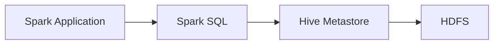
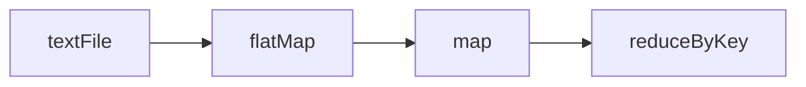
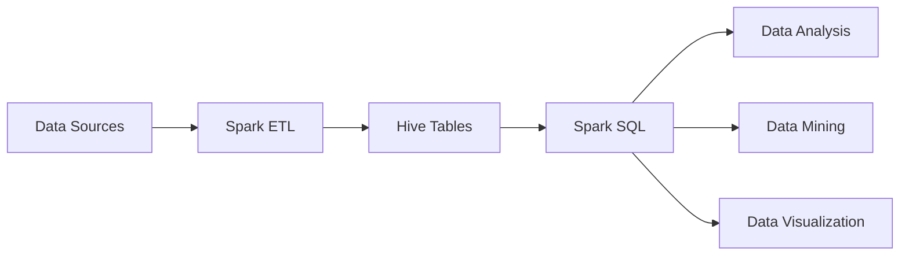

# Spark-Hive整合原理与代码实例讲解

## 1.背景介绍

### 1.1 大数据处理的挑战

在当今大数据时代,企业需要处理海量的结构化、半结构化和非结构化数据。传统的数据处理方式已经无法满足实时性、高并发、海量数据处理的需求。因此,大数据技术应运而生,其中 Hadoop 作为开源的分布式计算框架,为大数据处理提供了可靠的解决方案。

### 1.2 Hive 与 Spark 的优势

Hive 是构建在 Hadoop 之上的数据仓库工具,它提供了类 SQL 查询语言 HiveQL,可以将结构化的数据文件映射为一张数据库表,并提供简单的 SQL 查询功能,大大简化了 Hadoop 数据的分析。

Spark 是一个快速、通用的大数据计算引擎,具有高效的内存计算能力和丰富的数据处理算子。相比 Hadoop MapReduce,Spark 在内存中进行计算,避免了不必要的磁盘 IO,处理速度可以提升 100 倍以上。

### 1.3 Spark 与 Hive 整合的意义

Spark 与 Hive 的整合,可以充分发挥两者的优势。一方面,Spark 可以利用 Hive 的元数据信息,直接读取 Hive 表中的数据进行计算,避免了数据的额外转换。另一方面,Spark 强大的内存计算能力和丰富的算子,可以大幅提升 Hive 数据分析的效率。同时,Spark SQL 提供了与 Hive 类似的 SQL 接口,使得数据分析人员可以无缝迁移现有的 Hive 查询到 Spark 上执行。

## 2.核心概念与联系

### 2.1 Hive 表与 HDFS 文件

Hive 表本质上是 HDFS 上的文件目录映射。当创建一个 Hive 表时,实际上是在 HDFS 的 `/user/hive/warehouse` 目录下创建了一个对应的目录。Hive 表中的数据,以文件的形式存储在对应的 HDFS 目录中。

### 2.2 Spark SQL 的 DataFrame/Dataset

Spark SQL 是 Spark 用于结构化数据处理的组件。它提供了 DataFrame 和 Dataset 两个抽象,可以像操作关系型数据库表一样操作分布式数据集。DataFrame 是一种以 RDD 为基础的分布式数据集合,类似于关系型数据库中的二维表格。Dataset 是 DataFrame 的一个扩展,提供了更强类型的 API 接口。

### 2.3 Spark-Hive 整合架构

下图展示了 Spark 与 Hive 整合的架构:



Spark 应用程序通过 Spark SQL 连接到 Hive Metastore,读取 Hive 表的元数据信息。然后根据元数据直接从 HDFS 上读取 Hive 表对应目录的数据文件,加载为 DataFrame 或 Dataset 进行计算。计算结果也可以直接写回 Hive 表。

## 3.核心算法原理具体操作步骤

### 3.1 Spark 读取 Hive 表数据

1. 创建 SparkSession 对象,设置 Hive 支持
2. 使用 SQL 语句或 DataFrame API 读取 Hive 表数据
3. 将读取到的数据转换为 DataFrame 或 Dataset

### 3.2 Spark 写入数据到 Hive 表

1. 将 DataFrame 或 Dataset 注册为临时表或视图
2. 使用 SQL 语句将数据写入 Hive 表
3. 或使用 DataFrame 的 `write` 方法直接写入 Hive 表

### 3.3 Spark SQL 执行 Hive 查询

1. 使用 SparkSession 的 `sql` 方法提交 SQL 语句
2. Spark SQL 解析 SQL,生成逻辑执行计划
3. 优化器对逻辑计划进行优化,生成物理执行计划
4. Spark 执行物理计划,计算出查询结果

## 4.数学模型和公式详细讲解举例说明

在 Spark 中,RDD 是基本的数据抽象,表示一个不可变、可分区、里面元素可并行计算的集合。一个 RDD 由一个或者多个 partition 组成。RDD 可以通过一些确定的依赖关系从其他 RDD 转换而来,或者通过读取外部数据源来生成。

RDD 的数学定义如下:

$RDD = \{partition_1, partition_2, ..., partition_n\}$

其中,$partition_i$表示 RDD 的一个分区,每个分区包含了 RDD 的部分数据。RDD 之间的转换关系可以用有向无环图 DAG 表示:

$DAG = \{RDD_1 \rightarrow RDD_2 \rightarrow ... \rightarrow RDD_n\}$

例如,下面的代码演示了使用 Spark 读取 HDFS 上的文本文件,并进行词频统计:

```scala
val textFile = sc.textFile("hdfs://...")
val counts = textFile.flatMap(line => line.split(" "))
                 .map(word => (word, 1))
                 .reduceByKey(_ + _)
```

上述代码的 DAG 图如下:



其中,`textFile` 是从 HDFS 读取数据创建的 RDD,经过一系列转换操作 `flatMap`、`map`、`reduceByKey`,最终得到词频统计结果。

## 5.项目实践：代码实例和详细解释说明

下面通过一个具体的代码实例,演示如何在 Spark 中读写 Hive 表数据并进行分析。

```scala
// 创建 SparkSession
val spark = SparkSession.builder()
  .appName("SparkHiveExample")
  .enableHiveSupport()
  .getOrCreate()

// 读取 Hive 表数据
val df = spark.table("db.table")

// 注册临时表
df.createOrReplaceTempView("temp_table")

// 使用 SQL 分析数据
val result = spark.sql("SELECT * FROM temp_table WHERE ...")

// 将结果写入新的 Hive 表 
result.write.mode("overwrite").saveAsTable("db.new_table")
```

代码说明:

1. 首先创建 SparkSession 对象,设置 `enableHiveSupport` 以支持 Hive
2. 使用 `spark.table` 方法读取 Hive 表 `db.table` 的数据为 DataFrame
3. 将 DataFrame 注册为临时表 `temp_table`
4. 使用 `spark.sql` 方法提交 SQL 语句,对临时表进行分析,生成新的 DataFrame `result` 
5. 将 `result` 以覆盖的方式写入新的 Hive 表 `db.new_table`

可以看到,借助 Spark SQL,我们可以非常方便地读取 Hive 表数据、进行分析、将结果写回 Hive 表,整个过程无需理会底层数据的存储格式和位置。

## 6.实际应用场景

Spark 与 Hive 的整合在实际的数据分析场景中有广泛的应用,主要包括:

1. ETL 数据处理:使用 Spark 从各种数据源读取数据,经过清洗、转换等 ETL 处理后,将结果写入 Hive 表供后续分析使用。

2. 即席查询分析:利用 Spark SQL 优化后的查询引擎,对 Hive 数据进行交互式的即席查询分析,快速获得分析结果。

3. 数据挖掘与机器学习:将 Hive 表数据加载为 DataFrame 后,可以方便地使用 Spark MLlib 提供的各种机器学习算法进行数据挖掘和预测分析。

4. 数据可视化:通过 Spark SQL 将 Hive 数据处理后,可以对接各种数据可视化工具,实现大数据的可视化展现。

下面是一个典型的 Spark 与 Hive 整合的应用架构:



各种数据源的数据通过 Spark ETL 处理后写入 Hive 表,然后利用 Spark SQL 进行数据分析、挖掘和可视化展现。Hive 作为一个数据中心,承担了数据存储和管理的角色。

## 7.工具和资源推荐

1. Apache Spark 官网:https://spark.apache.org/,可以下载 Spark 发行版并查阅官方文档
2. Hive 官网:https://hive.apache.org/,提供 Hive 的下载和文档
3. Spark SQL 编程指南:https://spark.apache.org/docs/latest/sql-programming-guide.html
4. Hive 语言手册:https://cwiki.apache.org/confluence/display/Hive/LanguageManual
5. HiveQL 与 SQL 的比较:https://cwiki.apache.org/confluence/display/Hive/SQLLanguageManual
6. Spark 与 Hive 整合示例项目:https://github.com/apache/spark/tree/master/examples/src/main/scala/org/apache/spark/examples/sql/hive
7. Spark Summit 大会:https://spark-summit.org/,分享 Spark 的各种应用实践 
8. 《Spark: The Definitive Guide》,Spark 权威指南,系统全面地介绍了 Spark 各个组件的原理和使用

## 8.总结：未来发展趋势与挑战

Spark 与 Hive 的整合大大简化了大数据处理的流程,提高了数据分析的效率。未来 Spark 和 Hive 的整合将向以下方向发展:

1. Hive 3.0 引入了 LLAP 技术,可以大幅提升 Hive 查询的响应速度,使 Hive 更适合交互式分析场景。Spark 可以更好地利用 LLAP 加速查询。

2. Spark 结构化流(Structured Streaming)使得 Spark 可以处理流式数据,并支持与静态数据的关联分析。Spark 与 Hive 的整合也将扩展到实时流处理领域。

3. Hive 的 Kafka 存储处理引擎使得 Hive 可以直接消费 Kafka 数据并支持 SQL 分析。Spark Streaming 也可以消费 Kafka 数据后写入 Hive 进行批流一体的分析。

4. Spark 作为一个统一的大数据分析平台,除了 SQL 分析,还支持 MLlib 机器学习和 GraphX 图计算。通过 Hive 整合,Spark 可以更方便地获得训练和分析数据。

但是,Spark 与 Hive 的整合也面临一些挑战:

1. Hive 表的元数据管理依赖 HDFS,而 Spark 也需要频繁访问 HDFS,容易造成 HDFS 的 I/O 瓶颈。需要采取分布式缓存、数据本地化计算等优化手段。

2. Hive 表的数据文件格式多样,不同格式的读写效率差异较大。需要根据数据特点选择或转换为合适的文件格式,如 ORC、Parquet 等。

3. Spark 与 Hive 版本的兼容性问题。Spark 2.3 才开始支持 Hive 2.0,之前的 Spark 版本只支持 Hive 1.x。需要根据 Spark 和 Hive 的版本选择合适的整合方式。

4. 随着数据量的增长,Spark 作业的调度和资源管理也变得更加复杂。需要合理设置 Spark 作业的并行度、内存和 CPU 资源参数,权衡数据本地性与负载均衡,协调好与 Hive 表查询的资源争用。

## 9.附录：常见问题与解答

Q: 如何合理设置 Spark 任务的并行度?

A: Spark 任务的并行度取决于 RDD 的 partition 数量。每个 partition 对应一个 task,过多的 partition 会增加调度开销,过少的 partition 会导致 task 负载不均衡。一般设置 partition 数量为 2~3 倍的 CPU core 数。对于 HDFS 数据源,Spark 会根据 block 大小自动设置 partition 数量。对于 Hive 表,partition 的设置需要兼顾表的 bucket 数、文件大小和数量。

Q: Spark 读写 Hive 表数据时使用什么格式比较高效?