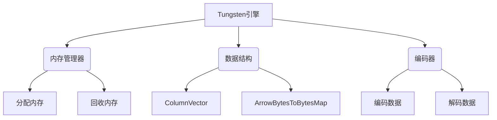
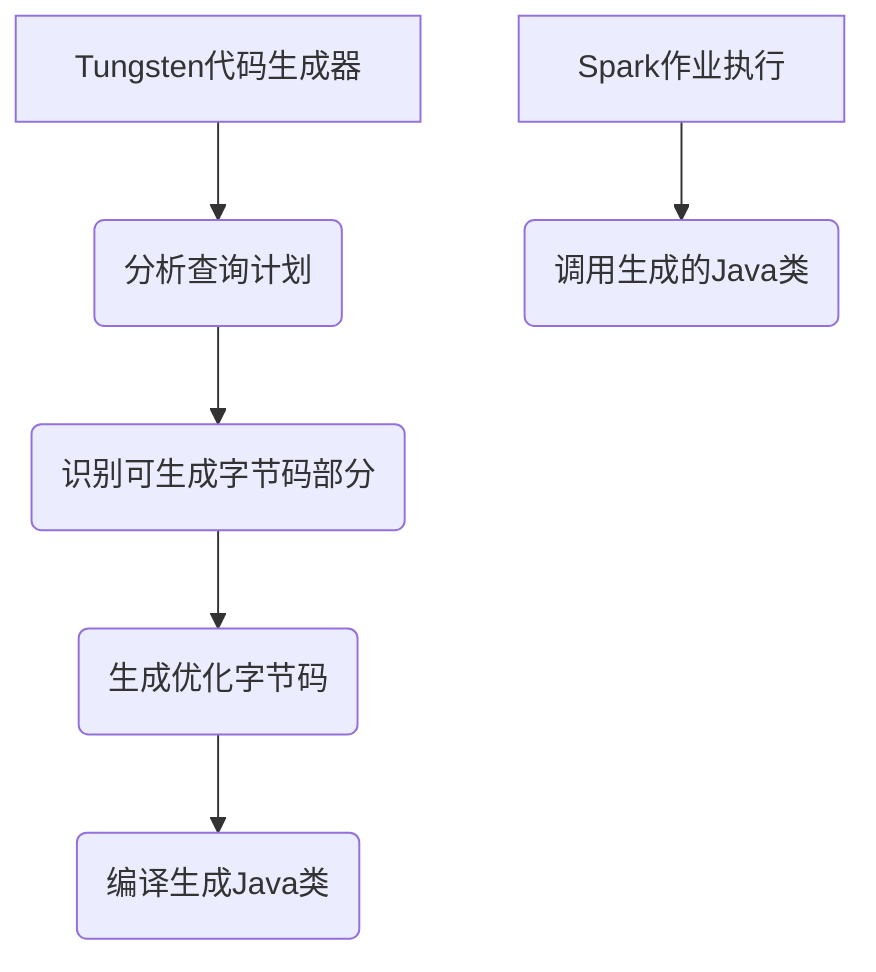
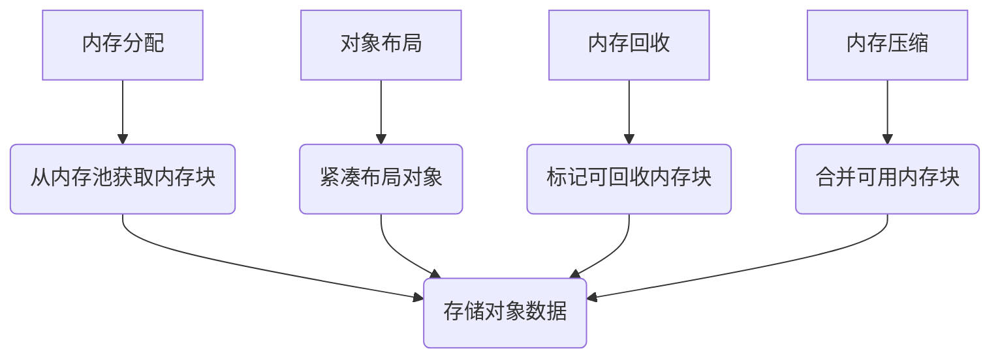
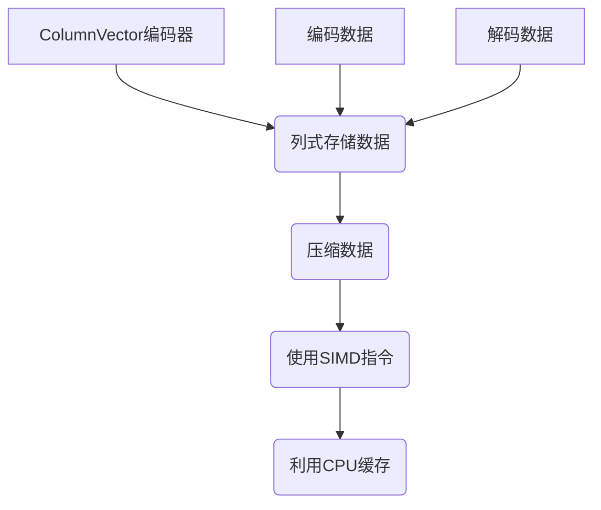
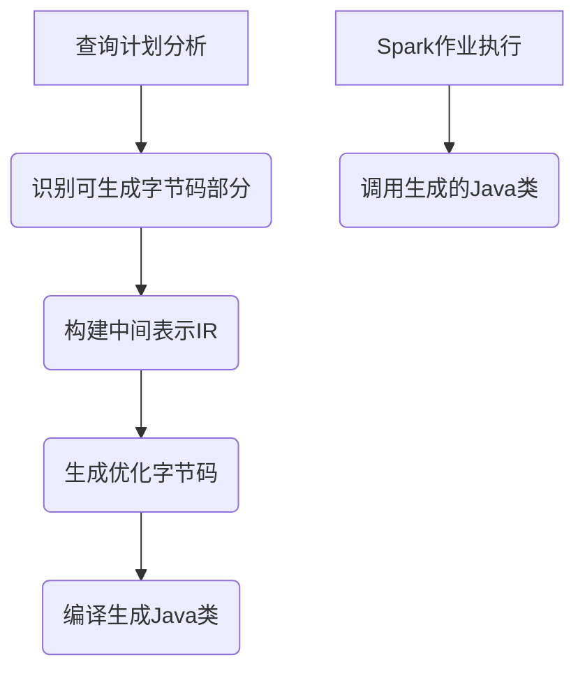

# SparkTungsten与代码调试：快速定位问题

## 1.背景介绍

Apache Spark是一种用于大规模数据处理的统一分析引擎。它提供了高性能和通用的数据并行处理平台,可以有效地对大数据集进行处理。然而,在处理大型数据集时,性能问题一直是一个挑战。为了解决这个问题,Spark引入了Tungsten项目,旨在通过多种技术手段提高Spark的运行效率。

Tungsten项目包含了多个组件,其中最重要的是Tungsten引擎和Tungsten代码生成器。Tungsten引擎是一个高效的内存管理系统,可以减少内存开销和GC压力。Tungsten代码生成器则通过在运行时生成优化的字节码,来消除虚拟机解释器的开销,从而提高CPU效率。

### 1.1 Spark性能问题

在大数据处理场景下,Spark面临以下几个主要性能挑战:

1. **内存管理开销**:Spark中的RDD和数据集需要频繁地创建和销毁对象,这会产生大量的内存分配和垃圾回收开销。
2. **解释器开销**:Spark的计算任务需要通过JVM的解释器执行,而解释器的开销会随着计算复杂度的增加而快速增长。
3. **数据编码/解码开销**:Spark需要在内存和外部存储之间频繁地编码和解码数据,这个过程会消耗大量的CPU资源。

### 1.2 Tungsten项目的作用

Tungsten项目旨在通过以下几个方面来解决Spark的性能问题:

1. **优化内存管理**:通过Tungsten引擎,减少内存分配和GC的开销。
2. **消除解释器开销**:通过Tungsten代码生成器,在运行时生成优化的字节码,避免解释器的开销。
3. **高效编解码**:提供高效的数据编码/解码机制,降低CPU开销。

## 2.核心概念与联系

### 2.1 Tungsten引擎

Tungsten引擎是一个高效的内存管理系统,它包含以下几个关键组件:

1. **内存管理器(MemoryManager)**:负责管理Spark应用程序的内存使用情况,包括分配和回收内存。
2. **数据结构(Data Structures)**:提供了一系列高效的数据结构,如ColumnVector、ArrowBytesToBytesMap等,用于存储和操作数据。
3. **编码器(Encoders)**:提供了高效的数据编码/解码机制,用于在内存和外部存储之间传输数据。

Tungsten引擎的核心思想是尽量减少内存分配和复制的开销,并使用高效的数据结构和编码器来存储和操作数据。这样可以显著降低内存占用和GC压力,提高Spark作业的运行效率。

### 2.2 Tungsten代码生成器

Tungsten代码生成器是一个在运行时动态生成优化字节码的组件。它的工作原理如下:

1. 在执行Spark作业之前,代码生成器会分析查询计划,识别出可以生成字节码的部分。
2. 针对这些部分,代码生成器会生成高度优化的字节码,并将其编译成Java类。
3. 在执行查询时,Spark会直接调用这些生成的Java类,而不需要通过解释器执行。

通过消除解释器的开销,Tungsten代码生成器可以显著提高CPU效率,尤其是对于计算密集型的作业。

### 2.3 Tungsten与Spark的集成

Tungsten引擎和代码生成器都已经与Spark核心模块紧密集成,为Spark提供了性能优化支持。具体来说:

- Spark SQL和Dataset API默认启用了Tungsten,利用其优化的内存管理和编码器。
- Spark的物化视图(Cached Table)也会使用Tungsten的内存管理和数据结构。
- 对于支持的操作,Spark会自动使用Tungsten代码生成器生成优化的字节码。

通过这些集成,Tungsten可以为Spark的各种工作负载提供性能提升,包括SQL查询、DataFrame/Dataset操作、机器学习算法等。

## 3.核心算法原理具体操作步骤

### 3.1 Tungsten内存管理

Tungsten引擎的内存管理由MemoryManager组件负责,它的核心算法包括以下几个步骤:

1. **内存分配**:MemoryManager维护一个内存池,当需要分配内存时,它会从内存池中获取一个连续的内存块。
2. **对象布局**:为了减少内存开销,Tungsten会对对象进行紧凑布局,避免内存填充。
3. **内存回收**:当对象不再使用时,MemoryManager会将其占用的内存块标记为可回收,以便后续重用。
4. **内存压缩**:为了避免内存碎片化,MemoryManager会定期对内存池进行压缩,将可用内存块合并为更大的连续块。

这种基于内存池的管理方式,可以显著减少内存分配和GC的开销,提高内存利用率。

### 3.2 Tungsten编码器

Tungsten提供了多种高效的编码器,用于在内存和外部存储之间传输数据。其中最常用的是ColumnVector编码器,它的工作原理如下:

1. **列式存储**:ColumnVector将数据按列存储在连续的内存块中,而不是按行存储。
2. **数据压缩**:ColumnVector会对数据进行压缩,以减小存储开销。
3. **SIMD指令**:在编码/解码过程中,ColumnVector会利用CPU的SIMD指令进行向量化操作,提高处理效率。
4. **缓存友好**:由于数据是按列存储的,ColumnVector可以充分利用CPU缓存,减少内存访问开销。

通过这些优化手段,ColumnVector编码器可以显著提高数据传输和处理的效率,尤其是对于列式存储的数据格式。

### 3.3 Tungsten代码生成

Tungsten代码生成器的核心算法包括以下几个步骤:

1. **查询计划分析**:代码生成器会分析Spark的查询计划,识别出可以生成字节码的部分。
2. **中间表示生成**:对于可生成字节码的部分,代码生成器会构建一个中间表示(IR),描述需要执行的操作。
3. **字节码生成**:根据IR,代码生成器会生成高度优化的字节码,包括向量化、循环展开等优化技术。
4. **类编译**:生成的字节码会被编译成Java类,供Spark作业执行时调用。

通过这种方式,Tungsten代码生成器可以避免解释器的开销,直接执行优化的本地代码,从而提高CPU效率。

## 4.数学模型和公式详细讲解举例说明

在Tungsten的内存管理和编码器中,涉及到一些数学模型和公式,用于优化性能。下面将详细讲解其中的几个关键模型和公式。

### 4.1 内存对齐

为了减少内存填充开销,Tungsten会对对象进行紧凑布局。这涉及到内存对齐的概念。

内存对齐是指将数据存储在特定的内存地址上,以确保CPU可以高效地访问该数据。对于大多数CPU,访问对齐的内存地址比访问未对齐的地址更快。

对于一个对象,其字段的内存布局需要遵循以下对齐规则:

- 对象的起始地址必须是8字节对齐的(64位系统)。
- 每个字段的起始地址必须与其数据类型的大小对齐。例如,一个long类型字段的起始地址必须是8字节对齐的。

为了满足这些对齐要求,编译器通常会在对象内部插入填充字节(padding bytes)。Tungsten则通过紧凑布局,尽量减少这些填充字节,从而降低内存开销。

### 4.2 SIMD指令

SIMD(Single Instruction Multiple Data)指令是现代CPU中的一种并行计算技术。它允许CPU在一个时钟周期内对多个数据执行相同的操作,从而提高计算效率。

在Tungsten的编码器中,会利用SIMD指令进行向量化操作。例如,在对一列数据进行编码时,可以将多个数据元素打包成一个SIMD向量,然后对整个向量执行相同的编码操作。

假设我们需要对一个长度为N的整数列表进行编码,每个元素占用4字节。如果CPU支持128位(16字节)的SIMD指令,那么我们可以将4个整数打包成一个SIMD向量,然后对这个向量执行编码操作。这样,只需执行N/4次SIMD指令,就可以完成整个列表的编码,比逐个元素编码效率高得多。

SIMD指令的计算过程可以用以下公式表示:

$$
\begin{aligned}
\text{for } i &= 0, 4, 8, \ldots, N-3 \\
\text{vector} &= \text{pack}(\text{data}[i], \text{data}[i+1], \text{data}[i+2], \text{data}[i+3]) \\
\text{encoded_vector} &= \text{encode}(\text{vector}) \\
\text{store}(\text{encoded_vector}) &\rightarrow \text{output}[i/4]
\end{aligned}
$$

其中,pack()函数将4个整数打包成一个SIMD向量,encode()函数对整个向量执行编码操作,store()函数将编码后的向量存储到输出缓冲区中。

通过SIMD指令,Tungsten的编码器可以充分利用CPU的并行计算能力,显著提高编解码效率。

### 4.3 列式存储

在传统的行式存储中,一行记录中的所有列都存储在相邻的内存位置。但对于分析型工作负载,通常只需要访问部分列,这会导致大量的内存带宽浪费。

为了解决这个问题,Tungsten采用了列式存储的方式。在列式存储中,同一列的数据会存储在连续的内存块中,这样可以最大化CPU缓存的命中率,减少内存带宽的浪费。

假设我们有一个表格数据,包含N行、C列,每个元素占用B字节。在行式存储中,一次内存访问需要读取N*C*B字节的数据。而在列式存储中,只需要读取N*B字节的数据,就可以访问一整列。

当只需要访问少数几列时,列式存储的内存效率会大大高于行式存储。具体来说,列式存储的内存带宽利用率可以用以下公式表示:

$$
\text{Memory Bandwidth Utilization} = \frac{C_\text{accessed}}{C}
$$

其中,C_accessed表示需要访问的列数,C表示总列数。

例如,如果一个表格有100列,但我们只需要访问其中的10列,那么列式存储的内存带宽利用率就是10/100=10%,而行式存储的利用率只有1%。

因此,对于分析