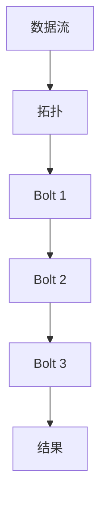

## 1. 背景介绍

在当今世界，数据是一种新的货币。它可以为我们提供无尽的知识和见解，帮助我们更好地理解世界，并优化我们的决策过程。然而，处理和分析大量数据并不是一件容易的事情，尤其是在实时环境中。这就是StormBolt的价值所在。

StormBolt是一种新的实时数据处理框架，它可以处理大量的数据流，并在几毫秒内生成结果。不同于传统的批处理系统，StormBolt可以实时处理数据，使得它在许多实际场景中都有着广泛的应用。

## 2. 核心概念与联系

StormBolt的核心概念包括流、拓扑和Bolt。流是数据的连续流动，拓扑是流的处理过程，Bolt是拓扑中的处理节点。

在StormBolt中，数据流通过拓扑，并在每个Bolt中进行处理。每个Bolt都可以处理一个或多个流，并将结果发送到下一个Bolt。这种方式使得数据处理过程可以并行进行，大大提高了处理速度。



## 3. 核心算法原理具体操作步骤

StormBolt的核心算法是基于流的处理。每个Bolt都是一个处理节点，它会接收一个或多个流，并对这些流进行处理。处理的结果会被发送到下一个Bolt，形成一个处理链。

在实际操作中，我们需要定义拓扑，即数据处理的流程。每个拓扑都由多个Bolt组成，每个Bolt都有一个特定的任务，例如过滤数据、聚合数据或者转换数据。

以下是一个简单的拓扑示例：

```java
TopologyBuilder builder = new TopologyBuilder();

builder.setSpout("spout", new RandomSentenceSpout(), 5);

builder.setBolt("split", new SplitSentence(), 8)
       .shuffleGrouping("spout");

builder.setBolt("count", new WordCount(), 12)
       .fieldsGrouping("split", new Fields("word"));
```

在这个示例中，我们定义了一个拓扑，它由三个Bolt组成：一个Spout，一个SplitSentence和一个WordCount。Spout是数据的源头，它会生成随机的句子。SplitSentence会接收这些句子，并将它们分割成单词。WordCount会接收这些单词，并计算每个单词的数量。

## 4. 数学模型和公式详细讲解举例说明

在StormBolt中，我们通常使用队列理论来描述和分析数据流的处理过程。队列理论是一种数学模型，它可以帮助我们理解和优化数据处理的过程。

根据队列理论，我们可以得到以下公式：

- 平均等待时间：$W = \frac{1}{\mu - \lambda}$
- 平均队列长度：$L = \lambda \times W$

其中，$\lambda$ 是到达率，即每秒到达的数据量；$\mu$ 是服务率，即每秒处理的数据量。

通过这些公式，我们可以理解数据处理的过程，并优化我们的拓扑，以提高数据处理的效率。

## 5. 项目实践：代码实例和详细解释说明

以下是一个使用StormBolt的代码示例：

```java
public class WordCountTopology {
    public static void main(String[] args) {
        TopologyBuilder builder = new TopologyBuilder();

        builder.setSpout("spout", new RandomSentenceSpout(), 5);

        builder.setBolt("split", new SplitSentence(), 8)
               .shuffleGrouping("spout");

        builder.setBolt("count", new WordCount(), 12)
               .fieldsGrouping("split", new Fields("word"));

        Config conf = new Config();
        conf.setDebug(true);

        LocalCluster cluster = new LocalCluster();
        cluster.submitTopology("word-count", conf, builder.createTopology());

        Utils.sleep(10000);
        cluster.killTopology("word-count");
        cluster.shutdown();
    }
}
```

在这个示例中，我们首先创建了一个拓扑，然后通过LocalCluster提交这个拓扑。在提交拓扑后，StormBolt会开始处理数据，并在10秒后停止。

## 6. 实际应用场景

StormBolt在许多实际场景中都有广泛的应用。例如，它可以用于实时日志处理，通过分析日志数据，我们可以实时地了解系统的运行状态。此外，StormBolt也可以用于实时数据分析，例如实时股票分析、实时交通分析等。

## 7. 工具和资源推荐

如果你想深入学习和使用StormBolt，以下是一些有用的资源：

- Apache Storm：StormBolt的官方网站，提供了详细的文档和教程。
- Storm Applied：一本关于StormBolt的书籍，详细介绍了StormBolt的使用和应用。
- Storm in Action：另一本关于StormBolt的书籍，更加深入地介绍了StormBolt的原理和应用。

## 8. 总结：未来发展趋势与挑战

随着数据量的不断增长，实时数据处理的需求也在增加。StormBolt作为一种新的实时数据处理框架，有着广阔的应用前景。然而，如何处理更大的数据量，如何提高处理速度，如何保证数据的准确性等，都是StormBolt面临的挑战。

## 9. 附录：常见问题与解答

1. **StormBolt是什么？**

StormBolt是一种实时数据处理框架，它可以处理大量的数据流，并在几毫秒内生成结果。

2. **StormBolt如何工作？**

StormBolt通过定义拓扑（数据处理的流程）来处理数据。每个拓扑都由多个Bolt组成，每个Bolt都有一个特定的任务，例如过滤数据、聚合数据或者转换数据。

3. **StormBolt有哪些应用场景？**

StormBolt在许多实际场景中都有广泛的应用，例如实时日志处理、实时数据分析等。

作者：禅与计算机程序设计艺术 / Zen and the Art of Computer Programming