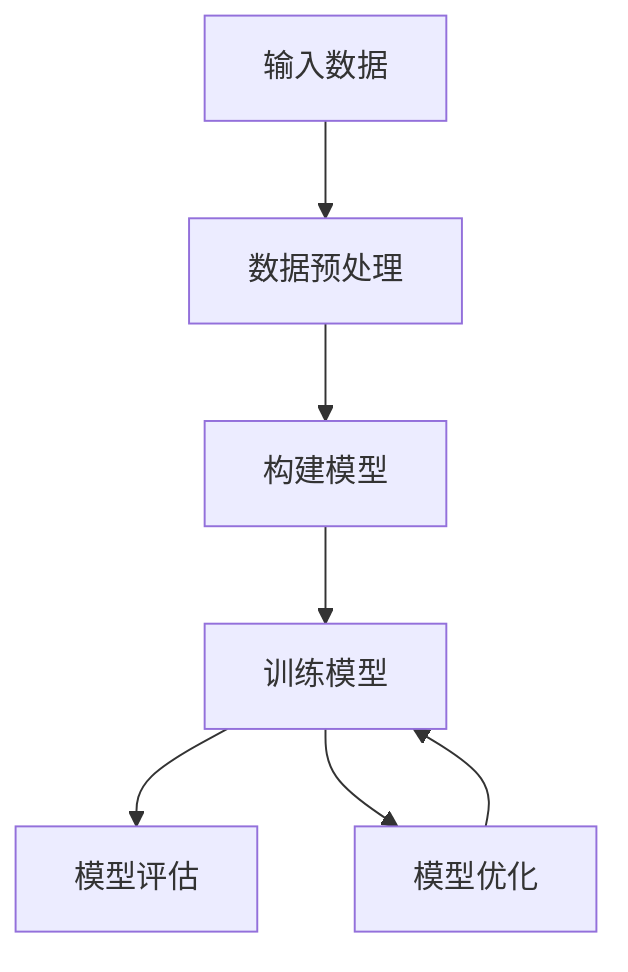

## 1.背景介绍

TensorFlow，这个名字已经成为了我们在人工智能领域中无法回避的一个重要词汇。作为一个强大的开源软件库，它为我们提供了一个用于进行高性能数值计算的框架，并且能够支持各种复杂的机器学习和深度学习算法。那么，它是如何做到这一切的呢？这篇文章将深入探讨TensorFlow的原理和实战案例。

## 2.核心概念与联系

在开始深入理解TensorFlow之前，我们需要了解一些核心的概念。首先，TensorFlow中的"Tensor"指的是一个多维数组，而"Flow"则表示的是计算模型——数据流图。在数据流图中，节点代表数学操作，线表示节点之间的数据传递关系，数据就是Tensor。



## 3.核心算法原理具体操作步骤

TensorFlow的运行过程可以分为两个阶段：构建阶段和执行阶段。在构建阶段，我们定义数据流图；在执行阶段，我们使用会话来运行图中的操作。

## 4.数学模型和公式详细讲解举例说明

在TensorFlow中，我们经常使用的一个数学模型就是神经网络模型。例如，对于一个简单的全连接神经网络，我们可以用下面的公式来表示：

$$
y = \sigma(Wx + b)
$$

其中，$W$是权重矩阵，$x$是输入向量，$b$是偏置向量，$\sigma$是激活函数，$y$是输出向量。

## 5.项目实践：代码实例和详细解释说明

接下来，我们将通过一个简单的线性回归模型的实例来演示TensorFlow的使用。

```python
import tensorflow as tf
# 定义输入和参数
x = tf.constant([[0.7, 0.5]])
w1 = tf.Variable(tf.random_normal([2, 3], stddev=1, seed=1))
w2 = tf.Variable(tf.random_normal([3, 1], stddev=1, seed=1))
# 定义前向传播过程
a = tf.matmul(x, w1)
y = tf.matmul(a, w2)
# 使用会话计算结果
with tf.Session() as sess:
    init_op = tf.global_variables_initializer()
    sess.run(init_op)
    print("y in TensorFlow is:\n", sess.run(y))
```

这段代码首先定义了输入数据和参数，然后定义了前向传播过程，最后使用会话来计算结果。

## 6.实际应用场景

TensorFlow广泛应用于各种领域，包括语音识别、图像识别、自然语言处理等等。例如，Google的语音搜索就使用了TensorFlow来完成语音识别。

## 7.工具和资源推荐

除了TensorFlow本身，还有很多其他的工具和资源可以帮助我们更好地使用TensorFlow，例如TensorBoard可以帮助我们可视化数据流图，TFX则是一个用于生产环境的TensorFlow扩展。

## 8.总结：未来发展趋势与挑战

TensorFlow的未来发展趋势将更加注重易用性、性能和跨平台的能力。同时，也面临着一些挑战，比如如何处理大规模的数据，如何提高计算效率等。

## 9.附录：常见问题与解答

在这个部分，我将回答一些关于TensorFlow的常见问题。

作者：禅与计算机程序设计艺术 / Zen and the Art of Computer Programming