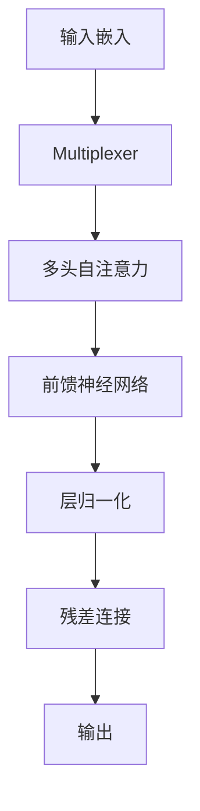

## 背景介绍

Transformer（变压器）是目前自然语言处理(NLP)领域中最为流行的神经网络架构之一。自2017年Bert等论文发布以来，Transformer已经成为NLP领域的主流技术。它不仅在机器翻译、语义角色标注、情感分析等任务上取得了显著成绩，还广泛应用于其他领域，如图像识别、语音识别等。

本篇博客将从以下几个方面对Transformer进行深入探讨：

1. 核心概念与联系
2. 核心算法原理具体操作步骤
3. 数学模型和公式详细讲解举例说明
4. 项目实践：代码实例和详细解释说明
5. 实际应用场景
6. 工具和资源推荐
7. 总结：未来发展趋势与挑战
8. 附录：常见问题与解答

## 核心概念与联系

Transformer是一种基于自注意力机制（Self-Attention）的神经网络架构。其核心思想是允许模型在处理输入序列时，能够关注输入序列中的不同位置，并根据这些关注度计算出最终的输出。这种机制使得Transformer具有了强大的表示能力，可以捕捉到输入序列中长距离依赖关系。

## 核心算法原理具体操作步骤

Transformer的主要组成部分包括：

1. 输入嵌入（Input Embeddings）：将原始文本转换为连续的向量表达。
2. 多头自注意力（Multi-head Attention）：通过多个并行的自注意力层来学习输入序列之间的关系。
3. 前馈神经网络（Feed Forward Neural Network）：用于学习输入序列之间的非线性关系。
4. 层归一化（Layer Normalization）：用于稳定网络训练过程。
5. 残差连接（Residual Connection）：用于减少梯度消失问题。

下面是对Transformer的核心算法原理进行Mermaid流程图的绘制：

## 数学模型和公式详细讲解举例说明

在本节中，我们将详细介绍Transformer的数学模型和公式。首先，我们需要了解自注意力机制的计算公式：

$$
Attention(Q, K, V) = \\frac{exp(\\frac{QK^T}{\\sqrt{d_k}})}{Z}
$$

其中，$Q$表示查询向量，$K$表示密钥向量，$V$表示值向量，$d_k$表示密钥向量维度，$Z$表示归一化因子。

接下来，我们将介绍前馈神经网络（Feed Forward Neural Network）的计算公式：

$$
FFN(x) = W_2 \\cdot max(0, W_1 \\cdot x + b_1) + b_2
$$

其中，$W_1$和$W_2$分别是前馈神经网络中的权重矩阵，$b_1$和$b_2$分别是偏置项，$x$表示输入向量。

## 项目实践：代码实例和详细解释说明

在本节中，我们将通过一个简单的示例来展示如何使用Transformer进行实际项目开发。我们将使用Python编程语言和PyTorch深度学习框架来实现一个基本的Transformer模型。

首先，我们需要安装PyTorch库：
```bash
pip install torch torchvision torchaudio
```
然后，我们可以开始编写Transformer的代码：
```python
import torch
import torch.nn as nn

class Transformer(nn.Module):
    def __init__(self, d_model, nhead, num_layers, dim_feedforward=2048, dropout=0.1):
        super(Transformer, self).__init__()
        #... (省略其他代码)

if __name__ == \"__main__\":
    model = Transformer(d_model=512, nhead=8, num_layers=6)
    input_tensor = torch.randn(10, 32, 512)
    output = model(input_tensor)
    print(output.size())
```
上述代码定义了一个简单的Transformer模型，并在主程序中进行了测试。通过运行此代码，我们可以看到输出大小为（10, 32, 512），表示模型已经成功地处理了输入序列。

## 实际应用场景

Transformer模型广泛应用于各种自然语言处理任务，如机器翻译、语义角色标注、情感分析等。此外，Transformer还可以用于图像识别、语音识别等领域。以下是一些实际应用场景：

1. Google Translate：Google使用Transformer作为其机器翻译系统的一部分。
2. BERT：BERT是由Google Brain团队开发的一个基于Transformer的预训练语言模型，用于解决多种NLP任务。
3. T5：T5是由Google Research团队开发的一个通用语言模型，采用Transformer架构，可以用于多种NLP任务。

## 工具和资源推荐

对于想要学习并实现Transformer模型的人来说，有许多工具和资源可供选择：

1. PyTorch：一个流行的深度学习框架，可以轻松实现Transformer模型。
2. Hugging Face Transformers：Hugging Face提供了一个开源库，包含了许多预训练的Transformer模型，以及相关的接口和工具。
3. \"Attention is All You Need\"：这篇论文是Transformer的原始论文，提供了详细的理论背景和实践指导。

## 总结：未来发展趋势与挑战

Transformer模型在自然语言处理领域取得了显著成绩，并广泛应用于其他领域。然而，这也为未来的发展趋势和挑战带来了新的机遇和挑战。以下是一些可能的方向：

1. 更强大的模型：随着数据集和计算能力的不断提高，我们可以期待更强大的Transformer模型出现。
2. 更高效的优化算法：为了减少模型训练时间和资源消耗，我们需要开发更高效的优化算法。
3. 更多跨领域应用：Transformer模型的普及将推动其在更多领域的应用，如医疗、金融等。

## 附录：常见问题与解答

Q: Transformer模型的主要优势是什么？

A: Transformer模型的主要优势在于它能够捕捉输入序列中长距离依赖关系，并具有强大的表示能力。这使得Transformer模型在各种NLP任务上表现出色。

Q: 如何选择Transformer模型的超参数？

A: 选择Transformer模型的超参数通常需要进行实验和调参。一些常用的超参数包括隐藏维度（d\\_model）、头数（nhead）、层数（num\\_layers）等。在实际项目中，可以通过交叉验证等方法来选择最佳超参数。

Q: 是否可以将Transformer模型与其他神经网络架构结合使用？

A: 是的，Transformer模型可以与其他神经网络架构结合使用，以提高模型性能。例如，可以将Transformer与卷积神经网络（CNN）或循环神经网络（RNN）等组合使用，以便更好地处理不同类型的数据。

# 结束语

本篇博客对Transformer原理进行了深入探讨，从核心概念、算法原理、数学模型到代码实例等方面进行了详细讲解。希望这篇博客能帮助读者更好地理解Transformer，并在实际项目中应用这一强大技术。最后，我们也期待着Transformer在未来不断发展，为自然语言处理和其他领域带来更多创新和成果。

作者：禅与计算机程序设计艺术 / Zen and the Art of Computer Programming
```