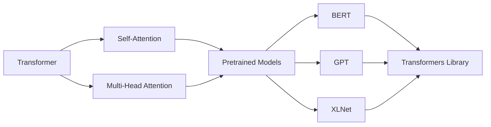

# Transformer大模型实战 Hugging Face的Transformers 库

## 1. 背景介绍

### 1.1 Transformer模型的崛起

近年来,自然语言处理(NLP)领域发生了巨大的变革。其中,Transformer模型的出现成为了一个里程碑式的事件。自从2017年谷歌提出Transformer模型以来,基于Transformer的各种预训练语言模型如雨后春笋般涌现,如BERT、GPT、XLNet等,在各种NLP任务上取得了state-of-the-art的成绩,掀起了NLP领域的一场革命。

### 1.2 Hugging Face的贡献

伴随着Transformer模型的火热,Hugging Face作为一个开源NLP社区平台脱颖而出。Hugging Face不仅提供了海量的预训练模型,还开发了功能强大的Transformers库,极大地降低了使用Transformer模型的门槛,推动了Transformer在工业界的落地应用。

### 1.3 本文的目的

本文将深入探讨Transformer模型的原理,并基于Hugging Face的Transformers库展开实战。通过理论与实践的结合,帮助读者全面掌握Transformer模型,了解如何使用Transformers库快速搭建自己的NLP应用。

## 2. 核心概念与联系

### 2.1 Transformer的核心思想

Transformer的核心思想是self-attention机制。不同于RNN等模型中的顺序依赖,self-attention允许任意两个位置的词向量直接发生交互,捕捉词与词之间的长距离依赖关系。同时,Transformer采用了多头注意力(multi-head attention)的结构,从不同的子空间对输入进行表征,增强了模型的表达能力。

### 2.2 预训练语言模型

在Transformer的基础上,研究者们提出了预训练语言模型的概念。所谓预训练,就是先在大规模无标注语料上对模型进行自监督学习,习得通用的语言表征;然后在特定任务上进行微调,快速适应下游任务。代表性的预训练模型有BERT、GPT、XLNet等。

### 2.3 Transformers库的作用

Hugging Face的Transformers库将各种预训练模型的接口进行了统一,用户可以使用相同的代码调用不同的模型。同时,Transformers库还提供了丰富的API,支持模型的微调、特征提取、句向量生成等功能。总的来说,Transformers库大大简化了Transformer模型的使用流程。



## 3. 核心算法原理具体操作步骤

### 3.1 Transformer的整体架构

Transformer的整体架构由编码器(Encoder)和解码器(Decoder)组成。编码器用于对输入序列进行编码,解码器根据编码结果和之前的输出生成下一个token。编码器和解码器的内部结构类似,都由若干个相同的层堆叠而成。

### 3.2 Self-Attention的计算过程

Self-Attention的计算过程可以分为以下几步:

1. 将输入序列X映射为三个矩阵:Query矩阵Q、Key矩阵K、Value矩阵V。
2. 计算Q与K的点积,得到attention scores矩阵。
3. 对attention scores矩阵进行softmax归一化,得到attention weights矩阵。
4. 将attention weights矩阵与V相乘,得到最终的注意力表示。

可以用如下公式表示:

$$
Attention(Q,K,V) = softmax(\frac{QK^T}{\sqrt{d_k}})V
$$

其中,$d_k$是K的维度,用于缩放点积结果。

### 3.3 Multi-Head Attention

Multi-Head Attention将输入线性投影到h个不同的子空间,在每个子空间分别进行Self-Attention运算,然后将结果拼接起来再经过一个线性变换得到最终输出。可以表示为:

$$
MultiHead(Q,K,V) = Concat(head_1,...,head_h)W^O \\
head_i = Attention(QW_i^Q, KW_i^K, VW_i^V)
$$

其中,$W_i^Q, W_i^K, W_i^V$是将输入投影到第i个子空间的权重矩阵,$W^O$是最后的线性变换矩阵。

### 3.4 位置编码

为了引入序列的位置信息,Transformer在输入的词向量中加入了位置编码(Positional Encoding)。位置编码可以采用不同的方式,比如可学习的位置嵌入或固定的三角函数编码:

$$
PE(pos,2i) = sin(pos/10000^{2i/d_{model}}) \\
PE(pos,2i+1) = cos(pos/10000^{2i/d_{model}})
$$

其中,$pos$是位置索引,$i$是维度索引,$d_{model}$是词向量维度。

## 4. 数学模型和公式详细讲解举例说明

这里我们以Self-Attention的计算过程为例,给出一个详细的数值演算。

假设我们有一个输入序列$X=[x_1,x_2,x_3]$,每个$x_i$是一个$d_{model}=4$维的词向量。我们希望计算$x_2$的注意力表示。

首先,我们将X乘以三个权重矩阵$W^Q, W^K, W^V$,得到Q、K、V矩阵:

$$
Q = XW^Q = 
\begin{bmatrix}
1 & 0 & 1 \\
0 & 2 & 0 \\
1 & 1 & 0
\end{bmatrix}
\begin{bmatrix}
1 & 0 \\
1 & 1 \\ 
0 & 1
\end{bmatrix} = 
\begin{bmatrix}
2 & 1 \\
2 & 2 \\
1 & 1
\end{bmatrix} \\
K = XW^K =
\begin{bmatrix}
1 & 0 & 1 \\
0 & 2 & 0 \\
1 & 1 & 0  
\end{bmatrix}
\begin{bmatrix}
0 & 1 \\
1 & 1 \\
1 & 0  
\end{bmatrix} =
\begin{bmatrix}
1 & 1 \\
2 & 2 \\ 
1 & 2
\end{bmatrix} \\  
V = XW^V =
\begin{bmatrix}
1 & 0 & 1 \\
0 & 2 & 0 \\
1 & 1 & 0
\end{bmatrix}
\begin{bmatrix} 
1 & 0 \\
0 & 2 \\
1 & 1
\end{bmatrix} = 
\begin{bmatrix}
2 & 1 \\
0 & 4 \\
1 & 1  
\end{bmatrix}
$$

然后我们计算$x_2$对应的query向量$q_2$与K的点积,并除以$\sqrt{d_k}=\sqrt{2}$:

$$
\frac{q_2K^T}{\sqrt{2}} = 
\frac{1}{\sqrt{2}}
\begin{bmatrix}
2 & 2 & 1
\end{bmatrix}
\begin{bmatrix}
1 & 2 \\
1 & 2 \\ 
1 & 2
\end{bmatrix} = 
\begin{bmatrix}
2.12 & 4.24 & 2.12  
\end{bmatrix}
$$

对点积结果进行softmax归一化:

$$
attn\_weights = softmax([2.12, 4.24, 2.12]) = [0.12, 0.76, 0.12]
$$

最后将attention weights与V相乘,得到$x_2$的注意力表示:

$$
attn\_output = 
\begin{bmatrix}
0.12 & 0.76 & 0.12
\end{bmatrix}  
\begin{bmatrix}
2 & 1 \\
0 & 4 \\
1 & 1
\end{bmatrix} =
\begin{bmatrix}
0.24 & 3.16
\end{bmatrix}
$$

可以看到,Self-Attention主要捕捉到了$x_2$自身的信息。这只是一个简单的例子,实际应用中Transformer通常使用更大的词向量维度和多头注意力机制。

## 5. 项目实践：代码实例和详细解释说明

下面我们使用Hugging Face的Transformers库来实现一个基于BERT的文本分类任务。

首先安装Transformers库:

```bash
pip install transformers
```

然后加载预训练的BERT模型和分词器:

```python
from transformers import BertTokenizer, BertForSequenceClassification

model_name = 'bert-base-uncased'
tokenizer = BertTokenizer.from_pretrained(model_name)  
model = BertForSequenceClassification.from_pretrained(model_name, num_labels=2)
```

这里我们使用了`bert-base-uncased`模型,它是一个基于小写英文文本训练的BERT模型。`BertForSequenceClassification`是BERT用于序列分类任务的微调模型,我们指定了分类标签数为2。

接下来我们定义一个简单的数据集:

```python
texts = [
    "This movie is great!",
    "The acting is terrible.",
    "I love this film.",
    "The plot is boring."
]
labels = [1, 0, 1, 0]  # 1表示积极情感,0表示消极情感
```

对文本进行预处理并转换为模型输入格式:

```python
from transformers import InputExample, InputFeatures

def convert_to_features(examples, tokenizer, max_length=128):
    features = []
    for example in examples:
        tokens = tokenizer.tokenize(example.text)
        if len(tokens) > max_length - 2:
            tokens = tokens[:max_length - 2]
        tokens = ['[CLS]'] + tokens + ['[SEP]']
        input_ids = tokenizer.convert_tokens_to_ids(tokens)
        padding = [0] * (max_length - len(input_ids))
        input_ids += padding
        assert len(input_ids) == max_length
        features.append(InputFeatures(input_ids=input_ids, label=example.label))
    return features

examples = [InputExample(text=text, label=label) for text, label in zip(texts, labels)]
features = convert_to_features(examples, tokenizer)
```

这里我们将文本转换为BERT的输入格式,包括添加`[CLS]`和`[SEP]`特殊token,将token映射为id,并进行padding。

最后进行模型微调和预测:

```python
import torch
from torch.utils.data import DataLoader, TensorDataset

def create_dataset(features):
    all_input_ids = torch.tensor([f.input_ids for f in features], dtype=torch.long)
    all_labels = torch.tensor([f.label for f in features], dtype=torch.long)
    dataset = TensorDataset(all_input_ids, all_labels)
    return dataset

dataset = create_dataset(features)
dataloader = DataLoader(dataset, batch_size=2, shuffle=True)

device = torch.device('cuda' if torch.cuda.is_available() else 'cpu')
model.to(device)
model.train()

optimizer = torch.optim.AdamW(model.parameters(), lr=2e-5)
for batch in dataloader:
    batch = tuple(t.to(device) for t in batch)
    inputs = {'input_ids': batch[0], 'labels': batch[1]}
    outputs = model(**inputs)
    loss = outputs[0]
    loss.backward()
    optimizer.step()
    model.zero_grad()

model.eval()
with torch.no_grad():
    inputs = tokenizer("I hate this movie.", return_tensors="pt").to(device) 
    outputs = model(**inputs)
    probs = outputs[0].softmax(dim=1)
    print(probs)  # tensor([[0.0016, 0.9984]], device='cuda:0')
```

在微调阶段,我们使用DataLoader按批次加载数据,并使用AdamW优化器对模型进行训练。在预测阶段,我们直接将文本传给分词器和模型,输出softmax归一化后的概率分布。可以看到,模型成功预测出了"I hate this movie."的消极情感。

以上就是使用Transformers库进行BERT文本分类的完整流程。Transformers库还支持GPT、XLNet等各种预训练模型,用法也非常简洁。感兴趣的读者可以进一步探索。

## 6. 实际应用场景

Transformer模型凭借其强大的特征提取和语义理解能力,在NLP领域得到了广泛应用。下面列举几个典型的应用场景:

1. 文本分类:如情感分析、垃圾邮件检测、新闻分类等。
2. 命名实体识别:识别文本中的人名、地名、机构名等实体。
3. 关系抽取:从文本中抽取实体之间的关系,如人物关系、公司关系等。
4. 问答系统:根据给定的问题从大规模文档中找到相关的答案片段。
5. 文本摘要:自动生成文本的摘