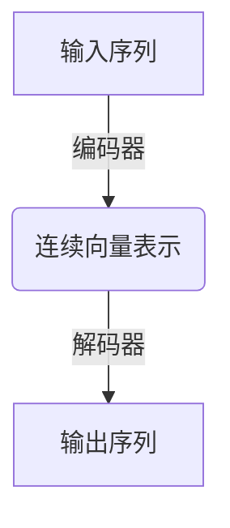
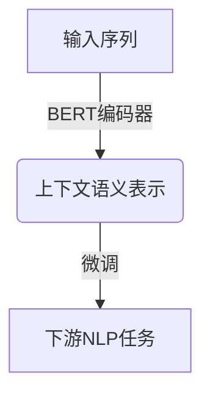
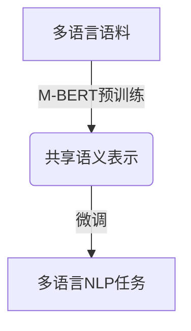

# Transformer大模型实战 M-BERT 模型的多语言表现

## 1.背景介绍

在自然语言处理(NLP)领域,Transformer模型因其出色的性能而备受关注。作为Transformer模型的一种变体,多语言BERT(M-BERT)模型展现出了强大的多语言处理能力,可以有效地处理跨语言的NLP任务。

语言的多样性给NLP带来了巨大的挑战。不同语言在语法、语义和表达方式上存在显著差异,使得构建通用的NLP模型变得异常困难。传统的NLP模型通常专注于单一语言,难以直接迁移到其他语言环境中。而M-BERT模型则通过预训练的方式,在大规模多语言语料库上学习语言的共性特征,从而获得跨语言的泛化能力。

M-BERT模型的核心思想是基于Transformer的自注意力机制,捕捉不同语言之间的语义关联,从而实现有效的跨语言表示。通过共享底层参数,M-BERT可以在多语言环境下进行高效的迁移学习,避免了为每种语言单独训练模型的昂贵成本。

## 2.核心概念与联系

### 2.1 Transformer模型

Transformer是一种全新的基于自注意力机制的序列到序列(Seq2Seq)模型,用于解决机器翻译等NLP任务。它完全摒弃了传统的基于RNN或CNN的架构,而是依赖于自注意力机制来捕捉输入序列中任意两个位置之间的长程依赖关系。

Transformer的核心组件包括编码器(Encoder)和解码器(Decoder),它们都由多个相同的层组成。每一层都包含一个多头自注意力子层和一个前馈全连接子层。编码器将输入序列映射到一系列连续的向量表示,而解码器则基于这些向量表示生成输出序列。



### 2.2 BERT模型

BERT(Bidirectional Encoder Representations from Transformers)是一种基于Transformer的双向编码器模型,用于生成上下文相关的词向量表示。与传统的单向语言模型不同,BERT可以同时捕捉输入序列中每个词的左右上下文信息,从而产生更加准确和丰富的语义表示。

BERT的核心思想是使用Masked Language Model(MLM)和Next Sentence Prediction(NSP)两种预训练任务,在大规模无标注语料库上进行自监督学习。MLM通过随机掩蔽部分输入词,并基于上下文预测被掩蔽的词,从而学习词的上下文语义表示;NSP则通过预测两个句子是否相邻,捕捉句子之间的关系。



### 2.3 M-BERT模型

M-BERT(Multilingual BERT)是BERT模型的多语言扩展版本,它在BERT的基础上,引入了共享词汇表和多语言语料的预训练策略,从而获得了跨语言的泛化能力。

在预训练阶段,M-BERT使用了来自104种语言的Wikipedia语料,并将所有语言的文本合并为单个语料库进行训练。通过共享底层参数,M-BERT可以学习到不同语言之间的共性特征,从而实现有效的跨语言迁移。

在微调阶段,M-BERT可以直接应用于各种多语言NLP任务,如机器翻译、跨语言文本分类等,无需为每种语言单独训练模型。这大大降低了模型的训练成本,并提高了模型的泛化能力。



## 3.核心算法原理具体操作步骤

M-BERT模型的核心算法原理可以分为两个阶段:预训练和微调。

### 3.1 预训练阶段

在预训练阶段,M-BERT模型在大规模多语言语料库上进行自监督学习,以获得通用的语义表示能力。具体操作步骤如下:

1. **语料准备**: 收集来自104种语言的Wikipedia语料,并将它们合并为单个语料库。每个语句前添加特殊的语言标记,以标识语言类型。

2. **词汇表构建**: 基于合并后的语料库,构建共享的WordPiece词汇表。这种子词分割方式可以有效地处理不同语言中的未知词。

3. **MLM预训练**: 对合并后的语料库进行MLM(Masked Language Model)预训练。具体做法是随机掩蔽部分输入词,并基于上下文预测被掩蔽的词。这一步可以学习到词的上下文语义表示。

4. **NSP预训练**: 对合并后的语料库进行NSP(Next Sentence Prediction)预训练。具体做法是从语料库中随机抽取两个句子,有50%的概率将它们连接在一起,然后预测它们是否相邻。这一步可以捕捉句子之间的关系。

5. **联合训练**: 将MLM和NSP两个预训练任务联合进行训练,使用交替优化的方式更新模型参数。

通过上述步骤,M-BERT模型可以在大规模多语言语料库上学习到通用的语义表示,为后续的微调阶段奠定基础。

### 3.2 微调阶段

在微调阶段,M-BERT模型将在特定的多语言NLP任务上进行进一步的训练,以获得更好的性能表现。具体操作步骤如下:

1. **任务数据准备**: 收集特定多语言NLP任务的训练数据,如机器翻译、文本分类等。

2. **数据预处理**: 对任务数据进行必要的预处理,如分词、填充、构建输入表示等。

3. **模型初始化**: 将预训练好的M-BERT模型作为初始化模型,并根据任务需求对模型进行适当的修改,如添加任务特定的输出层。

4. **微调训练**: 在任务数据上对M-BERT模型进行微调训练,通过监督学习的方式优化模型参数,使其适应特定的任务。

5. **模型评估**: 在任务的验证集或测试集上评估微调后的M-BERT模型的性能表现。

6. **模型部署**: 将训练好的M-BERT模型部署到实际的生产环境中,用于处理多语言NLP任务。

通过微调阶段,M-BERT模型可以在特定的多语言NLP任务上获得更好的性能表现,充分发挥其跨语言泛化能力。

## 4.数学模型和公式详细讲解举例说明

在M-BERT模型中,自注意力机制扮演着关键的角色。它能够捕捉输入序列中任意两个位置之间的长程依赖关系,从而产生更加准确和丰富的语义表示。下面我们将详细介绍自注意力机制的数学原理。

### 4.1 Scaled Dot-Product Attention

自注意力机制的核心是Scaled Dot-Product Attention,它计算查询(Query)和键(Key)之间的相似性,并基于该相似性对值(Value)进行加权求和,得到输出表示。具体计算公式如下:

$$\text{Attention}(Q, K, V) = \text{softmax}\left(\frac{QK^T}{\sqrt{d_k}}\right)V$$

其中:

- $Q$是查询矩阵(Query Matrix)
- $K$是键矩阵(Key Matrix)
- $V$是值矩阵(Value Matrix)
- $d_k$是缩放因子,用于防止内积过大导致的梯度消失问题

在实践中,查询、键和值通常由输入序列的嵌入表示经过线性变换得到,如下所示:

$$\begin{aligned}
Q &= XW_Q \\
K &= XW_K \\
V &= XW_V
\end{aligned}$$

其中$X$是输入序列的嵌入表示,而$W_Q$、$W_K$和$W_V$分别是查询、键和值的线性变换矩阵。

### 4.2 Multi-Head Attention

为了捕捉不同的位置关系,Transformer引入了Multi-Head Attention机制。它将注意力分成多个子空间,每个子空间单独计算Scaled Dot-Product Attention,然后将所有子空间的结果进行拼接。具体计算公式如下:

$$\text{MultiHead}(Q, K, V) = \text{Concat}(head_1, \dots, head_h)W^O$$
$$\text{where } head_i = \text{Attention}(QW_i^Q, KW_i^K, VW_i^V)$$

其中:

- $h$是头数(Head Number)
- $W_i^Q$、$W_i^K$和$W_i^V$分别是第$i$个头的查询、键和值的线性变换矩阵
- $W^O$是一个可学习的线性变换矩阵,用于将多头注意力的结果进行投影

通过Multi-Head Attention机制,Transformer可以从不同的子空间捕捉不同的位置关系,从而获得更加丰富和准确的语义表示。

### 4.3 案例分析

让我们以一个简单的英语-中文机器翻译任务为例,来说明M-BERT模型是如何利用自注意力机制捕捉跨语言的语义关系的。

假设输入序列是"I love you"(英语),目标是将其翻译为"我爱你"(中文)。在M-BERT模型中,输入序列首先会被映射为词嵌入表示$X$,然后通过线性变换得到查询$Q$、键$K$和值$V$。

接下来,模型会计算每个词与其他词之间的注意力分数,即$\text{softmax}(\frac{QK^T}{\sqrt{d_k}})$。这些注意力分数反映了不同词之间的相关性。例如,"I"和"you"之间的注意力分数可能较高,因为它们之间存在语义关联。

然后,模型将注意力分数与值$V$进行加权求和,得到每个位置的输出表示。这些输出表示捕捉了输入序列中每个词的上下文语义信息。

最后,模型会基于这些输出表示生成目标序列"我爱你"。由于M-BERT在预训练阶段已经学习到了英语和中文的共性特征,因此它可以有效地捕捉两种语言之间的语义关联,从而实现准确的跨语言翻译。

通过上述案例,我们可以看到自注意力机制在M-BERT模型中扮演着关键的角色,它能够捕捉输入序列中任意两个位置之间的长程依赖关系,从而产生更加准确和丰富的语义表示,为多语言NLP任务的处理奠定了坚实的基础。

## 5.项目实践:代码实例和详细解释说明

为了更好地理解M-BERT模型的实际应用,我们将提供一个基于Hugging Face Transformers库的代码示例,演示如何在Python中加载和使用M-BERT模型进行文本分类任务。

### 5.1 安装依赖库

首先,我们需要安装必要的Python库,包括Transformers、Datasets和Scikit-Learn。可以使用pip进行安装:

```bash
pip install transformers datasets scikit-learn
```

### 5.2 加载数据集

在这个示例中,我们将使用Hugging Face提供的XNLI(Cross-lingual Natural Language Inference)数据集。XNLI是一个多语言自然语言推理数据集,包含15种语言的数据。我们将使用其中的英语和中文数据进行演示。

```python
from datasets import load_dataset

dataset = load_dataset("xnli", "zh")
```

### 5.3 数据预处理

接下来,我们需要对数据进行预处理,将文本转换为M-BERT模型可以接受的输入格式。这包括对文本进行分词、填充和构建输入张量等步骤。

```python
from transformers import AutoTokenizer

tokenizer = AutoTokenizer.from_pretrained("bert-base-multilingual-cased")

def preprocess_function(examples):
    return tokenizer(examples["premise"], examples["hypothesis"], truncation=True)

tokenized_datasets = dataset.map(preprocess_function, batched=True)
```

### 5.4 加载M-BERT模型

接下来,我们将从Hugging Face模型库中加载预训练的M-BERT模型。

```python
from transformers import AutoModelForSequenceClassification

model = AutoModelForSequenceClassification.from_pretrained("bert