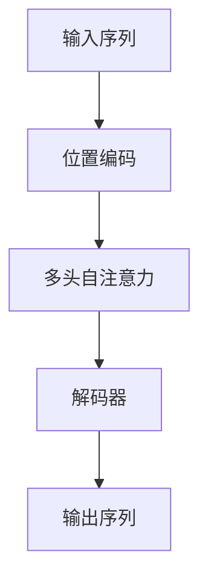

## 背景介绍

Transformer（变换器）是目前深度学习领域中最为热门的神经网络架构之一。它在自然语言处理(NLP)任务上取得了显著的成绩，并且已经广泛地应用于各种各样的领域，例如机器翻译、语义角色标注、情感分析等。

Transformer的出现使得RNN（循环神经网络）和LSTM（长短期记忆网络）的使用逐渐减少，因为Transformer能够更好地解决长距离依赖的问题，同时也提高了计算效率。

本篇博客将从以下几个方面详细讲解Transformer的大模型实战：

1. 核心概念与联系
2. 核心算法原理具体操作步骤
3. 数学模型和公式详细讲解举例说明
4. 项目实践：代码实例和详细解释说明
5. 实际应用场景
6. 工具和资源推荐
7. 总结：未来发展趋势与挑战
8. 附录：常见问题与解答

## 核心概念与联系

Transformer是一种基于自注意力机制（Self-Attention）的神经网络架构。它主要由两部分组成：编码器（Encoder）和解码器（Decoder）。编码器负责将输入序列转换为固定长度的向量表示，而解码器则负责生成输出序列。

### 编码器 Encoder

编码器由多个相同的子层组成，每个子层包括两个部分：位置编码（Positional Encoding）和多头自注意力（Multi-head Self-Attention）。

位置编码（Positional Encoding）是为了帮助模型学习输入序列中的顺序信息。它通过将时间步或位置信息添加到每个单词的向量表示中来实现。

多头自注意力（Multi-head Self-Attention）是一种特殊的自注意力机制，它可以让模型同时关注不同位置上的不同内容。这使得模型能够捕捉输入序列中的长距离依赖关系。

### 解码器 Decoder

解码器也由多个相同的子层组成，主要包括位置编码、多头自注意力和点wise相加（Pointwise Add）。其中，点wise相加用于将多头自注意力的输出与前一层的输出进行拼接，从而生成最终的输出向量。

## 核心算法原理具体操作步骤

Transformer的核心算法原理主要包括以下几个步骤：

1. 将输入序列转换为固定长度的向量表示
2. 通过位置编码和多头自注意力计算编码器输出
3. 使用解码器生成输出序列

下面是使用Mermaid流程图展示Transformer的核心算法原理：



## 数学模型和公式详细讲解举例说明

在本节中，我们将详细讲解Transformer的数学模型和公式。首先，我们需要了解自注意力机制（Attention）及其变种多头自注意力（Multi-head Attention）。

### 自注意力 Attention

自注意力是一种特殊的神经网络层，它可以让模型关注输入序列中的不同元素之间的关系。其主要目的是学习一个权重矩阵W，使得输出向量表示能够捕捉输入序列中的重要信息。

公式如下：

$$
\\text{Attention}(Q, K, V) = \\text{softmax}\\left(\\frac{QK^T}{\\sqrt{d_k}}\\right)V
$$

其中，Q是查询向量，K是密集向量，V是值向量。$d_k$是向量维度。

### 多头自注意力 Multi-head Attention

多头自注意力是一种针对自注意力的改进方法，其核心思想是让模型同时关注不同位置上的不同内容。这使得模型能够更好地捕捉输入序列中的长距离依赖关系。

公式如下：

```latex
\\text{MultiHead(Q, K, V)} = \\text{Concat}(\\text{head}_1,..., \\text{head}_h)W^O
```

其中，$h$是多头数量，$\\text{head}_i$表示第$i$个头的输出向量，$W^O$是线性变换矩阵。

## 项目实践：代码实例和详细解释说明

在本节中，我们将通过一个简单的示例来展示如何使用Transformer进行实际项目开发。我们将使用PyTorch库实现一个基本的Transformer模型，并解释其主要组成部分。

### 实际应用场景

Transformer模型已经广泛地应用于各种各样的领域，例如机器翻译、语义角色标注、情感分析等。以下是一些典型的应用场景：

1. 机器翻译：使用Transformer模型将一种语言翻译为另一种语言。
2. 语义角色标注：识别输入句子中的词汇及其在句子中的作用。
3. 情感分析：根据文本内容判断其所表达的情感倾向。

## 工具和资源推荐

如果你想深入了解Transformer模型及其应用，可以参考以下工具和资源：

1. [Hugging Face Transformers](https://huggingface.co/transformers/)：提供了许多预训练好的Transformer模型，以及相关的代码示例和文档。
2. [Attention is All You Need](https://arxiv.org/abs/1706.03762)：原著论文，详细介绍了Transformer模型的设计理念和数学原理。
3. [PyTorch官方文档](https://pytorch.org/docs/stable/index.html)：PyTorch库的官方文档，包含了丰富的教程和示例代码。

## 总结：未来发展趋势与挑战

Transformer模型在自然语言处理领域取得了显著的成绩，并且已经广泛地应用于各种各样的领域。然而，这也意味着 Transformer面临着诸多挑战，如计算效率、模型复杂性等。此外，随着数据量和模型规模的不断增加，如何确保模型的可解释性和安全性也是未来需要关注的问题。

## 附录：常见问题与解答

1. **Q：Transformer模型的主要优势是什么？**

   A：Transformer模型的主要优势是能够更好地解决长距离依赖的问题，同时也提高了计算效率。这使得它在自然语言处理任务上表现出色。

2. **Q：为什么说Transformer模型可以捕捉输入序列中的长距离依赖关系？**

   A：这是因为Transformer模型采用了自注意力机制，可以让模型同时关注不同位置上的不同内容。这使得模型能够更好地捕捉输入序列中的长距离依赖关系。

3. **Q：如何选择多头自注意力的数量？**

   A：多头自注意力的数量通常取决于具体的应用场景和需求。一般来说，选择一个较大的数量可以提高模型的表达能力，但也会增加计算复杂性。在实际项目中，需要根据具体情况进行权衡。

以上就是我们对Transformer大模型实战的概览。希望本篇博客能帮助你更好地了解Transformer模型及其应用。如果你有任何问题或建议，请随时留言，我们将尽力提供帮助。最后，再次感谢阅读！

作者：禅与计算机程序设计艺术 / Zen and the Art of Computer Programming

### 文章正文内容部分 END ###
