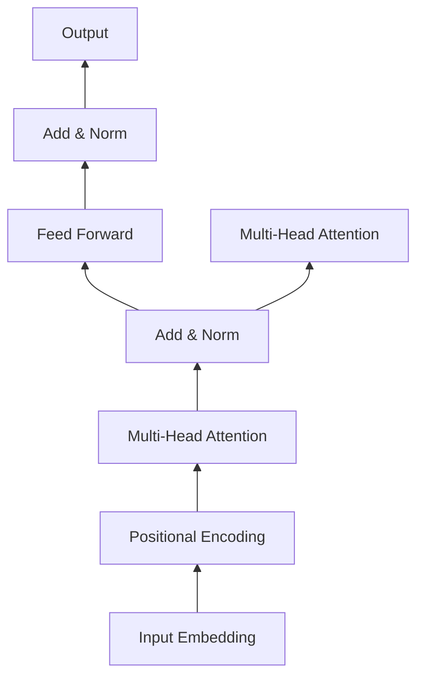

# Transformer架构剖析

## 1. 背景介绍
### 1.1 Transformer的诞生
2017年,Google机器翻译团队在论文《Attention Is All You Need》中首次提出了Transformer模型。Transformer的出现,标志着自然语言处理(NLP)领域从传统的循环神经网络(RNN)为主导,转向了以自注意力机制为核心的全新架构。

### 1.2 Transformer的影响力
Transformer架构的提出,在学术界和工业界都引起了巨大反响。以Transformer为基础,涌现出了一大批高质量的预训练语言模型,如BERT、GPT、XLNet等,大幅推动了NLP技术的发展。同时,Transformer也被广泛应用于语音识别、计算机视觉等其他领域,展现出了强大的泛化能力。

### 1.3 Transformer的优势
与传统的RNN模型相比,Transformer具有以下几个显著优势:

1. 并行计算能力强,训练速度快
2. 能够更好地捕捉长距离依赖关系
3. 不受序列长度限制,适合处理长文本
4. 可解释性强,注意力权重直观反映了词与词之间的关联

## 2. 核心概念与联系
### 2.1 Encoder-Decoder结构
Transformer沿用了传统的Encoder-Decoder结构,由编码器和解码器两部分组成。编码器负责将输入序列X映射为隐藏状态表示Z,解码器根据Z和之前的输出,逐步生成目标序列Y。

### 2.2 Self-Attention
Self-Attention是Transformer的核心,它能够学习序列内部的依赖关系。对于序列中的每个位置,通过计算该位置与其他所有位置的注意力权重,得到一个加权求和的新表示。Self-Attention让模型能够在更大的感受野内捕捉信息。

### 2.3 Multi-Head Attention
Transformer使用Multi-Head Attention,即同时计算多个Self-Attention,每个head关注输入的不同子空间表示。然后将不同head的输出拼接起来,经过线性变换得到最终的注意力表示。Multi-Head Attention增强了模型的表达能力。

### 2.4 位置编码
由于Self-Attention是位置无关的,为了引入序列的位置信息,Transformer在输入embedding中加入了位置编码(Positional Encoding)。位置编码可以是固定的三角函数,也可以设置成可学习的参数。

### 2.5 前馈神经网络
Transformer的Encoder和Decoder中都包含前馈神经网络(Feed-Forward Network)子层,由两个线性变换和ReLU激活函数组成。FFN进一步增加了模型的非线性表达能力。

### 2.6 残差连接与Layer Normalization
Transformer在Self-Attention和FFN子层之后,都使用了残差连接(Residual Connection)和Layer Normalization。残差连接能够缓解深度网络中的梯度消失问题,Layer Normalization有助于稳定训练。

下图展示了Transformer Encoder中各个组件的连接关系:



## 3. 核心算法原理具体操作步骤
### 3.1 Self-Attention计算过程
1. 将输入序列X通过三个线性变换,得到Query矩阵Q,Key矩阵K和Value矩阵V。

$Q = XW^Q, K = XW^K, V = XW^V$

2. 计算Q与K的点积注意力分数,除以 $\sqrt{d_k}$ 缩放,然后做softmax归一化,得到注意力权重矩阵A。

$A = softmax(\frac{QK^T}{\sqrt{d_k}})$

3. 将注意力权重矩阵A与V相乘,得到加权求和的输出矩阵。

$Attention(Q,K,V) = AV$

其中,$d_k$为K的维度。

### 3.2 Multi-Head Attention计算过程
1. 将Q,K,V通过不同的线性变换,得到h组子空间表示 $Q_i,K_i,V_i, i=1,2,...,h$。

$Q_i = QW_i^Q, K_i = KW_i^K, V_i = VW_i^V$

2. 对每组 $Q_i,K_i,V_i$ 分别做Self-Attention,得到h个输出矩阵 $head_i$。

$head_i = Attention(Q_i, K_i, V_i)$

3. 将h个$head_i$拼接起来,经过另一个线性变换得到最终的Multi-Head Attention输出。

$MultiHead(Q,K,V) = Concat(head_1, ..., head_h)W^O$

### 3.3 前馈神经网络计算过程
对Multi-Head Attention的输出进行两个线性变换,中间加ReLU激活函数。

$FFN(x) = max(0, xW_1 + b_1)W_2 + b_2$

### 3.4 残差连接与Layer Normalization
对Multi-Head Attention和FFN的输出,先做残差连接,再做Layer Normalization。

$x + Sublayer(x)$
$LayerNorm(x + Sublayer(x))$

其中,Sublayer可以是Multi-Head Attention或FFN。

## 4. 数学模型和公式详细讲解举例说明
### 4.1 Scaled Dot-Product Attention
在Self-Attention中,使用Scaled Dot-Product Attention计算注意力权重。它首先计算Query与Key的点积相似度,然后除以 $\sqrt{d_k}$ 缩放,接着做softmax归一化得到注意力分布。

$$Attention(Q,K,V) = softmax(\frac{QK^T}{\sqrt{d_k}})V$$

举例说明:
假设有一个长度为4的输入序列,embedding维度为3。Query矩阵Q,Key矩阵K和Value矩阵V分别为:

$$Q = \begin{bmatrix} 1 & 0 & 1 \\ 0 & 1 & 1 \\ 1 & 1 & 0 \\ 0 & 0 & 1 \end{bmatrix}, 
K = \begin{bmatrix} 1 & 1 & 0 \\ 0 & 1 & 1 \\ 1 & 0 & 1 \\ 1 & 0 & 0 \end{bmatrix},
V = \begin{bmatrix} 0 & 1 \\ 1 & 0 \\ 1 & 1 \\ 0 & 0 \end{bmatrix}$$

首先计算 $QK^T$:

$$QK^T = \begin{bmatrix} 
2 & 1 & 1 & 1 \\
1 & 2 & 1 & 0 \\ 
1 & 2 & 2 & 1 \\
1 & 1 & 1 & 1
\end{bmatrix}$$

然后除以 $\sqrt{d_k} = \sqrt{3}$,做softmax归一化:

$$softmax(\frac{QK^T}{\sqrt{3}}) = \begin{bmatrix} 
0.32 & 0.11 & 0.11 & 0.21 \\
0.11 & 0.32 & 0.11 & 0.06 \\ 
0.11 & 0.32 & 0.32 & 0.21 \\
0.21 & 0.21 & 0.21 & 0.32
\end{bmatrix}$$

最后将归一化后的注意力权重矩阵与V相乘:

$$Attention(Q,K,V) = \begin{bmatrix} 
0.32 & 0.11 & 0.11 & 0.21 \\
0.11 & 0.32 & 0.11 & 0.06 \\ 
0.11 & 0.32 & 0.32 & 0.21 \\
0.21 & 0.21 & 0.21 & 0.32
\end{bmatrix} \begin{bmatrix} 0 & 1 \\ 1 & 0 \\ 1 & 1 \\ 0 & 0 \end{bmatrix}
= \begin{bmatrix}
0.43 & 0.43 \\
0.54 & 0.43 \\
0.75 & 0.75 \\ 
0.42 & 0.42
\end{bmatrix}$$

这就是Scaled Dot-Product Attention的计算过程。可以看到,输出的每一行都是输入序列的一个加权求和表示,权重由当前位置与其他位置的相似度决定。

### 4.2 Multi-Head Attention
Multi-Head Attention用多组参数对Q,K,V做线性变换,生成多个子空间表示,然后对每个子空间分别做Self-Attention,最后拼接求和得到输出。设有h个head,每个head的维度为 $d_k$,Multi-Head Attention可以表示为:

$$MultiHead(Q,K,V) = Concat(head_1,...,head_h)W^O$$

$$head_i = Attention(QW_i^Q, KW_i^K, VW_i^V)$$

其中, $W_i^Q \in \mathbb{R}^{d_{model} \times d_k}$, 
$W_i^K \in \mathbb{R}^{d_{model} \times d_k}$,
$W_i^V \in \mathbb{R}^{d_{model} \times d_k}$,  
$W^O \in \mathbb{R}^{hd_k \times d_{model}}$

举例说明:
假设有一个长度为4,维度为6的输入序列,使用2个head,每个head的维度为3。Query矩阵Q,Key矩阵K和Value矩阵V分别为:

$$Q = K = V = \begin{bmatrix} 
1 & 0 & 0 & 0 & 1 & 1\\ 
0 & 1 & 1 & 0 & 0 & 1\\
1 & 0 & 1 & 0 & 1 & 0\\
0 & 1 & 0 & 1 & 0 & 1
\end{bmatrix}$$

对于第一个head,假设线性变换矩阵为:

$$W_1^Q = W_1^K = W_1^V = \begin{bmatrix}
1 & 0 & 0 \\
0 & 1 & 0 \\
0 & 0 & 1 \\
0 & 0 & 0 \\
0 & 0 & 0 \\
0 & 0 & 0
\end{bmatrix}$$

对于第二个head,假设线性变换矩阵为:

$$W_2^Q = W_2^K = W_2^V = \begin{bmatrix}
0 & 0 & 0 \\
0 & 0 & 0 \\
0 & 0 & 0 \\
1 & 0 & 0 \\
0 & 1 & 0 \\
0 & 0 & 1
\end{bmatrix}$$

那么,第一个head的Q,K,V为:

$$Q_1 = K_1 = V_1 = \begin{bmatrix}
1 & 0 & 0 \\ 
0 & 1 & 1 \\
1 & 0 & 1 \\
0 & 1 & 0
\end{bmatrix}$$

第二个head的Q,K,V为:

$$Q_2 = K_2 = V_2 = \begin{bmatrix}
0 & 1 & 1\\ 
0 & 0 & 1\\
0 & 1 & 0\\
1 & 0 & 1
\end{bmatrix}$$

对每个head分别做Self-Attention,得到输出 $head_1$ 和 $head_2$,再拼接起来:

$$Concat(head_1, head_2) = \begin{bmatrix}
h_{11} & h_{12} & h_{13} & h_{21} & h_{22} & h_{23} \\
... & ... & ... & ... & ... & ...\\
h_{41} & h_{42} & h_{43} & h_{51} & h_{52} & h_{53}
\end{bmatrix}$$

最后乘以输出线性变换矩阵 $W^O \in \mathbb{R}^{6 \times 6}$,得到Multi-Head Attention的最终输出,维度与输入一致。

Multi-Head Attention通过多个head捕捉序列在不同子空间的表示,增强了模型的表达能力,是Transformer的一个关键组件。

## 5. 项目实践：代码实例和详细解释说明
下面是一个使用PyTorch实现Transformer Encoder的示例代码,包括了Multi-Head Attention, FFN, 残差连接和Layer Normalization等组件。

```python
import torch
import torch.nn as nn
import math

class MultiHeadAttention(nn.Module):
    def __init__(self, d_model, num_heads):
        super().__init__()
        self.d_model = d_model
        self.num_heads = num_heads
        self.head_dim = d_model // num_heads
        
        self.q_linear = nn.Linear(d_model, d_model)
        self.k_linear = nn.Linear(d_model, d_model)
        self.v_linear = nn.Linear(d_model, d_model)
        self.out_linear