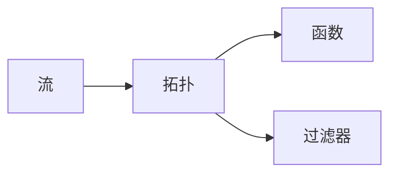
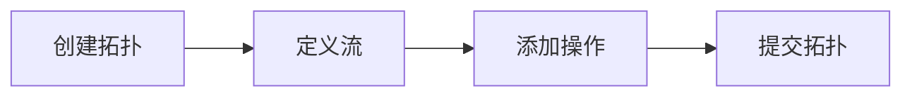

## 1.背景介绍

在处理大数据流的过程中，我们常常需要对数据进行实时处理和分析。在这种情况下，我们需要一种强大的工具来帮助我们处理这些数据。TridentAPI就是这样一种工具。它是Apache Storm项目的一部分，提供了一种函数式编程风格的方式来构建流处理逻辑。

## 2.核心概念与联系

在深入了解TridentAPI之前，我们首先需要了解一些核心的概念。

### 2.1 流（Stream）

在Trident中，流是数据处理的基本单元。一个流可以看作是一个无限的元组序列，每个元组都是一个字段的集合。

### 2.2 拓扑（Topology）

拓扑是Trident中处理流的逻辑结构。它由多个流和操作（如过滤、聚合等）组成，这些操作通过数据流连接在一起。

### 2.3 函数（Function）和过滤器（Filter）

函数和过滤器是Trident中对流进行操作的主要方式。函数可以将一个流转换为另一个流，过滤器则可以从流中选择出满足特定条件的元组。



## 3.核心算法原理具体操作步骤

TridentAPI使用函数式编程风格来构建流处理逻辑。具体来说，它的操作步骤如下：

### 3.1 创建拓扑

首先，我们需要创建一个拓扑来定义我们的流处理逻辑。拓扑的创建通常通过TridentTopology类的实例来完成。

### 3.2 定义流

接下来，我们需要定义我们的数据流。这可以通过调用TridentTopology实例的newStream方法来完成。

### 3.3 添加操作

然后，我们可以在流上添加各种操作，如过滤、转换、聚合等。这些操作都是通过调用Stream实例的相关方法来完成的。

### 3.4 提交拓扑

最后，我们需要提交我们的拓扑到Storm集群中去执行。这可以通过调用TridentTopology实例的submitTopology方法来完成。



## 4.数学模型和公式详细讲解举例说明

在TridentAPI中，流处理的逻辑可以用一种数学模型来表示，这就是函数式编程模型。在这个模型中，流处理的逻辑被看作是一系列的函数应用。

假设我们有一个流 $S$，并且我们想要在这个流上应用一系列的函数 $f_1, f_2, ..., f_n$。那么，我们可以将这个过程表示为下面的公式：

$$
S' = f_n(f_{n-1}(...(f_1(S))...))
$$

其中，$S'$ 是最终得到的流。

这个公式表明，我们首先在流 $S$ 上应用函数 $f_1$，然后在结果上应用函数 $f_2$，依此类推，直到应用函数 $f_n$。这就是TridentAPI中函数式编程风格的基本思想。

## 5.项目实践：代码实例和详细解释说明

下面，我们通过一个简单的例子来说明如何使用TridentAPI来构建流处理逻辑。

假设我们有一个流，它包含了一系列的单词，我们想要计算每个单词出现的次数。

首先，我们需要创建一个拓扑：

```java
TridentTopology topology = new TridentTopology();
```

然后，我们定义我们的流：

```java
Stream wordStream = topology.newStream("words", new WordSpout());
```

接下来，我们在流上添加操作。首先，我们使用each方法来应用一个函数，这个函数将每个单词转换为小写：

```java
wordStream = wordStream.each(new Fields("word"), new LowerCaseFunction(), new Fields("lowercaseWord"));
```

然后，我们使用groupBy方法来按照单词进行分组，然后使用persistentAggregate方法来进行计数：

```java
wordStream.groupBy(new Fields("lowercaseWord"))
          .persistentAggregate(new MemoryMapState.Factory(), new Count(), new Fields("count"));
```

最后，我们提交我们的拓扑：

```java
topology.submitTopology("wordCount", new Config(), topology.build());
```

这就是一个简单的使用TridentAPI构建流处理逻辑的例子。

## 6.实际应用场景

TridentAPI在许多实际应用场景中都发挥了重要的作用。例如：

- 实时分析：TridentAPI可以用于实时分析大数据流，例如实时统计网站的访问量、实时监控系统的运行状态等。
- 实时机器学习：TridentAPI可以用于实时机器学习，例如实时预测用户的行为、实时推荐商品等。
- 实时数据清洗：TridentAPI可以用于实时数据清洗，例如实时过滤掉无效的数据、实时转换数据的格式等。

## 7.工具和资源推荐

如果你想要更深入地学习和使用TridentAPI，以下是一些推荐的工具和资源：

- Apache Storm官方网站：这是Apache Storm项目的官方网站，你可以在这里找到最新的文档和教程。
- TridentAPI源代码：这是TridentAPI的源代码，你可以在这里看到TridentAPI的实现细节。
- StackOverflow：这是一个程序员问答社区，你可以在这里找到许多关于TridentAPI的问题和答案。

## 8.总结：未来发展趋势与挑战

随着大数据和实时处理的需求日益增长，TridentAPI的重要性也在不断提升。然而，TridentAPI也面临着一些挑战，例如如何提高处理速度、如何处理大规模的数据等。这些都是TridentAPI未来需要解决的问题。

## 9.附录：常见问题与解答

### 问题1：TridentAPI和Storm有什么区别？

答：TridentAPI是Storm的一部分，它提供了一种更高级的抽象，使得构建流处理逻辑更加简单和方便。

### 问题2：TridentAPI支持哪些操作？

答：TridentAPI支持许多操作，例如过滤、转换、聚合、分组等。

### 问题3：如何在TridentAPI中处理状态？

答：TridentAPI提供了一种状态管理的机制，使得我们可以在流处理的过程中维护状态。

作者：禅与计算机程序设计艺术 / Zen and the Art of Computer Programming