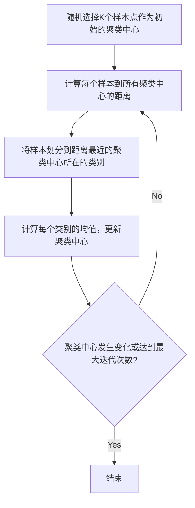
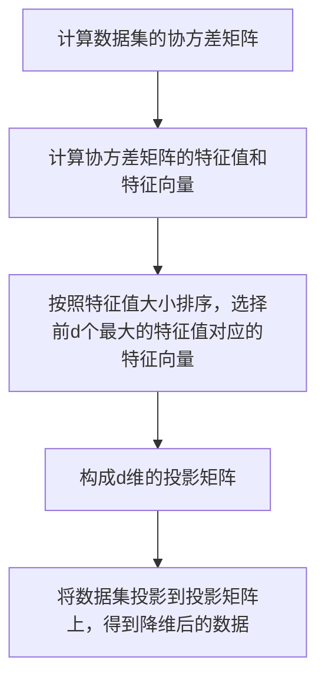

## 1.背景介绍
无监督学习(Unsupervised Learning)是机器学习中的一种主要方法，它与我们常说的监督学习(Supervised Learning)有所不同。无监督学习的特点是在训练过程中，模型并不知道预期的输出应该是什么样的，只能通过学习数据的内在结构和关系，自我学习和提升。这种方法在处理大数据、高维数据、复杂数据等问题上有着独特的优势。

## 2.核心概念与联系
无监督学习的主要任务可以分为两类：聚类(Clustering)和降维(Dimensionality Reduction)。

- 聚类：聚类是将数据集中的样本根据某种相似度度量分组的过程，使得同一组内的样本尽可能相似，而不同组的样本尽可能不同。常见的聚类算法有K-means、DBSCAN、层次聚类等。

- 降维：降维是将高维数据映射到低维空间的过程，以便我们更好地理解数据的结构和关系。常见的降维方法有主成分分析(PCA)、线性判别分析(LDA)等。

## 3.核心算法原理具体操作步骤
接下来我们以K-means算法和PCA为例，详细介绍无监督学习的核心算法。

### 3.1 K-means算法
K-means算法是一种经典的聚类算法，其基本步骤如下：

1. 随机选择K个样本点作为初始的聚类中心。
2. 对于数据集中的每一个样本，计算其到所有聚类中心的距离，将其划分到距离最近的聚类中心所在的类别。
3. 对于每一个类别，计算类别中所有样本的均值，更新聚类中心。
4. 重复步骤2和3，直到聚类中心不再发生变化，或者达到预设的最大迭代次数。



### 3.2 PCA算法
PCA是一种常用的降维方法，其基本步骤如下：

1. 计算数据集的协方差矩阵。
2. 计算协方差矩阵的特征值和特征向量。
3. 将特征值按照从大到小的顺序排序，选择前d个最大的特征值对应的特征向量，构成一个d维的投影矩阵。
4. 将数据集投影到该投影矩阵上，得到降维后的数据。



## 4.数学模型和公式详细讲解举例说明
### 4.1 K-means算法的数学模型
K-means算法的目标是最小化所有样本到其所属类别中心的距离之和，即：

$$J = \sum_{i=1}^{K}\sum_{x\in C_i}||x - \mu_i||_2^2$$

其中，$C_i$是第i个类别，$\mu_i$是第i个类别的中心，$||\cdot||_2$表示2范数，即欧式距离。

### 4.2 PCA算法的数学模型
PCA算法的目标是找到一个投影矩阵，使得原始数据投影到该矩阵上后，数据的方差最大，即：

$$\max_W \{ \frac{1}{m}\sum_{i=1}^{m}||W^T(x_i-\mu)||_2^2 \}$$

其中，$W$是投影矩阵，$x_i$是原始数据，$\mu$是原始数据的均值。

## 5.项目实践：代码实例和详细解释说明
接下来我们使用Python的sklearn库来进行代码实战，分别实现K-means和PCA算法。

### 5.1 K-means算法的代码实现
```python
from sklearn.cluster import KMeans
from sklearn.datasets import make_blobs

# 生成模拟数据
X, y = make_blobs(n_samples=300, centers=4, random_state=0, cluster_std=0.60)

# 使用KMeans进行聚类
kmeans = KMeans(n_clusters=4)
kmeans.fit(X)

# 打印聚类结果
print("Cluster centers:\n", kmeans.cluster_centers_)
print("Labels:\n", kmeans.labels_)
```

### 5.2 PCA算法的代码实现
```python
from sklearn.decomposition import PCA
from sklearn.datasets import load_iris

# 加载iris数据集
iris = load_iris()
X = iris.data
y = iris.target

# 使用PCA进行降维
pca = PCA(n_components=2)
X_pca = pca.fit_transform(X)

# 打印降维后的数据
print("Reduced data:\n", X_pca)
```

## 6.实际应用场景
无监督学习在许多实际应用中都有广泛的应用，例如：

- 聚类：在市场细分、社交网络分析、搜索引擎、医学图像分割等领域都有应用。
- 降维：在可视化、特征提取、数据压缩、大数据分析等领域都有应用。

## 7.工具和资源推荐
推荐使用Python的sklearn库进行无监督学习的研究和应用，它提供了丰富的无监督学习算法，例如K-means、DBSCAN、PCA等，并且具有良好的文档和社区支持。

## 8.总结：未来发展趋势与挑战
无监督学习作为机器学习的重要分支，未来有着广阔的发展前景。随着数据量的增加和计算能力的提升，我们将能够处理更复杂、更高维的数据，发现数据中更深层次的结构和关系。然而，无监督学习也面临着一些挑战，例如如何评估无监督学习的性能、如何处理高维数据的"维度灾难"问题、如何解释无监督学习的结果等。

## 9.附录：常见问题与解答
Q: 无监督学习和监督学习有什么区别？
A: 监督学习是在有标签的数据上进行学习，而无监督学习是在无标签的数据上进行学习。

Q: K-means算法的K值如何选择？
A: K值的选择通常需要根据具体的应用场景和数据特性来确定，可以通过实验或者使用肘部法则(Elbow Method)来选择。

Q: PCA降维后的数据如何解释？
A: PCA降维后的数据是原始数据在新的坐标系上的投影，每个维度对应一个主成分，主成分是原始数据的线性组合，可以理解为数据在该方向上的"信息"或"变化"。

作者：禅与计算机程序设计艺术 / Zen and the Art of Computer Programming