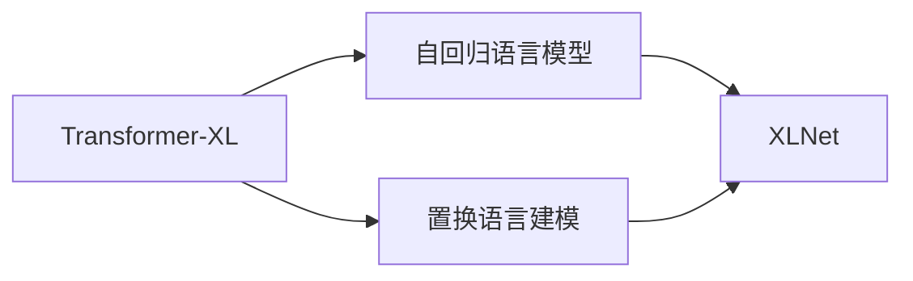

## 1.背景介绍

随着深度学习技术的快速发展，自然语言处理（NLP）领域的研究日新月异。其中，预训练模型如BERT、GPT等在各类NLP任务上取得了显著的成果。然而，这些模型也存在着一些不足，例如BERT的双向编码方式无法捕获句子中的顺序信息，GPT的单向编码方式则无法同时考虑上下文信息。为了解决这些问题，XLNet模型应运而生。XLNet结合了BERT的双向编码和GPT的自回归语言模型，同时避免了BERT的独立预测的限制，从而在各类NLP任务上取得了更好的效果。

## 2.核心概念与联系

XLNet是一种基于Transformer-XL的预训练模型，它的主要创新点有两个：一是采用了自回归语言模型，二是引入了置换语言建模。自回归语言模型能够捕获句子中的顺序信息，而置换语言建模则使得模型在预测每个单词时都能考虑到全局的上下文信息。



## 3.核心算法原理具体操作步骤

XLNet的训练过程包括以下几个步骤：

1. 输入序列的生成：首先，我们需要生成一个包含所有可能的句子排列的序列集合。
2. 自回归语言模型的训练：然后，我们需要对每个句子进行自回归预测。这个过程中，我们会按照句子的排列顺序，逐个预测每个单词。
3. 模型的微调：最后，我们需要对模型进行微调，使其能够适应特定的任务。这个过程中，我们会使用特定任务的训练数据对模型进行训练。

## 4.数学模型和公式详细讲解举例说明

XLNet的数学模型主要包括两部分：自回归语言模型和置换语言建模。

自回归语言模型的数学表达为：

$$ P(x) = \prod_{t=1}^{T} P(x_t | x_{<t}) $$

其中，$x$是输入序列，$T$是序列长度，$x_t$是序列中的第$t$个单词，$x_{<t}$是$t$之前的所有单词。

置换语言建模的数学表达为：

$$ P(x) = \frac{1}{T!} \sum_{\pi \in S_T} \prod_{t=1}^{T} P(x_{\pi(t)} | x_{\pi(<t)}) $$

其中，$S_T$是所有可能的$T$个单词的排列，$\pi$是一个具体的排列，$\pi(t)$是排列中的第$t$个位置，$\pi(<t)$是$t$之前的所有位置。

## 5.项目实践：代码实例和详细解释说明

在实际项目中，我们通常使用Hugging Face的Transformers库来实现XLNet。以下是一个简单的例子：

```python
from transformers import XLNetTokenizer, XLNetModel

# 初始化tokenizer和model
tokenizer = XLNetTokenizer.from_pretrained('xlnet-base-cased')
model = XLNetModel.from_pretrained('xlnet-base-cased')

# 输入文本
input_text = "Hello, my dog is cute"

# 编码输入文本
input_ids = tokenizer.encode(input_text, add_special_tokens=True)

# 转化为tensor
input_ids = torch.tensor([input_ids])

# 获取模型输出
outputs = model(input_ids)

# 输出第一个句子的最后一个词的隐藏状态
last_hidden_states = outputs[0]
```

在这个例子中，我们首先初始化了tokenizer和model，然后对输入文本进行了编码，接着将编码后的输入文本转化为tensor，最后通过模型获取了输出。

## 6.实际应用场景

XLNet在许多实际应用场景中都表现出了优秀的性能，例如情感分析、文本分类、命名实体识别、问答系统等。例如，在情感分析任务中，XLNet能够准确地预测出文本的情感倾向；在文本分类任务中，XLNet能够准确地将文本分类到正确的类别；在命名实体识别任务中，XLNet能够准确地识别出文本中的实体；在问答系统中，XLNet能够准确地回答用户的问题。

## 7.工具和资源推荐

在实际使用XLNet时，推荐使用以下工具和资源：

1. Hugging Face的Transformers库：这是一个包含了众多预训练模型的库，可以方便地使用XLNet等模型。
2. XLNet的预训练模型：可以在Hugging Face的模型库中找到各种预训练的XLNet模型，包括各种语言的模型。
3. XLNet的官方论文：可以在arXiv上找到XLNet的官方论文，论文中详细介绍了XLNet的原理和实现。

## 8.总结：未来发展趋势与挑战

随着深度学习技术的发展，预训练模型在NLP领域的应用越来越广泛。XLNet作为一种新型的预训练模型，虽然在众多NLP任务上取得了优秀的性能，但也面临着一些挑战，例如模型的复杂性较高，需要大量的计算资源，训练时间较长等。未来，我们期待有更多的研究能够解决这些问题，进一步提升XLNet的性能。

## 9.附录：常见问题与解答

1. **问：XLNet和BERT有什么区别？**

答：XLNet和BERT的主要区别在于编码方式。BERT采用的是双向编码，即同时考虑上下文信息，但无法捕获句子中的顺序信息；而XLNet采用的是自回归语言模型，能够捕获句子中的顺序信息，并通过置换语言建模使得在预测每个单词时都能考虑到全局的上下文信息。

2. **问：XLNet的主要应用场景有哪些？**

答：XLNet在许多NLP任务中都有应用，例如情感分析、文本分类、命名实体识别、问答系统等。

3. **问：如何使用Hugging Face的Transformers库实现XLNet？**

答：首先，我们需要安装Transformers库，然后使用`XLNetTokenizer`和`XLNetModel`类来实现XLNet。具体的代码示例可以参考本文的项目实践部分。

作者：禅与计算机程序设计艺术 / Zen and the Art of Computer Programming
