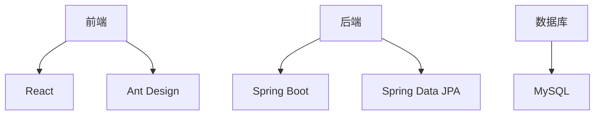

# XX学院师资培养管理系统设计与实现

## 1.背景介绍

随着高等教育事业的不断发展,师资队伍建设成为了高校可持续发展的关键因素之一。为了有效管理师资队伍,提高教师培养质量,许多高校都在探索建立师资培养管理系统。本文将介绍一种基于Web的XX学院师资培养管理系统的设计与实现。

## 2.核心概念与联系

### 2.1 师资培养管理

师资培养管理是指对学校师资队伍的培养、培训、考核、晋升等全过程的科学化管理。它包括:

- 师资队伍规划
- 教师招聘
- 教师培训
- 教师考核
- 职称评定
- 薪酬福利等

### 2.2 系统架构

该系统采用B/S架构,前端使用React,后端使用Spring Boot,数据库使用MySQL。系统分为管理员端和教师端两部分。



## 3.核心算法原理具体操作步骤  

### 3.1 教师绩效考核算法

该系统采用加权平均算法对教师的教学、科研、服务等方面进行综合评分。

1) 设置各项指标权重 $w_i$
2) 教师在每项指标上的分数为 $s_i$
3) 教师总分 = $\sum_{i=1}^{n}{w_i \times s_i}$

其中,n为指标总数。

### 3.2 职称评定算法  

采用基于规则的推理算法,根据学校规定的职称晋升条件,判断教师是否满足要求。

1) 提取教师信息,构建知识库
2) 根据规则进行推理
3) 生成结论:是否晋升

### 3.3 薪酬发放算法

1) 获取教师基本工资
2) 加上职称、绩效等工资项
3) 扣除五险一金等
4) 计算应发工资

## 4.数学模型和公式详细讲解举例说明

### 4.1 教师绩效考核模型

设有n个考核指标,指标i的权重为$w_i$,教师j在该指标上的分数为$s_{ij}$,则教师j的总分为:

$$\text{Score}_j = \sum_{i=1}^{n}{w_i \times s_{ij}}$$

例如,某教师在教学(权重0.4)、科研(权重0.3)、服务(权重0.2)、其他(权重0.1)四个指标上的分数分别为85、90、80、75,则总分为:

$$\begin{aligned}
\text{Score} &= 0.4 \times 85 + 0.3 \times 90 + 0.2 \times 80 + 0.1 \times 75\\
            &= 34 + 27 + 16 + 7.5\\
            &= 84.5
\end{aligned}$$

### 4.2 薪酬发放模型

教师月薪=$W_0 + \sum_{i=1}^{m}{S_i} - \sum_{j=1}^{n}{D_j}$

- $W_0$: 基本工资
- $S_i$: 第i个薪酬项(如绩效工资、职称工资等),共m项  
- $D_j$: 第j个扣减项(如五险一金等),共n项

例如,某教师基本工资5000元,加上职称工资1000元、绩效工资500元,扣除五险一金1200元,则实发工资为:

$$\begin{aligned}
\text{Salary} &= 5000 + 1000 + 500 - 1200\\
             &= 5300
\end{aligned}$$

## 5.项目实践:代码实例和详细解释说明

### 5.1 教师考核模块

```java
// 教师考核实体类
@Entity
public class TeacherAppraisal {
    @Id
    private Long id;
    
    // 教学分数
    private Integer teaching; 
    
    // 科研分数
    private Integer research;
    
    // ...其他属性
}

// 教师考核服务
@Service
public class TeacherAppraisalService {

    @Autowired 
    private TeacherAppraisalRepository repository;
    
    // 计算教师总分
    public Double calculateScore(TeacherAppraisal appraisal) {
        // 设置指标权重
        Map<String, Double> weights = new HashMap<>();
        weights.put("teaching", 0.4);
        weights.put("research", 0.3);
        // ...
        
        Double totalScore = 0.0;
        for (Map.Entry<String, Double> entry : weights.entrySet()) {
            String key = entry.getKey();
            Double weight = entry.getValue();
            Integer score = (Integer) PropertyUtils.getProperty(appraisal, key);
            totalScore += score * weight;
        }
        return totalScore;
    }
    
    // ...其他方法
}
```

上述代码展示了教师考核的实体类和服务层代码。`calculateScore`方法根据设置的权重,计算教师的总分。

### 5.2 职称评定模块

```java
// 知识库
public class KnowledgeBase {
    private List<Rule> ruleList = new ArrayList<>();
    
    // 添加规则
    public void addRule(Rule rule) {
        ruleList.add(rule);
    }
    
    // 推理
    public boolean makeInference(TeacherFact fact) {
        for (Rule rule : ruleList) {
            if (rule.isMatched(fact)) {
                return true;
            }
        }
        return false;
    }
}

// 规则
public class Rule {
    private List<Condition> conditions = new ArrayList<>();
    
    // 添加条件
    public void addCondition(Condition condition) {
        conditions.add(condition);
    }
    
    // 判断是否匹配
    public boolean isMatched(TeacherFact fact) {
        for (Condition condition : conditions) {
            if (!condition.isSatisfied(fact)) {
                return false;
            }
        }
        return true;
    }
}

// 条件
public class Condition {
    private String field;
    private Object value;
    
    // 判断是否满足
    public boolean isSatisfied(TeacherFact fact) {
        Object fieldValue = PropertyUtils.getProperty(fact, field);
        return fieldValue.equals(value);
    }
}
```

上述代码展示了基于规则的推理算法的实现。`KnowledgeBase`维护了一组规则,`Rule`由一组条件组成,`Condition`对应教师的某个属性值。通过遍历规则,判断教师是否满足所有条件,从而推导出是否满足职称晋升要求。

## 6.实际应用场景

该系统可广泛应用于高校、培训机构等场景,实现对师资队伍的科学化管理。主要应用场景包括:

- 高校师资队伍管理
- 培训机构师资管理
- 企业内训师资管理
- 在线教育平台师资管理

## 7.工具和资源推荐

- 开发工具: IntelliJ IDEA、Visual Studio Code
- 框架: React、Spring Boot、Ant Design
- 数据库: MySQL
- 版本控制: Git
- 项目管理: Jira
- 文档工具: Markdown、Draw.io

## 8.总结:未来发展趋势与挑战

未来,师资培养管理系统将向智能化、移动化和云化方向发展。

- 智能化:利用大数据、机器学习等技术,实现教师培养过程的智能分析和决策支持。
- 移动化:开发移动端APP,支持教师随时随地查看个人信息、培训安排等。
- 云化:将系统部署到云端,实现多校区、多机构的统一管理。

但也面临一些挑战,如数据安全、系统性能、用户体验等,需要在系统设计和实现中重点考虑。

## 9.附录:常见问题与解答

1. **如何保证数据安全?**
   
   可采取加密存储、访问控制、操作审计等措施,确保数据的机密性、完整性和可用性。

2. **如何处理大规模并发访问?**

   可采用负载均衡、缓存、异步处理等策略,提高系统的并发处理能力。

3. **如何提高用户体验?**

   注重界面设计、交互流程,提供个性化服务,优化系统响应速度等。

4. **如何降低系统维护成本?**

   遵循设计模式、编码规范,提高代码可读性和可维护性;采用自动化测试、持续集成等DevOps实践。

作者: 禅与计算机程序设计艺术 / Zen and the Art of Computer Programming