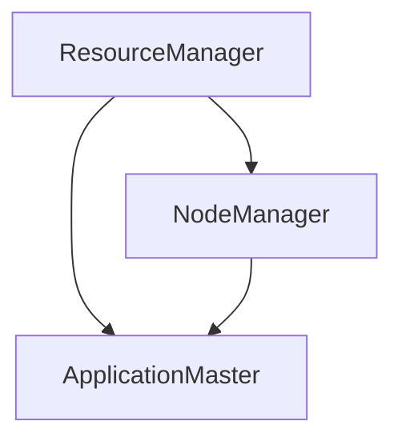

## 背景介绍

YARN（Yet Another Resource Negotiator）是一个Hadoop生态系统中的重要组件，它负责为不同的数据处理框架分配资源。YARN的设计目标是提供一个通用的资源管理器，使得各种大数据处理框架可以在同一套基础设施上运行。

## 核心概念与联系

YARN的核心概念包括ResourceManager、NodeManager、ApplicationMaster等。这些组件之间通过RESTful API进行通信，实现对集群资源的调度和分配。下面是YARN的主要组件及其关系的Mermaid流程图：

## 核心算法原理具体操作步骤

YARN的核心算法是基于资源竞争和资源分配的。ResourceManager负责全局的资源分配，而NodeManager则负责本地的资源管理。以下是YARN的核心算法原理及操作步骤：

1. ResourceManager启动时，会将整个集群的资源信息注册到ZK中。
2. NodeManager也会在启动时，将自身信息注册到ResourceManager中。
3. 当一个应用程序提交时，ResourceManager会为其分配资源，并生成一个ApplicationID。
4. ApplicationMaster根据ApplicationID获取资源分配信息，并向ResourceManager申请Container（容器）。
5. ResourceManager将Container分配给ApplicationMaster，并通知NodeManager启动Container。
6. NodeManager接收到通知后，启动Container并运行任务。

## 数学模型和公式详细讲解举例说明

在YARN中，资源分配通常使用FIFO（先进先出）策略。Formula如下：
$$
ResourceAllocated = \\frac{TotalResources}{NumberOfContainers}
$$`
其中，$ResourceAllocated$表示已分配资源，$TotalResources$表示总资源量，$NumberOfContainers$表示容器数量。

## 项目实践：代码实例和详细解释说明

以下是一个简单的YARN NodeManager代码示例：
```python
from yarn.client.api import YarnClient
from yarn.client.api import ApplicationRequest

client = YarnClient()
app_request = ApplicationRequest(application_name=\"my_app\", 
                                  application_type=\"MAPREDUCE\")

# 提交应用程序
response = client.submit_application(app_request)

if response.status == \"SUCCEEDED\":
    print(\"Application submitted successfully\")
else:
    print(\"Failed to submit application\")
```
上述代码首先导入了YARN客户端API，然后创建了一个YarnClient实例。接着，创建了一个ApplicationRequest对象，并设置了应用程序名称和类型。最后，通过调用client.submit\\_application()方法提交了应用程序。

## 实际应用场景

YARN在大数据处理领域具有广泛的应用场景，如Hadoop、Spark等数据处理框架都可以运行在YARN之上。以下是一些实际应用场景：

1. 数据仓库：YARN可以用于构建大规模数据仓库，实现数据清洗、ETL等功能。
2. 机器学习：YARN可以为机器学习框架提供资源管理和调度支持。
3. 数据流处理：YARN可以用于构建实时数据流处理系统，例如Apache Flink、Apache Storm等。

## 工具和资源推荐

对于想要深入了解YARN的读者，可以参考以下工具和资源：

1. 官方文档：<https://hadoop.apache.org/docs/current/hadoop-yarn/yarn.html>
2. YARN教程：<https://www.yarnprogrammer.com/>
3. Hadoop与YARN视频课程：<https://www.imooc.com/course/detail/ai/4309>

## 总结：未来发展趋势与挑战

随着大数据和人工智能技术的不断发展,YARN在未来将面临更多的挑战和机遇。以下是一些可能的发展趋势和挑战：

1. 更高效的资源分配策略：未来YARN可能会采用更复杂的资源分配策略，以提高资源利用率。
2. 容器化支持：YARN可能会引入容器化技术，实现更细粒度的资源管理和调度。
3. 多云环境支持：YARN需要适应多云环境下的资源管理和调度需求。

## 附录：常见问题与解答

Q: YARN与Mesos有什么区别？

A: YARN和Mesos都是大规模分布式系统的资源管理器，但它们的设计理念和实现方式有所不同。YARN主要针对Hadoop生态系统，而Mesos则是一个通用的资源管理器，可以为多种数据处理框架提供支持。Mesos采用了更复杂的资源分配策略，但也带来了更高的复杂性。

Q: 如何选择合适的资源分配策略？

A: 选择合适的资源分配策略需要根据具体场景和需求进行权衡。一般来说，FIFO策略较为简单，但可能导致资源分配不均匀。而其他策略，如最短作业优先（SJF）或最小偏差优先（MDF）等，可以提高资源利用率，但也可能带来更高的复杂性。在实际应用中，需要根据具体情况选择合适的策略。

# 结束语

本文通过详细讲解YARN NodeManager原理与代码实例，帮助读者深入了解YARN的核心概念、算法原理以及实际应用场景。此外，本文还提供了工具和资源推荐，为读者提供实用的价值。希望本文能对读者有所启发，并在实际工作中为解决问题提供帮助。最后，再次感谢您阅读本篇博客文章，期待下一次再相遇！

作者：禅与计算机程序设计艺术 / Zen and the Art of Computer Programming
```