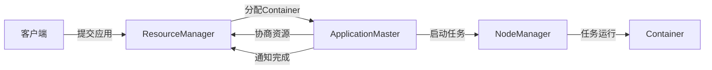

## 1.背景介绍

在大数据处理领域，Apache Hadoop已经成为了一种标准的开源框架。它能够处理和分析大规模的数据集，而Yarn则是Hadoop的一个重要组件，它负责集群的资源管理和任务调度。Yarn的全称是Yet Another Resource Negotiator，意为“又一种资源协调器”。它的出现，极大地提高了Hadoop的灵活性和可扩展性，使得Hadoop能够支持更多种类的计算模型，而不仅仅是MapReduce。

## 2.核心概念与联系

首先，我们需要了解一下Yarn的核心组件和概念：

- `ResourceManager`：它是整个集群的资源管理器，负责整个系统的资源管理和分配。

- `NodeManager`：它是工作节点的管理器，负责单个节点上的资源和任务管理。

- `ApplicationMaster`：每个应用程序都会有一个ApplicationMaster，它负责与ResourceManager协商资源，并与NodeManager通信来执行和监控任务。

- `Container`：这是Yarn中的资源抽象，它封装了某个节点上的一部分资源，如内存、CPU等。任务的运行都在一个或多个Container中进行。

Yarn的工作流程大致可以分为以下几步：

1. 客户端提交应用程序到ResourceManager
2. ResourceManager为应用程序分配第一个Container，并在该Container中启动ApplicationMaster
3. ApplicationMaster与ResourceManager协商获取更多的Container
4. ApplicationMaster与运行在相应节点上的NodeManager通信，启动任务
5. 任务在Container中运行，直到应用程序完成
6. ApplicationMaster通知ResourceManager应用程序已完成，然后关闭

这个流程可以用下面的Mermaid流程图来表示：


## 3.核心算法原理具体操作步骤

Yarn的资源分配是通过一种名为“公平调度器(Fair Scheduler)”的算法来实现的。公平调度器会根据应用程序的需求和集群的资源情况，公平地分配资源。具体来说，它会按照以下步骤进行：

1. 当有新的资源请求时，调度器会计算每个队列的“公平份额”，即如果资源被平均分配，每个队列应该得到的资源。

2. 调度器会比较队列的当前使用情况和其公平份额，优先满足当前使用资源最少的队列。

3. 在队列内部，调度器会按照同样的方法，比较每个应用程序的使用情况和公平份额，优先满足当前使用资源最少的应用程序。

4. 当一个应用程序的资源请求被满足后，它的使用情况会被更新，然后调度器会重新计算队列和应用程序的公平份额。

这个算法保证了每个队列和每个应用程序都能公平地获取到资源，避免了资源的长期占用和饥饿问题。

## 4.数学模型和公式详细讲解举例说明

公平调度器的核心是计算每个队列的“公平份额”。假设我们有$n$个队列，每个队列$i$都有一个权重$w_i$，表示它的优先级。同时，我们有总共$R$个资源可以分配。那么，队列$i$的公平份额$f_i$可以通过以下公式计算：

$$
f_i = \frac{w_i}{\sum_{j=1}^{n} w_j} \times R
$$

这个公式的含义是，每个队列的公平份额是按照它的权重比例来分配的。例如，如果所有队列的权重都相同，那么资源就会被平均分配。

## 5.项目实践：代码实例和详细解释说明

下面是一个简单的Yarn应用程序的例子，它使用Java API提交一个MapReduce任务：

```java
Configuration conf = new Configuration();
// 设置ResourceManager的地址
conf.set("yarn.resourcemanager.address", "localhost:8032");
// 创建一个应用程序提交的上下文
YarnClientApplication app = YarnClient.createYarnClient().createApplication();
// 设置应用程序的名称
app.getApplicationSubmissionContext().setApplicationName("MyApplication");
// 设置应用程序的队列
app.getApplicationSubmissionContext().setQueue("default");
// 设置ApplicationMaster的资源需求
Resource capability = Resource.newInstance(1024, 1);
app.getApplicationSubmissionContext().setResource(capability);
// 提交应用程序
app.submit();
```

这段代码首先创建了一个Yarn客户端，并设置了ResourceManager的地址。然后，它创建了一个应用程序提交的上下文，并设置了应用程序的名称和队列。接着，它设置了ApplicationMaster的资源需求，包括内存和CPU的数量。最后，它提交了应用程序。

## 6.实际应用场景

Yarn广泛应用于大数据处理领域，它支持多种计算模型，包括批处理、交互式查询、流处理等。例如，Hadoop MapReduce、Apache Flink、Apache Spark等都可以运行在Yarn上。

此外，Yarn还可以应用于机器学习、图计算等领域。例如，Google的TensorFlow也支持运行在Yarn上，使得用户可以在同一个Yarn集群上，同时运行数据处理和机器学习任务。

## 7.工具和资源推荐

- Apache Hadoop：Yarn的官方网站，提供了详细的文档和教程。

- Hadoop: The Definitive Guide：这本书详细介绍了Hadoop和Yarn的原理和使用方法。

- Apache Flink：一个基于Yarn的大数据处理框架，支持批处理和流处理。

- TensorFlow on Yarn：Google的TensorFlow在Yarn上的运行环境。

## 8.总结：未来发展趋势与挑战

随着大数据和人工智能的发展，Yarn面临着更大的挑战和机遇。一方面，大数据的规模和复杂性不断增加，对Yarn的资源管理和任务调度能力提出了更高的要求。另一方面，新的计算模型和应用场景的出现，如实时计算、深度学习等，也对Yarn提出了新的需求。

为了应对这些挑战，Yarn需要不断地进行优化和改进。例如，引入更智能的调度算法，提高资源利用率；支持更多种类的资源，如GPU、FPGA等；提供更好的容错和安全机制等。

## 9.附录：常见问题与解答

1. 什么是Yarn？

Yarn是Hadoop的一个组件，负责集群的资源管理和任务调度。

2. Yarn的主要组件有哪些？

Yarn的主要组件包括ResourceManager、NodeManager、ApplicationMaster和Container。

3. Yarn如何分配资源？

Yarn通过一种名为“公平调度器”的算法来分配资源，它会根据应用程序的需求和集群的资源情况，公平地分配资源。

4. Yarn可以运行哪些应用程序？

Yarn支持多种计算模型，包括批处理、交互式查询、流处理等。例如，Hadoop MapReduce、Apache Flink、Apache Spark等都可以运行在Yarn上。

作者：禅与计算机程序设计艺术 / Zen and the Art of Computer Programming