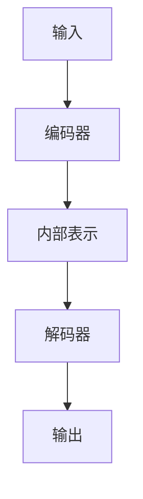

## 1.背景介绍

在深度学习领域，Transformer架构无疑是一种革命性的模型。它最早由Vaswani等人在2017年的论文"Attention is all you need"中提出，用以解决机器翻译任务。此后，Transformer架构在自然语言处理、语音识别、计算机视觉等各个领域均取得了显著的效果，成为了当前最为主流的深度学习模型之一。

## 2.核心概念与联系

Transformer架构主要由两部分组成：编码器和解码器。编码器负责将输入数据转换为一种内部表示，解码器则将这种内部表示转换为最终的输出。编码器和解码器都是由多个相同的层堆叠而成，每一层都包含两部分：自注意力机制和前馈神经网络。



## 3.核心算法原理具体操作步骤

Transformer的核心是自注意力机制，也被称为Scaled Dot-Product Attention。自注意力机制的主要思想是，模型在生成输出的每一个元素时，都会对输入的所有元素进行加权，权重由输入元素和输出元素的相关性决定。这种机制使得模型能够在生成每一个输出元素时，都能考虑到输入的全局信息。

自注意力机制的计算过程如下：

1. 将输入元素通过线性变换得到三个向量：Query、Key和Value。
2. 计算Query和所有Key的点积，得到权重。
3. 对权重进行缩放和softmax归一化。
4. 用归一化后的权重对所有Value进行加权求和，得到输出元素。

## 4.数学模型和公式详细讲解举例说明

假设输入元素为$x_1, x_2, ..., x_n$，对应的Query、Key和Value分别为$q_1, q_2, ..., q_n$，$k_1, k_2, ..., k_n$和$v_1, v_2, ..., v_n$。则自注意力机制的计算过程可以用以下公式表示：

$$
\text{Attention}(Q, K, V) = \text{softmax}\left(\frac{QK^T}{\sqrt{d_k}}\right)V
$$

其中，$Q$, $K$, $V$分别是所有Query、Key和Value堆叠而成的矩阵，$d_k$是Key的维度。

## 5.项目实践：代码实例和详细解释说明

下面是一个使用PyTorch实现的Transformer模型的简单示例：

```python
import torch
import torch.nn as nn
import torch.nn.functional as F

class Transformer(nn.Module):
    def __init__(self, d_model, nhead, num_layers):
        super(Transformer, self).__init__()
        self.encoder_layer = nn.TransformerEncoderLayer(d_model, nhead)
        self.transformer_encoder = nn.TransformerEncoder(self.encoder_layer, num_layers)
        self.decoder_layer = nn.TransformerDecoderLayer(d_model, nhead)
        self.transformer_decoder = nn.TransformerDecoder(self.decoder_layer, num_layers)

    def forward(self, src, tgt):
        src = self.transformer_encoder(src)
        output = self.transformer_decoder(tgt, src)
        return output
```

## 6.实际应用场景

Transformer架构在许多实际应用中都取得了显著的效果，例如：

- 机器翻译：Google的神经机器翻译系统就采用了Transformer架构，显著提高了翻译的准确性。
- 文本生成：OpenAI的GPT-2和GPT-3模型都基于Transformer架构，能够生成极其逼真的人类文本。
- 图像生成：最近的研究表明，Transformer架构也可以应用于图像生成任务，例如DALL-E模型就能够根据文本描述生成各种各样的图像。

## 7.工具和资源推荐

- PyTorch：一个强大的深度学习框架，提供了丰富的Transformer相关的API。
- TensorFlow：Google开源的深度学习框架，也提供了丰富的Transformer相关的API。
- Hugging Face：提供了大量预训练的Transformer模型，可以直接用于各种NLP任务。

## 8.总结：未来发展趋势与挑战

Transformer架构的优点是显而易见的，但同时也存在一些挑战，例如计算复杂度高、需要大量的训练数据等。然而，随着深度学习技术的不断发展，这些问题有望得到解决。我相信，未来Transformer架构将在更多领域发挥更大的作用。

## 9.附录：常见问题与解答

Q: Transformer架构的主要优点是什么？

A: Transformer架构的主要优点是能够捕捉输入元素之间的长距离依赖关系，而且计算过程可以并行化，大大提高了计算效率。

Q: Transformer架构的主要缺点是什么？

A: Transformer架构的主要缺点是计算复杂度高，需要大量的训练数据，而且模型的可解释性较差。

作者：禅与计算机程序设计艺术 / Zen and the Art of Computer Programming